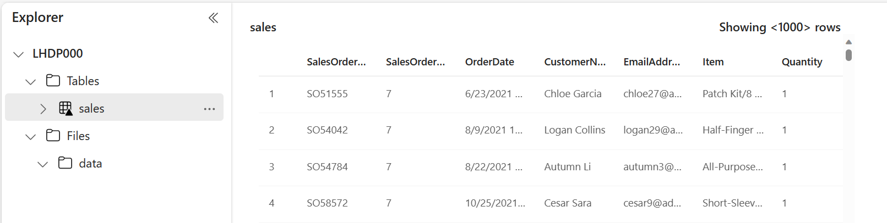

---
lab:
  title: Microsoft Fabric レイクハウスを作成する
  module: Get started with lakehouses in Microsoft Fabric
---

# Microsoft Fabric レイクハウスを作成する

大規模なデータ分析ソリューションは、従来、''データ ウェアハウス'' を中心に構築されてきました。データはリレーショナル テーブルに格納され、SQL を使用してクエリが実行されます。** 低コストのストレージとクラウド規模の分散コンピューティング テクノロジの可用性と共に、"ビッグ データ" (新しいデータ資産が大量にあり、種類が豊富で高速であることが特徴) が増加したことで、分析データ ストレージの代替アプローチであるデータ レイクが登場しました。** ** ** ** データ レイクでは、データは、ストレージ用の固定スキーマを適用せずにファイルとして格納されます。 データ エンジニアとアナリストは、''データ レイクハウス'' でそれらを組み合わせることによって、これらの両方のアプローチの最高の機能の利点を得ようとしています。データはデータ レイク内のファイルに格納され、リレーショナル スキーマがメタデータ レイヤーとして適用されるため、従来の SQL セマンティクスを使用してクエリを実行できます。**

Microsoft Fabric では、レイクハウスによって *OneLake* ストア (Azure Data Lake Store Gen2 上に構築) に、オープンソースの *Delta Lake* テーブル形式に基づくテーブルやビューなどのリレーショナル オブジェクトのメタストアを備えた、拡張性の高いファイル ストレージが提供されます。 Delta Lake では、SQL を使用してクエリを実行できるテーブルのスキーマをレイクハウスで定義できます。

このラボの所要時間は約 **30** 分です。

> **注**:この演習を完了するには、[Microsoft Fabric 試用版](https://learn.microsoft.com/fabric/get-started/fabric-trial)が必要です。

## ワークスペースの作成

Fabric でデータを操作する前に、Fabric 試用版を有効にしてワークスペースを作成してください。

1. [Microsoft Fabric ホーム ページ](https://app.fabric.microsoft.com/home?experience=fabric) (`https://app.fabric.microsoft.com/home?experience=fabric`) で、**[Synapse Data Engineering]** を選択します。
1. 左側のメニュー バーで、 **[ワークスペース]** を選択します (アイコンは &#128455; に似ています)。
1. 新しいワークスペースを任意の名前で作成し、 **[詳細]** セクションで、Fabric 容量を含むライセンス モード ("*試用版*"、*Premium*、または *Fabric*) を選択します。
1. 開いた新しいワークスペースは空のはずです。

    

## レイクハウスを作成する

ワークスペースが作成されたので、次にデータ ファイル用のデータ レイクハウスを作成します。

1. **Synapse Data Engineering** ホーム ページで、任意の名前で新しい **Lakehouse** を作成します。

    1 分ほどすると、新しいレイクハウスが作成されます。

    

1. 新しいレイクハウスを表示します。左側の **[レイクハウス エクスプローラー]** ペインを使用すると、レイクハウス内のテーブルとファイルを参照できることに注意してください。
    - **Tables** フォルダーには、SQL セマンティクスを使用してクエリを実行できるテーブルが含まれています。 Microsoft Fabric レイクハウスのテーブルは、Apache Spark でよく使われるオープンソースの *Delta Lake* ファイル形式に基づいています。
    - **Files** フォルダーには、マネージド デルタ テーブルに関連付けられていないレイクハウスの OneLake ストレージ内のデータ ファイルが含まれています。 このフォルダーに ''ショートカット'' を作成して、外部に格納されているデータを参照することもできます。**

    現在、レイクハウスにはテーブルやファイルはありません。

## ファイルをアップロードする

Fabric には、Power Query に基づいてビジュアル ツールを使用して定義できるデータを外部ソースとデータ フロー (Gen 2) からコピーするパイプラインの組み込みサポートなど、レイクハウスにデータを読み込むための複数の方法が用意されています。 しかし、少量のデータを取り込む最も簡単な方法の 1 つは、ローカル コンピューター (または該当する場合はラボ VM) からファイルまたはフォルダーをアップロードすることです。

1. `https://raw.githubusercontent.com/MicrosoftLearning/dp-data/main/sales.csv` から [sales.csv](https://raw.githubusercontent.com/MicrosoftLearning/dp-data/main/sales.csv) ファイルをダウンロードし、ローカル コンピューター (または該当する場合はラボ VM) に **sales.csv** として保存します。

   > **注**: ファイルをダウンロードするには、ブラウザーで新しいタブを開き、URL を貼り付けます。 データを含むページ上の任意の場所を右クリックし、 **[名前を付けて保存]** を選択して、ページを CSV ファイルとして保存します。

2. レイクハウスを含む Web ブラウザー タブに戻り、 **[レイクハウス エクスプローラー]** ペインの **Files** フォルダーの **[...]** メニューで、 **[新しいサブフォルダー]** を選択し、**data** という名前のサブフォルダーを作成します。
3. 新しい **data** フォルダーの **[...]** メニューで、**[アップロード]** と **[ファイルのアップロード]** を選択し、ローカル コンピューター (または該当する場合はラボ VM) から **sales.csv** ファイルをアップロードします。
4. ファイルがアップロードされた後、**Files の data** フォルダーを選択し、以下に示すように **sales.csv** ファイルがアップロードされたことを確認します。

    

5. **sales.csv** ファイルを選択すると、その内容のプレビューが表示されます。

## ショートカットを調べる

多くのシナリオでは、レイクハウスで操作する必要があるデータが他の場所に格納される場合があります。 レイクハウスの OneLake ストレージにデータを取り込む方法は多数ありますが、代わりに ''ショートカット'' を作成することもできます。** ショートカットを使用すると、外部ソース データを分析ソリューションに含めることができ、そのコピーに関連するデータの不整合のオーバーヘッドやリスクはありません。

1. **Files** フォルダーの **[...]** メニューで、 **[新しいショートカット]** を選択します。
2. ショートカットに使用できるデータ ソースの種類を表示します。 その後、ショートカットを作成せずに **[新しいショートカット]** ダイアログ ボックスを閉じます。

## ファイル データをテーブルに読み込む

アップロードした売上データはファイル内にあり、データ アナリストやエンジニアは Apache Spark コードを使用して直接操作できます。 しかし、多くのシナリオでは、SQL を使用してクエリを実行できるように、ファイルからテーブルにデータを読み込むことができます。

1. **[ホーム]** ページで、**Files の data** フォルダーを選択して、それに含まれる **sales.csv** ファイルを表示できるようにします。
2. **sales.csv** ファイルの **[...]** メニューで、 **[テーブルに読み込む]** を選択します。
3. **[テーブルに読み込む]** ダイアログ ボックスで、テーブル名を **sales** に設定し、読み込み操作を確認します。 その後、テーブルが作成されて読み込まれるのを待ちます。

    > **ヒント**: **sales** テーブルが自動的に表示されない場合は、**Tables** フォルダーの **[...]** メニューで **[最新の情報に更新]** を選択します。

3. **[レイクハウス エクスプローラー]** ペインで、作成された **sales** テーブルを選択してデータを表示します。

    

4. **sales** テーブルの **[...]** メニューで、 **[ファイルの表示]** を選択して、このテーブルの基になるファイルを表示します

    

    デルタ テーブルのファイルは *Parquet* 形式で格納され、テーブルに適用されたトランザクションの詳細がログに記録される **_delta_log** という名前のサブフォルダーが含まれます。

## SQL を使用してテーブルのクエリを実行する

レイクハウスを作成してテーブルを定義すると、SQL エンドポイントが自動的に作成され、SQL `SELECT` ステートメントを使用してテーブルのクエリを実行できます。

1. [レイクハウス] ページの右上で、**[レイクハウス]** から **[SQL 分析エンドポイント]** に切り替えます。 次に、レイクハウスの SQL 分析エンドポイントがビジュアル インターフェイスで開き、テーブルのクエリを実行できるようになるまでしばらく待ちます。

2. **[新しい SQL クエリ]** ボタンを使用して新しいクエリ エディターを開き、次の SQL クエリを入力します。

    ```sql
   SELECT Item, SUM(Quantity * UnitPrice) AS Revenue
   FROM sales
   GROUP BY Item
   ORDER BY Revenue DESC;
    ```
> **注**:ラボ VM を使っていて SQL クエリの入力に問題がある場合は、`https://github.com/MicrosoftLearning/mslearn-fabric/raw/main/Allfiles/Labs/01/Assets/01-Snippets.txt` から [01-Snippets.txt](https://github.com/MicrosoftLearning/mslearn-fabric/raw/main/Allfiles/Labs/01/Assets/01-Snippets.txt) ファイルをダウンロードして VM に保存できます。 その後、テキスト ファイルからクエリをコピーできます。

3. **[&#9655;] (実行)** ボタンを使用してクエリを実行し、結果を表示します。これには、各製品の総収益が表示されるはずです。

    

## ビジュアル クエリを作成する

多くのデータ プロフェッショナルは SQL を使い慣れていますが、Power BI の経験があるデータ アナリストは、Power Query スキルを生かしてビジュアル クエリを作成することができます。

1. ツールバーで、 **[新しいビジュアル クエリ]** を選択します。
2. 次に示すように、**sales** テーブルを開いた新しいビジュアル クエリ エディター ペインにドラッグして、Power Query を作成します。 

    

3. **[列の管理]** メニューの **[列の選択]** を選びます。 その後、**SalesOrderNumber** と **SalesOrderLineNumber** 列だけを選択します。

    ![[列の選択] ダイアログ ボックスのスクリーンショット。](./Images/choose-columns.png)

4. **[変換]** メニューの **[グループ化]** を選択します。 その後、次の **[基本]** 設定を使用してデータをグループ化します。

    - **グループ化**: SalesOrderNumber
    - **新しい列名**: LineItems
    - **操作**: 個別の値をカウントする
    - **列**: SalesOrderLineNumber

    完了すると、ビジュアル クエリの下の結果ペインに、各販売注文の品目数が表示されます。

    

## レポートを作成する

レイクハウス内のテーブルは、Power BI を使ってレポートするための既定のセマンティック モデルに自動的に追加されます。


1. [SQL エンドポイント] ページの下部にある **[モデル]** タブを選びます。セマンティック モデルのデータ モデル スキーマが表示されます。

    

    > **注 1**: この演習では、セマンティック モデルは 1 つのテーブルで構成されます。 実際のシナリオでは、レイクハウスに複数のテーブルを作成し、それぞれがモデルに含まれる可能性があります。 その後、モデル内のこれらのテーブル間のリレーションシップを定義できます。
    
    > **注 2**: ビュー **frequently_run_queries**、**long_running_queries**、**exec_sessions_history**、**exec_requests_history** は、ファブリック によって自動的に作成される **queryinsights** スキーマの一部です。 これは、SQL 分析エンドポイントでの履歴クエリ アクティビティの総合的なビューを提供する機能です。 この機能はこの演習の範囲外であるため、現時点ではこれらのビューは無視してください。

2. メニュー リボンで、 **[レポート]** タブを選択します。次に、 **[新しいレポート]** を選択します。 現在のページがレポート デザイナー ビューに変更されます。

    

3. 右側の **[データ]** ペインで、**sales** テーブルを展開します。 その後、次のフィールドを選択します。
    - **Item**
    - **Quantity**

    テーブルの視覚化がレポートに追加されます。

    

4. **[データ]** と **[フィルター]** ペインを非表示にして、領域を広くします。 その後、テーブルの視覚化が選択されていることを確かめ、 **[視覚化]** ペインで、視覚化を **[集合横棒グラフ]** に変更し、次に示すようにサイズを変更します。

    

5. **[ファイル]** メニューの **[保存]** をクリックします。 次に、前に作成したワークスペースにレポートを `Item Sales Report` として保存します。
6. ここで、左側のハブ メニュー バーでワークスペースを選択し、次の項目が含まれていることを確認します。
    - レイクハウス。
    - レイクハウスの SQL 分析エンドポイント。
    - レイクハウス内にあるテーブルの既定のセマンティック モデル。
    - **Item Sales Report** レポート。

## リソースをクリーンアップする

この演習では、レイクハウスを作成し、それにデータをインポートしました。 レイクハウスが OneLake データ ストアに格納されているファイルとテーブルで構成されるしくみを確認しました。 マネージド テーブルは SQL を使用してクエリを実行でき、データの視覚化をサポートする既定のセマンティック モデルに含まれています。

レイクハウスの探索が完了したら、この演習用に作成したワークスペースを削除できます。

1. 左側のバーで、ワークスペースのアイコンを選択して、それに含まれるすべての項目を表示します。
2. ツール バーの **[...]** メニューで、 **[ワークスペースの設定]** を選択してください。
3. **[全般]** セクションで、**[このワークスペースの削除]** を選択します。
