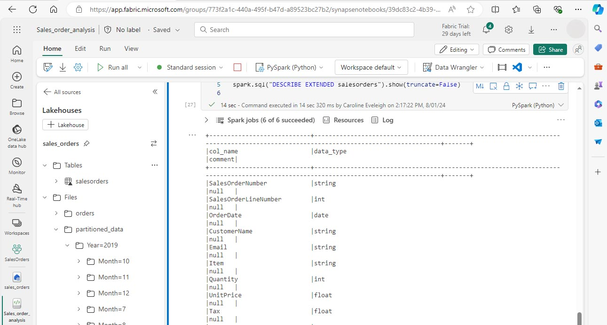

---
lab:
  title: Apache Spark を使用してデータを分析する
  module: Use Apache Spark to work with files in a lakehouse
---

# Fabric の Apache Spark を使用してデータを分析する

このラボでは、Fabric レイクハウスにデータを取り込み、PySpark を使用してデータの読み取りと分析を行います。

このラボは完了するまで、約 45 分かかります。

## 前提条件

* [Microsoft Fabric 試用版](https://www.microsoft.com/microsoft-fabric/getting-started)

## ワークスペースの作成

Fabric でデータを操作するには、ワークスペースを作成する必要があります。

1. ブラウザーの `https://app.fabric.microsoft.com/home?experience=fabric` で [Microsoft Fabric ホーム ページ](https://app.fabric.microsoft.com/home?experience=fabric)に移動し、Fabric 資格情報でサインインします。
1. 左側のメニュー バーで、**[ワークスペース] ** (🗇)、**[新しいワークスペース]** の順に選択します。
1. 新しいワークスペースに名前を付け、**[詳細]** セクションで適切なライセンス モードを選択します。 Microsoft Fabric 試用版を開始した場合は、[試用版] を選択します。
1. **[適用]** を選択して、空のワークスペースを作成します。
 
    

## レイクハウスを作成してファイルをアップロードする

ワークスペースが作成されたので、レイクハウスを作成してデータ ファイルを保存できます。 新しいワークスペースから **[+ 新しい項目]** と **[レイクハウス]** を選択します。 レイクハウスに名前を付け、**[作成]** を選択します。 しばらくすると、新しいレイクハウスが作成されます。

これでレイクハウスにデータを取り込めます。 これを行う方法はいくつかありますが、今は、ローカル コンピューター (または該当する場合はラボ VM) にテキスト ファイルのフォルダーをダウンロードし、レイクハウスにアップロードします。

1. `https://github.com/MicrosoftLearning/dp-data/raw/main/orders.zip` からデータファイルをダウンロードします。
1. zip 形式のアーカイブを展開し、*orders* という名前のフォルダーがあり、2019.csv、2020.csv、2021.csv という 3 つの CSV ファイルが含まれていることを確認します。
1. 新しいレイクハウスに戻ります。 **[エクスプローラー]** ペインで、**[ファイル]** フォルダーの横にある **[...]** メニューを選択し、 **[アップロード]** と **[フォルダーのアップロード]** を選択します。 ローカル コンピューター (または該当する場合はラボ VM) の orders フォルダーに移動し、**[アップロード]** を選択します。
1. ファイルがアップロードされたら、**[ファイル]** を展開し、**orders** フォルダーを選択します。 次に示すように、CSV ファイルがアップロードされたことを確認します。

    

## ノートブックを作成する

これで、データを操作する Fabric ノートブックを作成できるようになりました。 ノートブックは、コードを記述して実行できる対話型環境を提供します。

1. ワークスペースを選択し、**[+ 新しい項目]** と **[ノートブック]** を選択します。 数秒後に、1 つの ''セル'' を含む新しいノートブックが開きます。 ノートブックは、''コード'' または ''マークダウン'' (書式設定されたテキスト) を含むことができる 1 つ以上のセルで構成されます。
1. Fabric は、Notebook 1、Notebook 2 などのように、作成する各ノートブックに名前を割り当てます。名前をよりわかりやすいものに変更するには、メニューの **[ホーム]** タブの上にある名前パネルをクリックします。
1. 最初のセル (今はコード セル) を選択し、右上のツール バーで **[M↓]** ボタンを使用して Markdown セルに変換します。 セルに含まれるテキストは、書式設定されたテキストで表示されます。
1. 🖉 ([編集]) ボタンを使用してセルを編集モードに切り替え、マークダウンを次のように変更します。

    ```markdown
   # Sales order data exploration
   Use this notebook to explore sales order data
    ```

    

完了したら、セルの外側のノートブック内の任意の場所をクリックして編集を停止し、レンダリングされたマークダウンを確認します。

## DataFrame の作成

これで、ワークスペース、レイクハウス、ノートブックが作成されたので、データを操作する準備が整いました。 Fabric ノートブックの既定の言語である PySpark と、Spark 用に最適化された Python のバージョンを使用することになります。

>[!NOTE]
> Fabric ノートブックでは、Scala、R、Spark SQL などの複数のプログラミング言語がサポートされています。

1. 左側のバーから新しいワークスペースを選択します。 ワークスペースに含まれるアイテム (レイクハウスやノートブックなど) の一覧が表示されます。
2. レイクハウスを選択して、 **orders** フォルダーを含む [エクスプローラー] ペインを表示します。
3. 上部のメニューから **[ノートブックを開く]**、**[既存のノートブック]** を選択し、前に作成したノートブックを開きます。 これで [エクスプローラー] ペインの横にノートブックが開くはずです。 [レイクハウス] を展開し、[ファイル] リストを展開して、orders フォルダーを選択します。 アップロードした CSV ファイルは、次のようにノートブック エディターの横に一覧表示されます。

    ![[エクスプローラー] ビューの CSV ファイルの画面画像。](Images/explorer-notebook-view.jpg)

4. から 2019.csv の [...] メニューで、**[データの読み込み]**、**[Spark]** の順に選択します。 次のコードは、新しいコード セルに自動的に生成されます。

    ```python
    df = spark.read.format("csv").option("header","true").load("Files/orders/2019.csv")
    # df now is a Spark DataFrame containing CSV data from "Files/orders/2019.csv".
    display(df)
    ```

>[!TIP]
> 左側のレイクハウス エクスプローラー ペインは、その [«] アイコンで非表示にできます。 こうすると、ノートブックの領域が増えます。

5. セルの左側にある ▷ **[セルの実行** を選択してコードを実行します。

>[!NOTE]
> 初めて Spark コードを実行したときに、Spark セッションは開始されます。 これには数秒以上かかる可能性があります。 同じセッション内でのその後の実行は速くなります。

6. セル コードが完了したら、セルの下にある出力を確認します。これは次のようになるはずです。
 
    

7. 出力には、2019.csv ファイルのデータが行と列に表示されます。  列ヘッダーにデータの最初の行が入っていることに注意してください。 これを修正するには、次のようにコードの最初の行を変更する必要があります。

    ```python
    df = spark.read.format("csv").option("header","false").load("Files/orders/2019.csv")
    ```

8. DataFrame が最初の行をデータとして正しく識別するように、コードをもう一度実行します。 列名が _c0、_c1 などに変更されていることに注意してください。

9. わかりやすい列名は、データを理解するのに役立ちます。 意味のある列名を作成するには、スキーマとデータ型を定義する必要があります。 また、データ型を定義するには、Spark SQL 型の標準セットをインポートする必要もあります。 既存のコードを次のコードに置き換えます。

    ```python
    from pyspark.sql.types import *

    orderSchema = StructType([
        StructField("SalesOrderNumber", StringType()),
        StructField("SalesOrderLineNumber", IntegerType()),
        StructField("OrderDate", DateType()),
        StructField("CustomerName", StringType()),
        StructField("Email", StringType()),
        StructField("Item", StringType()),
        StructField("Quantity", IntegerType()),
        StructField("UnitPrice", FloatType()),
        StructField("Tax", FloatType())
    ])

    df = spark.read.format("csv").schema(orderSchema).load("Files/orders/2019.csv")

    display(df)
    ```
    
10. セルを実行し、出力を確認します。

    

11. この DataFrame には、2019.csv ファイルからのデータのみが含まれています。 ファイル パスでワイルドカード * を使用するようにコードを変更して、orders フォルダー内のすべてのファイルを読み取ります。

    ```python
    from pyspark.sql.types import *

    orderSchema = StructType([
        StructField("SalesOrderNumber", StringType()),
        StructField("SalesOrderLineNumber", IntegerType()),
        StructField("OrderDate", DateType()),
        StructField("CustomerName", StringType()),
        StructField("Email", StringType()),
        StructField("Item", StringType()),
        StructField("Quantity", IntegerType()),
        StructField("UnitPrice", FloatType()),
        StructField("Tax", FloatType())
        ])

    df = spark.read.format("csv").schema(orderSchema).load("Files/orders/*.csv")

    display(df)
    ```

12. 変更したコードを実行すると、2019 年、2020 年、2021 年の売上が表示されるはずです。 行のサブセットのみが表示されるため、すべての年の行は表示されない場合があります。

>[!NOTE]
> 結果の横の **[...]** を選択することで、セルの出力を非表示にしたり表示したりできます 。 こうすることで、ノートブックでの作業が簡単になります。

## DataFrame 内のデータを探索する

DataFrame オブジェクトには、データをフィルター処理、グループ化、操作する機能など、追加の機能があります。

### DataFrame をフィルター処理する

1. 現在のセルまたはその出力の上または下にマウス ポインターを置くと表示される **[+ コード]** を選択して、コード セルを追加します。 または、リボン メニューで **[編集]**、**[+ コード セルを下に挿入する]** の順に選択します。

2.  次のコードでは、2 つの列のみが返されるようにデータをフィルター処理します。 また、*count* と *distinct* を使用してレコードの数を集計します。

    ```python
    customers = df['CustomerName', 'Email']

    print(customers.count())
    print(customers.distinct().count())

    display(customers.distinct())
    ```

3. コードを実行し、出力を調べます。

    * このコードでは、元の **df** DataFrame の列のサブセットを含む、**customers** という新しい DataFrame を作成します。 DataFrame 変換を実行するときは、元の DataFrame は変更せず、新しいデータフレームを返します。
    * 同じ結果を得るもう 1 つの方法は、select メソッドを使用することです。

    ```
    customers = df.select("CustomerName", "Email")
    ```

    * DataFrame 関数 *count* と *distinct* は、顧客の総数と一意の顧客の総数を得るのに使用します。

4. 次のように *where* 関数と共に *select* を使用して、コードの最初の行を変更します。

    ```python
    customers = df.select("CustomerName", "Email").where(df['Item']=='Road-250 Red, 52')
    print(customers.count())
    print(customers.distinct().count())

    display(customers.distinct())
    ```

5. この変更したコードを実行して、"Road-250 Red, 52" という製品を購入した顧客のみを選択します。 なお、複数の関数を "連結" して、ある関数の出力が次の関数の入力になるようにすることができます。 この場合、*select* メソッドによって作成された DataFrame は、フィルター条件の適用に使用される **where** メソッドのソース DataFrame です。

### データフレーム内のデータを集約してグループ化する

1. コード セルを追加し、次のコードを入力します。

    ```python
    productSales = df.select("Item", "Quantity").groupBy("Item").sum()

    display(productSales)
    ```

2. コードを実行します。 製品ごとにグループ化された注文数量の合計が結果に表示されているのが確認できます。 *groupBy* メソッドにより Item ごとに行がグループ化され、その後の *sum* 集計関数は、残りの数値列 (この場合は *Quantity*) に適用されます。

3. ノートブックにコード セルをもう 1 つ追加し、次のコードを入力します。

    ```python
    from pyspark.sql.functions import *

    yearlySales = df.select(year(col("OrderDate")).alias("Year")).groupBy("Year").count().orderBy("Year")

    display(yearlySales)
    ```

4. セルを実行します。 出力を調べます。 今回の結果には年間の販売注文数が表示されます。

    * *import* ステートメントを使用すると、Spark SQL ライブラリを使用できます。
    * *select* メソッドは、*OrderDate* フィールドの year コンポーネントを抽出するのに、SQL year 関数と共に使用します。
    * *alias* メソッドは、抽出された year 値に列名を割り当てるのに使用します。
    * *groupBy* メソッドは、派生した Year 列ごとにデータをグループ化します。
    * 結果として生成された DataFrame を並べ替えるために *orderBy* メソッドが使用がされる前に、各グループの行数が計算されます。

    

## Spark を使用してデータ ファイルを変換する

データ エンジニアとデータ サイエンティストにとって一般的なタスクは、さらなるダウンストリームの処理や分析のためにデータを変換することです。

### DataFrame のメソッドと関数を使用してデータを変換する

1. ノートブックにコード セルを追加し、次のコードを入力します。

    ```python
    from pyspark.sql.functions import *

    # Create Year and Month columns
    transformed_df = df.withColumn("Year", year(col("OrderDate"))).withColumn("Month", month(col("OrderDate")))

    # Create the new FirstName and LastName fields
    transformed_df = transformed_df.withColumn("FirstName", split(col("CustomerName"), " ").getItem(0)).withColumn("LastName", split(col("CustomerName"), " ").getItem(1))

    # Filter and reorder columns
    transformed_df = transformed_df["SalesOrderNumber", "SalesOrderLineNumber", "OrderDate", "Year", "Month", "FirstName", "LastName", "Email", "Item", "Quantity", "UnitPrice", "Tax"]

    # Display the first five orders
    display(transformed_df.limit(5))
    ```

2. セルを実行します。 次の変換で、元の注文データから新しい DataFrame が作成されます。

    - OrderDate 列に基づいて Year 列と Month 列が追加されます。
    - CustomerName 列に基づいて FirstName 列と LastName 列が追加されます。
    - 列はフィルター処理されて並べ替えられ、CustomerName 列が削除されます。

3. 出力を調べて、データに変換が行われたことを確認します。

Spark SQL ライブラリを使用することで、行のフィルター処理、派生、削除、列の名前変更、その他のデータ変更の適用によってデータを変換できます。

>[!TIP]
> Dataframe オブジェクトの詳細については、[Apache Spark データフレーム](https://spark.apache.org/docs/latest/api/python/reference/pyspark.sql/dataframe.html)のドキュメントをご覧ください。

### 変換されたデータを保存する

さらなる分析に使用できるように、この時点で変換されたデータを保存することができます。

*Parquet* は、データを効率的に格納し、ほとんどの大規模なデータ分析システムでサポートされているため、広く普及しているデータ ストレージ形式です。 実際、データ変換の要件が、ある形式 (CSV など) から Parquet にデータを変換することである場合があります。

1. 変換された DataFrame を Parquet 形式で保存するには、コード セルを追加し、次のコードを追加します。  

    ```python
    transformed_df.write.mode("overwrite").parquet('Files/transformed_data/orders')

    print ("Transformed data saved!")
    ```

2. セルを実行し、データが保存されたことを示すメッセージを待ちます。 次に、左側の [レイクハウス] ペインで、 Files ノードの [...] メニューにある **[更新]** を選択します。 transformed_data フォルダーを選択して、orders という名前の新しいフォルダーが入っていることを確認します。さらにこの新しいフォルダーには、1 つ以上の Parquet ファイルが入っています。

3. 次のコードを使用してセルを追加します。

    ```python
    orders_df = spark.read.format("parquet").load("Files/transformed_data/orders")
    display(orders_df)
    ```

4. セルを実行します。  *transformed_data/orders* フォルダー内の Parquet ファイルから新しい DataFrame が作成されます。 Parquet ファイルから読み込まれた注文データが結果に表示されていることを確認します。

    

### パーティション分割されたファイルにデータを保存する

大量のデータを処理する場合、パーティション分割によってパフォーマンスが大幅に向上し、データのフィルター処理が容易になります。

1. コードが入ったセルを追加して DataFrame を保存し、Year と Month でデータをパーティション分割します。

    ```python
    orders_df.write.partitionBy("Year","Month").mode("overwrite").parquet("Files/partitioned_data")

    print ("Transformed data saved!")
    ```

2.  セルを実行し、データが保存されたことを示すメッセージを待ちます。 次に、左側の [レイクハウス] ペインで、 Files ノードの [...] メニューにある **[更新]** を選択し、partitioned_data フォルダーを展開して、「*Year=xxxx*」という名前のフォルダーの階層が含まれていて、それぞれに「*Month=xxxx*」という名前のフォルダーが入っていることを確認します。 各月のフォルダーには、その月の注文を含む Parquet ファイルが含まれています。

    

3. orders.parquet ファイルから新しい DataFrame を読み込む次のコードが入った新しいセルを追加します。

    ```python
    orders_2021_df = spark.read.format("parquet").load("Files/partitioned_data/Year=2021/Month=*")

    display(orders_2021_df)
    ```

4. セルを実行し、2021 年の売上の注文データが結果で示されることを確認します。 パス (Year と Month) で指定されているパーティション分割列は DataFrame に入っていないことに注意してください。

## テーブルと SQL を操作する

DataFrame オブジェクトのネイティブ メソッドにより、どのようにファイルからのデータのクエリと分析を行えるようになるのかを見てきました。 しかし、SQL 構文を使用してテーブルを操作する方が簡単な場合があります。 Spark で提供される "メタストア" を使うと、リレーショナル テーブルを定義できます。 

Spark SQL ライブラリでは、メタストア内のテーブルのクエリを実行する SQL ステートメントの使用がサポートされています。 この結果、リレーショナル データ ウェアハウスの構造化データ スキーマおよび SQL ベースのクエリと合わせたデータ レイク (このため、"データ レイクハウス" と呼ばれます) の柔軟性が得られます。

### テーブルの作成

Spark メタストアのテーブルは、データ レイク内のファイルに対するリレーショナル抽象化です。 テーブルは、メタストアによる*マネージド*、またはメタストアとは別の *"外部"* およびマネージドにできます。

1.  ノートブックにコード セルを追加し、次のコードを入力します。この結果、販売注文データの DataFrame が *salesorders* という名前のテーブルとして保存されます。

    ```python
    # Create a new table
    df.write.format("delta").saveAsTable("salesorders")

    # Get the table description
    spark.sql("DESCRIBE EXTENDED salesorders").show(truncate=False)
    ```

>[!NOTE]
> この例では、明示的なパスが指定されていないため、テーブルのファイルはメタストアによって管理されます。 また、テーブルは差分形式で保存され、リレーショナル データベース機能がテーブルに追加されます。 これには、トランザクション、行のバージョン管理、およびその他の便利な機能のサポートが含まれます。 Fabric のデータ レイクハウスの場合、デルタ形式でテーブルを作成することをお勧めします。

2. コード セルを実行し、新しいテーブルの定義が記述されている出力を確認します。

3. **[レイクハウス]** ペインで、 Tables フォルダーの [...] メニューにある **[更新]** を選択します。 次に、 **[テーブル]** ノードを展開し、**salesorders** テーブルが作成されていることを確認します。

    

4. の salesorders テーブルのメニューで、**[データの読み込み]** > 、**[Spark]** の順に選択します。 新しいコード セルが次のようなコードが入って追加されます。

    ```pyspark
    df = spark.sql("SELECT * FROM [your_lakehouse].salesorders LIMIT 1000")

    display(df)
    ```

5. 新しいコードを実行すると、Spark SQL ライブラリを使用して *salesorder* テーブルに対する SQL クエリが PySpark コードに埋め込まれ、クエリの結果が DataFrame に読み込まれます。

### SQL コードをセル内で実行する

PySpark コードが含まれているセルに SQL ステートメントを埋め込むことができるのは便利ですが、データ アナリストにとっては、SQL で直接作業できればよいという場合も多くあります。

1. ノートブックに新しいコード セルを追加し、次のコードを入力します。

    ```SparkSQL
    %%sql
    SELECT YEAR(OrderDate) AS OrderYear,
           SUM((UnitPrice * Quantity) + Tax) AS GrossRevenue
    FROM salesorders
    GROUP BY YEAR(OrderDate)
    ORDER BY OrderYear;
    ```

7. このセルを実行し、結果を確認します。 次の点に注意してください。

    * セルの先頭にある **%%sql** コマンド (マジックといいます) は、PySpark ではなく Spark SQL に言語を変更します。
    * この SQL コードは、前に作成した *salesorder* テーブルを参照します。
    * SQL クエリからの出力は、セルの下に自動的に結果として表示されます。

>[!NOTE]
> Spark SQL と DataFrame の詳細については、[Apache Spark SQL](https://spark.apache.org/sql/) のドキュメントをご覧ください。

## Spark を使用してデータを視覚化する

グラフを使用すると、何千行ものデータをスキャンしてできるよりも速く、パターンや傾向を確認できます。 Fabric ノートブックには組み込みのグラフ ビューが備わっていますが、複雑なグラフ用には設計されていません。 DataFrames のデータからどのようにグラフが作成されるかをより詳細に制御するには、*matplotlib* や *seaborn* などの Python グラフィックス ライブラリを使用します。

### 結果をグラフで表示する

1. 新しいコード セルを追加し、次のコードを入力します。

    ```python
    %%sql
    SELECT * FROM salesorders
    ```

2. コードを実行して、前に作成した販売注文ビューのデータを表示します。 セルの下の結果セクションで、 **[ビュー]** オプションを **[表]** から **[グラフ]** に変更します。

3.  グラフの右上にある **[グラフのカスタマイズ]** ボタンを使用して、次のオプションを設定します。

    * グラフの種類: 横棒グラフ
    * キー: Item
    * 値: Quantity
    * 系列グループ: "空白のままにする"
    * 集計: SUM
    * 積み上げ: "未選択"

完了したら、**[適用]** を選択します。

4. グラフは次のようになるはずです。

     

### matplotlib の使用を開始する

1. 新しいコード セルを追加し、次のコードを入力します。

    ```python
    sqlQuery = "SELECT CAST(YEAR(OrderDate) AS CHAR(4)) AS OrderYear, \
                    SUM((UnitPrice * Quantity) + Tax) AS GrossRevenue, \
                    COUNT(DISTINCT SalesOrderNumber) AS YearlyCounts \
                FROM salesorders \
                GROUP BY CAST(YEAR(OrderDate) AS CHAR(4)) \
                ORDER BY OrderYear"
    df_spark = spark.sql(sqlQuery)
    df_spark.show()
    ```

2. コードを実行します。 年間収益と注文数が格納された Spark DataFrame が返されます。 データをグラフとして視覚化するには、まず matplotlib Python ライブラリを使用します。 このライブラリは他の多くが基づいているコア プロット ライブラリであり、グラフ作成が著しく柔軟になります。

3. 新しいコード セルを追加し、次のコードを追加します。

    ```python
    from matplotlib import pyplot as plt

    # matplotlib requires a Pandas dataframe, not a Spark one
    df_sales = df_spark.toPandas()

    # Create a bar plot of revenue by year
    plt.bar(x=df_sales['OrderYear'], height=df_sales['GrossRevenue'])

    # Display the plot
    plt.show()
    ```

4. このセルを実行し、結果を確認します。結果には、各年の総収益が縦棒グラフで示されています。 コードを確認し、次のことに注意します。

    * matplotlib ライブラリには Pandas DataFrame が必要であるため、Spark SQL クエリによって返された Spark DataFrame を変換する必要があります。
    * matplotlib ライブラリの中核となるのは、*pyplot* オブジェクトです。 これは、ほとんどのプロット機能の基礎となります。
    * 既定の設定では、使用可能なグラフが生成されますが、カスタマイズすべき範囲が大幅に増えます。

5.  コードを次のように変更して、グラフをプロットします。

    ```python
    from matplotlib import pyplot as plt

    # Clear the plot area
    plt.clf()

    # Create a bar plot of revenue by year
    plt.bar(x=df_sales['OrderYear'], height=df_sales['GrossRevenue'], color='orange')

    # Customize the chart
    plt.title('Revenue by Year')
    plt.xlabel('Year')
    plt.ylabel('Revenue')
    plt.grid(color='#95a5a6', linestyle='--', linewidth=2, axis='y', alpha=0.7)
    plt.xticks(rotation=45)

    # Show the figure
    plt.show()
    ```

6. コード セルを再実行し、結果を表示します。 これでグラフがわかりやすくなりました。
7. プロットは図に格納されています。 前の例では、図が暗黙的に作成されていましたが、明示的に作成することもできます。 コードを次のように変更して、グラフをプロットします。

    ```python
    from matplotlib import pyplot as plt

    # Clear the plot area
    plt.clf()

    # Create a Figure
    fig = plt.figure(figsize=(8,3))

    # Create a bar plot of revenue by year
    plt.bar(x=df_sales['OrderYear'], height=df_sales['GrossRevenue'], color='orange')

    # Customize the chart
    plt.title('Revenue by Year')
    plt.xlabel('Year')
    plt.ylabel('Revenue')
    plt.grid(color='#95a5a6', linestyle='--', linewidth=2, axis='y', alpha=0.7)
    plt.xticks(rotation=45)

    # Show the figure
    plt.show()
    ```

8. コード セルを再実行し、結果を表示します。 図によって、プロットの形状とサイズが決まります。
9. 図には複数のサブプロットが含まれており、それぞれに独自の "軸" があります。 コードを次のように変更して、グラフをプロットします。

    ```python
    from matplotlib import pyplot as plt

    # Clear the plot area
    plt.clf()

    # Create a figure for 2 subplots (1 row, 2 columns)
    fig, ax = plt.subplots(1, 2, figsize = (10,4))

    # Create a bar plot of revenue by year on the first axis
    ax[0].bar(x=df_sales['OrderYear'], height=df_sales['GrossRevenue'], color='orange')
    ax[0].set_title('Revenue by Year')

    # Create a pie chart of yearly order counts on the second axis
    ax[1].pie(df_sales['YearlyCounts'])
    ax[1].set_title('Orders per Year')
    ax[1].legend(df_sales['OrderYear'])

    # Add a title to the Figure
    fig.suptitle('Sales Data')

    # Show the figure
    plt.show()
    ```

10. コード セルを再実行し、結果を表示します。 

>[!NOTE] 
> matplotlib を使用したプロットの詳細については、[matplotlib](https://matplotlib.org/) のドキュメントをご覧ください。

### seaborn ライブラリを使用する

*matplotlib* を使用すると、さまざまな種類のグラフを作成することができますが、優れた結果を得るのに複雑なコードが必要になる場合があります。 このため、複雑さを取り除き機能を強化するために、新しいライブラリが matplotlib に基づいて構築されてきました。 そのようなライブラリの 1 つに seaborn があります。

1. ノートブックに新しいコード セルを追加し、次のコードを入力します。 

    ```python
    import seaborn as sns

    # Clear the plot area
    plt.clf()

    # Create a bar chart
    ax = sns.barplot(x="OrderYear", y="GrossRevenue", data=df_sales)

    plt.show()
    ```

2. コードを実行し、seaborn ライブラリを使用して作成された棒グラフを表示します。
3. コードを次のように変更します。

    ```python
    import seaborn as sns

    # Clear the plot area
    plt.clf()

    # Set the visual theme for seaborn
    sns.set_theme(style="whitegrid")

    # Create a bar chart
    ax = sns.barplot(x="OrderYear", y="GrossRevenue", data=df_sales)

    plt.show()
    ```

4.  変更したコードを実行し、seaborn によってプロットに配色テーマが設定されていることに注意します。
5.  もう一度コードを次のように変更します。

    ```python
    import seaborn as sns

    # Clear the plot area
    plt.clf()

    # Create a line chart
    ax = sns.lineplot(x="OrderYear", y="GrossRevenue", data=df_sales)

    plt.show()
    ```

6.  変更したコードを実行し、年間収益を折れ線グラフで表示します。

>[!NOTE]
> seaborn を使用したプロットの詳細については、[seaborn](https://seaborn.pydata.org/index.html) のドキュメントをご覧ください。

## リソースをクリーンアップする

この演習では、Spark を使用して Microsoft Fabric のデータを操作する方法を学習しました。

データの探索が終了したら、Spark セッションを終了し、この演習用に作成したワークスペースを削除できます。

1.  ノートブック メニューで、 **[セッションの停止]** を選択して Spark セッションを終了します。
1.  左側のバーで、ワークスペースのアイコンを選択して、それに含まれるすべての項目を表示します。
1.  **[ワークスペースの設定]** を選択し、**[全般]** セクションで下にスクロールし、**[このワークスペースを削除する]** を選択します。
1.  **[削除]** を選択して、ワークスペースを削除します。

