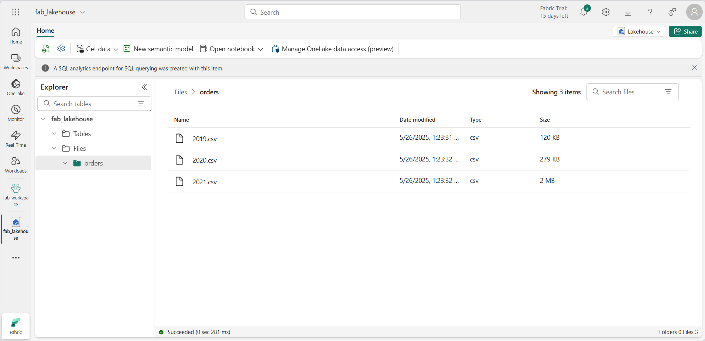

---
lab:
  title: Apache Spark を使用してデータを分析する
  module: Use Apache Spark to work with files in a lakehouse
---

# Apache Spark を使用してデータを分析する

Apache Spark は、分散データ処理を行うためのオープン ソース エンジンであり、データ レイク ストレージ内の膨大な量のデータを探索、処理、分析するために広く使用されています。 Spark は、Azure HDInsight、Azure Databricks、Azure Synapse Analytics、Microsoft Fabric など、多くのデータ プラットフォーム製品で処理オプションとして使用できます。 Java、Scala、Python、SQL など、幅広いプログラミング言語に対応していることが Spark の利点の 1 つであり、これにより Spark は、データ クレンジングと操作、統計分析と機械学習、データ分析と視覚化など、データ処理ワークロードのソリューションとして高い柔軟性を実現しています。

このラボは完了するまで、約 **45** 分かかります。

> **注**:この演習を完了するには、[Microsoft Fabric 試用版](https://learn.microsoft.com/fabric/get-started/fabric-trial)が必要です。

## ワークスペースの作成

Fabric でデータを操作する前に、Fabric 試用版を有効にしてワークスペースを作成してください。

1. [Microsoft Fabric ホーム ページ](https://app.fabric.microsoft.com/home?experience=fabric) (`https://app.fabric.microsoft.com/home?experience=fabric`) で、**[Synapse Data Engineering]** を選択します。
1. 左側のメニュー バーで、 **[ワークスペース]** を選択します (アイコンは &#128455; に似ています)。
1. 新しいワークスペースを任意の名前で作成し、 **[詳細]** セクションで、Fabric 容量を含むライセンス モード ("*試用版*"、*Premium*、または *Fabric*) を選択します。
1. 開いた新しいワークスペースは空のはずです。

    

## レイクハウスを作成してファイルをアップロードする

ワークスペースが作成されたので、次に分析するデータ ファイル用のデータ レイクハウスを作成します。

1. **Synapse Data Engineering** のホーム ページで、任意の名前を指定して新しい**レイクハウス**を作成します。

    1 分ほどすると、新しい空のレイクハウスが作成されます。 分析のために、データ レイクハウスにいくつかのデータを取り込む必要があります。 これを行う複数の方法がありますが、この演習では、ローカル コンピューター (該当する場合はラボ VM) にテキスト ファイルのフォルダーをダウンロードして抽出し、レイクハウスにアップロードします。

1. `https://github.com/MicrosoftLearning/dp-data/raw/main/orders.zip` からこの演習の[データ ファイル](https://github.com/MicrosoftLearning/dp-data/raw/main/orders.zip)をダウンロードして抽出します。

1. zip 形式のアーカイブを抽出した後、**orders** という名前のフォルダーがあり、**2019.csv**、**2020.csv**、**2021.csv** という名前の CSV ファイルが含まれていることを確認します。
1. レイクハウスを含む Web ブラウザー タブに戻り、 **[エクスプローラー]** ペインの **Files** フォルダーの **[...]** メニューで **[アップロード]** と **[ファイルのアップロード]** を選択し、ローカル コンピューター (または該当する場合はラボ VM) からレイクハウスに **orders** フォルダーをアップロードします。
1. ファイルがアップロードされたら、 **[ファイル]** を展開して、**orders** フォルダーを選びます。そして、次に示すように、CSV ファイルがアップロードされていることを確認します。

    

## ノートブックを作成する

Apache Spark でデータを操作するには、"ノートブック" を作成します。** ノートブックは、(複数の言語で) コードを記述して実行し、メモを追加してドキュメント化できる、対話型の環境が提供されます。

1. データレイクの **orders** フォルダーの内容を表示したまま、 **[ホーム]** ページの **[ノートブックを開く]** メニューで、 **[新しいノートブック]** を選択します。

    数秒後に、1 つの ''セル'' を含む新しいノートブックが開きます。** ノートブックは、''コード'' または ''マークダウン'' (書式設定されたテキスト) を含むことができる 1 つまたは複数のセルで構成されます。** **

2. 最初のセル (現在は ''コード'' セル) を選択し、右上の動的ツール バーで **[M&#8595;]** ボタンを使用してセルを ''マークダウン'' セルに変換します。** **

    セルがマークダウン セルに変わると、それに含まれるテキストがレンダリングされます。

3. **&#128393;** ([編集]) ボタンを使ってセルを編集モードに切り替え、マークダウンを次のように変更します。

    ```
   # Sales order data exploration

   Use the code in this notebook to explore sales order data.
    ```

4. セルの外側のノートブック内の任意の場所をクリックして編集を停止し、レンダリングされたマークダウンを確認します。

## データフレームにデータを読み込む

これで、"データフレーム" にデータを読み込むコードを実行する準備ができました。** Spark のデータフレームは Python の Pandas データフレームに似ており、行と列のデータを操作するための共通の構造が提供されます。

> **注**: Spark では、Scala、Java などの複数のコーディング言語がサポートされています。 この演習では、Python の Spark に最適化されたバリエーションである *PySpark* を使います。 PySpark は Spark で最もよく使われる言語の 1 つであり、Fabric ノートブックの既定の言語です。

1. ノートブックが表示されている状態で、**[エクスプローラー]** ペインで **[レイクハウス]** を展開し、レイクハウスの **[ファイル]** 一覧を展開して、**orders** フォルダーを選びます。すると、次のように CSV ファイルがノートブック エディターの横に一覧表示されます。

    ![[ファイル] ペインを含むノートブックのスクリーンショット。](./Images/notebook-files.png)

1. **2019.csv** の **[...]** メニューで、 **[データの読み込み]**  >  **[Spark]** を選びます。 次のコードを含む新しいコード セルがノートブックに追加されるはずです。

    ```python
   df = spark.read.format("csv").option("header","true").load("Files/orders/2019.csv")
   # df now is a Spark DataFrame containing CSV data from "Files/orders/2019.csv".
   display(df)
    ```

    > **ヒント**: 左側のレイクハウス エクスプローラー ペインは、その **<<** アイコンを使って非表示にできます。 そうすると、ノートブックに集中するのに役立ちます。

1. セルの左側にある **&#9655; [セルの実行]** ボタンを使って実行します。

    > **注**: ここで初めて Spark コードを実行するので、Spark セッションを開始する必要があります。 これは、セッション内での最初の実行が完了するまで 1 分ほどかかる場合があることを意味します。 それ以降は、短時間で実行できます。

1. セル コマンドが完了したら、セルの下にある出力を確認します。これは次のようになるはずです。

    | インデックス | SO43701 | 11 | 2019-07-01 | Christy Zhu | christy12@adventure-works.com | Mountain-100 Silver, 44 | 16 | 3399.99 | 271.9992 |
    | -- | -- | -- | -- | -- | -- | -- | -- | -- | -- |
    | 1 | SO43704 | 1 | 2019-07-01 | Julio Ruiz | julio1@adventure-works.com | Mountain-100 Black, 48 | 1 | 3374.99 | 269.9992 |
    | 2 | SO43705 | 1 | 2019-07-01 | Curtis Lu | curtis9@adventure-works.com | Mountain-100 Silver, 38 | 1 | 3399.99 | 271.9992 |
    | ... | ... | ... | ... | ... | ... | ... | ... | ... | ... |

    出力には、2019.csv ファイルのデータの行と列が表示されます。 ただし、列ヘッダーが正しく表示されないことに注意してください。 データフレームにデータを読み込むために使われる既定のコードでは、CSV ファイルの最初の行に列名が含まれているものと想定されていますが、この場合、CSV ファイルにはヘッダー情報はなく、データだけが含まれます。

1. 次のようにコードを変更して、**header** オプションを **false** に設定します。

    ```python
   df = spark.read.format("csv").option("header","false").load("Files/orders/2019.csv")
   # df now is a Spark DataFrame containing CSV data from "Files/orders/2019.csv".
   display(df)
    ```

1. セルをもう一度実行して、出力が次のようになることを確認します。

   | インデックス | _c0 | _c1 | _c2 | _c3 | _c4 | _c5 | _c6 | _c7 | _c8 |
    | -- | -- | -- | -- | -- | -- | -- | -- | -- | -- |
    | 1 | SO43701 | 11 | 2019-07-01 | Christy Zhu | christy12@adventure-works.com | Mountain-100 Silver, 44 | 16 | 3399.99 | 271.9992 |
    | 2 | SO43704 | 1 | 2019-07-01 | Julio Ruiz | julio1@adventure-works.com | Mountain-100 Black, 48 | 1 | 3374.99 | 269.9992 |
    | 3 | SO43705 | 1 | 2019-07-01 | Curtis Lu | curtis9@adventure-works.com | Mountain-100 Silver, 38 | 1 | 3399.99 | 271.9992 |
    | ... | ... | ... | ... | ... | ... | ... | ... | ... | ... |

    これで、データフレームの最初の行にはデータ値が正しく格納されますが、列名は自動生成され、あまり役に立ちません。 データを意味のあるものにするには、ファイル内のデータ値の正しいスキーマとデータ型を明示的に定義する必要があります。

1. 次のようにコードを変更してスキーマを定義し、データの読み込み時にそれを適用します。

    ```python
   from pyspark.sql.types import *

   orderSchema = StructType([
       StructField("SalesOrderNumber", StringType()),
       StructField("SalesOrderLineNumber", IntegerType()),
       StructField("OrderDate", DateType()),
       StructField("CustomerName", StringType()),
       StructField("Email", StringType()),
       StructField("Item", StringType()),
       StructField("Quantity", IntegerType()),
       StructField("UnitPrice", FloatType()),
       StructField("Tax", FloatType())
       ])

   df = spark.read.format("csv").schema(orderSchema).load("Files/orders/2019.csv")
   display(df)
    ```

1. 変更したセルを実行して、出力が次のようになることを確認します。

   | インデックス | SalesOrderNumber | SalesOrderLineNumber | OrderDate | CustomerName | Email | Item | Quantity | UnitPrice | 税 |
    | -- | -- | -- | -- | -- | -- | -- | -- | -- | -- |
    | 1 | SO43701 | 11 | 2019-07-01 | Christy Zhu | christy12@adventure-works.com | Mountain-100 Silver, 44 | 16 | 3399.99 | 271.9992 |
    | 2 | SO43704 | 1 | 2019-07-01 | Julio Ruiz | julio1@adventure-works.com | Mountain-100 Black, 48 | 1 | 3374.99 | 269.9992 |
    | 3 | SO43705 | 1 | 2019-07-01 | Curtis Lu | curtis9@adventure-works.com | Mountain-100 Silver, 38 | 1 | 3399.99 | 271.9992 |
    | ... | ... | ... | ... | ... | ... | ... | ... | ... | ... |

    これで、データフレームに正しい列名が含まれるようになりました (すべてのデータフレームに組み込まれる、各行の序数位置に基づく **Index** 列に加えて)。 列のデータ型は、Spark SQL ライブラリで定義されている標準の型のセットを使って指定されます。これは、セルの先頭でインポートされています。

1. データフレームには、**2019.csv** ファイルからのデータのみが含まれます。 ファイル パスで \* ワイルドカードを使うようにコードを変更して、**orders** フォルダー内のすべてのファイルから販売注文データを読み取ります。

    ```python
   from pyspark.sql.types import *

   orderSchema = StructType([
       StructField("SalesOrderNumber", StringType()),
       StructField("SalesOrderLineNumber", IntegerType()),
       StructField("OrderDate", DateType()),
       StructField("CustomerName", StringType()),
       StructField("Email", StringType()),
       StructField("Item", StringType()),
       StructField("Quantity", IntegerType()),
       StructField("UnitPrice", FloatType()),
       StructField("Tax", FloatType())
       ])

   df = spark.read.format("csv").schema(orderSchema).load("Files/orders/*.csv")
   display(df)
    ```

1. 変更したコード セルを実行して出力を確認します。2019 年、2020 年、2021 年の売上が含まれるようになっているはずです。

    **注**: 行のサブセットのみが表示されるため、すべての年の例を表示できない場合があります。

## データフレーム内のデータを調べる

データフレーム オブジェクトに含まれるさまざまな関数を使って、それに含まれるデータのフィルター処理、グループ化、その他の操作を実行できます。

### データフレームをフィルター処理する

1. 現在のセルの出力の左側にマウスを移動すると表示される **[+ コード]** リンクを使用して (または、メニュー バーの **[編集]** タブで **[+ コード セルの追加]** を選択して)、新しいコード セルを追加します。 次に、以下のコードを入力します。

    ```Python
   customers = df['CustomerName', 'Email']
   print(customers.count())
   print(customers.distinct().count())
   display(customers.distinct())
    ```

2. この新しいコード セルを実行し、結果を確認します。 次の詳細を確認します。
    - データフレームに対して操作を実行すると、その結果として新しいデータフレームが作成されます (この場合、**df** データフレームから列の特定のサブセットを選択することで、新しい **customers** データフレームが作成されます)
    - データフレームには、そこに含まれているデータの集計やフィルター処理に使用できる **count** や **distinct** などの関数が用意されています。
    - `dataframe['Field1', 'Field2', ...]` 構文は、列のサブセットを定義する簡単な方法です。 また、**select** メソッドを使用すると、上記のコードの最初の行を `customers = df.select("CustomerName", "Email")` のように記述することができます

3. コードを次のように変更します。

    ```Python
   customers = df.select("CustomerName", "Email").where(df['Item']=='Road-250 Red, 52')
   print(customers.count())
   print(customers.distinct().count())
   display(customers.distinct())
    ```

4. この変更したコードを実行すると、"*Road-250 Red, 52*" という製品を購入した顧客が表示されます。 複数の関数を "チェーン" にすると、1 つの関数の出力が次の関数の入力になることに注意してください。この場合、**select** メソッドによって作成されたデータフレームは、フィルター条件を適用するために使用される **where** メソッドのソース データフレームとなります。

### データフレーム内のデータを集計してグループ化する

1. ノートブックに新しいコード セルを追加し、そこに次のコードを入力します。

    ```Python
   productSales = df.select("Item", "Quantity").groupBy("Item").sum()
   display(productSales)
    ```

2. 追加したコード セルを実行し、その結果が、製品ごとにグループ化された注文数の合計を示していることに注意してください。 **groupBy** メソッドを使用すると、*Item* ごとに行がグループ化されます。その後の **sum** 集計関数は、残りのすべての数値列に適用されます (この場合は *Quantity*)

3. ノートブックに新しいコード セルをもう 1 つ追加し、そこに次のコードを入力します。

    ```Python
   from pyspark.sql.functions import *

   yearlySales = df.select(year("OrderDate").alias("Year")).groupBy("Year").count().orderBy("Year")
   display(yearlySales)
    ```

4. 追加したコード セルを実行し、その結果が 1 年あたりの販売注文数を示していることに注意してください。 **select** メソッドには、*OrderDate* フィールドの年コンポーネントを抽出するための SQL **year** 関数が含まれていることに注意してください (このため、コードには Spark SQL ライブラリから関数をインポートするための **import** ステートメントが含まれます)。 次に、**alias** メソッドを使用して、抽出された年の値に列名を割り当てます。 次に、データは派生 *Year* 列によってグループ化され、各グループの行数が計算されます。その後、結果として生成されたデータフレームを並べ替えるために、最後に **orderBy** メソッドが使用されます。

## Spark を使用してデータ ファイルを変換する

データ エンジニアにとって一般的なタスクは、特定の形式または構造でデータを取り込み、ダウンストリームの処理や分析のために変換することです。

### データフレームのメソッドと関数を使用してデータを変換する

1. ノートブックに新しいコード セルをもう 1 つ追加し、そこに次のコードを入力します。

    ```Python
   from pyspark.sql.functions import *

   ## Create Year and Month columns
   transformed_df = df.withColumn("Year", year(col("OrderDate"))).withColumn("Month", month(col("OrderDate")))

   # Create the new FirstName and LastName fields
   transformed_df = transformed_df.withColumn("FirstName", split(col("CustomerName"), " ").getItem(0)).withColumn("LastName", split(col("CustomerName"), " ").getItem(1))

   # Filter and reorder columns
   transformed_df = transformed_df["SalesOrderNumber", "SalesOrderLineNumber", "OrderDate", "Year", "Month", "FirstName", "LastName", "Email", "Item", "Quantity", "UnitPrice", "Tax"]

   # Display the first five orders
   display(transformed_df.limit(5))
    ```

2. 次の変換を使用して、元の注文データから新しいデータフレームを作成するコードを実行します。
    - **OrderDate** 列に基づく **Year** 列と **Month** 列を追加します。
    - **CustomerName** 列に基づく **FirstName** 列と **LastName** 列を追加します。
    - 列をフィルター処理して並べ替え、**CustomerName** 列を削除します。

3. 出力を調べて、データに変換が行われたことを確認します。

    Spark SQL ライブラリの完全な機能を使用して、行のフィルター処理、派生、削除、列の名前変更、その他の必要なデータ変更の適用によってデータを変換できます。

    > **ヒント**: Dataframe オブジェクトのメソッドについて詳しくは、[Spark データフレームのドキュメント](https://spark.apache.org/docs/latest/api/python/reference/pyspark.sql/dataframe.html)をご覧ください。

### 変換されたデータを保存する

1. 次のコードを含む新しいセルを追加して、変換されたデータフレームを Parquet 形式で保存します (データが既に存在する場合は上書きします)。

    ```Python
   transformed_df.write.mode("overwrite").parquet('Files/transformed_data/orders')
   print ("Transformed data saved!")
    ```

    > **注**: 一般に、*Parquet* 形式は、分析ストアへの追加の分析またはインジェストに使用するデータ ファイルに適しています。 Parquet は、ほとんどの大規模な Data Analytics システムでサポートされている非常に効率的な形式です。 実際、データ変換の要件が、単に別の形式 (CSV など) から Parquet にデータを変換することだけである場合があります。

2. セルを実行し、データが保存されたことを示すメッセージを待ちます。 次に、左側の **[レイクハウス]** ペインの **[ファイル]** ノードの **[...]** メニューで **[更新]** を選び、**transformed_data** フォルダーを選んで、**orders** という名前の新しいフォルダーが含まれることを確認します。これには、1 つ以上の Parquet ファイルが含まれています。

    

3. 次のコードを含む新しいセルを追加して、**transformed_data/orders** フォルダー内の Parquet ファイルから新しいデータフレームを読み込みます。

    ```Python
   orders_df = spark.read.format("parquet").load("Files/transformed_data/orders")
   display(orders_df)
    ```

4. セルを実行し、Parquet ファイルから読み込まれた注文データが結果で示されることを確認します。

### パーティション分割されたファイルにデータを保存する

1. 次のコードを含む新しいセルを追加します。このコードは、データフレームを保存し、**Year** と **Month** でデータをパーティション分割します。

    ```Python
   orders_df.write.partitionBy("Year","Month").mode("overwrite").parquet("Files/partitioned_data")
   print ("Transformed data saved!")
    ```

2. セルを実行し、データが保存されたことを示すメッセージを待ちます。 次に、左側の **[レイクハウス]** ペインの **[ファイル]** ノードの **[...]** メニューで **[更新]** を選び、**partitioned_orders** フォルダーを展開して、**Year=* xxxx*** という名前のフォルダーの階層が含まれ、それぞれに **Month=* xxxx*** という名前のフォルダーが含まれていることを確認します。 各月のフォルダーには、その月の注文を含む Parquet ファイルが含まれています。

    

    データ ファイルのパーティション分割は、大量のデータを処理するときにパフォーマンスを最適化する一般的な方法です。 この手法により、パフォーマンスが大幅に向上し、データのフィルター処理が容易になります。

3. **orders.parquet** ファイルから新しいデータフレームを読み込む次のコードを含む、新しいセルを追加します。

    ```Python
   orders_2021_df = spark.read.format("parquet").load("Files/partitioned_data/Year=2021/Month=*")
   display(orders_2021_df)
    ```

4. セルを実行し、2021 年の売上の注文データが結果で示されることを確認します。 パス (**Year** と **Month**) で指定されているパーティション分割列はデータフレームに含まれていないことに注意してください。

## テーブルと SQL を操作する

ここまで見てきたように、データフレーム オブジェクトのネイティブ メソッドを使うと、ファイルのデータのクエリと分析を効率的に行うことができます。 ただし、多くのデータ アナリストは、SQL 構文を使ってクエリを実行できるテーブルを使う方を好みます。 Spark で提供される "メタストア" を使うと、リレーショナル テーブルを定義できます。** データフレーム オブジェクトを提供する Spark SQL ライブラリでは、SQL ステートメントを使ってメタストア内のテーブルのクエリを実行することもできます。 Spark のこれらの機能を使うと、データ レイクの柔軟性と、リレーショナル データ ウェアハウスの構造化データ スキーマおよび SQL ベースのクエリを組み合わせることができます。そのため、"データ レイクハウス" と呼ばれます。

### テーブルを作成する

Spark メタストアのテーブルは、データ レイク内のファイルに対するリレーショナル抽象化です。 テーブルは、"マネージド" (この場合、ファイルはメタストアによって管理されます) でも "外部" (この場合、テーブルはメタストアとは別にユーザーが管理するデータ レイク内のファイルの場所を参照します) でもかまいません。** **

1. ノートブックに新しいコード セルを追加し、次のコードを入力します。これにより、販売注文データのデータフレームが **salesorders** という名前のテーブルとして保存されます。

    ```Python
   # Create a new table
   df.write.format("delta").saveAsTable("salesorders")

   # Get the table description
   spark.sql("DESCRIBE EXTENDED salesorders").show(truncate=False)
    ```

    > **注**: この例については、いくつかの点に注目してください。 まず、明示的なパスが指定されていないため、テーブルのファイルはメタストアによって管理されます。 次に、テーブルは**デルタ**形式で保存されます。 複数のファイル形式 (CSV、Parquet、Avro など) に基づいてテーブルを作成できますが、"デルタ レイク" は、リレーショナル データベース機能をテーブルに追加する Spark のテクノロジであり、トランザクション、行のバージョン管理、その他の便利な機能のサポートが含まれます。** Fabric のデータ レイクハウスの場合、デルタ形式でテーブルを作成することをお勧めします。

2. コード セルを実行し、新しいテーブルの定義が記述されている出力を確認します。

3. **[レイクハウス]** ペインで、**Tables** フォルダーの **[...]** メニューにある **[更新]** を選びます。 次に、 **[テーブル]** ノードを展開し、**salesorders** テーブルが作成されていることを確認します。

    

5. **salesorders** テーブルの **[...]** メニューで、 **[データの読み込み]**  >  **[Spark]** を選びます。

    次の例のようなコードを含む新しいコード セルがノートブックに追加されます。

    ```Python
   df = spark.sql("SELECT * FROM [your_lakehouse].salesorders LIMIT 1000")
   display(df)
    ```

6. 新しいコードを実行すると、Spark SQL ライブラリを使って **salesorder** テーブルに対する SQL クエリが PySpark コードに埋め込まれ、クエリの結果がデータフレームに読み込まれます。

### SQL コードをセル内で実行する

PySpark コードが含まれているセルに SQL ステートメントを埋め込むことができるのは便利ですが、データ アナリストにとっては、SQL で直接作業できればよいという場合も多くあります。

1. ノートブックに新しいコード セルを追加し、そこに次のコードを入力します。

    ```sql
   %%sql
   SELECT YEAR(OrderDate) AS OrderYear,
          SUM((UnitPrice * Quantity) + Tax) AS GrossRevenue
   FROM salesorders
   GROUP BY YEAR(OrderDate)
   ORDER BY OrderYear;
    ```
 
2. このセルを実行し、結果を確認します。 次の点に注意してください。
    - セルの先頭にある `%%sql` 行 (*magic* と呼ばれます) は、このセル内でこのコードを実行するには、PySpark ではなく、Spark SQL 言語ランタイムを使用する必要があることを示しています。
    - この SQL コードは、前に作成した **salesorder** テーブルを参照します。
    - SQL クエリからの出力は、セルの下に自動的に結果として表示されます。

> **注**: Spark SQL とデータフレームの詳細については、[Spark SQL のドキュメント](https://spark.apache.org/docs/2.2.0/sql-programming-guide.html)を参照してください。

## Spark を使用してデータを視覚化する

画像が何千もの言葉を語り、表が何千行にも及ぶデータよりもわかりやすいことは、だれもが知っています。 Fabric のノートブックには、データフレームまたは Spark SQL クエリから表示されるデータのグラフ ビューが組み込まれていますが、これは包括的なグラフ作成を目的としたものではありません。 ただし、**matplotlib** や **seaborn** などの Python グラフィックス ライブラリを使用して、データフレーム内のデータからグラフを作成することができます。

### 結果をグラフで表示する

1. ノートブックに新しいコード セルを追加し、そこに次のコードを入力します。

    ```sql
   %%sql
   SELECT * FROM salesorders
    ```

2. コードを実行し、前に作成した **salesorders** ビューからのデータが返されることを確認します。
3. セルの下の結果セクションで、 **[ビュー]** オプションを **[表]** から **[グラフ]** に変更します。
4. グラフの右上にある **[グラフのカスタマイズ]** ボタンを使って、グラフのオプション ペインを表示します。 オプションを次のように設定し、 **[適用]** を選択します。
    - **グラフの種類**: 横棒グラフ
    - **キー**: Item
    - **値**: Quantity
    - **系列グループ**: "空白のままにする"**
    - **集計**: SUM
    - **積み上げ**: "未選択"**

5. グラフが次のように表示されていることを確認します。

    

### **matplotlib** の使用を開始する

1. ノートブックに新しいコード セルを追加し、そこに次のコードを入力します。

    ```Python
   sqlQuery = "SELECT CAST(YEAR(OrderDate) AS CHAR(4)) AS OrderYear, \
                   SUM((UnitPrice * Quantity) + Tax) AS GrossRevenue \
               FROM salesorders \
               GROUP BY CAST(YEAR(OrderDate) AS CHAR(4)) \
               ORDER BY OrderYear"
   df_spark = spark.sql(sqlQuery)
   df_spark.show()
    ```

2. コードを実行し、年間収益を含む Spark データフレームが返されることを確認します。

    データをグラフとして視覚化するには、まず **matplotlib** Python ライブラリを使用します。 このライブラリは、他の多くのライブラリに基づいたコア プロット ライブラリであり、これを使用するとグラフ作成時の柔軟性が大幅に向上します。

3. ノートブックに新しいコード セルを追加し、そこに次のコードを追加します。

    ```Python
   from matplotlib import pyplot as plt

   # matplotlib requires a Pandas dataframe, not a Spark one
   df_sales = df_spark.toPandas()

   # Create a bar plot of revenue by year
   plt.bar(x=df_sales['OrderYear'], height=df_sales['GrossRevenue'])

   # Display the plot
   plt.show()
    ```

4. このセルを実行し、結果を確認します。結果には、各年の総収益が縦棒グラフで示されています。 このグラフの生成に使用されているコードの次の機能に注目してください。
    - **matplotlib** ライブラリには *Pandas* データフレームが必要であるため、Spark SQL クエリによって返される *Spark* データフレームをこの形式に変換する必要があります。
    - **matplotlib** ライブラリの中核となるのは、**pyplot** オブジェクトです。 これは、ほとんどのプロット機能の基礎となります。
    - 既定の設定では、使用可能なグラフが生成されますが、カスタマイズすべき範囲が大幅に増えます。

5. コードを次のように変更して、グラフをプロットします。

    ```Python
   from matplotlib import pyplot as plt

   # Clear the plot area
   plt.clf()

   # Create a bar plot of revenue by year
   plt.bar(x=df_sales['OrderYear'], height=df_sales['GrossRevenue'], color='orange')

   # Customize the chart
   plt.title('Revenue by Year')
   plt.xlabel('Year')
   plt.ylabel('Revenue')
   plt.grid(color='#95a5a6', linestyle='--', linewidth=2, axis='y', alpha=0.7)
   plt.xticks(rotation=45)

   # Show the figure
   plt.show()
    ```

6. コード セルを再実行し、結果を表示します。 これで、もう少し詳細な情報がグラフに含まれるようになりました。

    プロットは、技術的に**図**に含まれています。 前の例では、図が暗黙的に作成されていましたが、明示的に作成することもできます。

7. コードを次のように変更して、グラフをプロットします。

    ```Python
   from matplotlib import pyplot as plt

   # Clear the plot area
   plt.clf()

   # Create a Figure
   fig = plt.figure(figsize=(8,3))

   # Create a bar plot of revenue by year
   plt.bar(x=df_sales['OrderYear'], height=df_sales['GrossRevenue'], color='orange')

   # Customize the chart
   plt.title('Revenue by Year')
   plt.xlabel('Year')
   plt.ylabel('Revenue')
   plt.grid(color='#95a5a6', linestyle='--', linewidth=2, axis='y', alpha=0.7)
   plt.xticks(rotation=45)

   # Show the figure
   plt.show()
    ```

8. コード セルを再実行し、結果を表示します。 図によって、プロットの形状とサイズが決まります。

    図には複数のサブプロットが含まれており、それぞれに独自の "軸" があります**。

9. コードを次のように変更して、グラフをプロットします。

    ```Python
   from matplotlib import pyplot as plt

   # Clear the plot area
   plt.clf()

   # Create a figure for 2 subplots (1 row, 2 columns)
   fig, ax = plt.subplots(1, 2, figsize = (10,4))

   # Create a bar plot of revenue by year on the first axis
   ax[0].bar(x=df_sales['OrderYear'], height=df_sales['GrossRevenue'], color='orange')
   ax[0].set_title('Revenue by Year')

   # Create a pie chart of yearly order counts on the second axis
   yearly_counts = df_sales['OrderYear'].value_counts()
   ax[1].pie(yearly_counts)
   ax[1].set_title('Orders per Year')
   ax[1].legend(yearly_counts.keys().tolist())

   # Add a title to the Figure
   fig.suptitle('Sales Data')

   # Show the figure
   plt.show()
    ```

10. コード セルを再実行し、結果を表示します。 図には、コード内に指定したサブプロットが含まれています。

> **注**: matplotlib を使用したプロットの詳細については、[matplotlib のドキュメント](https://matplotlib.org/)を参照してください。

### **seaborn** ライブラリを使用する

**matplotlib** を使用すると、複数の種類の複雑なグラフを作成することができますが、優れた結果を得るには、複雑なコードを必要とする場合があります。 このため、複雑性の抽象化と機能の強化を目的に、matplotlib のベース上に数多くの新しいライブラリが何年もかけて構築されてきました。 そのようなライブラリの 1 つに **seaborn** があります。

1. ノートブックに新しいコード セルを追加し、そこに次のコードを入力します。

    ```Python
   import seaborn as sns

   # Clear the plot area
   plt.clf()

   # Create a bar chart
   ax = sns.barplot(x="OrderYear", y="GrossRevenue", data=df_sales)
   plt.show()
    ```

2. コードを実行し、seaborn ライブラリを使用した横棒グラフが表示されていることを確認します。
3. コードを次のように変更します。

    ```Python
   import seaborn as sns

   # Clear the plot area
   plt.clf()

   # Set the visual theme for seaborn
   sns.set_theme(style="whitegrid")

   # Create a bar chart
   ax = sns.barplot(x="OrderYear", y="GrossRevenue", data=df_sales)
   plt.show()
    ```

4. 変更したコードを実行し、seaborn によってプロットに一貫性のある配色テーマが設定されていることに注意します。

5. もう一度コードを次のように変更します。

    ```Python
   import seaborn as sns

   # Clear the plot area
   plt.clf()

   # Create a line chart
   ax = sns.lineplot(x="OrderYear", y="GrossRevenue", data=df_sales)
   plt.show()
    ```

6. 変更したコードを実行し、年間収益を折れ線グラフで表示します。

> **注**: seaborn を使用したプロットの詳細については、[seaborn のドキュメント](https://seaborn.pydata.org/index.html)を参照してください。

## ノートブックを保存して Spark セッションを終了する

データの操作が済んだので、わかりやすい名前でノートブックを保存し、Spark セッションを終了できます。

1. ノートブックのメニュー バーで、⚙️ **[設定]** アイコンを使用してノートブックの設定を表示します。
2. ノートブックの **[名前]** を「**販売注文を探索する**」に設定して、設定ペインを閉じます。
3. ノートブック メニューで、 **[セッションの停止]** を選択して Spark セッションを終了します。

## リソースをクリーンアップする

この演習では、Spark を使って Microsoft Fabric のデータを操作する方法を学習しました。

レイクハウスの探索が完了したら、この演習用に作成したワークスペースを削除できます。

1. 左側のバーで、ワークスペースのアイコンを選択して、それに含まれるすべての項目を表示します。
2. ツール バーの **[...]** メニューで、 **[ワークスペースの設定]** を選択してください。
3. **[全般]** セクションで、**[このワークスペースの削除]** を選択します。
