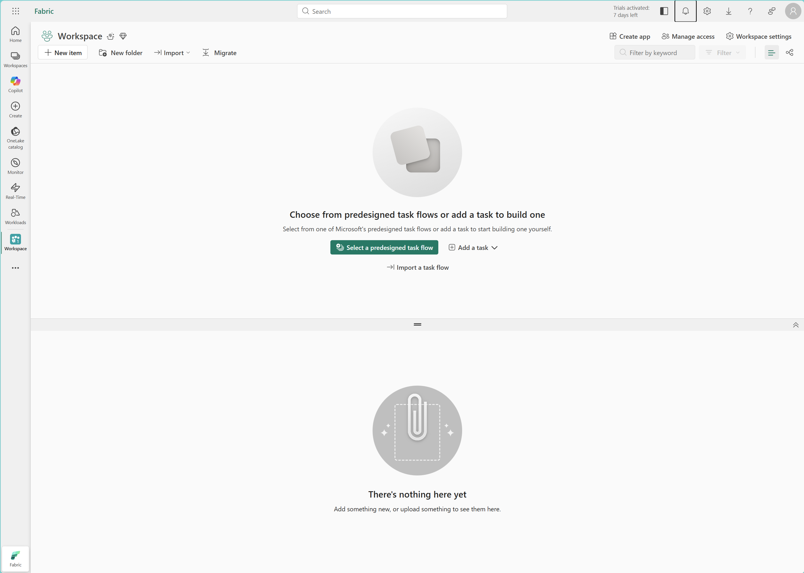
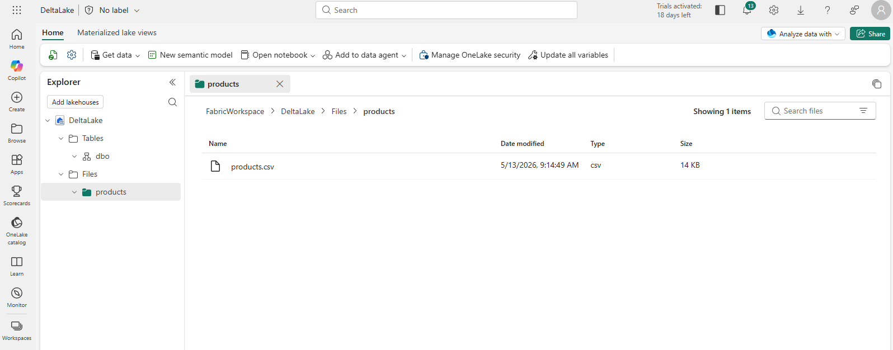
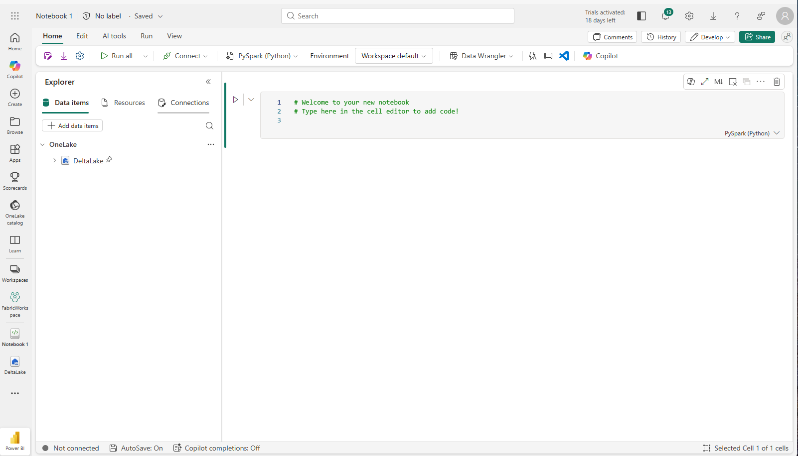
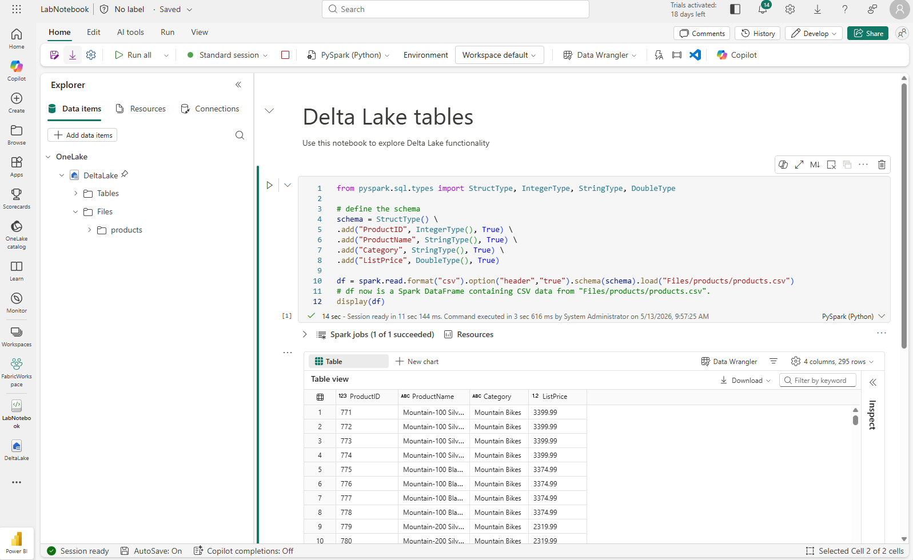
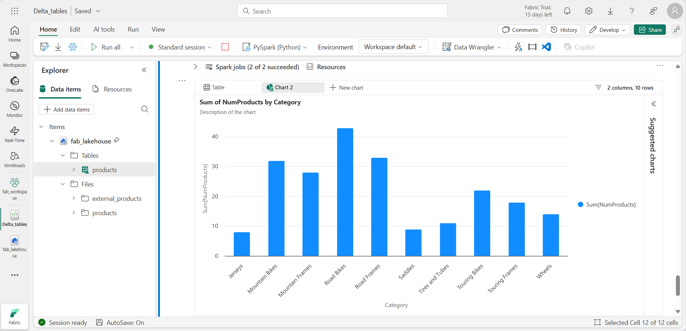

---
lab:
  title: Apache Spark で差分テーブルを使用する
  module: Work with Delta Lake tables in Microsoft Fabric
  description: このラボでは、PySpark と SQL の両方を使用して、Microsoft Fabric レイクハウスで Delta テーブルを作成して管理します。 マネージド テーブル、テーブルのバージョン管理、ストリーミング データ、Delta Lake データに対する SQL クエリについて説明します。
  duration: 45 minutes
  level: 300
  islab: true
  primarytopics:
    - Microsoft Fabric
  categories:
    - Data engineering
  courses:
    - DP-700
    - DP-601
---

# Apache Spark で Delta テーブルを使用する

Microsoft Fabric レイクハウスのテーブルは、オープンソースの Delta Lake 形式に基づいています。 Delta Lake では、バッチ データとストリーミング データの両方に対するリレーショナル セマンティクスのサポートが追加されます。 この演習では、PySpark と SQL を使用してマネージド Delta テーブルを作成し、テーブルのバージョン管理を調べて、ストリーミング データを操作します。

この演習の完了に要する時間は約 **45** 分です

## ワークスペースの作成

> **注**: この演習を完了するには、Fabric の有料版または試用版の容量にアクセスできることが必要です。 無料の Fabric 試用版の詳細については、[Fabric 試用版](https://aka.ms/fabrictrial)に関するページを参照してください。

1. ブラウザーで [Microsoft Fabric ホーム ページ](https://app.fabric.microsoft.com/home?experience=fabric-developer) (`https://app.fabric.microsoft.com/home?experience=fabric-developer`) に移動し、Fabric 資格情報でサインインします。
1. 左側のメニュー バーで、 **[ワークスペース]** を選択します (アイコンは &#128455; に似ています)。
1. **dp_workspace** という名前で新しいワークスペースを作成し、**[詳細]** セクションで、Fabric 容量を含むライセンス モード ("試用版"、*Premium*、または *Fabric*) を選択します。**
1. 開いた新しいワークスペースは空のはずです。

    

## レイクハウスを作成してファイルをアップロードする

ワークスペースが作成されたので、次に自分のデータ用のデータ レイクハウスを作成します。

1. ワークスペースで、**[+ 新しい項目]** を選択し、**delta_lakehouse** という名前の新しい**レイクハウス**を作成します。 **[レイクハウス スキーマ]** チェック ボックスはオンにしたままにします。

    1 分ほどすると、新しいレイクハウスが作成されます。

    

1. 新しいレイクハウスを表示します。左側の **[エクスプローラー]** ペインでレイクハウス内のテーブルやファイルを参照できます。

これでレイクハウスにデータを取り込めます。 これを行う方法はいくつかありますが、ここでは、テキスト ファイルを自分のコンピューターにダウンロードし、それをレイクハウスにアップロードします。

1. `https://github.com/MicrosoftLearning/dp-data/raw/main/products.csv` から[データ ファイル](https://github.com/MicrosoftLearning/dp-data/raw/main/products.csv)をダウンロードし、*products.csv* として保存します。
1. レイクハウスを含む Web ブラウザー タブに戻り、[エクスプローラー] ペインで、**Files** フォルダーの横にある [...]  メニューを選択します。  *products* という**新しいサブフォルダー**を作成します。 名前はすべて小文字にする必要があります。
1. MMC コンソールで、[ファイル] を選択し、 products フォルダーの [...] メニューで、コンピューターから *products.csv* ファイルの **[アップロード]** を実行します。
1. ファイルがアップロードされたら、**products** フォルダーを選択し、次に示すようにファイルがアップロードされていることを確認します。

    
  
## DataFrame 内のデータを探索する

これで、データを操作する Fabric ノートブックを作成できるようになりました。 ノートブックは、コードを記述して実行できる対話型環境を提供します。

1. レイクハウスで、**[ノートブックを開く]**  >  **[新しいノートブック]** の順に選択します。

    **Notebook 1** という名前の新しいノートブックが作成されて開きます。

    

1. Fabric は、Notebook 1、Notebook 2 などのように、作成する各ノートブックに名前を割り当てます。名前をよりわかりやすいものに変更するには、メニューの **[ホーム]** タブの上にある名前パネルをクリックします。
1. 最初のセル (今はコード セル) を選択し、右上のツール バーで **[M↓]** ボタンを使用して Markdown セルに変換します。 セルに含まれるテキストは、書式設定されたテキストで表示されます。
1. 🖉 ([編集]) ボタンを使用してセルを編集モードに切り替え、マークダウンを次のように変更します。

    ```markdown
    # Delta Lake tables 
    Use this notebook to explore Delta Lake functionality 
    ```

1. セルの外側のノートブック内の任意の場所をクリックして編集を停止します。
1. 新しいコード セルを追加し、次のコードを追加して、定義したスキーマにより製品データを DataFrame に読み取ります。

    > [!TIP]
    > コード セルを追加するには、現在のセルまたはその出力の上または下にマウス ポインターを置くと表示される **[+ コード]** を選択します。 または、リボン メニューで **[編集]**、**[+ コード セルを下に挿入する]** の順に選択します。

    ```python
   from pyspark.sql.types import StructType, IntegerType, StringType, DoubleType

   # define the schema
   schema = StructType() \
   .add("ProductID", IntegerType(), True) \
   .add("ProductName", StringType(), True) \
   .add("Category", StringType(), True) \
   .add("ListPrice", DoubleType(), True)

   df = spark.read.format("csv").option("header","true").schema(schema).load("Files/products/products.csv")
   # df now is a Spark DataFrame containing CSV data from "Files/products/products.csv".
   display(df)
    ```

> [!TIP]
> シェブロン [«] アイコンを使用して、エクスプローラー ペインを非表示または表示にできます。 こうすることで、ノートブックまたはファイルに集中できます。

1. セルの左側にある **[セルの実行]** (▷) ボタンを使用して実行します。

> [!NOTE]
> このノートブックで Spark コードを実行したのはこれが最初であるため、Spark セッションを開始する必要があります。 これは、最初の実行が完了するまで 1 分ほどかかる場合があることを意味します。 それ以降は、短時間で実行できます。

1. セル コードが完了したら、セルの下にある出力を確認します。これは次のようになるはずです。

    
 
## Delta テーブルを作成する

これで、製品データを DataFrame に読み込んだので、それをレイクハウスの Delta テーブルとして保持できます。 これを行う最も簡単な方法は、`saveAsTable` メソッドを使用することです。

1. 新しいコード セルを追加し、次のコードを入力して、セルを実行します。

    ```python
   df.write.format("delta").saveAsTable("dbo.products_table")
    ```

1. [エクスプローラー] ペインで **[更新]** を選択して **Tables** フォルダーを更新し、Tables ノードを展開して **products_table** テーブルが作成されていることを確認します。

> [!NOTE]
> ファイル名の横にある三角形アイコンは Delta テーブルを示します。

## テーブルのバージョン管理を調べる

Delta Lake では、テーブルに対するすべての変更がトランザクション ログに自動的に記録されます。 このログを使用して、変更の履歴を表示し、データの以前のバージョンに対してクエリを実行できます。この機能は "タイム トラベル" と呼ばれます。**

実際の動作を確認するために、いくつかのデータを更新し、Delta Lake で記録された内容を調べてみましょう。

1. 新しいコード セルを追加し、次のコードを実行して、マウンテン バイクの定価を 10% 値下げします。

    ```python
   %%sql
   UPDATE dbo.products_table
   SET ListPrice = ListPrice * 0.9
   WHERE Category = 'Mountain Bikes';
    ```

1. 別のコード セルを追加し、次のコードを実行して、テーブルのトランザクション履歴を表示します。

    ```python
   %%sql
   DESCRIBE HISTORY dbo.products_table;
    ```

   結果には、テーブルに対して記録された各トランザクションが表示されます。バージョン 0 は元の書き込みであり、バージョン 1 は先ほど実行した更新です。

1. 別のコード セルを追加し、次のコードを実行して、マウンテン バイクの元の価格と更新された価格を比較します。

    ```python
   %%sql
   SELECT
       o.ProductName,
       o.ListPrice AS OriginalPrice,
       u.ListPrice AS UpdatedPrice
   FROM dbo.products_table VERSION AS OF 0 o
   JOIN dbo.products_table u ON o.ProductID = u.ProductID
   WHERE o.Category = 'Mountain Bikes'
   ORDER BY o.ProductName;
    ```

   各行にはマウンテン バイクが表示され、元の価格と更新された価格が別々の列に表示されます。

## SQL クエリを使用してデルタ テーブルのデータを分析する

SQL を使用して、Delta テーブルに対して分析クエリを実行できます。 便利な手法の 1 つは、"一時ビュー" を作成することです。これは、セッション期間中に存在する名前付きクエリです。** テーブルのように参照できるため、後続のクエリを短く、読みやすくすることができます。

1. 新しいコード セルを追加し、次のコードを実行して、製品データをカテゴリ別に集計する一時ビューを作成します。

    ```python
   %%sql
   CREATE OR REPLACE TEMPORARY VIEW products_view
   AS
       SELECT Category, COUNT(*) AS NumProducts, MIN(ListPrice) AS MinPrice, MAX(ListPrice) AS MaxPrice, AVG(ListPrice) AS AvgPrice
       FROM dp_workspace.delta_lakehouse.dbo.products_table
       GROUP BY Category;

   SELECT *
   FROM products_view
   ORDER BY Category;
    ```

1. 新しいコード セルを追加し、次のコードを実行して、製品数の多い上位 10 カテゴリのビューに対してクエリを実行します。集計ロジックを繰り返さずに、ビューに対して直接クエリを実行していることに注意してください。

    ```python
   %%sql
   SELECT Category, NumProducts
   FROM products_view
   ORDER BY NumProducts DESC
   LIMIT 10;
    ```

1. データが返されたら、 **[+ 新しいグラフ]** を選択して、推奨されるグラフの 1 つを表示します。

    

PySpark を使用してビューのクエリを実行することもできます。これは、DataFrame 操作または視覚化を SQL 結果に適用する場合に便利です。

1. 新しいコード セルを追加し、次のコードを実行します。

    ```python
   from pyspark.sql.functions import col, desc

   df_products = spark.sql("SELECT Category, MinPrice, MaxPrice, AvgPrice FROM products_view").orderBy(col("AvgPrice").desc())
   display(df_products.limit(6))
    ```

## ストリーミング データに Delta テーブルを使用する

Delta Lake ではストリーミング データがサポートされています。 デルタ テーブルは、Spark 構造化ストリーミング API を使用して作成されたデータ ストリームの "シンク" または "ソース" に指定できます。 この例では、モノのインターネット (IoT) のシミュレーション シナリオで、一部のストリーミング データのシンクに Delta テーブルを使用します。

1.  新しいコード セルを追加し、次のコードを追加して、実行します。

    ```python
    from notebookutils import mssparkutils
    from pyspark.sql.types import *
    from pyspark.sql.functions import *

    # Create a folder
    inputPath = 'Files/data/'
    mssparkutils.fs.mkdirs(inputPath)

    # Create a stream that reads data from the folder, using a JSON schema
    jsonSchema = StructType([
    StructField("device", StringType(), False),
    StructField("status", StringType(), False)
    ])
    iotstream = spark.readStream.schema(jsonSchema).option("maxFilesPerTrigger", 1).json(inputPath)

    # Write some event data to the folder
    device_data = '''{"device":"Dev1","status":"ok"}
    {"device":"Dev1","status":"ok"}
    {"device":"Dev1","status":"ok"}
    {"device":"Dev2","status":"error"}
    {"device":"Dev1","status":"ok"}
    {"device":"Dev1","status":"error"}
    {"device":"Dev2","status":"ok"}
    {"device":"Dev2","status":"error"}
    {"device":"Dev1","status":"ok"}'''

    mssparkutils.fs.put(inputPath + "data.txt", device_data, True)

    print("Source stream created...")
    ```

メッセージ「*Source stream created...*」が表示されることを 確認します。 先ほど実行したコードによって、一部のデータが保存されているフォルダーに基づいてストリーミング データ ソースが作成されました。これは、架空の IoT デバイスからの読み取り値を表しています。

1. 新しいコード セルに、次のコードを追加して実行します。

    ```python
   # Write the stream to a delta table
   delta_stream_table_path = 'Tables/dbo/iotdevicedata'
   checkpointpath = 'Files/delta/checkpoint'
   deltastream = iotstream.writeStream.format("delta").option("checkpointLocation", checkpointpath).start(delta_stream_table_path)
   print("Streaming to delta sink...")
    ```

このコードは、iotdevicedata という名前のフォルダーに、ストリーミング デバイス データを差分形式で書き込みます。 このフォルダーの場所を示すパスは Tables フォルダー内であるため、テーブルは自動的に作成されます。

1. 新しいコード セルに、次のコードを追加して実行します。

    ```python
   %%sql
   SELECT * FROM dbo.IotDeviceData;
    ```

このコードを実行して、ストリーミング ソースのデバイス データが含まれる IotDeviceData テーブルに対してクエリを実行します。

1. 新しいコード セルに、次のコードを追加して実行します。

    ```python
   # Add more data to the source stream
   more_data = '''{"device":"Dev1","status":"ok"}
   {"device":"Dev1","status":"ok"}
   {"device":"Dev1","status":"ok"}
   {"device":"Dev1","status":"ok"}
   {"device":"Dev1","status":"error"}
   {"device":"Dev2","status":"error"}
   {"device":"Dev1","status":"ok"}'''

   mssparkutils.fs.put(inputPath + "more-data.txt", more_data, True)
    ```

このコードを実行して、さらに架空のデバイス データをストリーミング ソースに書き込みます。

1. 次のコードを含むセルを再実行します。

    ```python
   %%sql
   SELECT * FROM dbo.IotDeviceData;
    ```

このコードを実行して、IotDeviceData テーブルに対してもう一度クエリを実行します。今度は、ストリーミング ソースに追加された追加データが含まれるはずです。

1. 新しいコード セルに、ストリームを停止するコードを追加して、セルを実行します。

    ```python
   deltastream.stop()
    ```

## リソースをクリーンアップする

この演習では、Microsoft Fabric で Delta テーブルを操作する方法を学習しました。

レイクハウスの探索が終了したら、この演習用に作成したワークスペースを削除できます。

1. 左側のバーで、ワークスペースのアイコンを選択して、それに含まれるすべての項目を表示します。
1. MMC コンソールで、[ファイル] を選択し、 ツール バーの [...] メニューで、**[ワークスペース設定]** を選択します。
1. [全般] セクションで、**[このワークスペースを削除する]** を選択します。
