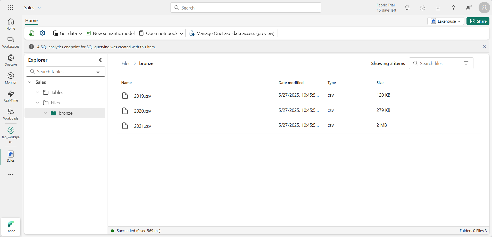

---
lab:
  title: Microsoft Fabric レイクハウスでメダリオン アーキテクチャを作成する
  module: Organize a Fabric lakehouse using medallion architecture design
---

# Microsoft Fabric レイクハウスでメダリオン アーキテクチャを作成する

この演習では、ノートブックを使用して Fabric レイクハウスにメダリオン アーキテクチャを構築します。 ワークスペースの作成、レイクハウスの作成、ブロンズ レイヤーへのデータのアップロード、データの変換とシルバー Delta テーブルへの読み込み、追加のデータ変換とゴールド Delta テーブルへの読み込み、データセットの探索とリレーションシップの作成を行います。

この演習の所要時間は約 **40** 分です

> **注**: この演習を完了するには、Microsoft Fabric ライセンスが必要です。 無料の Fabric 試用版ライセンスを有効にする方法の詳細については、[Fabric の概要](https://learn.microsoft.com/fabric/get-started/fabric-trial)に関するページを参照してください。 これを行うには、Microsoft の "*学校*" または "*職場*" アカウントが必要です。 お持ちでない場合は、[Microsoft Office 365 E3 以降の試用版にサインアップ](https://www.microsoft.com/microsoft-365/business/compare-more-office-365-for-business-plans)できます。

## ワークスペースを作成し、データ モデルの編集を有効にする

Fabric でデータを操作する前に、Fabric 試用版を有効にしてワークスペースを作成してください。

1. `https://app.fabric.microsoft.com` で [Microsoft Fabric](https://app.fabric.microsoft.com) にサインインし、 **[Power BI]** を選択してください。
2. 左側のメニュー バーで、 **[ワークスペース]** を選択します (アイコンは &#128455; に似ています)。
3. 任意の名前で新しいワークスペースを作成し、Fabric 容量を含むライセンス モード ("試用版"、*Premium*、または *Fabric*) を選択してください。**
4. 新しいワークスペースを開くと次に示すように空のはずです。

    
5. ワークスペースの設定に移動し、 **[Data model editing] (データ モデル編集)** プレビュー機能を有効にします。 これにより、レイクハウス内のテーブル間のリレーションシップを作成できます。

    

    > **注**: プレビュー機能を有効にした後、ブラウザー タブを最新の情報に更新する必要がある場合があります。
## レイクハウスを作成し、ブロンズ レイヤーにデータをアップロードする

ワークスペースが用意できたので、次に Fabric ポータルで *Data Engineering* エクスペリエンスに切り替えて、分析するデータのデータ レイクハウスを作成します。

1. Power BI ポータルの左下にある **[Power BI]** アイコンを選択し、 **[Data Engineering]** エクスペリエンスに切り替えます。

2. **Synapse Data Engineering** のホーム ページで、任意の名前を指定して新しい**レイクハウス**を作成します。

    1 分ほど経つと、新しい空のレイクハウスが表示されます。 分析のために、データ レイクハウスにいくつかのデータを取り込む必要があります。 これを行うには複数の方法がありますが、この演習では、テキスト ファイルをローカル コンピューター (または、該当する場合はラボ VM) にダウンロードし、レイクハウスにアップロードするだけです。

3. `https://github.com/MicrosoftLearning/dp-data/blob/main/orders.zip` からこの演習用のデータ ファイルをダウンロードして抽出します。 ファイルを抽出し、元の名前でローカル コンピューター (または該当する場合はラボ VM) に保存します。 3 年間の売上データを含む 3 つのファイル (2019.csv、2020.csv、2021.csv) が含まれているはずです。

4. レイクハウスの Web ブラウザー タブに戻り、**エクスプローラー** ペインの **Files** フォルダーの **[...]** メニューで、 **[新しいサブフォルダー]** を選択し、**bronze** という名前のフォルダーを作成します。

5. **bronze** フォルダーの **[...]** メニューで、 **[アップロード]** 、 **[ファイルのアップロード]** の順に選択し、3 つのファイル (2019.csv、2020.csv、2021.csv) をローカル コンピューター (または、該当する場合はラボ VM) からレイクハウスにアップロードします。 3 つのファイルすべてを一度にアップロードするには Shift キーを使用します。
   
6. ファイルがアップロードされたら、**bronze** フォルダーを選びます。そして、次に示すように、ファイルがアップロードされていることを確認します。

    

## データを変換し、シルバー Delta テーブルに読み込む

これで、レイクハウスのブロンズ レイヤーにいくつかのデータが作成されたので、ノートブックを使用してデータを変換し、シルバー レイヤーのデルタ テーブルに読み込むことができます。 

1. データレイクの **bronze** フォルダーの内容を表示したまま、 **[ホーム]** ページの **[ノートブックを開く]** メニューで、 **[新しいノートブック]** を選択します。

    数秒後に、1 つの ''セル'' を含む新しいノートブックが開きます。** ノートブックは、''コード'' または ''マークダウン'' (書式設定されたテキスト) を含むことができる 1 つまたは複数のセルで構成されます。** **

2. ノートブックが開いたら、ノートブックの左上にある **[Notebook xxxx]** テキストを選択し、新しい名前を入力して、名前を「**シルバー用にデータを変換する**」に変更します。

    

2. ノートブック内の既存のセルを選択します。このセルには、いくつかの単純なコメントアウト コードが含まれています。 これら 2 つの行を強調表示して削除します。このコードは必要ありません。
   
   > **注**: ノートブックを使用すると、Python、Scala、SQL など、さまざまな言語でコードを実行できます。 この演習では、PySpark と SQL を使用します。 マークダウン セルを追加して、コードを文書化するための書式設定されたテキストと画像を指定することもできます。

3. 次のコードをセルにに貼り付けます。

    ```python
    from pyspark.sql.types import *
    
    # Create the schema for the table
    orderSchema = StructType([
        StructField("SalesOrderNumber", StringType()),
        StructField("SalesOrderLineNumber", IntegerType()),
        StructField("OrderDate", DateType()),
        StructField("CustomerName", StringType()),
        StructField("Email", StringType()),
        StructField("Item", StringType()),
        StructField("Quantity", IntegerType()),
        StructField("UnitPrice", FloatType()),
        StructField("Tax", FloatType())
        ])

    # Import all files from bronze folder of lakehouse
    df = spark.read.format("csv").option("header", "true").schema(orderSchema).load("Files/bronze/*.csv")
    
    # Display the first 10 rows of the dataframe to preview your data
    display(df.head(10))
    ```

4. セルの左側にある **&#9655;** ([セルの実行]) ボタンを使ってコードを実行します。**

    > **注**: このノートブック内で Spark コードを実行したのはこれが最初であるため、Spark セッションを起動する必要があります。 これは、最初の実行が完了するまで 1 分ほどかかる場合があることを意味します。 それ以降は、短時間で実行できます。

5. セル コマンドが完了したら、セルの下にある出力を確認します。これは次のようになるはずです。

    | インデックス | SalesOrderNumber | SalesOrderLineNumber | OrderDate | CustomerName | Email | Item | Quantity | UnitPrice | 税 |
    | -- | -- | -- | -- | -- | -- | -- | -- | -- | -- |
    | 1 | SO49172 | 1 | 2021-01-01 | Brian Howard | brian23@adventure-works.com | Road-250 Red, 52 | 1 | 2443.35 | 195.468 |
    | 2 |  SO49173 | 1 | 2021-01-01 | Linda Alvarez | Mountain-200 Silver, 38 | 1 | 2071.4197 | 165.7136 |
    | ... | ... | ... | ... | ... | ... | ... | ... | ... | ... |

    実行したコードは、**bronze** フォルダー内の CSV ファイルから Spark データフレームにデータを読み込み、データフレームの最初の数行を表示しました。

    > **注**: 出力ウィンドウの左上にある **[...]** メニューを選択すると、セル出力の内容をクリア、非表示、自動サイズ変更できます。

6. 次に、PySpark データフレームを使用して列を追加し、既存の列の一部の値を更新して、データ検証とクリーンアップ用の列を追加します。 [+] ボタンを使用して新しいコード ブロックを追加し、次のコードをセルに追加します。

    ```python
    from pyspark.sql.functions import when, lit, col, current_timestamp, input_file_name
    
    # Add columns FileName, IsFlagged, CreatedTS and ModifiedTS for data validation and tracking
    df = df.withColumn("FileName", input_file_name())
    df = df.withColumn("IsFlagged", when(col("OrderDate") < '2019-08-01',True).otherwise(False))
    df = df.withColumn("CreatedTS", current_timestamp()).withColumn("ModifiedTS", current_timestamp())
    df = df.withColumn("CustomerID", lit(None).cast("BigInt"))
    df = df.withColumn("ItemID", lit(None).cast("BigInt"))
    
    # Update CustomerName to "Unknown" if CustomerName null or empty
    df = df.withColumn("CustomerName", when((col("CustomerName").isNull() | (col("CustomerName")=="")),lit("Unknown")).otherwise(col("CustomerName")))
    ```

    実行したコードの最初の行により、PySpark から必要な関数がインポートされます。 次に、データフレームに新しい列を追加して、ソース ファイル名、注文が該当の会計年度の前にフラグが付けられたかどうか、行がいつ作成および変更されたかを追跡できるようにします。 
    
    また、CustomerID と ItemID の列も追加します。これは後で設定されます。
    
    最後に、CustomerName 列が null 値または空の場合は、"Unknown" に更新します。

7. セルを実行し、 **&#9655;** ([セルの実行]) ボタンを使用してコードを実行します。**

8. 次に、SQL マジックを使用して、Delta Lake 形式を使用する sales データベース内に、クリーンアップされたデータフレームを sales_silver という新しいテーブルとして作成します。 新しいコード ブロックを作成し、セルに次のコードを追加します。

    ```python
     %%sql
    
    -- Create sales_silver table 
    CREATE TABLE sales.sales_silver (
        SalesOrderNumber string
        , SalesOrderLineNumber int
        , OrderDate date
        , CustomerName string
        , Email string
        , Item string
        , Quantity int
        , UnitPrice float
        , Tax float
        , FileName string
        , IsFlagged boolean
        , CustomerID bigint
        , ItemID bigint
        , CreatedTS date
        , ModifiedTS date
    ) USING delta;
    ```

    このコードでは、`%sql` マジック コマンドを使用して SQL ステートメントを実行します。 最初のステートメントでは、**sales** という名前の新しいデータベースを作成します。 2 番目のステートメントでは、Delta Lake 形式と前のコード ブロックで作成したデータフレームを使用して、**sales** データベースに **sales_silver** という名前の新しいテーブルを作成します。

9. セルを実行し、 **&#9655;** ([セルの実行]) ボタンを使用してコードを実行します。**

10. レイクハウス エクスプローラー ペインの [テーブル] セクションで **[...]** を選択し、 **[更新]** を選択します。 新しい **sales_silver** テーブルが一覧表示されます。 三角形のアイコンは、Delta テーブルであることを示します。

    

    > **注**: 新しいテーブルが表示されない場合は、数秒待ってからもう一度 **[更新]** を選択するか、ブラウザー タブ全体を最新の情報に更新してください

11. 次に、Delta テーブルに対してアップサート操作を実行し、特定の条件に基づいて既存のレコードを更新し、一致するものが見つからない場合は新しいレコードを挿入します。 新しいコード ブロックを追加し、次のコードを貼り付けます。

    ```python
    # Update existing records and insert new ones based on a condition defined by the columns SalesOrderNumber, OrderDate, CustomerName, and Item.

    from delta.tables import *
    
    deltaTable = DeltaTable.forPath(spark, 'abfss://1daff8bf-a15d-4063-97c2-fd6381bd00b4@onelake.dfs.fabric.microsoft.com/065c411a-27de-4dec-b4fb-e1df9737f0a0/Tables/sales_silver')
    
    dfUpdates = df
    
    deltaTable.alias('silver') \
      .merge(
        dfUpdates.alias('updates'),
        'silver.SalesOrderNumber = updates.SalesOrderNumber and silver.OrderDate = updates.OrderDate and silver.CustomerName = updates.CustomerName and silver.Item = updates.Item'
      ) \
       .whenMatchedUpdate(set =
        {
          
        }
      ) \
     .whenNotMatchedInsert(values =
        {
          "SalesOrderNumber": "updates.SalesOrderNumber",
          "SalesOrderLineNumber": "updates.SalesOrderLineNumber",
          "OrderDate": "updates.OrderDate",
          "CustomerName": "updates.CustomerName",
          "Email": "updates.Email",
          "Item": "updates.Item",
          "Quantity": "updates.Quantity",
          "UnitPrice": "updates.UnitPrice",
          "Tax": "updates.Tax",
          "FileName": "updates.FileName",
          "IsFlagged": "updates.IsFlagged",
          "CustomerID": "updates.CustomerID",
          "ItemID": "updates.ItemID",
          "CreatedTS": "updates.CreatedTS",
          "ModifiedTS": "updates.ModifiedTS"
        }
      ) \
      .execute()
    ```
    この操作は、特定の列の値に基づいてテーブル内の既存のレコードを更新し、一致するものが見つからない場合に新しいレコードを挿入できるようにするため、重要です。 これは、既存のレコードの更新と新しいレコードを含む可能性があるデータをソース システムから読み込む場合の一般的な要件です。

これで、データがシルバー Delta テーブルに追加され、追加の変換とモデリングを行う準備ができました。
    

## ゴールド レイヤー向けにデータを変換する

ブロンズ レイヤーからデータを取得し、変換し、シルバー Delta テーブルに読み込みました。 次に、新しいノートブックを使用してデータをさらに変換し、それをスター スキーマにモデル化し、ゴールド Delta テーブルに読み込みます。

このすべてを 1 つのノートブックで行うことができますが、この演習では、データをブロンズからシルバーに変換し、次にシルバーからゴールドに変換するプロセスを示すために、別のノートブックを使用しています。 これは、デバッグ、トラブルシューティング、再利用に役立ちます。

1. **Data Engineering** ホーム ページに戻り、「**ゴールド用にデータを変換する**」という名前の新しいノートブックを作成します。

2. レイクハウス エクスプローラー ウィンドウで、 **[追加]** を選択し、前に作成した **Sales** レイクハウスを選択して、**Sales** レイクハウスを追加します。 エクスプローラー ウィンドウの **[テーブル]** セクションに **sales_silver** テーブルが表示されます。

3. 既存のコード ブロックの定型テキストを削除し、次のコードを追加してデータフレームにデータを読み込み、スター スキーマの構築を開始します。

    ```python
    # Load data to the dataframe as a starting point to create the gold layer
    df = spark.read.table("Sales.sales_silver")
    ```

4. 新しいコード ブロックを追加し、次のコードを貼り付けて日付ディメンション テーブルを作成します。

    ```python
        %%sql
    -- Create Date_gold dimension table
    CREATE TABLE IF NOT EXISTS sales.dimdate_gold (
        OrderDate date
        , Day int
        , Month int
        , Year int
        , `mmmyyyy` string
        , yyyymm string
    ) USING DELTA;
    
    ```
    > **注**: `display(df)` コマンドはいつでも実行して、作業の進行状況をチェックできます。 この場合は、'display(dfdimDate_gold)' を実行して、dimDate_gold データフレームの内容を表示します。

5. 新しいコード ブロックに次のコードを追加して、新しいデータが入力されたら日付ディメンションを更新します。

    ```python
    from delta.tables import *

    deltaTable = DeltaTable.forPath(spark, 'abfss://1daff8bf-a15d-4063-97c2-fd6381bd00b4@onelake.dfs.fabric.microsoft.com/065c411a-27de-4dec-b4fb-e1df9737f0a0/Tables/dimdate_gold')
    
    dfUpdates = dfdimDate_gold
    
    deltaTable.alias('silver') \
      .merge(
        dfUpdates.alias('updates'),
        'silver.OrderDate = updates.OrderDate'
      ) \
       .whenMatchedUpdate(set =
        {
          
        }
      ) \
     .whenNotMatchedInsert(values =
        {
          "OrderDate": "updates.OrderDate",
          "Day": "updates.Day",
          "Month": "updates.Month",
          "Year": "updates.Year",
          "mmmyyyy": "updates.mmmyyyy",
          "yyyymm": "yyyymm"
        }
      ) \
      .execute()
    ```
5. 次に、Customer ディメンション テーブルを作成します。 新しいコード ブロックを追加し、次のコードを貼り付けます。

    ```python
   %%sql
    -- Create Customer dimension table
    CREATE TABLE sales.dimCustomer_gold (
        CustomerName string
        , Email string
        , First string
        , Last string
        , CustomerID BIGINT
    ) USING DELTA;
    ```
    
6. 新しいコード ブロックに次のコードを追加して、新しいデータが入力されたら Customer ディメンションを更新します。

    ```python
    from pyspark.sql.functions import col, split

    # Create Customer_gold dataframe

    dfdimCustomer_silver = df.dropDuplicates(["CustomerName","Email"]).select(col("CustomerName"),col("Email")) \
        .withColumn("First",split(col("CustomerName"), " ").getItem(0)) \
        .withColumn("Last",split(col("CustomerName"), " ").getItem(1)) \
    ```

     ここでは、重複の削除、特定の列の選択、"CustomerName" 列を分割して "First" と "Last" の名前列を作成するなど、さまざまな変換を実行して、新しい DataFrame dfdimCustomer_silver を作成しました。 その結果、"CustomerName" 列から抽出された個別の "First" と "Last" の名前列を含む、クリーンで構造化された顧客データを含む DataFrame になりました。

7. 次に、顧客の ID 列を作成します。 新しいコード ブロックに、次を貼り付けます。

    ```python
    from pyspark.sql.functions import monotonically_increasing_id, col, when

    dfdimCustomer_temp = spark.sql("SELECT * FROM dimCustomer_gold")
    CustomerIDCounters = spark.sql("SELECT COUNT(*) AS ROWCOUNT, MAX(CustomerID) AS MAXCustomerID FROM dimCustomer_gold")
    MAXCustomerID = CustomerIDCounters.select((when(col("ROWCOUNT")>0,col("MAXCustomerID"))).otherwise(0)).first()[0]
    
    dfdimCustomer_gold = dfdimCustomer_silver.join(dfdimCustomer_temp,(dfdimCustomer_silver.CustomerName == dfdimCustomer_temp.CustomerName) & (dfdimCustomer_silver.Email == dfdimCustomer_temp.Email), "left_anti")
    
    dfdimCustomer_gold = dfdimCustomer_gold.withColumn("CustomerID",monotonically_increasing_id() + MAXCustomerID)
    
    ```
    ここでは、左の反結合を実行して dimCustomer_gold テーブルに既に存在する重複を除外し、monotonically_increasing_id() 関数を使用して一意の CustomerID 値を生成することで、顧客データ (dfdimCustomer_silver) をクリーニングして変換します。

8. 次に、新しいデータが入力されると、顧客テーブルが最新の状態に保たれるようにします。 新しいコード ブロックに、次を貼り付けます。

    ```python
    from delta.tables import *

    deltaTable = DeltaTable.forPath(spark, 'abfss://1daff8bf-a15d-4063-97c2-fd6381bd00b4@onelake.dfs.fabric.microsoft.com/065c411a-27de-4dec-b4fb-e1df9737f0a0/Tables/dimcustomer_gold')
    
    dfUpdates = dfdimCustomer_gold
    
    deltaTable.alias('silver') \
      .merge(
        dfUpdates.alias('updates'),
        'silver.CustomerName = updates.CustomerName AND silver.Email = updates.Email'
      ) \
       .whenMatchedUpdate(set =
        {
          
        }
      ) \
     .whenNotMatchedInsert(values =
        {
          "CustomerName": "updates.CustomerName",
          "Email": "updates.Email",
          "First": "updates.First",
          "Last": "updates.Last",
          "CustomerID": "updates.CustomerID"
        }
      ) \
      .execute()
    ```
9. ここで、これらの手順を繰り返して製品ディメンションを作成します。 新しいコード ブロックに、次を貼り付けます。

    ```python
    %%sql
    -- Create Product dimension table
    CREATE TABLE sales.dimProduct_gold (
        Item string
        , ItemID BIGINT
    ) USING DELTA;
    ```    
10. 別のコード ブロックを追加して、customer_gold データフレームを作成します。 これは、後で Sales の結合で使用します。
    
    ```python
    from pyspark.sql.functions import col, split, lit

    # Create Customer_gold dataframe, this dataframe will be used later on on the Sales join
    
    dfdimProduct_silver = df.dropDuplicates(["Item"]).select(col("Item")) \
        .withColumn("ItemName",split(col("Item"), ", ").getItem(0)) \
        .withColumn("ItemInfo",when((split(col("Item"), ", ").getItem(1).isNull() | (split(col("Item"), ", ").getItem(1)=="")),lit("")).otherwise(split(col("Item"), ", ").getItem(1))) \
    
    # display(dfdimProduct_gold)
            ```

11. Now you'll prepare to add new products to the dimProduct_gold table. Add the following syntax to a new code block:

    ```python
    from pyspark.sql.functions import monotonically_increasing_id, col

    dfdimProduct_temp = spark.sql("SELECT * FROM dimProduct_gold")
    Product_IDCounters = spark.sql("SELECT COUNT(*) AS ROWCOUNT, MAX(ItemID) AS MAXProductID FROM dimProduct_gold")
    MAXProduct_ID = Product_IDCounters.select((when(col("ROWCOUNT")>0,col("MAXProductID"))).otherwise(0)).first()[0]
    
    
    dfdimProduct_gold = dfdimProduct_gold.withColumn("ItemID",monotonically_increasing_id() + MAXProduct_ID)
    
    #display(dfdimProduct_gold)

12.  Similar to what you've done with your other dimensions, you need to ensure that your product table remains up-to-date as new data comes in. In a new code block, paste the following:
    
    ```python
    from delta.tables import *
    
    deltaTable = DeltaTable.forPath(spark, 'abfss://Learn@onelake.dfs.fabric.microsoft.com/Sales.Lakehouse/Tables/dimproduct_gold')
    
    dfUpdates = dfdimProduct_gold
    
    deltaTable.alias('silver') \
      .merge(
        dfUpdates.alias('updates'),
        'silver.ItemName = updates.ItemName AND silver.ItemInfo = updates.ItemInfo'
      ) \
       .whenMatchedUpdate(set =
        {
          
        }
      ) \
     .whenNotMatchedInsert(values =
        {
          "ItemName": "updates.ItemName",
          "ItemInfo": "updates.ItemInfo",
          "ItemID": "updates.ItemID"
        }
      ) \
      .execute()
    ```

    これにより、テーブル内の現在のデータに基づいて次に使用可能な製品 ID が計算され、これらの新しい ID が製品に割り当てられ、更新された製品情報が表示されます (表示コマンドがコメント解除されている場合)。

ディメンションが構築されたので、最後の手順ではファクト テーブルを作成します。

13. 新しいコード ブロックで、次のコードを貼り付けてファクト テーブルを作成します。

    ```python
       %%sql
    -- Create Date_gold dimension table if not exist
    CREATE TABLE IF NOT EXISTS sales.factsales_gold (
        CustomerID BIGINT
        , ItemID BIGINT
        , OrderDate date
        , Quantity INT
        , UnitPrice float
        , Tax float
    ) USING DELTA;
    ```
14. 新しいコード ブロックに次のコードを貼り付けて新しいデータフレームを作成し、売上データを顧客 ID、品目 ID、注文日、数量、単価、税を含む顧客と製品の情報と結合します。

    ```python
    from pyspark.sql.functions import col

    dfdimCustomer_temp = spark.sql("SELECT * FROM dimCustomer_gold")
    dfdimProduct_temp = spark.sql("SELECT * FROM dimProduct_gold")
    
    df = df.withColumn("ItemName",split(col("Item"), ", ").getItem(0)) \
        .withColumn("ItemInfo",when((split(col("Item"), ", ").getItem(1).isNull() | (split(col("Item"), ", ").getItem(1)=="")),lit("")).otherwise(split(col("Item"), ", ").getItem(1))) \
    
    # Create Sales_gold dataframe
    
    dffactSales_gold = df.alias("df1").join(dfdimCustomer_temp.alias("df2"),(df.CustomerName == dfdimCustomer_temp.CustomerName) & (df.Email == dfdimCustomer_temp.Email), "left") \
            .join(dfdimProduct_temp.alias("df3"),(df.ItemName == dfdimProduct_temp.ItemName) & (df.ItemInfo == dfdimProduct_temp.ItemInfo), "left") \
        .select(col("df2.CustomerID") \
            , col("df3.ItemID") \
            , col("df1.OrderDate") \
            , col("df1.Quantity") \
            , col("df1.UnitPrice") \
            , col("df1.Tax") \
        ).orderBy(col("df1.OrderDate"), col("df2.CustomerID"), col("df3.ItemID"))
    
    
    display(dffactSales_gold)
    ```

15. 次に、新しいコード ブロックで次のコードを実行して、売上データを最新の状態に保つようにします。
    ```python
    from delta.tables import *

    deltaTable = DeltaTable.forPath(spark, 'abfss://Learn@onelake.dfs.fabric.microsoft.com/Sales.Lakehouse/Tables/factsales_gold')
    
    dfUpdates = dffactSales_gold
    
    deltaTable.alias('silver') \
      .merge(
        dfUpdates.alias('updates'),
        'silver.OrderDate = updates.OrderDate AND silver.CustomerID = updates.CustomerID AND silver.ItemID = updates.ItemID'
      ) \
       .whenMatchedUpdate(set =
        {
          
        }
      ) \
     .whenNotMatchedInsert(values =
        {
          "CustomerID": "updates.CustomerID",
          "ItemID": "updates.ItemID",
          "OrderDate": "updates.OrderDate",
          "Quantity": "updates.Quantity",
          "UnitPrice": "updates.UnitPrice",
          "Tax": "updates.Tax"
        }
      ) \
      .execute()
    ```
     ここでは、Delta Lake のマージ操作を使用して、factsales_gold テーブルを新しい売上データ (dffactSales_gold) と同期して更新します。 この操作では、注文日、顧客 ID、および項目 ID が既存のデータ (シルバー テーブル) と新しいデータ (更新 DataFrame) の間で比較され、一致するレコードが更新され、必要に応じて新しいレコードが挿入されます。

これで、レポートと分析に使用できる、キュレーションされ、モデル化されたゴールド レイヤーが作成されました。

## データセットを作成する

ワークスペースで、ゴールド レイヤーを使用してレポートを作成し、データを分析できるようになりました。 ワークスペースでデータセットに直接アクセスして、レポート用のリレーションシップとメジャーを作成できます。

レイクハウスの作成時に自動的に作成される既定のデータセットは使用できないことに注意してください。 レイクハウス エクスプローラーから、この演習で作成したゴールド テーブルを含む新しいデータセットを作成する必要があります。

1. ワークスペースで、**Sales** レイクハウスに移動します。
2. レイクハウス エクスプローラー ビューのリボンから **[New Power BI dataset] (新しい Power BI データセット)** を選択します。
3. データセットに含める変換済のゴールド テーブルを選択し、 **[確認]** を選択します。
   - dimdate_gold
   - dimcustomer_gold
   - dimproduct_gold
   - factsales_gold

    これにより、Fabric でデータセットが開き、リレーションシップとメジャーを作成できます。

4. データセットの名前を変更して、識別しやすくします。 ウィンドウの左上隅でデータセット名を選択します。 データセットの名前を **Sales_Gold** に変更します。

ここから、自分またはデータ チームの他のメンバーが、レイクハウス内のデータに基づいてレポートとダッシュボードを作成できます。 これらのレポートはレイクハウスのゴールド レイヤーに直接接続されるため、常に最新のデータが反映されます。

## リソースをクリーンアップする

この演習では、Microsoft Fabric レイクハウスでメダリオン アーキテクチャを作成する方法を学習しました。

レイクハウスの探索が完了したら、この演習用に作成したワークスペースを削除できます。

1. 左側のバーで、ワークスペースのアイコンを選択して、それに含まれるすべての項目を表示します。
2. ツール バーの **[...]** メニューで、 **[ワークスペースの設定]** を選択します。
3. **[その他]** セクションで、 **[このワークスペースの削除]** を選択してください。
