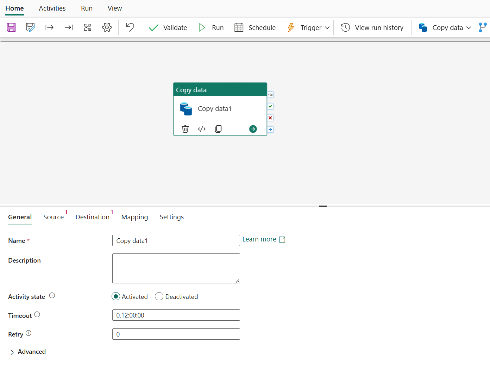
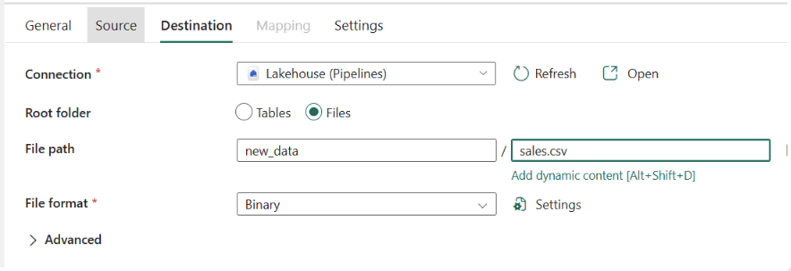
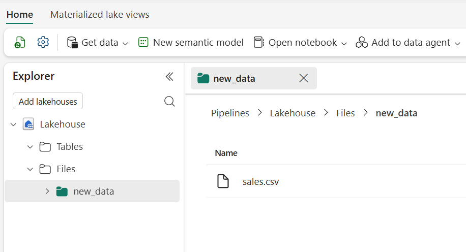
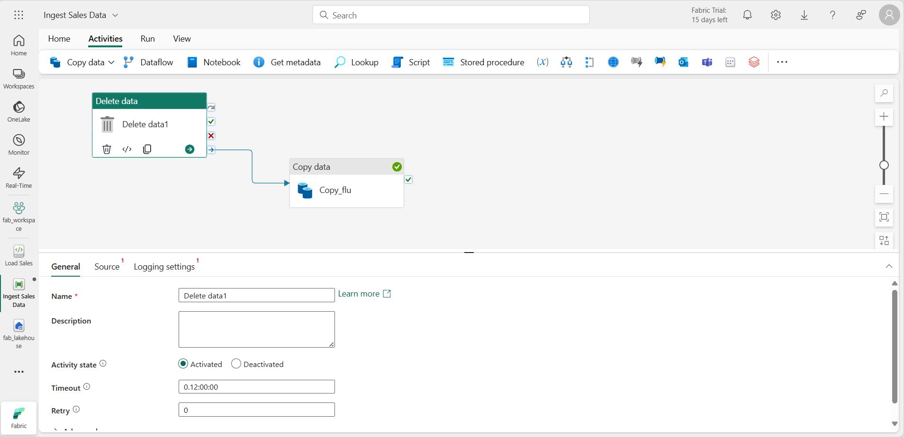

---
lab:
  title: Microsoft Fabric でパイプラインを使用してデータを取り込む
  module: Use Data Factory pipelines in Microsoft Fabric
  description: このラボでは、外部ソースからレイクハウスにデータを取り込むデータ パイプラインを作成し、Spark ノートブックを統合してデータを変換し、テーブルに読み込みます。 データ コピー アクティビティとカスタム Spark 変換を組み合わせて、Microsoft Fabric で再利用可能な ETL プロセスを構築する方法について説明します。
  duration: 45 minutes
  level: 300
  islab: true
  primarytopics:
    - Microsoft Fabric
---

# Microsoft Fabric でパイプラインを使用してデータを取り込む

データ レイクハウスは、クラウド規模の分析ソリューション用の一般的な分析データ ストアです。 データ エンジニアの中心的な職務の 1 つは、オペレーショナル データの複数のソースからレイクハウスへのデータ インジェストを実装して管理することです。 Microsoft Fabric では、"パイプライン" を作成することによって、データ インジェストの "抽出、変換、読み込み" (ETL) または "抽出、読み込み、変換" (ELT) ソリューションを実装できます。** ** **

Fabric では、Apache Spark もサポートされるため、データを大規模に処理するコードを作成して実行できます。 Fabric でパイプラインと Spark 機能を組み合わせることで、データを外部ソースからレイクハウスの基になる OneLake ストレージにコピーし、分析のためにテーブルに読み込む前に、Spark コードを使用してカスタム データ変換を実行する複雑なデータ インジェスト ロジックを実装できます。

このラボは完了するまで、約 **45** 分かかります。

> [!Note]
> 注: この演習を完了するには、[Microsoft Fabric テナント](https://learn.microsoft.com/fabric/get-started/fabric-trial)へのアクセス権が必要です。

## ワークスペースの作成

Fabric でデータを操作する前に、Fabric 試用版を有効にしてワークスペースを作成してください。

1. ブラウザーで [Microsoft Fabric ホーム ページ](https://app.fabric.microsoft.com/home?experience=fabric-developer) (`https://app.fabric.microsoft.com/home?experience=fabric-developer`) に移動し、Fabric 資格情報でサインインします。
1. 左側のナビゲーション ウィンドウで、**[ワークスペース]** (&#128455; のようなアイコン) を選択します。
1. 新しいワークスペースを任意の名前で作成し、 **[詳細]** セクションで、Fabric 容量を含むライセンス モード ("*試用版*"、*Premium*、または *Fabric*) を選択します。
1. 開いた新しいワークスペースは空のはずです。

    

## レイクハウスを作成する

ワークスペースが作成されたので、次にデータを取り込むデータ レイクハウスを作成します。

1. 左側のナビゲーション ウィンドウで **[作成]** を選択し、**[レイクハウス]** を選択します。 任意の一意の名前を設定します。 [Lakehouse スキーマ (パブリック プレビュー)] オプションが無効になっていることを確認します。

    >**注**: **[作成]** オプションがサイド バーにピン留めされていない場合は、最初に省略記号 (**...**) オプションを選択する必要があります。

    1 分ほどすると、**Tables** や **Files** のない新しいレイクハウスが作成されます。

1. 左側の **[エクスプローラー]** ペインで、**Files** ノードの **[...]** メニューにある **[新しいサブフォルダー]** を選択し、**new_data** という名前のサブフォルダーを作成します。

## パイプラインを作成する

データを簡単に取り込むには、パイプラインで**データのコピー** アクティビティを使用して、データをソースから抽出し、レイクハウス内のファイルにコピーします。

> **注**: [コピー ジョブ] と [データのコピー] アクティビティは、Fabric でデータを移動するための異なる方法です。**** [コピー ジョブ] はスタンドアロンの簡略化されたデータ移動ツールであり、パイプラインは必要ありません。 [データのコピー] アクティビティはパイプライン内で構成され、他のアクティビティとのオーケストレーションをサポートします。 この演習では、パイプラインで **[データのコピー]** アクティビティを使用します。

1. 左側のナビゲーション ウィンドウで、お使いのワークスペースの名前を選択します。
1. ワークスペースで **[新しい項目]** を選択し、**[パイプライン]** を検索し、`Ingest Sales Data` という名前の新しいパイプラインを作成します。
1. パイプライン エディター キャンバスで、**[パイプライン アクティビティの追加]**、**[Copy アクティビティ]** の順に選択します。 **[データのコピー]** アクティビティをパイプラインに追加します。

    

### ソースを構成する

1. キャンバスで **[データのコピー]** アクティビティを選択し、キャンバスの下のペインで **[ソース]** タブを選択します。
1. **[接続]** ドロップダウンで、**[すべて参照]** を選択します。
1. **[新しい接続]** ダイアログで、**[HTTP]** を検索して選択し、**[続行]** を選択します。
1. 次の設定を構成し、**[接続]** を選択します。
    - **URL**: `https://raw.githubusercontent.com/MicrosoftLearning/dp-data/main/sales.csv`
    - **接続名**: "一意の名前を指定します"**
    - **データ ゲートウェイ**: (なし)
    - **認証の種類**: 匿名
1. **[ソース]** タブに戻り、次のソース設定を構成します。
    - **相対 URL**: *空白のまま*
    - **ファイル形式**: ドロップダウンから **[DelimitedText]** を選択します

    ![HTTP 接続とファイル形式の設定を示す [ソース] タブのスクリーンショット。](./Images/copy-data-source-tab.png)

1. **[ファイル形式]** ドロップダウンの横にある **[設定]** ボタンを選択します。 **[ファイル形式の設定]** ダイアログで、次の設定が構成されていることを確認し、**[OK]** を選択します。
    - **圧縮の種類**: 圧縮なし
    - **列区切り記号**: コンマ (,)
    - **行区切り記号**: 改行 (\n)
    - **最初の行をヘッダーとして使用**: "オン"**

    ![[ファイル形式の設定] ダイアログのスクリーンショット。](./Images/file-format-settings.png)

1. **[接続のテスト]** を選択し、接続が動作することを確認します。
2. "省略可能": **[データのプレビュー]** を選択して、データが正しいことを確認します。**

### コピー先を構成する

1. **[コピー先]** タブを選択します。次に、**[接続]** ドロップダウンで、**[すべて参照]** を選択します。
1. **[新しい接続]** ダイアログ ボックスの [OneLake カタログ] セクションで、お使いのレイクハウスを見つけて選択します。**
1. 接続が作成されたら、**[コピー先]** タブに戻り、次の設定を構成します。
    - **接続**: "新しく作成したレイクハウス接続"**
    - **レイクハウス**: "前に作成したレイクハウスを選択します"**
    - **ルート フォルダー**: Files
    - **ファイル パス**: "ディレクトリ": new_data/ "ファイル名": sales.csv****
1. これ以外の変更は必要ありません。



### パイプラインを実行する

1. **[ホーム]** タブで **&#128427;** ([保存]) アイコンを使用してパイプラインを保存します。** **[&#9655; 実行]** ボタンを使用してパイプラインを実行します。

1. パイプラインの実行が開始されたら、パイプライン デザイナーの **[出力]** ペインで状態を監視できます。 **&#8635;** ([更新]) アイコンを使用して、状態を更新し、正常に終了するまで待ちます。**

1. 左側のナビゲーション ウィンドウで、お使いのレイクハウスを選択します。
1. **[ホーム]** ページの **[エクスプローラー]** ペインで **[Files]** を展開し、**[new_data]** フォルダーを選択して、**sales.csv** ファイルがコピーされていることを確認します。



## ノートブックを作成する

1. レイクハウスの **[ホーム]** ページの **[ノートブックを開く]** メニューで、 **[新しいノートブック]** を選択します。

    数秒後に、1 つの ''セル'' を含む新しいノートブックが開きます。** ノートブックは、''コード'' または ''マークダウン'' (書式設定されたテキスト) を含むことができる 1 つ以上のセルで構成されます。** **

1. ノートブック内の既存のセルを選択します。これには、単純なコードが含まれています。既定のコードを次の変数宣言に置き換えます。

    ```python
   table_name = "sales"
    ```

1. セルの **[...]** メニュー (右上にあります) で、 **[パラメーター セルの切り替え]** を選択します。 これにより、セルは、パイプラインからノートブックを実行するときに、そのセル内で宣言された変数をパラメーターとして扱うように構成されます。

1. parameters セルの下にある **[+ コード]** ボタンを使用して新しいコード セルを追加します。 次に、そのセルに次のコードを追加します。

    ```python
   from pyspark.sql.functions import *

   # Read the new sales data
   df = spark.read.format("csv").option("header","true").load("Files/new_data/*.csv")

   ## Add month and year columns
   df = df.withColumn("Year", year(col("OrderDate"))).withColumn("Month", month(col("OrderDate")))

   # Derive FirstName and LastName columns
   df = df.withColumn("FirstName", split(col("CustomerName"), " ").getItem(0)).withColumn("LastName", split(col("CustomerName"), " ").getItem(1))

   # Filter and reorder columns
   df = df["SalesOrderNumber", "SalesOrderLineNumber", "OrderDate", "Year", "Month", "FirstName", "LastName", "EmailAddress", "Item", "Quantity", "UnitPrice", "TaxAmount"]

   # Load the data into a table
   df.write.format("delta").mode("append").saveAsTable(table_name)
    ```

    このコードは、**データのコピー** アクティビティによって取り込まれた sales.csv ファイルからデータを読み込み、いくつかの変換ロジックを適用し、変換されたデータをテーブルとして保存します。テーブルが既に存在する場合は、データを追加します。

1. ノートブックが次のようになっていることを確認し、ツールバーの **&#9655;** ([すべて実行]) ボタンを使用して、含まれているすべてのセルを実行します。

    > **注**: このセッション内で Spark コードを実行したのはこれが最初であるため、Spark プールを起動する必要があります。 これは、最初のセルが完了するまで 1 分ほどかかる場合があることを意味します。

1. ノートブックの実行が完了したら、左側の **[エクスプローラー**] ペインで、**Tables** の **[...]** メニューにある **[更新]** を選択し、**Sales** テーブルが作成されていることを確認します。
1. ノートブックのメニュー バーにある **[設定]** アイコンを使用して、ノートブックの設定を表示します。 次に、ノートブックの **[名前]** を `Load Sales` に設定し、[設定] ペインを閉じます。
1. 左側のハブ メニュー バーで、レイクハウスを選択します。
1. **エクスプローラー** ペインで、ビューを更新します。 次に、**Tables** を展開し、**sales** テーブルを選択して、それに含まれるデータのプレビューを表示します。

    

## パイプラインを変更する

データを変換してテーブルに読み込むためのノートブックを実装したので、そのノートブックをパイプラインに組み込んで、再利用可能な ETL プロセスを作成できます。

1. 左側のハブ メニュー バーで、先ほど作成した **Ingest Sales Data** パイプラインを選択します。
1. **[アクティビティ]** タブの **[すべてのアクティビティ]** 一覧で、**[データの削除]** を選択します。 次に、次に示すように、新しい**データの削除**アクティビティを**データのコピー** アクティビティの左側に配置し、その **[完了時]** 出力を**データのコピー** アクティビティに接続します。

    

1. **データの削除**アクティビティを選択し、デザイン キャンバスの下のペインで、次のプロパティを設定します。
    - **全般**:
        - **名前**: `Delete old files`
    - **ソース**
        - **接続**: すべてを参照し、お使いのレイクハウスを選択します
        - **ファイル パスの種類**: ワイルドカード ファイル パス
        - **フォルダー パス**: Files / **new_data**
        - **ワイルドカード ファイル名**: `*.csv`
        - **再帰的**: "オンにします"**
    - **ログの設定**:
        - **ログの有効化**: "選択<u>解除</u>します"**

    これらの設定により、**sales.csv** ファイルをコピーする前に、既存の .csv ファイルが確実に削除されます。

1. パイプライン デザイナーの **[アクティビティ]** タブで、 **[ノートブック]** を選択し、**ノートブック** アクティビティをパイプラインに追加します。
1. **[データのコピー]** アクティビティを選択し、次に示すように、その **[完了時]** 出力を**ノートブック** アクティビティに接続します。

    

1. **ノートブック** アクティビティを選択し、デザイン キャンバスの下のペインで、次のプロパティを設定します。
    - **全般**:
        - **名前**: `Load Sales notebook`
    - **設定**:
        - **ノートブック**: "Load Sales" ノートブックを選択します**
        - **基本パラメーター**: "次のプロパティを指定した新しいパラメーターを追加します"**

            | 名前 | Type | 値 |
            | -- | -- | -- |
            | table_name | String | new_sales |

    **table_name** パラメーターはノートブックに渡され、parameters セル内の **table_name** 変数に割り当てられている既定値がオーバーライドされます。

1. **[ホーム]** タブで **&#128427;** ([保存]) アイコンを使用してパイプラインを保存します。** 次に、 **&#9655;** ([実行]) ボタンを使用してパイプラインを実行し、すべてのアクティビティが完了するのを待ちます。

    

> 注: エラー メッセージ "Spark SQL クエリはレイクハウスのコンテキストでのみ使用できます。** 次の手順に進むには、レイクハウスをアタッチしてください" を受け取る場合:ノートブックを開き、左ペインで作成したレイクハウスを選び、**[すべてのレイクハウスの削除]** を選び、再度追加します。 パイプライン デザイナーに戻り、**[&#9655; 実行]** を選びます。

1. ポータルの左端にあるハブ メニュー バーで、お使いのレイクハウスを選択します。
1. **エクスプローラー** ペインで、**Tables** を展開し、**new_sales** テーブルを選択して、それに含まれるデータのプレビューを表示します。 このテーブルは、パイプラインによって実行されたときにノートブックによって作成されました。

この演習では、パイプラインを使用してデータを外部ソースからレイクハウスにコピーした後、Spark ノートブックを使用してデータを変換し、テーブルに読み込むデータ インジェストを実装しました。

## リソースをクリーンアップする

この演習では、Microsoft Fabric でパイプラインを実装する方法を学習しました。

レイクハウスの探索が完了したら、この演習用に作成したワークスペースを削除できます。

1. 左側のバーで、ワークスペースのアイコンを選択して、それに含まれるすべての項目を表示します。
1. **[ワークスペースの設定]** を選択し、**[全般]** セクションで下にスクロールし、**[このワークスペースを削除する]** を選択します。
1. **[削除]** を選択して、ワークスペースを削除します。
