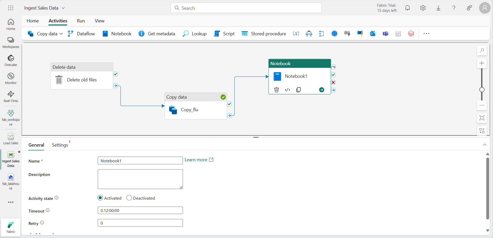

---
lab:
  title: Microsoft Fabric でパイプラインを使用してデータを取り込む
  module: Use Data Factory pipelines in Microsoft Fabric
---

# Microsoft Fabric でパイプラインを使用してデータを取り込む

データ レイクハウスは、クラウド規模の分析ソリューション用の一般的な分析データ ストアです。 データ エンジニアの中心的な職務の 1 つは、オペレーショナル データの複数のソースからレイクハウスへのデータ インジェストを実装して管理することです。 Microsoft Fabric では、"パイプライン" を作成することによって、データ インジェストの "抽出、変換、読み込み" (ETL) または "抽出、読み込み、変換" (ELT) ソリューションを実装できます。** ** **

Fabric では、Apache Spark もサポートされるため、データを大規模に処理するコードを作成して実行できます。 Fabric でパイプラインと Spark 機能を組み合わせることで、データを外部ソースからレイクハウスの基になる OneLake ストレージにコピーし、分析のためにテーブルに読み込む前に、Spark コードを使用してカスタム データ変換を実行する複雑なデータ インジェスト ロジックを実装できます。

このラボは完了するまで、約 **60** 分かかります。

> **注**:この演習を完了するには、 [Microsoft Fabric 試用版](https://learn.microsoft.com/fabric/get-started/fabric-trial)が必要です。

## ワークスペースの作成

Fabric でデータを操作する前に、Fabric 試用版を有効にしてワークスペースを作成してください。

1. [Microsoft Fabric ホーム ページ](https://app.fabric.microsoft.com)で、**Synapse Data Engineering** を選択します。
1. 左側のメニュー バーで、 **[ワークスペース]** を選択します (アイコンは &#128455; に似ています)。
1. 任意の名前で新しいワークスペースを作成し、Fabric 容量を含むライセンス モード ("試用版"、*Premium*、または *Fabric*) を選択します。**
1. 開いた新しいワークスペースは空のはずです。

    

## レイクハウスを作成する

ワークスペースが作成されたので、次にデータを取り込むデータ レイクハウスを作成します。

1. **Synapse Data Engineering** ホーム ページで、任意の名前で新しい **Lakehouse** を作成します。

    1 分ほどすると、**Tables** や **Files** のない新しいレイクハウスが作成されます。

1. 左側のペインの **[レイク ビュー]** タブで、**Files** ノードの **[...]** メニューにある **[新しいサブフォルダー]** を選択し、**new_data** という名前のサブフォルダーを作成します。

## パイプラインを作成する

データを簡単に取り込むには、パイプラインで**データのコピー** アクティビティを使用して、データをソースから抽出し、レイクハウス内のファイルにコピーします。

1. レイクハウスの **[ホーム]** ページで **[新しいデータ パイプライン]** を選択し、**Ingest Sales Data** という名前の新しいデータ パイプラインを作成します。
2. **データのコピー** ウィザードが自動的に開かない場合は、パイプライン エディター ページで **[データのコピー]** を選択します。
3. **データのコピー** ウィザードの **[データ ソースの選択]** ページにある **[データ ソース]** セクションで、 **[汎用プロトコル]** タブを選択し、 **[HTTP]** を選択します。

    ![[データ ソースの選択] ページのスクリーンショット。](./Images/choose-data-source.png)

4. **[次へ]** を選択し、 **[新しい接続の作成]** を選択して、データ ソースの接続に関して次の設定を入力します。
    - **URL**: `https://raw.githubusercontent.com/MicrosoftLearning/dp-data/main/sales.csv`
    - **接続**: 新しい接続の作成
    - **接続名**: "一意の名前を指定します"**
    - **認証の種類**: Basic ("ユーザー名とパスワードは空白のままにしておきます")**
5. **[次へ]** を選択します。 次に、次の設定が選択されていることを確認します。
    - **相対 URL**: *空白のまま*
    - **要求メソッド**:GET
    - **追加ヘッダー** :*空白のまま*
    - **バイナリ コピー**: 選択<u>解除</u>
    - **要求タイムアウト**: *空白のまま*
    - **最大同時接続数**: *空白のまま*
6. **[次へ]** を選択し、データがサンプリングされるのを待ってから、次の設定が選択されていることを確認します。
    - **ファイル形式**: DelimitedText
    - **列区切り記号**: コンマ (,)
    - **行区切り記号**: 改行 (\n)
    - **最初の行をヘッダーとして使用**: 選択
    - **圧縮の種類**: なし
7. **[データのプレビュー]** を選択すると、取り込まれたデータのサンプルが表示されます。 次に、データ プレビューを閉じて、 **[次へ]** を選択します。
8. **[データのコピー先の選択]** ページで、既存のレイクハウスを選択します。 **[次へ]** を選択します。
9. データのコピー先オプションを次のように設定し、 **[次へ]** を選択します。
    - **ルート フォルダー**: Files
    - **フォルダーのパス名**: new_data
    - **ファイル名**: sales.csv
    - **コピー動作**: なし
10. ファイル形式オプションを次のように設定して、 **[次へ]** を選択します。
    - **ファイル形式**: DelimitedText
    - **列区切り記号**: コンマ (,)
    - **行区切り記号**: 改行 (\n)
    - **ヘッダーをファイルに追加**: 選択
    - **圧縮の種類**: なし
11. **[コピーの概要]** ページで、コピー操作の詳細を確認し、 **[保存と実行]** を選択します。

    次に示すように、**データのコピー** アクティビティを含む新しいパイプラインが作成されます。

    

12. パイプラインの実行が開始されたら、パイプライン デザイナーの **[出力]** ペインで状態を監視できます。 **&#8635;** ([更新]) アイコンを使用して、状態を更新し、正常に終了するまで待ちます。**

13. 左側のメニュー バーで、レイクハウスを選択します。
14. **[ホーム]** ページの**レイクハウス エクスプローラー** ペインで、**Files** を展開し、**new_data** フォルダーを選択して、**sales.csv** ファイルがコピーされていることを確認します。

## ノートブックを作成する

1. レイクハウスの **[ホーム]** ページの **[ノートブックを開く]** メニューで、 **[新しいノートブック]** を選択します。

    数秒後に、1 つの ''セル'' を含む新しいノートブックが開きます。** ノートブックは、''コード'' または ''マークダウン'' (書式設定されたテキスト) を含むことができる 1 つ以上のセルで構成されます。** **

2. ノートブック内の既存のセルを選択します。これには、単純なコードが含まれています。既定のコードを次の変数宣言に置き換えます。

    ```python
   table_name = "sales"
    ```

3. セルの **[...]** メニュー (右上にあります) で、 **[パラメーター セルの切り替え]** を選択します。 これにより、セルは、パイプラインからノートブックを実行するときに、そのセル内で宣言された変数をパラメーターとして扱うように構成されます。

4. parameters セルの下にある **[+ コード]** ボタンを使用して新しいコード セルを追加します。 次に、そのセルに次のコードを追加します。

    ```python
   from pyspark.sql.functions import *

   # Read the new sales data
   df = spark.read.format("csv").option("header","true").load("Files/new_data/*.csv")

   ## Add month and year columns
   df = df.withColumn("Year", year(col("OrderDate"))).withColumn("Month", month(col("OrderDate")))

   # Derive FirstName and LastName columns
   df = df.withColumn("FirstName", split(col("CustomerName"), " ").getItem(0)).withColumn("LastName", split(col("CustomerName"), " ").getItem(1))

   # Filter and reorder columns
   df = df["SalesOrderNumber", "SalesOrderLineNumber", "OrderDate", "Year", "Month", "FirstName", "LastName", "EmailAddress", "Item", "Quantity", "UnitPrice", "TaxAmount"]

   # Load the data into a table
   df.write.format("delta").mode("append").saveAsTable(table_name)
    ```

    このコードは、**データのコピー** アクティビティによって取り込まれた sales.csv ファイルからデータを読み込み、いくつかの変換ロジックを適用し、変換されたデータをテーブルとして保存します。テーブルが既に存在する場合は、データを追加します。

5. ノートブックが次のようになっていることを確認し、ツールバーの **&#9655;** ([すべて実行]) ボタンを使用して、含まれているすべてのセルを実行します。

    

    > **注**: このセッション内で Spark コードを実行したのはこれが最初であるため、Spark プールを起動する必要があります。 これは、最初のセルが完了するまで 1 分ほどかかる場合があることを意味します。

6. ノートブックの実行が完了したら、左側の **[レイクハウス エクスプローラー**] ペインで、**Tables** の **[...]** メニューにある **[更新]** を選択し、**sales** テーブルが作成されていることを確認します。
7. ノートブックのメニュー バーで、[⚙️] (**設定**) アイコンを使用してノートブックの設定を表示します。 次に、ノートブックの **[名前]** を **Load Sales** に設定し、[設定] ペインを閉じます。
8. 左側のハブ メニュー バーで、レイクハウスを選択します。
9. **エクスプローラー** ペインで、ビューを更新します。 次に、**Tables** を展開し、**sales** テーブルを選択して、それに含まれるデータのプレビューを表示します。

## パイプラインを変更する

データを変換してテーブルに読み込むためのノートブックを実装したので、そのノートブックをパイプラインに組み込んで、再利用可能な ETL プロセスを作成できます。

1. 左側のハブ メニュー バーで、先ほど作成した **Ingest Sales Data** パイプラインを選択します。
2. **[アクティビティ]** タブの **[その他のアクティビティ]** の一覧で、 **[データの削除]** を選択します。 次に、次に示すように、新しい**データの削除**アクティビティを**データのコピー** アクティビティの左側に配置し、その **[完了時]** 出力を**データのコピー** アクティビティに接続します。

    

3. **データの削除**アクティビティを選択し、デザイン キャンバスの下のペインで、次のプロパティを設定します。
    - **全般**:
        - **名前**: Delete old files
    - **ソース**
        - **データ ストアの種類**: ワークスペース
        - **ワークスペース データ ストア**: "お使いのレイクハウス"**
        - **ファイル パスの種類**: ワイルドカード ファイル パス
        - **フォルダー パス**: Files / **new_data**
        - **ワイルドカード ファイル名**: *.csv        
        - **再帰的**: "オンにします"**
    - **ログの設定**:
        - **ログの有効化**: "選択<u>解除</u>します"**

    これらの設定により、**sales.csv** ファイルをコピーする前に、既存の .csv ファイルが確実に削除されます。

4. パイプライン デザイナーの **[アクティビティ]** タブで、 **[ノートブック]** を選択し、**ノートブック** アクティビティをパイプラインに追加します。
5. **[データのコピー]** アクティビティを選択し、次に示すように、その **[完了時]** 出力を**ノートブック** アクティビティに接続します。

    

6. **ノートブック** アクティビティを選択し、デザイン キャンバスの下のペインで、次のプロパティを設定します。
    - **全般**:
        - **名前**: Load Sales notebook
    - **設定**:
        - **ノートブック**: Load Sales
        - **基本パラメーター**: "次のプロパティを指定した新しいパラメーターを追加します"**
            
            | 名前 | Type | 値 |
            | -- | -- | -- |
            | table_name | String | new_sales |

    **table_name** パラメーターはノートブックに渡され、parameters セル内の **table_name** 変数に割り当てられている既定値がオーバーライドされます。

7. **[ホーム]** タブで **&#128427;** ([保存]) アイコンを使用してパイプラインを保存します。** 次に、 **&#9655;** ([実行]) ボタンを使用してパイプラインを実行し、すべてのアクティビティが完了するのを待ちます。

    

8. ポータルの左端にあるハブ メニュー バーで、お使いのレイクハウスを選択します。
9. **エクスプローラー** ペインで、**Tables** を展開し、**new_sales** テーブルを選択して、それに含まれるデータのプレビューを表示します。 このテーブルは、パイプラインによって実行されたときにノートブックによって作成されました。

この演習では、パイプラインを使用してデータを外部ソースからレイクハウスにコピーした後、Spark ノートブックを使用してデータを変換し、テーブルに読み込むデータ インジェストを実装しました。

## リソースをクリーンアップする

この演習では、Microsoft Fabric でパイプラインを実装する方法を学習しました。

レイクハウスの探索が完了したら、この演習用に作成したワークスペースを削除できます。

1. 左側のバーで、ワークスペースのアイコンを選択して、それに含まれるすべての項目を表示します。
2. ツール バーの **[...]** メニューで、 **[ワークスペースの設定]** を選択してください。
3. **[全般]** セクションで、**[このワークスペースの削除]** を選択します。
