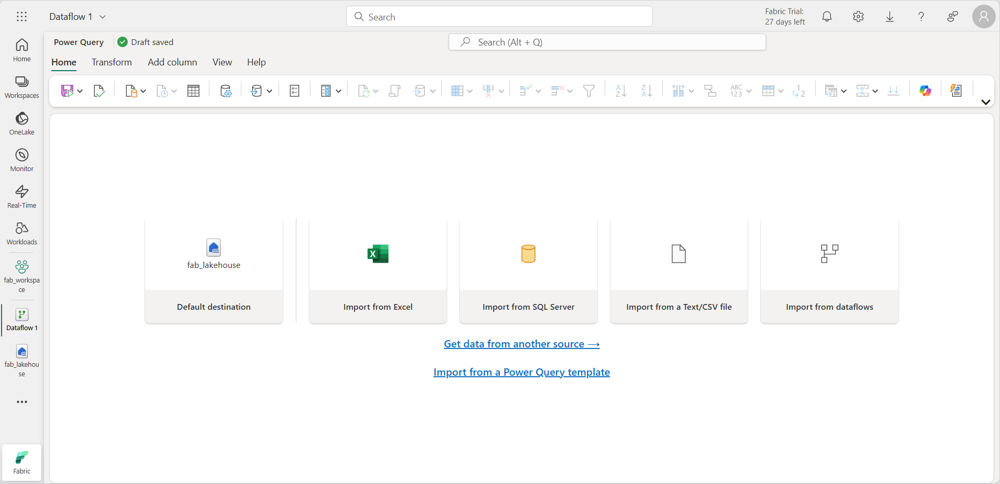
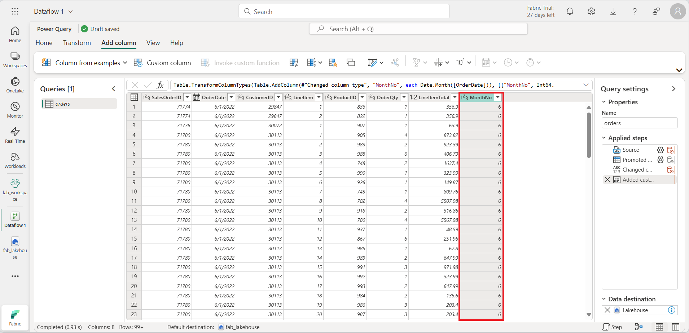

---
lab:
  title: Microsoft Fabric でデータフロー (Gen2) を作成して使用する
  module: Ingest Data with Dataflows Gen2 in Microsoft Fabric
---

# Microsoft Fabric でデータフロー (Gen2) を作成して使用する

Microsoft Fabric では、データフロー (Gen2) でさまざまなデータ ソースに接続し、Power Query Online で変換を実行します。 その後はデータ パイプラインで使用して、レイクハウスやその他の分析ストアにデータを取り込んだり、Power BI レポートのデータセットを定義したりできます。

このラボの目的は、データフロー (Gen2) のさまざまな要素を紹介することであり、エンタープライズに存在する可能性のある複雑なソリューションを作成することではありません。 このラボの所要時間は**約 30 分**です。

> **注**:この演習を完了するには、[Microsoft Fabric 試用版](https://learn.microsoft.com/fabric/get-started/fabric-trial)が必要です。

## ワークスペースの作成

Fabric でデータを操作する前に、Fabric 試用版を有効にしてワークスペースを作成してください。

1. ブラウザーの `https://app.fabric.microsoft.com/home?experience=fabric` で [Microsoft Fabric ホーム ページ](https://app.fabric.microsoft.com/home?experience=fabric)に移動し、Fabric 資格情報でサインインします。
1. 左側のメニュー バーで、 **[ワークスペース]** を選択します (アイコンは &#128455; に似ています)。
1. 任意の名前で新しいワークスペースを作成し、Fabric 容量を含むライセンス モード ("試用版"、*Premium*、または *Fabric*) を選択します。**
1. 開いた新しいワークスペースは空のはずです。

    

## レイクハウスを作成する

ワークスペースが作成されたので、次にデータを取り込むデータ レイクハウスを作成します。

1. 左側のメニュー バーで、**[作成]** を選択します。 *[新規]* ページの [*[Data Engineering]* セクションで、**[レイクハウス]** を選択します。 任意の一意の名前を設定します。 [Lakehouse スキーマ (パブリック プレビュー)] オプションが無効になっていることを確認します。

    >**注**: **[作成]** オプションがサイド バーにピン留めされていない場合は、最初に省略記号 (**...**) オプションを選択する必要があります。

    1 分ほどすると、新しい空のレイクハウスが作成されます。

 

## データフロー (Gen2) を作成してデータを取り込む

レイクハウスが作成されたので、それにデータを取り込む必要があります。 これを行う 1 つの方法は、"抽出、変換、読み込み" (ETL) プロセスをカプセル化するデータフローを定義することです。**

1. レイクハウスのホーム ページで、**[データの取得]** > **[新しいデータフロー Gen2]** の順に選択します。 数秒後、次に示すように、新しいデータフローの Power Query エディターが開きます。

 

2. **[Text ファイルまたは CSV ファイルからイポート]** を選択し、次の設定を使用して新しいデータ ソースを作成します。
 - **ファイルへのリンク**: 選択**
 - **ファイル パスまたは URL**: `https://raw.githubusercontent.com/MicrosoftLearning/dp-data/main/orders.csv`
 - **接続**: 新しい接続の作成
 - **接続名**: "一意の名前を指定します"**
 - **データ ゲートウェイ**: (なし)
 - **認証の種類**: 匿名

3. **[次へ]** を選択してファイル データをプレビューし、データ ソースを**作成**します。 Power Query エディターには、次に示すように、データ ソースと、データを書式設定するためのクエリ ステップの初期セットが表示されます。

 

4. ツール バーのリボンで、 **[列の追加]** タブを選択して、 **[カスタム列]** を選択し、新しい列を作成します。

5. *[New column name] (新しい列名)* を `MonthNo` に設定して *[データ型]* を**整数**に設定し、次に示すように `Date.Month([OrderDate])` の数式を追加します。

 

6. **[OK]** を選択して列を作成し、カスタム列を追加する手順がどのようにクエリに追加されるかを確認します。 結果の列がデータ ペインに表示されます。

 

> **ヒント:** 右側の [クエリの設定] ペインで、 **[適用したステップ]** に各変換ステップが含まれていることがわかります。 下部にある **[ダイアグラム フロー]** ボタンを切り替えて、ステップの視覚的な図を有効にすることもできます。
>
> ステップを上下に移動することや、歯車アイコンを選択して編集することができます。また、各ステップを選択してプレビュー ウィンドウに変換が適用されることを確認できます。

7. **OrderDate** 列のデータ型が **Date** に設定され、新しく作成された **MonthNo** 列のデータ型が **Whole Number** に設定されていることを確認します。

## データフローのデータ同期先を追加する

1. ツール バーのリボンで、 **[ホーム]** タブを選択します。次に、 **[データ同期先の追加]** ドロップダウン メニューで **[Lakehouse]** を選択します。

   > **メモ:** このオプションが淡色表示されている場合は、既にデータ同期先が設定されている可能性があります。 Power Query エディターの右側にある [クエリの設定] ペインの下部でデータ同期先を確認します。 既定の宛先が既に設定されている場合は、削除して新しい宛先を追加できます。

2. **[データ変換先に接続]** ダイアログ ボックスで、接続を編集し、Power BI 組織アカウントを使用してサインインし、データフローからレイクハウスへのアクセスに使用する ID を設定します。

 

3. **[次へ]** を選択し、使用可能なワークスペースの一覧でご自分のワークスペースを見つけて、この演習の開始時に作成したレイクハウスを選択します。 次に、**orders** という名前の新しいテーブルを指定します。

   

4. **[次へ]** を選択し、**[コピー先の設定]** ページで、**[自動設定を使用する]** オプションを無効にして、**[追加]** を選択し、**[設定の保存]** を選択します。
    > **注:** データ型の更新には *Power Query* エディターを使用することを推奨しますが、必要に応じて、このページから行うこともできます。

    

5. メニュー バーで、 **[ビュー]** を開き、 **[Diagram view] (ダイアグラム ビュー)** を選択します。 同期先である **Lakehouse** は、Power Query エディターのクエリにアイコンとして示されることに注目してください。

   

6. ツール バー リボンで、**[ホーム]** タブを選択します。次に、**[保存して実行]** を選択し、ワークスペースに **Dataflow 1** データフローが作成されるまで待ちます。

## パイプラインにデータフローを追加する

データフローをアクティビティとしてパイプラインに含めることができます。 パイプラインを使用してデータ インジェストと処理アクティビティを調整し、1 つのスケジュールされたプロセスでデータフローを他の種類の操作と組み合わせることができます。 パイプラインは、Data Factory エクスペリエンスなど、いくつかの異なるエクスペリエンスで作成できます。

1. Fabric 対応ワークスペースから、**[+ 新しい項目]** > **[データ パイプライン]** を選択し、メッセージが表示されたら、**[データ読み込み]** という名前の新しいパイプラインを作成します。

   パイプライン エディターが開きます。

   

   > **ヒント**: データのコピー ウィザードが自動的に開いた場合は、閉じます。

2. **[パイプライン アクティビティ]** を選択し、パイプラインに **[データフロー]** アクティビティを追加します。

3. 新しい **Dataflow1** アクティビティを選択した状態で、 **[設定]** タブの **[データフロー]** ドロップダウン リストで、"**Dataflow 1**" (先ほど作成したデータフロー) を選択します

   

4. **[ホーム]** タブで、 **&#128427;** ( *[保存]* ) アイコンを使用してパイプラインを保存します。
5. **[&#9655; 実行]** ボタンを使用してパイプラインを実行し、完了するまで待ちます。 これには数分かかることがあります。

   

6. 左端のメニュー バーで、レイクハウスを選択します。
7. **[テーブル]** の **[...]** メニューで、 **[更新]** を選択します。 次に、 **[テーブル]** を展開し、データフローによって作成された **orders** テーブルを選択します。

   

> **ヒント**: Power BI Desktop で *Power BI データフロー (レガシ)* コネクタ を使用して、データフローで行われたデータ変換に直接接続できます。
>
> また、追加の変換を行い、新しいデータセットとして公開し、特殊なデータセットの対象ユーザーを想定して配布することもできます。
>
>

## リソースをクリーンアップする

Microsoft Fabric でのデータフローの調査が完了したら、この演習用に作成したワークスペースを削除できます。

1. ブラウザーで Microsoft Fabric に移動します。
1. 左側のバーで、ワークスペースのアイコンを選択して、それに含まれるすべての項目を表示します。
1. **[ワークスペースの設定]** を選択し、**[全般]** セクションで下にスクロールし、**[このワークスペースを削除する]** を選択します。
1. **[削除]** を選択して、ワークスペースを削除します。
