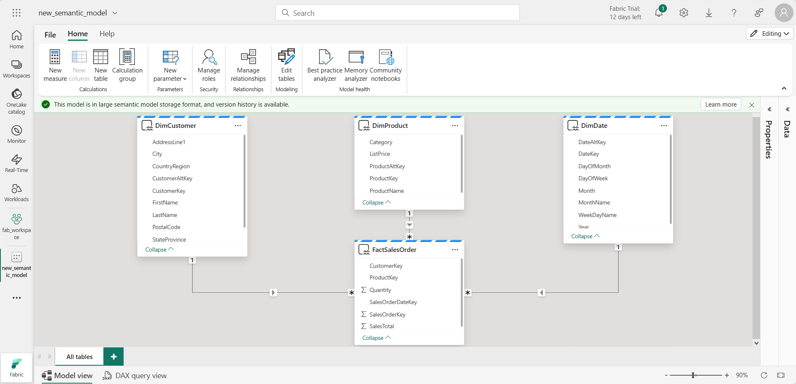

---
lab:
  title: データ ウェアハウスでデータを分析する
  module: Get started with data warehouses in Microsoft Fabric
---

# データ ウェアハウスでデータを分析する

Microsoft Fabric では、データ ウェアハウスによって大規模な分析用のリレーショナル データベースが提供されます。 レイクハウスで定義されているテーブルの既定の読み取り専用 SQL エンドポイントとは異なり、データ ウェアハウスは完全な SQL セマンティクスを提供します。これには、テーブル内のデータを挿入、更新、削除する機能が含まれます。

このラボは完了するまで、約 **30** 分かかります。

> **注**:この演習を完了するには、[Microsoft Fabric 試用版](https://learn.microsoft.com/fabric/get-started/fabric-trial)が必要です。

## ワークスペースの作成

Fabric でデータを操作する前に、Fabric 試用版を有効にしてワークスペースを作成してください。

1. ブラウザーの `https://app.fabric.microsoft.com/home?experience=fabric` で [Microsoft Fabric ホーム ページ](https://app.fabric.microsoft.com/home?experience=fabric)に移動し、Fabric 資格情報でサインインします。
1. 左側のメニュー バーで、 **[ワークスペース]** を選択します (アイコンは &#128455; に似ています)。
1. 任意の名前で新しいワークスペースを作成し、Fabric 容量を含むライセンス モード ("試用版"、*Premium*、または *Fabric*) を選択します。**
1. 開いた新しいワークスペースは空のはずです。

    

## データ ウェアハウスの作成

これでワークスペースが作成されたので、次にデータ ウェアハウスを作成します。

1. 左側のメニュー バーで、**[作成]** を選択します。 *[新規]* ページの *[データ ウェアハウス]* セクションで、**[ウェアハウス]** を選択します。 任意の一意の名前を設定します。

    >**注**: **[作成]** オプションがサイド バーにピン留めされていない場合は、最初に省略記号 (**...**) オプションを選択する必要があります。

    1 分ほどで、新しいレイクハウスが作成されます。

    

## テーブルを作成してデータを挿入する

ウェアハウスは、テーブルやその他のオブジェクトを定義できるリレーショナル データベースです。

1. 新しいウェアハウスで、**[T-SQL]** タイルを選択し、次の CREATE TABLE ステートメントを使用します。

    ```sql
   CREATE TABLE dbo.DimProduct
   (
       ProductKey INTEGER NOT NULL,
       ProductAltKey VARCHAR(25) NULL,
       ProductName VARCHAR(50) NOT NULL,
       Category VARCHAR(50) NULL,
       ListPrice DECIMAL(5,2) NULL
   );
   GO
    ```

2. **[&#9655; 実行]** ボタンを使用して SQL スクリプトを実行してください。これにより、データ ウェアハウスの **dbo** スキーマに **DimProduct** という名前の新しいテーブルが作成されます。
3. ツール バーの **[更新]** ボタンを使用して、ビューを更新してください。 次に、 **[エクスプローラー]** ペインで **[スキーマ]**  >  **[dbo]**  >  **[テーブル]** の順に展開し、**DimProduct** テーブルが作成されていることを確認してください。
4. **[ホーム]** メニュー タブで、 **[新しい SQL クエリ]** ボタンを使用して新しいクエリを作成し、次の INSERT ステートメントを入力してください。

    ```sql
   INSERT INTO dbo.DimProduct
   VALUES
   (1, 'RING1', 'Bicycle bell', 'Accessories', 5.99),
   (2, 'BRITE1', 'Front light', 'Accessories', 15.49),
   (3, 'BRITE2', 'Rear light', 'Accessories', 15.49);
   GO
    ```

5. 新しいクエリを実行して **DimProduct** テーブルに 3 行を挿入してください。
6. **[エクスプローラー]** ペインで **DimProduct** テーブルを選択し、テーブルに 3 行が追加されていることを確認します。
7. **[ホーム]** メニュー タブで、 **[新しい SQL クエリ]** ボタンを使用して新しいクエリを作成してください。 次に、`https://raw.githubusercontent.com/MicrosoftLearning/dp-data/main/create-dw.txt` から Transact-SQL コードをコピーして、新しいクエリのペインに貼り付けます。
8. クエリを実行してください。これにより、シンプルなデータ ウェアハウス スキーマが作成され、データがいくつか読み込まれます。 スクリプトの実行には約 30 秒かかります。
9. ツール バーの **[更新]** ボタンを使用して、ビューを更新してください。 次に、 **[エクスプローラー]** ペインで、データ ウェアハウスの **dbo** スキーマに次の 4 つのテーブルが含まれていることを確認してください。
    - **DimCustomer**
    - **DimDate**
    - **DimProduct**
    - **FactSalesOrder**

    > **ヒント**: スキーマの読み込みに時間がかかる場合は、ブラウザー ページを更新してください。

## データ ウェアハウスのテーブルにクエリを実行する

データ ウェアハウスはリレーショナル データベースであるため、SQL を使用してそのテーブルにクエリを実行できます。

### ファクト テーブルとディメンション テーブルに対してクエリを実行する

リレーショナル データ ウェアハウスのほとんどのクエリでは、(JOIN 句を使用して) 関連するテーブル間で (集計関数と GROUP BY 句を使用して) データが集計およびグループ化されます。

1. ウェアハウスのブラウザー タブに戻り、新しい SQL クエリを作成し、次のコードを実行します。

    ```sql
   SELECT  d.[Year] AS CalendarYear,
            d.[Month] AS MonthOfYear,
            d.MonthName AS MonthName,
           SUM(so.SalesTotal) AS SalesRevenue
   FROM FactSalesOrder AS so
   JOIN DimDate AS d ON so.SalesOrderDateKey = d.DateKey
   GROUP BY d.[Year], d.[Month], d.MonthName
   ORDER BY CalendarYear, MonthOfYear;
    ```

    日付ディメンションの属性を使用すると、ファクト テーブル内のメジャーを複数の階層レベル (この場合は年と月) で集計できます。 これは、データ ウェアハウスでの一般的なパターンです。

2. 次のようにクエリを変更して、集計に 2 番目のディメンションを追加してください。

    ```sql
   SELECT  d.[Year] AS CalendarYear,
           d.[Month] AS MonthOfYear,
           d.MonthName AS MonthName,
           c.CountryRegion AS SalesRegion,
          SUM(so.SalesTotal) AS SalesRevenue
   FROM FactSalesOrder AS so
   JOIN DimDate AS d ON so.SalesOrderDateKey = d.DateKey
   JOIN DimCustomer AS c ON so.CustomerKey = c.CustomerKey
   GROUP BY d.[Year], d.[Month], d.MonthName, c.CountryRegion
   ORDER BY CalendarYear, MonthOfYear, SalesRegion;
    ```

3. 変更されたクエリを実行し、結果を確認してください。これには、年、月、販売地域別に集計された売上収益が含まれます。

## ビューを作成する

Microsoft Fabric のデータ ウェアハウスには、リレーショナル データベースで使用できるのと同じ機能が多くあります。 たとえば、"ビュー" や "ストアド プロシージャ" などのデータベース オブジェクトを作成して、SQL ロジックをカプセル化できます。** **

1. ビューを作成するには、前に作成したクエリを次のように変更してください (ビューを作成するには ORDER BY 句を削除する必要があることにご注意ください)。

    ```sql
   CREATE VIEW vSalesByRegion
   AS
   SELECT  d.[Year] AS CalendarYear,
           d.[Month] AS MonthOfYear,
           d.MonthName AS MonthName,
           c.CountryRegion AS SalesRegion,
          SUM(so.SalesTotal) AS SalesRevenue
   FROM FactSalesOrder AS so
   JOIN DimDate AS d ON so.SalesOrderDateKey = d.DateKey
   JOIN DimCustomer AS c ON so.CustomerKey = c.CustomerKey
   GROUP BY d.[Year], d.[Month], d.MonthName, c.CountryRegion;
    ```

2. クエリを実行してビューを作成してください。 次に、データ ウェアハウス スキーマを更新し、新しいビューが **[エクスプローラー]** ペインに一覧表示されていることを確認してください。
3. 新しい SQL クエリを作成し、次の SELECT ステートメントを実行してください。

    ```SQL
   SELECT CalendarYear, MonthName, SalesRegion, SalesRevenue
   FROM vSalesByRegion
   ORDER BY CalendarYear, MonthOfYear, SalesRegion;
    ```

## ビジュアル クエリを作成する

SQL コードを記述する代わりに、グラフィカル クエリ デザイナーを使用して、データ ウェアハウス内のテーブルに対してクエリを実行できます。 このエクスペリエンスは、コードなしでデータ変換ステップを作成できる Power Query Online に似ています。 より複雑なタスクの場合は、Power Query の M (Mashup) 言語を使用できます。

1. **[ホーム]** メニューで、**[新しい SQL クエリ]** 配下のオプションを展開し、**[新しいビジュアル クエリ]** を選択します。

1. **FactSalesOrder** を**キャンバス**にドラッグしてください。 テーブルのプレビューが下の **[プレビュー]** ペインに表示されていることに注目してください。

1. **DimProduct** を**キャンバス**にドラッグしてください。 これで、クエリに 2 つのテーブルが含まれました。

2. キャンバス上の **FactSalesOrder** テーブルの **(+)** ボタンを使用して、**クエリをマージしてください**。


1. **[クエリのマージ]** ウィンドウで、マージする適切なテーブルとして **DimProduct** を選択してください。 両方のクエリで **[ProductKey]** を選択し、既定の **[左外部]** 結合種類のままにして、 **[OK]** をクリックしてください。

2. **[プレビュー]** では、新しい **DimProduct** 列が FactSalesOrder テーブルに追加されていることに注目してください。 列名の右側にある矢印をクリックして列を展開してください。 **[ProductName]** を選択して **[OK]** をクリックしてください。

    ![DimProduct 列が展開され、[ProductName] が選択されているプレビュー ペインのスクリーンショット。](./Images/visual-query-preview.png)

1. マネージャーの要求により、1 つの製品のデータを調べたい場合に、**ProductName** 列を使用してクエリ内のデータをフィルター処理できるようになりました。 **ProductName** 列をフィルター処理して、**ケーブル ロック**のデータのみを表示してください。

1. ここから、**[結果の可視化]** または **[Excel ファイルのダウンロード]** を選択して、この 1 つのクエリの結果を分析できます。 マネージャーが求めていた内容を正確に確認できるようになったので、結果をさらに分析する必要はありません。

## (省略可能) データ モデルを定義する

**注**:このタスクは完全に省略可能ですが、セマンティック モデルを作成および編集するには、Power BI ライセンスまたは Fabric F64 SKU が必要です。

リレーショナル データ ウェアハウスは、通常 "ファクト" および "ディメンション" テーブルで構成されます。** ** ファクト テーブルには、ビジネス パフォーマンスを分析するために集計できる数値メジャー (売上収益など) が含まれており、ディメンション テーブルには、データ (製品、顧客、時間など) を集計できるエンティティの属性が含まれています。 Microsoft Fabric データ ウェアハウスでは、これらのキーを使用して、テーブル間のリレーションシップをカプセル化するデータ モデルを定義できます。

1. ツール バーで、**[新しいセマンティック モデル]** を選択します。
1. **[新しいセマンティック モデル]** ウィンドウで、セマンティック モデルに名前を付け、4 つのテーブルをすべて選択します。 **確認** を選択します。
1. 新しいセマンティック モデルが新しいブラウザー タブで自動的に開きます。 [モデル] ペインで、次のように **FactSalesOrder** テーブルが中央になるように、データ ウェアハウス内のテーブルを再配置してください。

    ![データ ウェアハウスの [モデル] ページのスクリーンショット。](./Images/model-dw.png)

1. **FactSalesOrder** テーブルから **ProductKey** フィールドをドラッグし、**DimProduct** テーブルの **ProductKey** フィールドにドロップしてください。 次に、次のリレーションシップの詳細を確認します。
    - **ソース テーブル**: FactSalesOrder
    - **列**: ProductKey
    - **ターゲット テーブル**: DimProduct
    - **列**: ProductKey
    - **カーディナリティ**: 多対一 (*:1)
    - **クロス フィルターの方向**: 単一
    - **このリレーションシップをアクティブにする**: 選択済み
    - **参照整合性を想定する**: 未選択

1. このプロセスを繰り返して、次のテーブルの間に多対一のリレーションシップを作成してください。
    - **FactSalesOrder.CustomerKey** &#8594; **DimCustomer.CustomerKey**
    - **FactSalesOrder.SalesOrderDateKey** &#8594; **DimDate.DateKey**

    すべてのリレーションシップが定義されると、モデルは次のようになります。

    

## リソースをクリーンアップする

この演習では、複数のテーブルを含むデータ ウェアハウスを作成しました。 SQL を使用してテーブルにデータを挿入し、T-SQL とビジュアル クエリ ツールを使ってテーブルにクエリを実行しました。 最後に、ダウンストリーム分析とレポートを行うために、データ ウェアハウスの既定のデータセットのデータ モデルを拡張しました。

データ ウェアハウスの探索が完了したら、この演習用に作成したワークスペースを削除できます。

1. 左側のバーで、ワークスペースのアイコンを選択して、それに含まれるすべての項目を表示してください。
2. ツール バーの **[...]** メニューで、 **[ワークスペースの設定]** を選択してください。
3. **[全般]** セクションで、**[このワークスペースの削除]** を選択します。
