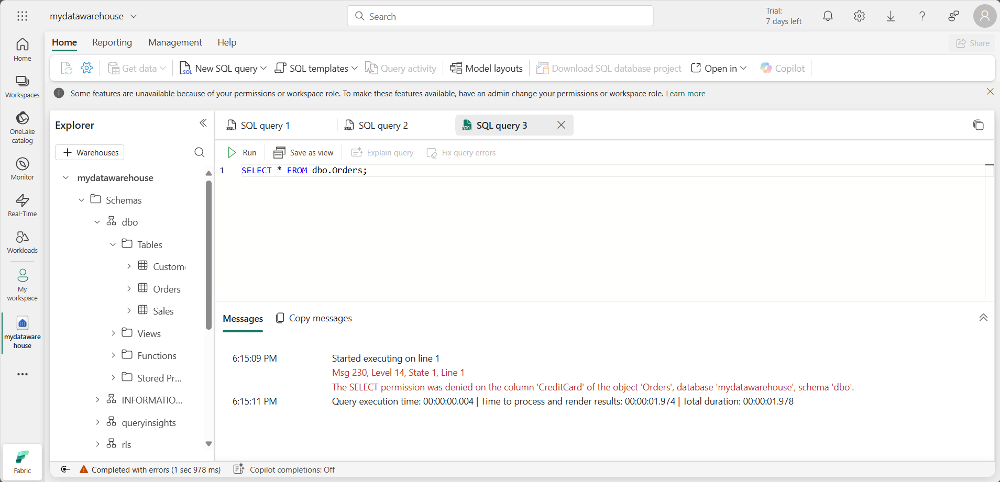
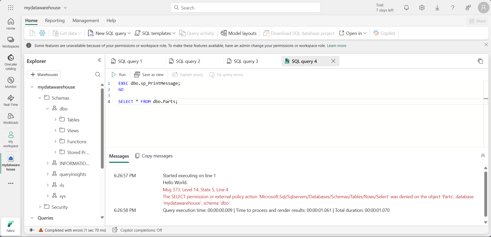

---
lab:
  title: Microsoft Fabric データ ウェアハウスをセキュリティで保護する
  module: Secure a Microsoft Fabric data warehouse
---

# Microsoft Fabric データ ウェアハウスをセキュリティで保護する

Microsoft Fabric のアクセス許可と詳細な SQL アクセス許可を組み合わせて使用し、ウェアハウスのアクセスとユーザーのアクセス許可を管理します。 この演習では、詳細なアクセス許可、列レベル セキュリティ、行レベル セキュリティ、動的データ マスクを使用してデータをセキュリティで保護します。

> **注**:この演習には省略可能な手順があり、結果の検証には 2 つ目のユーザー アカウントが必要です。1 人のユーザーにワークスペース管理者ロールを割り当て、もう 1 人にワークスペース閲覧者ロールを割り当てる必要があります。 ワークスペースにロールを割り当てるには、「[ワークスペースへのアクセスを許可する](https://learn.microsoft.com/fabric/get-started/give-access-workspaces)」を参照してください。 同じ組織内で 2 つ目のアカウントにアクセスできない場合でも、演習の**スクリーンショット**を参照して、ワークスペース閲覧者アカウントでアクセスできる内容を確認し、ワークスペース管理者として演習を実行することができます。

このラボの所要時間は約 **45** 分です。

## ワークスペースの作成

Fabric でデータを操作する前に、Fabric 試用版を有効にしてワークスペースを作成してください。

1. ブラウザーの `https://app.fabric.microsoft.com/home?experience=fabric` で [Microsoft Fabric ホーム ページ](https://app.fabric.microsoft.com/home?experience=fabric)に移動し、Fabric 資格情報でサインインします。
1. 左側のメニュー バーで、 **[ワークスペース]** を選択します (アイコンは &#128455; に似ています)。
1. 任意の名前で新しいワークスペースを作成し、Fabric 容量を含むライセンス モード ("試用版"、*Premium*、または *Fabric*) を選択します。**
1. 開いた新しいワークスペースは空のはずです。

    

> **注**:ワークスペースを作成すると、自分は自動的にワークスペース管理者ロールのメンバーになります。 2 番目のユーザーはご利用の環境からワークスペース ビューアー ロールに追加し、これらの演習で構成された機能をテストできます。 これを行うには、ワークスペース内で **[アクセスの管理]** を選択し、**[ユーザーまたはグループの追加]** を選択します。 これにより、2 番目のユーザーにワークスペースのコンテンツの表示が許可されます。

## データ ウェアハウスの作成

次に、作成したワークスペースにデータ ウェアハウスを作成します。

1. 左側のメニュー バーで、**[作成]** を選択します。 *[新規]* ページの *[データ ウェアハウス]* セクションで、**[ウェアハウス]** を選択します。 任意の一意の名前を設定します。

    >**注**: **[作成]** オプションがサイド バーにピン留めされていない場合は、最初に省略記号 (**...**) オプションを選択する必要があります。

    1 分ほどで、新しいレイクハウスが作成されます。

    

## テーブル内の列に動的データ マスク ルールを適用する

動的データ マスク ルールは、テーブル レベルの個々の列に適用されるため、すべてのクエリがマスクの影響を受けます。 機密データを表示する明示的なアクセス許可を持たないユーザーに対しては、クエリ結果にマスクされた値が表示され、データを表示する明示的なアクセス許可を持つユーザーに対しては、マスクされていないデータが表示されます。 マスクには、既定、電子メール、ランダム、カスタム文字列の 4 種類があります。 この演習では、既定のマスク、電子メール マスク、およびカスタム文字列マスクを適用します。

1. ウェアハウスで、**T-SQL** タイルを選択し、次の T-SQL ステートメントを使用してテーブルを作成し、データを挿入して表示します。  

    ```T-SQL
   CREATE TABLE dbo.Customers
   (   
       CustomerID INT NOT NULL,   
       FirstName varchar(50) MASKED WITH (FUNCTION = 'partial(1,"XXXXXXX",0)') NULL,     
       LastName varchar(50) NOT NULL,     
       Phone varchar(20) MASKED WITH (FUNCTION = 'default()') NULL,     
       Email varchar(50) MASKED WITH (FUNCTION = 'email()') NULL   
   );
   
   INSERT dbo.Customers (CustomerID, FirstName, LastName, Phone, Email) VALUES
   (29485,'Catherine','Abel','555-555-5555','catherine0@adventure-works.com'),
   (29486,'Kim','Abercrombie','444-444-4444','kim2@adventure-works.com'),
   (29489,'Frances','Adams','333-333-3333','frances0@adventure-works.com');
   
   SELECT * FROM dbo.Customers;
    ```

    マスクされていないデータの表示が制限されているユーザーが、テーブルに対してクエリを実行すると、**FirstName** 列に XXXXXXX の文字列の最初の文字が表示され、これに続く文字は表示されません。 **Phone** 列に xxxx が表示されます。 **Email** 列に、メール アドレスの最初の文字が表示され、`XXX@XXX.com` がその後に続きます。 この方法により、機密データは保護されたままになりますが、制限されたユーザーもテーブルに対してクエリを実行することはできます。

2. **[&#9655; 実行]** ボタンを使用して SQL スクリプトを実行してください。これにより、データ ウェアハウスの **dbo** スキーマに **Customer** という名前の新しいテーブルが作成されます。

3. 次に、**[エクスプローラー]** ペインで **[スキーマ]** > **[dbo]** > **[テーブル]** の順に展開し、**Customer** テーブルが作成されていることを確認してください。 `SELECT` ステートメントは、マスクされていないデータを返します。これは、ワークスペースの作成者は、マスクされていないデータを表示できるワークスペース管理者ロールのメンバーであるためです。

    >**注**:**ビューアー** ワークスペース ロールのメンバーであるテスト ユーザーとして接続し、**Customers** テーブルで `SELECT` ステートメントを実行すると、マスクされたデータに関する次の結果が表示されます。
   
    
 
    テスト ユーザーには UNMASK アクセス許可が付与されていないため、FirstName、Phone、Email 列に対して返されるデータはマスクされます。これらの列は、`CREATE TABLE` ステートメント内でマスクを使用するものとして定義されているためです。

## 行レベル セキュリティを適用する

行レベル セキュリティ (RLS) を使用すると、ID またはクエリを実行するユーザーのロールに基づいて行へのアクセスを制限できます。 この演習では、インライン テーブル値関数として定義されたセキュリティ ポリシーとセキュリティ述語を作成して、行へのアクセスを制限します。

1. 前の演習で作成したウェアハウスで、**[新しい SQL クエリ]** ドロップダウンを選択し、**新しい SQL クエリ**を選択します。

2. テーブルを作成してデータを挿入します。 後の手順で行レベルのセキュリティを実装するには、`<username1>@<your_domain>.com` を架空のユーザー名または実際の環境のユーザー名 (**閲覧者**ロール) に置き換え、`<username2>@<your_domain>.com` をユーザー名 (**管理者**ロール) に置き換えます。

    ```T-SQL
   CREATE TABLE dbo.Sales  
   (  
       OrderID INT,  
       SalesRep VARCHAR(60),  
       Product VARCHAR(10),  
       Quantity INT  
   );
    
   --Populate the table with 6 rows of data, showing 3 orders for each test user. 
   INSERT dbo.Sales (OrderID, SalesRep, Product, Quantity) VALUES
   (1, '<username1>@<your_domain>.com', 'Valve', 5),   
   (2, '<username1>@<your_domain>.com', 'Wheel', 2),   
   (3, '<username1>@<your_domain>.com', 'Valve', 4),  
   (4, '<username2>@<your_domain>.com', 'Bracket', 2),   
   (5, '<username2>@<your_domain>.com', 'Wheel', 5),   
   (6, '<username2>@<your_domain>.com', 'Seat', 5);  
    
   SELECT * FROM dbo.Sales;  
    ```

3. **[&#9655; 実行]** ボタンを使用して SQL スクリプトを実行します。これにより、データ ウェアハウスの **dbo** スキーマに **Sales** という名前の新しいテーブルが作成されます。

4. 次に、**[エクスプローラー]** ペインで **[スキーマ]** > **[dbo]** > **[テーブル]** の順に展開し、**Sales** テーブルが作成されていることを確認してください。
5. 新しいスキーマ、関数として定義されたセキュリティ述語、セキュリティ ポリシーを作成します。  

    ```T-SQL
   --Create a separate schema to hold the row-level security objects (the predicate function and the security policy)
   CREATE SCHEMA rls;
   GO
   
   /*Create the security predicate defined as an inline table-valued function.
   A predicate evaluates to true (1) or false (0). This security predicate returns 1,
   meaning a row is accessible, when a row in the SalesRep column is the same as the user
   executing the query.*/   
   --Create a function to evaluate who is querying the table
   CREATE FUNCTION rls.fn_securitypredicate(@SalesRep AS VARCHAR(60)) 
       RETURNS TABLE  
   WITH SCHEMABINDING  
   AS  
       RETURN SELECT 1 AS fn_securitypredicate_result   
   WHERE @SalesRep = USER_NAME();
   GO   
   /*Create a security policy to invoke and enforce the function each time a query is run on the Sales table.
   The security policy has a filter predicate that silently filters the rows available to 
   read operations (SELECT, UPDATE, and DELETE). */
   CREATE SECURITY POLICY SalesFilter  
   ADD FILTER PREDICATE rls.fn_securitypredicate(SalesRep)   
   ON dbo.Sales  
   WITH (STATE = ON);
   GO
    ```

6. ** [&#9655; 実行]** ボタンを使用して SQL スクリプトを実行します
7. 次に、**[エクスプローラー]** ペインで **[スキーマ]** > **[rls]** > **[関数]** > **[テーブル値関数]** の順に展開し、関数が作成されていることを確認します。

    > **注**:`<username1>@<your_domain>.com` を置き換えたユーザーとして接続し、**Sales** テーブルで `SELECT` ステートメントを実行すると、行レベルのセキュリティに関する次の結果が表示されます。

    

## 列レベルのセキュリティを実装する

列レベル セキュリティを使用すると、テーブル内の特定の列にアクセスできるユーザーを指定できます。 これは、テーブルに対して `GRANT` または `DENY` ステートメントを発行し、このときに列の一覧とそれらの読み取りが可能または可能でないユーザーまたはロールを指定することで実装されます。 アクセス管理を効率化するには、アクセス許可を個々のユーザーでなくロールに割り当てます。 この演習では、テーブルを作成し、テーブル上の列のサブセットへのアクセスを許可し、制限された列は自分以外のユーザーが表示できないことをテストします。

1. 前の演習で作成したウェアハウスで、**[新しい SQL クエリ]** ドロップダウンを選択してから、**新しい SQL クエリ**を選択します。  

2. テーブルを作成し、テーブルにデータを挿入します。

    ```T-SQL
   CREATE TABLE dbo.Orders
   (   
       OrderID INT,   
       CustomerID INT,  
       CreditCard VARCHAR(20)      
   );   
   INSERT dbo.Orders (OrderID, CustomerID, CreditCard) VALUES
   (1234, 5678, '111111111111111'),
   (2341, 6785, '222222222222222'),
   (3412, 7856, '333333333333333');   
   SELECT * FROM dbo.Orders;
    ```

3. テーブル内の列を表示するためのアクセス許可を拒否します。 T-SQL ステートメントを使用すると、`<username1>@<your_domain>.com` は Orders テーブル内の CreditCard 列を表示できなくなります。 `DENY` ステートメントで、`<username1>@<your_domain>.com` をワークスペースに対する閲覧者アクセス許可を持つユーザーのユーザー名に置き換えます。

    ```T-SQL
   DENY SELECT ON dbo.Orders (CreditCard) TO [<username1>@<your_domain>.com];
    ```

    > **注**:`<username1>@<your_domain>.com` を置き換えたユーザーとして接続し、**Orders**テーブルで `SELECT` ステートメントを実行すると、列レベルのセキュリティに関する次の結果が表示されます。

    

    スクリーンショットに示されているエラーは、`CreditCard` 列へのアクセスが制限されていることで発生します。 `OrderID` と `CustomerID` の列のみを選択すると、クエリが正常に実行されます。

## T-SQL を使用して SQL の詳細なアクセス許可を構成する

Fabric にはアクセス許可モデルがあり、これを使用すると、ワークスペース レベルおよび項目レベルでデータへのアクセスを制御できます。 Fabric ウェアハウス内でセキュリティ保護可能なリソースを使用してユーザーが実行できる操作をより細かく制御する必要がある場合は、標準の SQL データ制御言語 (DCL) の `GRANT`、`DENY`、`REVOKE` の各コマンドを使用できます。 この演習では、オブジェクトを作成し、それらを `GRANT` と `DENY` を使用してセキュリティで保護し、その後クエリを実行して、詳細なアクセス許可の適用の効果を確かめます。

1. 前の演習で作成したウェアハウスで、**[新規 SQL クエリ]** ドロップダウンを選択します。 **[新しい SQL クエリ]** を選択します。  

2. ストアド プロシージャとテーブルを作成します。 次に、このプロシージャを実行し、テーブルに対してクエリを実行します。

    ```T-SQL
   CREATE PROCEDURE dbo.sp_PrintMessage
   AS
   PRINT 'Hello World.';
   GO   
   CREATE TABLE dbo.Parts
   (
       PartID INT,
       PartName VARCHAR(25)
   );
   
   INSERT dbo.Parts (PartID, PartName) VALUES
   (1234, 'Wheel'),
   (5678, 'Seat');
    GO
   
   /*Execute the stored procedure and select from the table and note the results you get
   as a member of the Workspace Admin role. Look for output from the stored procedure on 
   the 'Messages' tab.*/
   EXEC dbo.sp_PrintMessage;
   GO   
   SELECT * FROM dbo.Parts
    ```

3. 次に、テーブルに対する `DENY SELECT` アクセス許可を、**ワークスペース閲覧者**ロールのメンバーであるユーザーに、プロシージャに対する `GRANT EXECUTE` を同じユーザーに割り当てます。 `<username1>@<your_domain>.com` を、ワークスペースに対する**閲覧者**アクセス許可を持つユーザーのユーザー名に置き換えます。

    ```T-SQL
   DENY SELECT on dbo.Parts to [<username1>@<your_domain>.com];

   GRANT EXECUTE on dbo.sp_PrintMessage to [<username1>@<your_domain>.com];
    ```

    > **注**:`<username1>@<your_domain>.com` を置き換えたユーザーとして接続し、ストアド プロシージャを実行し、**Parts** テーブルで `SELECT` ステートメントを実行すると、詳細なアクセス許可についての次の結果が表示されます。

    

## リソースをクリーンアップする

この演習では、テーブル内の列に対して T-SQL を使用して動的データ マスク ルールを適用し、行レベル セキュリティを適用し、列レベル セキュリティを実装し、SQL の詳細なアクセス許可を構成しました。

1. 左側のナビゲーション バーで、ワークスペースのアイコンを選択して、それに含まれるすべての項目を表示します。
2. 上部のツール バーのメニューで、**[ワークスペース設定]** を選択します。
3. **[全般]** セクションで、**[このワークスペースの削除]** を選択します。
