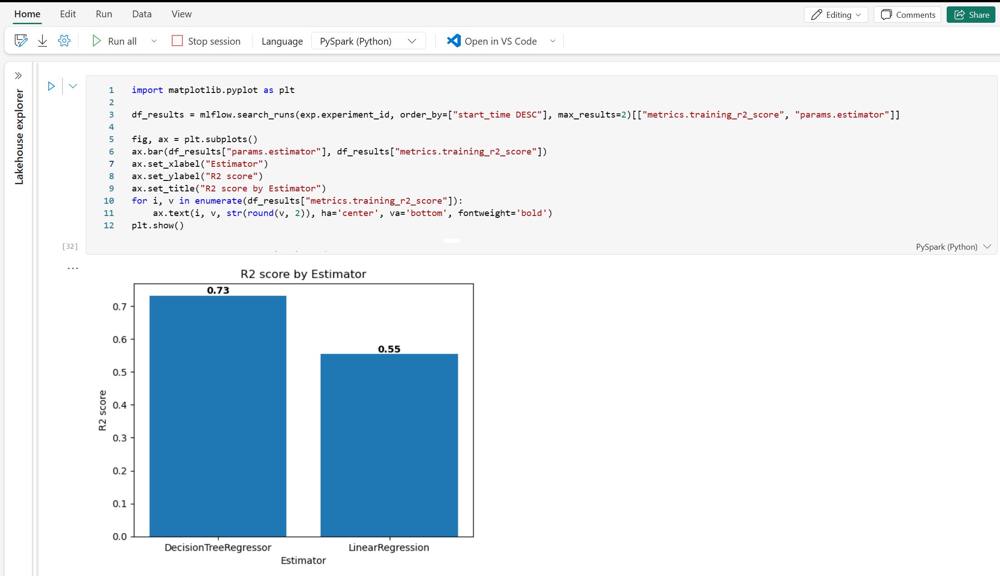

---
lab:
  title: 顧客離反を予測する分類モデルをトレーニングする
  module: Get started with data science in Microsoft Fabric
---

# ノートブックを使用して Microsoft Fabric でモデルをトレーニングする

このラボでは、Microsoft Fabric を使用してノートブックを作成し、機械学習モデルをトレーニングして顧客離反を予測します。 Scikit-Learn を使用してモデルをトレーニングし、MLflow でそのパフォーマンスを追跡します。 顧客離反は、多くの企業が直面する重要なビジネス上の問題であり、チャーンする可能性が高い顧客を予測することは、企業が顧客を維持し、収益を増やすのに役立つ場合があります。 このラボを完了することで、機械学習とモデルの追跡に関する実践的な経験を積み、Microsoft Fabric を使用してプロジェクト用のノートブックを作成する方法を学習します。

このラボは完了するまで、約 **45** 分かかります。

> **注**: この演習を完了するには、Microsoft Fabric ライセンスが必要です。 無料の Fabric 使用版ライセンスを有効にする方法の詳細については、[Fabric の開始](https://learn.microsoft.com/fabric/get-started/fabric-trial)に関するページを参照してください。 これを行うには、Microsoft の "学校" または "職場" アカウントが必要です。** ** お持ちでない場合は、[Microsoft Office 365 E3 以降の試用版にサインアップ](https://www.microsoft.com/microsoft-365/business/compare-more-office-365-for-business-plans)できます。

## ワークスペースの作成

Fabric でデータを操作する前に、Fabric 試用版を有効にしてワークスペースを作成します。

1. `https://app.fabric.microsoft.com` で [Microsoft Fabric](https://app.fabric.microsoft.com) にサインインし、 **[Power BI]** を選択します。
2. 左側のメニュー バーで、 **[ワークスペース]** を選択します (アイコンは &#128455; のようになります)。
3. 任意の名前で新しいワークスペースを作成し、Fabric 容量を含むライセンス モード ("試用版"、*Premium*、または *Fabric*) を選択します。**
4. 開いた新しいワークスペースは次のように空のはずです。

    

## レイクハウスを作成してファイルをアップロードする

ワークスペースが作成されたので、次はポータルの *[Data Science]* エクスペリエンスに切り替えて、分析するデータ ファイルのデータ レイクハウスを作成します。

1. Power BI ポータルの左下にある **[Power BI]** アイコンを選択し、 **[Data Engineering]** エクスペリエンスに切り替えます。
1. **[Data Engineering]** ホーム ページで、任意の名前で新しい**レイクハウス**を作成します。

    1 分ほどすると、**Tables** や **Files** のない新しいレイクハウスが作成されます。 分析のために、データ レイクハウスにいくつかのデータを取り込む必要があります。 これを行う複数の方法がありますが、この演習では、ローカル コンピューター (該当する場合はラボ VM) にテキスト ファイルのフォルダーをダウンロードして抽出し、レイクハウスにアップロードします。

1. [https://raw.githubusercontent.com/MicrosoftLearning/dp-data/main/churn.csv](https://raw.githubusercontent.com/MicrosoftLearning/dp-data/main/churn.csv) からこの演習用の `churn.csv` CSV ファイルをダウンロードして保存します。


1. レイクハウスを含む Web ブラウザー タブに戻り、 **[レイク ビュー]** ペインの **Files** ノードの **[...]** メニューで **[アップロード]** と **[ファイルのアップロード]** を選択し、ローカル コンピューター (または該当する場合はラボ VM) からレイクハウスに **churn.csv** ファイルをアップロードします。
6. ファイルがアップロードされた後、**Files** を展開し、CSV ファイルがアップロードされたことを確認します。

## ノートブックを作成する

モデルをトレーニングするために、''*ノートブック*'' を作成できます。 ノートブックでは、''実験'' として (複数の言語で) コードを記述して実行できる対話型環境が提供されます。**

1. Power BI ポータルの左下にある **[Data Engineering]** アイコンを選択し、 **[Data Science]** エクスペリエンスに切り替えます。

1. **[Data Science]** ホーム ページで、新しい**ノートブック**を作成します。

    数秒後に、1 つの ''セル'' を含む新しいノートブックが開きます。** ノートブックは、''コード'' または ''マークダウン'' (書式設定されたテキスト) を含むことができる 1 つまたは複数のセルで構成されます。** **

1. 最初のセル (現在は ''コード'' セル) を選択し、右上の動的ツール バーで **[M&#8595;]** ボタンを使用してセルを ''マークダウン'' セルに変換します。** **

    セルがマークダウン セルに変わると、それに含まれるテキストがレンダリングされます。

1. **[&#128393;]** (編集) ボタンを使用してセルを編集モードに切り替え、その内容を削除して次のテキストを入力します。

    ```text
   # Train a machine learning model and track with MLflow

   Use the code in this notebook to train and track models.
    ``` 

## データフレームにデータを読み込む

これで、データを準備してモデルをトレーニングするためのコードを実行する準備ができました。 データを操作するには、''データフレーム'' を使用します。** Spark のデータフレームは Python の Pandas データフレームに似ており、行と列のデータを操作するための共通の構造が提供されます。

1. **[レイクハウスの追加]** ペインで、 **[追加]** を選択してレイクハウスを追加します。
1. **[既存のレイクハウス]** を選び、 **[追加]** を選択します。
1. 前のセクションで作成したレイクハウスを選択します。
1. **Files** フォルダーを展開して、ノートブック エディターの横に CSV ファイルが表示されるようにします。
1. **churn.csv** の **[...]** メニューで、 **[データの読み込み]**  >  **[Pandas]** の順に選択します。 次のコードを含む新しいコード セルがノートブックに追加されるはずです。

    ```python
   import pandas as pd
   # Load data into pandas DataFrame from "/lakehouse/default/" + "Files/churn.csv"
   df = pd.read_csv("/lakehouse/default/" + "Files/churn.csv")
   display(df)
    ```

    > **ヒント**: 左側のファイルを含むペインは、その **[<<]**  アイコンを使用して非表示にすることができます。 そうすると、ノートブックに集中するのに役立ちます。

1. セルの左側にある **[&#9655;] (セルの実行)** ボタンを使用して実行します。

    > **注**: このセッション内で Spark コードを実行したのはこれが最初であるため、Spark プールを起動する必要があります。 これは、セッション内での最初の実行が完了するまで 1 分ほどかかる場合があることを意味します。 それ以降は、短時間で実行できます。

1. セル コマンドが完了したら、セルの下にある出力を確認します。これは次のようになるはずです。

    |インデックス|CustomerID|years_with_company|total_day_calls|total_eve_calls|total_night_calls|total_intl_calls|average_call_minutes|total_customer_service_calls|age|churn|
    | -- | -- | -- | -- | -- | -- | -- | -- | -- | -- | -- |
    |1|1000038|0|117|88|32|607|43.90625678|0.810828179|34|0|
    |2|1000183|1|164|102|22|40|49.82223317|0.294453889|35|0|
    |3|1000326|3|116|43|45|207|29.83377967|1.344657937|57|1|
    |4|1000340|0|92|24|11|37|31.61998183|0.124931779|34|0|
    | ... | ... | ... | ... | ... | ... | ... | ... | ... | ... | ... |

    出力には、churn.csv ファイルの顧客データの行と列が表示されます。

## 機械学習モデルのトレーニング

データを読み込んだので、それを使用して機械学習モデルをトレーニングし、顧客離反を予測できます。 Scikit-Learn ライブラリを使用してモデルをトレーニングし、MLflow でモデルを追跡します。 

1. セル出力の下にある **[+ コード]** アイコンを使用して、ノートブックに新しいコード セルを追加し、次のコードを入力します。

    ```python
   from sklearn.model_selection import train_test_split

   print("Splitting data...")
   X, y = df[['years_with_company','total_day_calls','total_eve_calls','total_night_calls','total_intl_calls','average_call_minutes','total_customer_service_calls','age']].values, df['churn'].values
   
   X_train, X_test, y_train, y_test = train_test_split(X, y, test_size=0.30, random_state=0)
    ```

1. 追加したコード セルを実行します。データセットの "CustomerID" を省略し、データをトレーニングとテスト データセットに分割していることに注意してください。
1. ノートブックに新しいコード セルをもう 1 つ追加し、そこに次のコードを入力して実行します。
    
    ```python
   import mlflow
   experiment_name = "experiment-churn"
   mlflow.set_experiment(experiment_name)
    ```
    
    このコードでは、`experiment-churn` という名前の MLflow 実験を作成します。 この実験でモデルが追跡されます。

1. ノートブックに新しいコード セルをもう 1 つ追加し、そこに次のコードを入力して実行します。

    ```python
   from sklearn.linear_model import LogisticRegression
   
   with mlflow.start_run():
       mlflow.autolog()

       model = LogisticRegression(C=1/0.1, solver="liblinear").fit(X_train, y_train)

       mlflow.log_param("estimator", "LogisticRegression")
    ```
    
    このコードでは、ロジスティック回帰を使用して分類モデルをトレーニングします。 パラメーター、メトリック、および成果物は、MLflow で自動的にログに記録されます。 さらに、値が `LogisticRegression` の `estimator` というパラメーターをログに記録しています。

1. ノートブックに新しいコード セルをもう 1 つ追加し、そこに次のコードを入力して実行します。

    ```python
   from sklearn.tree import DecisionTreeClassifier
   
   with mlflow.start_run():
       mlflow.autolog()

       model = DecisionTreeClassifier().fit(X_train, y_train)
   
       mlflow.log_param("estimator", "DecisionTreeClassifier")
    ```

    このコードでは、デシジョン ツリー分類子を使用して分類モデルをトレーニングします。 パラメーター、メトリック、および成果物は、MLflow で自動的にログに記録されます。 さらに、値が `DecisionTreeClassifier` の `estimator` というパラメーターをログに記録しています。

## MLflow を使用して実験を検索および表示する

MLflow でモデルをトレーニングして追跡したら、MLflow ライブラリを使用して実験とその詳細を取得できます。

1. すべての実験を一覧表示するには、次のコードを使用します。

    ```python
   import mlflow
   experiments = mlflow.search_experiments()
   for exp in experiments:
       print(exp.name)
    ```

1. 特定の実験を取得するには、その名前で取得できます。

    ```python
   experiment_name = "experiment-churn"
   exp = mlflow.get_experiment_by_name(experiment_name)
   print(exp)
    ```

1. 実験名を使用すると、その実験のすべてのジョブを取得できます。

    ```python
   mlflow.search_runs(exp.experiment_id)
    ```

1. ジョブの実行と出力をより簡単に比較するために、結果を並べ替える検索を構成できます。 たとえば、次のセルは結果を `start_time` で並べ替え、最大 `2` 個の結果のみを表示します。 

    ```python
   mlflow.search_runs(exp.experiment_id, order_by=["start_time DESC"], max_results=2)
    ```

1. 最後に、複数のモデルの評価メトリックを並べてプロットして、モデルを簡単に比較できます。

    ```python
   import matplotlib.pyplot as plt
   
   df_results = mlflow.search_runs(exp.experiment_id, order_by=["start_time DESC"], max_results=2)[["metrics.training_accuracy_score", "params.estimator"]]
   
   fig, ax = plt.subplots()
   ax.bar(df_results["params.estimator"], df_results["metrics.training_accuracy_score"])
   ax.set_xlabel("Estimator")
   ax.set_ylabel("Accuracy")
   ax.set_title("Accuracy by Estimator")
   for i, v in enumerate(df_results["metrics.training_accuracy_score"]):
       ax.text(i, v, str(round(v, 2)), ha='center', va='bottom', fontweight='bold')
   plt.show()
    ```

    出力は次の画像のようになるはずです。

    

## 実験を調べる

Microsoft Fabric では、すべての実験を追跡し、それらを視覚的に調べることができます。

1. **[Data Science]** ホーム ページに移動します。
1. `experiment-churn` 実験を選択して開きます。

    > **ヒント:** ログに記録された実験の実行が表示されない場合は、ページを最新の情報に更新します。

1. **[表示]** タブを選択します。
1. **[実行リスト]** を選択します。 
1. 各ボックスをオンにして、最新の 2 つの実行を選択します。
    その結果、最後の 2 つの実行が **[メトリック比較]** ペインで相互に比較されます。 既定では、メトリックは実行名でプロットされます。 
1. 各実行の精度を視覚化するグラフの **[&#128393;]** (編集) ボタンを選択します。 
1. **視覚化の種類**を `bar` に変更します。 
1. **X 軸**を `estimator` に変更します。 
1. **[置換]** を選択し、新しいグラフを調べます。

ログに記録された推定器ごとの精度をプロットすることで、どのアルゴリズムがより優れたモデルになったかを確認できます。

## モデルを保存する

実験の実行でトレーニングした機械学習モデルを比較した後、最適なパフォーマンス モデルを選ぶことができます。 最適なパフォーマンス モデルを使用するには、モデルを保存し、それを使用して予測を生成します。

1. 実験の概要で、 **[表示]** タブが選択されていることを確かめます。
1. **[実行の詳細]** を選択します。
1. 最も精度の高い実行を選択します。 
1. **[モデルとして保存]** ボックスで **[保存]** を選択します。
1. 新しく開いたポップアップ ウィンドウで **[新しいモデルの作成]** を選択します。
1. モデルに `model-churn` という名前を付け、 **[作成]** を選択します。 
1. モデルの作成時に画面の右上に表示される通知で、 **[モデルの表示]** を選択します。 ウィンドウを最新の情報に更新することもできます。 保存されたモデルは、 **[登録済みバージョン]** の下にリンクされています。 

モデル、実験、実験の実行がリンクされていることに注意してください。これにより、モデルのトレーニング方法を確認できます。 

## ノートブックを保存して Spark セッションを終了する

モデルのトレーニングと評価が完了したので、わかりやすい名前でノートブックを保存し、Spark セッションを終了できます。

1. ノートブックのメニュー バーで、[⚙️] (**設定**) アイコンを使用してノートブックの設定を表示します。
2. ノートブックの **[名前]** を **[モデルのトレーニングと比較]** に設定し、設定ペインを閉じます。
3. ノートブック メニューで、 **[セッションの停止]** を選択して Spark セッションを終了します。

## リソースをクリーンアップする

この演習では、ノートブックを作成し、機械学習モデルをトレーニングしました。 Scikit-Learn を使用してモデルをトレーニングし、MLflow でそのパフォーマンスを追跡しました。

モデルと実験の探索が完了したら、この演習用に作成したワークスペースを削除できます。

1. 左側のバーで、ワークスペースのアイコンを選択して、それに含まれるすべての項目を表示します。
2. ツール バーの **[...]** メニューで、 **[ワークスペースの設定]** を選択します。
3. **[その他]** セクションで、 **[このワークスペースの削除]** を選択します。
