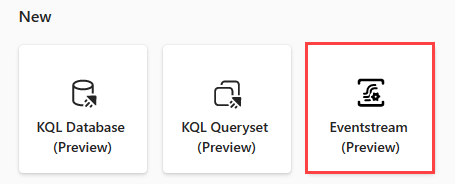
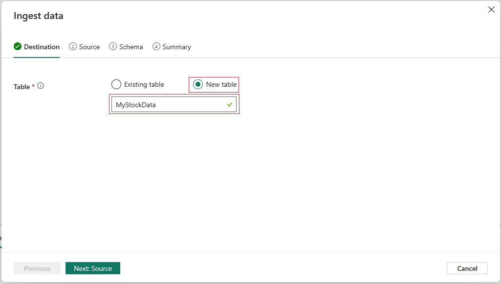
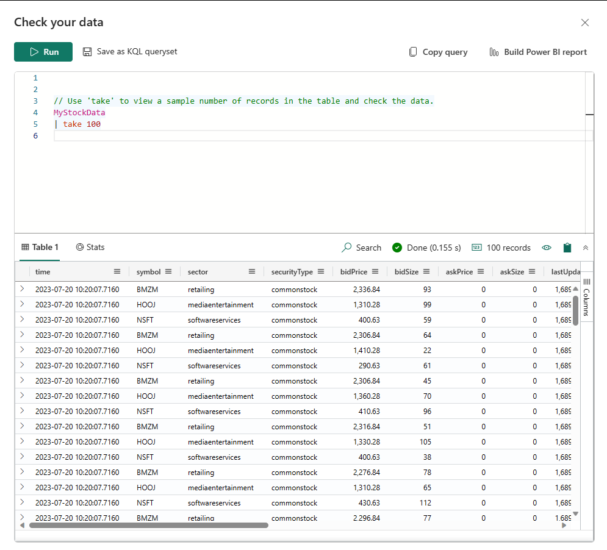

---
lab:
  title: Microsoft Fabric での Real-Time Analytics の概要
  module: Get started with real-time analytics in Microsoft Fabric
---
# Real Time Analytics (RTA) での Eventstream の概要

イベント ストリームは、コードなしのエクスペリエンスでリアルタイム イベントをキャプチャし、変換し、さまざまな宛先にルーティングする Microsoft Fabric の機能です。 ポータルで作成した Eventstream 項目は、Fabric のイベント ストリーム (Eventstream とも呼ばれます) のインスタンスになります。 変換が必要な場合は、イベントのデータ ソース、ルーティング先、イベント プロセッサを Eventstream に追加できます。 Azure Service Fabric の EventStore は、クラスターからのイベントを維持し、特定の時点でのクラスターまたはワークロードの状態を理解できるようにする監視オプションです。 EventStore サービスでは、クラスター内のエンティティとエンティティ型のそれぞれで使用できるイベントのクエリを実行できます。 つまり、クラスター、ノード、アプリケーション、サービス、パーティション、パーティション レプリカなど、さまざまなレベルのイベントにクエリを実行できます。 EventStore サービスは、クラスター内のイベントを関連付ける機能も備えています。 EventStore サービスは、相互に影響を与えた可能性がある異なるエンティティから同時に書き込まれたイベントを調べてそれらのイベントをリンクし、クラスター内で発生したアクティビティの原因の識別に役立てることができます。 Azure Service Fabric クラスターの監視と診断を行うもう 1 つのオプションが、EventFlow を使用したイベントの集計と収集です。

このラボの所要時間は約 **30** 分です。

> **注**: この演習を完了するには、Microsoft Fabric ライセンスが必要です。 無料の Fabric 試用版ライセンスを有効にする方法の詳細については、[Fabric の概要](https://learn.microsoft.com/fabric/get-started/fabric-trial)に関するページを参照してください。 これを行うには、Microsoft の "学校" または "職場" アカウントが必要です。** ** お持ちでない場合は、[Microsoft Office 365 E3 以上の試用版にサインアップ](https://www.microsoft.com/microsoft-365/business/compare-more-office-365-for-business-plans)できます。

## ワークスペースの作成

Fabric でデータを操作する前に、Fabric 試用版を有効にしてワークスペースを作成します。

1. `https://app.fabric.microsoft.com` で [Microsoft Fabric](https://app.fabric.microsoft.com) にサインインし、 **[Power BI]** を選択します。
2. 左側のメニュー バーで、 **[ワークスペース]** を選択します (アイコンは &#128455; のようになります)。
3. 任意の名前で新しいワークスペースを作成し、Fabric 容量を含むライセンス モード ("試用版"、*Premium*、または *Fabric*) を選択します。**
4. 新しいワークスペースを開くと、次に示すように空です。

   
5. Power BI ポータルの左下で、 **[Power BI]** アイコンを選択し、**Real-Time Analytics** エクスペリエンスに切り替えます。

## シナリオ

Microsoft Fabric イベント ストリームでは、イベント データを 1 か所で簡単に管理できます。 リアルタイム イベント データを収集し、変換し、目的の形式でさまざまな宛先に送信できます。 また、イベント ストリームを、Azure Event Hubs、KQL データベース、レイクハウスに簡単に接続することもできます。

このラボは、株式市場データと呼ばれるサンプル ストリーミング データに基づいています。 株式市場サンプル データは、時刻、シンボル、価格、数量などの事前設定されたスキーマ列を含む証券取引所のデータセットです。 このサンプル データを使用して、株価のリアルタイム イベントをシミュレートし、KQL データベースなどのさまざまな宛先で分析します。

Real-Time Analytics のストリーミングとクエリの機能を使用して、株価統計に関する重要な質問の回答を得て、その結果を使用して Power BI レポートを作成できます。 このシナリオでは、KQL データベースなどの一部のコンポーネントを個別に手動で作成する代わりに、ウィザードを最大限に活用します。

このチュートリアルでは、以下の内容を学習します。

- KQL データベースを作成する
- OneLake へのデータ コピーを有効にする
- Eventstream を作成する
- Eventstream から KQL データベースにデータをストリーミングする
- KQL と SQL を使用してデータを探索する

## KQL データベースを作成する

1. **Real-Time Analytics** で、 **[KQL データベース]** ボックスを選択します。

2. KQL データベースに**名前を付ける**ダイアログが表示されます

3. KQL データベースに、覚えやすい名前 (**MyStockData** など) を指定し、 **[作成]** を押します。

次に、OneLake の可用性をオンにします

1. **[データベースの詳細]** パネルで、鉛筆アイコンを選択します。

2. ボタンを **[アクティブ]** に切り替えてから、 **[完了]** を選択してください。

## Eventstream を作成する

1. メニュー バーで **[Real-Time Analytics]** を選択します (アイコンは に似ています)
2. **[新規]** で **[Eventstream (プレビュー)]** を選択します

3. **Eventstream に名前を付ける**ダイアログが表示されます

4. Eventstream に覚えやすい名前 (***MyStockES** など) を指定し、 **[作成]** ボタンを押します。

## Eventstream のソース データ

1. Eventstream キャンバスで、ドロップダウン リストから **[新しいソース]** を選択し、 **[サンプル データ]** を選択します。

2. 次の表に示すように、サンプル データの値を入力し、 **[追加と構成]** を選択します。

| フィールド       | 推奨値 |
| ----------- | ----------------- |
| ソース名 | StockData         |
| サンプル データ | 株式市場      |

## Eventstream の宛先データ

1. Eventstream キャンバスで、 **[新しい宛先]** を選択し、 **[KQL データベース]** を選択します

2. KQL データベースの構成で、次の表を使用して構成を完了します。

| フィールド            | 推奨値                              |
| ---------------- | ---------------------------------------------- |
| 宛先名 | MyStockData                                    |
| ワークスペース        | KQL データベースを作成したワークスペース |
| KQL データベース     | MyStockData                                    |

3. **[追加と構成]** を選択します。

## データ インジェストを構成する

1. **[データの取り込み]** ダイアログ ページで、 **[新しいテーブル]** を選択し、「MyStockData」と入力します。

2. **[Next: Source](次へ: ソース)** を選択します。
3. **[ソース]** ページで **[データ接続名]** を確認し、 **[次へ: スキーマ]** を選択します。

4. サンプル データの場合、受信データは圧縮されないため、圧縮の種類は圧縮解除のままにします。
5. **[データ形式]** ドロップダウンから **[JSON]** を選択します。

6. その後、一部またはすべてのデータ型を受信ストリームから宛先テーブルに変更することが必要になる場合があります。
7. このタスクを実行するには、**下矢印 > [データ型の変更]** を選択します。 次に、列に正しいデータ型が反映されていることを確認します。

8. 終了したら、 **[次へ: 概要]** を選択します

すべてのステップが緑色のチェックマークでマークされるまで待ちます。 **[Eventsream からの継続的な取り込みが確立されました]** というページ タイトルが表示されるはずです。 その後、 **[閉じる]** を選択して Eventstream ページに戻ります。

> !注: Eventstream 接続が構築されて確立された後、テーブルを表示するには、ページを更新しなければならない場合があります

## KQL のクエリ

Kusto 照会言語 (KQL) は、データを処理して結果を返すための、読み取り専用の要求です。 要求は、読みやすく、作りやすく、自動化しやすいデータフロー モデルを利用してプレーンテキストで提示されます。 クエリは常に、特定のテーブルまたはデータベースのコンテキストで実行されます。 クエリは少なくとも、ソース データ参照と、シーケンスで適用される 1 つ以上のクエリ演算子で構成され、演算子を区切るパイプ文字 () を使用して視覚的に示されます。 Kusto 照会言語について詳しくは、「[Kusto 照会言語 (KQL) の概要](https://learn.microsoft.com/en-us/azure/data-explorer/kusto/query/?context=%2Ffabric%2Fcontext%2Fcontext)」を参照してください

> ! 注: KQL エディターには構文と Inellisense 強調表示の両方が付属しています。これにより、Kusto 照会言語 (KQL) に関する知識をすばやく得ることができます。

1. ***MyStockData*** という名前の、新しく作成され、ハイドレートされた KQL データベースを参照します。
2. データ ツリーで、MyStockData テーブルのその他メニュー [...] を選択します。 次に、[クエリ テーブル] > [100 個のレコードを表示する] を選択します。

3. サンプル クエリは、テーブル コンテキストが既に設定されている **[データを調査する]** ペインで開きます。 この最初のクエリは、take 演算子を使用してサンプル数のレコードを返します。データ構造と使用可能な値を最初に確認すると便利です。 自動設定されたサンプル クエリは自動的に実行されます。 結果ペインでクエリの結果を確認できます。

4. データ ツリーに戻り、次のクエリを選択します。このクエリは、where 演算子と between 演算子を使用して、過去 24 時間以内に取り込まれたレコードを返します。

> !注: ストリーミング データのボリュームがクエリの制限を超えていることに注目してください。 この動作は、データベースにストリーミングされるデータの量によって異なる場合があります。
> 引き続き、組み込みのクエリ関数の使用を試すことで、データを理解することができます。

## サンプル SQL クエリ

クエリ エディターでは、主要なクエリ Kusto 照会言語 (KQL) に加えて T-SQL の使用がサポートされています。 T-SQL は、KQL を使用できないツールで役立ちます。 詳細については、「[T-SQL を使用してデータのクエリを実行する](https://learn.microsoft.com/en-us/azure/data-explorer/t-sql)」を参照してください

1. データ ツリーに戻り、MyStockData テーブルで**その他メニュー** [...] を選択します。 **[クエリ テーブル] > [SQL] > [100 個のレコードを表示する]** を選択します。

2. クエリ内のどこかにカーソルを置き、 **[実行]** を選択するか、**Shift キーを押しながら Enter キー**を押します。

引き続き、組み込みの関数の使用を試すことで、SQL または KQL を使用したデータを理解することができます。 これでレッスンは終了です。

## リソースをクリーンアップする

1. この演習では、KQL データベースを作成し、Eventstream を使用して継続的ストリーミングを設定しました。 その後、KQL と SQL を使用してデータにクエリを実行しました。
2. KQL データベースの探索が完了したら、この演習用に作成したワークスペースを削除できます。 
3. 左側のバーで、ワークスペースのアイコンを選択します。
4. ツール バーの [...] メニューで、[ワークスペースの設定] を選択します。
5. [その他] セクションで、[このワークスペースの削除] を選択します。