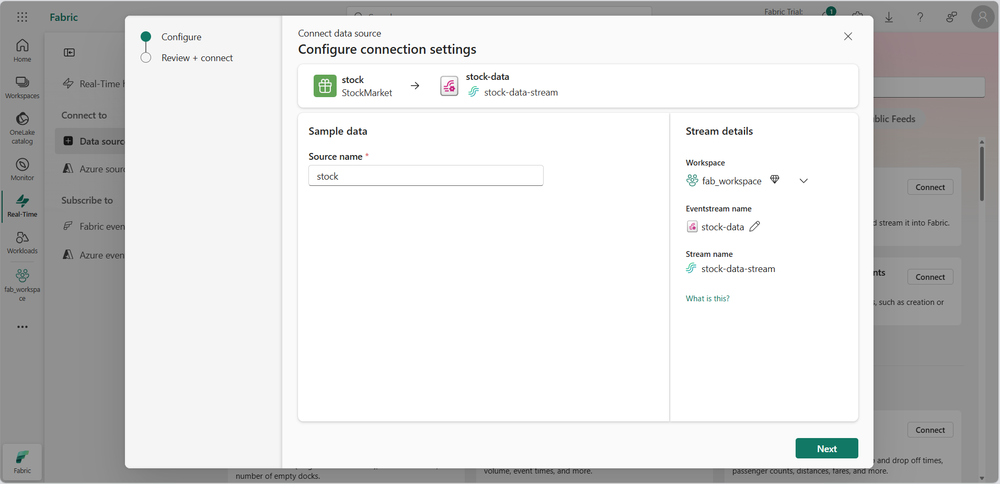

---
lab:
  title: Microsoft Fabric の Eventstream に関する概要
  module: Get started with Eventstream in Microsoft Fabric
---
# リアルタイム インテリジェンスにおける Eventstream の概要

Eventstream とは、コードなしのエクスペリエンスでリアルタイム イベントをキャプチャし、変換し、さまざまな宛先にルーティングする Microsoft Fabric の機能です。 変換が必要な場合は、イベントのデータ ソース、ルーティング先、イベント プロセッサを Eventstream に追加できます。 Microsoft Fabric の EventStore は、クラスターからのイベントを維持し、特定の時点でのクラスターまたはワークロードの状態を理解できるようにする監視オプションです。 EventStore サービスでは、クラスター内のエンティティとエンティティ型のそれぞれで使用できるイベントのクエリを実行できます。 つまり、クラスター、ノード、アプリケーション、サービス、パーティション、パーティション レプリカなど、さまざまなレベルのイベントにクエリを実行できます。 EventStore サービスは、クラスター内のイベントを関連付ける機能も備えています。 EventStore サービスは、相互に影響を与えた可能性がある異なるエンティティから同時に書き込まれたイベントを調べてそれらのイベントをリンクし、クラスター内で発生したアクティビティの原因の識別に役立てることができます。 Microsoft Fabric クラスターの監視と診断を行うもう 1 つのオプションが、EventFlow を使用したイベントの集計と収集です。

このラボの所要時間は約 **30** 分です。

> **注**:この演習を完了するには、[Microsoft Fabric 試用版](https://learn.microsoft.com/fabric/get-started/fabric-trial)が必要です。

## ワークスペースの作成

Fabric でデータを操作する前に、Fabric 試用版を有効にしてワークスペースを作成してください。

1. `https://app.fabric.microsoft.com` で [Microsoft Fabric](https://app.fabric.microsoft.com) にサインインし、 **[Power BI]** を選択してください。
2. 左側のメニュー バーで、 **[ワークスペース]** を選択します (アイコンは &#128455; に似ています)。
3. 任意の名前で新しいワークスペースを作成し、Fabric 容量を含むライセンス モード ("試用版"、*Premium*、または *Fabric*) を選択してください。**
4. 新しいワークスペースを開くと次に示すように空のはずです。

   
5. Power BI ポータルの左下で、**[Power BI]** アイコンを選択し、**リアルタイム インテリジェンス** エクスペリエンスに切り替えます。

## シナリオ

Fabric Eventstream を使用すると、イベント データを 1 か所で簡単に管理できます。 リアルタイム イベント データを収集し、変換し、目的の形式でさまざまな宛先に送信できます。 また、Eventstream を、Azure Event Hubs、KQL データベース、レイクハウスに簡単に接続することもできます。

このラボは、株式市場データと呼ばれるサンプル ストリーミング データに基づいています。 株式市場サンプル データは、時刻、シンボル、価格、数量などの事前設定されたスキーマ列を含む証券取引所のデータセットです。 このサンプル データを使用して、株価のリアルタイム イベントをシミュレートし、KQL データベースなどのさまざまな宛先で分析します。

リアルタイム インテリジェンスのストリーミングおよびクエリ機能を使用して、株価統計に関する主な質問に回答します。 このシナリオでは、KQL データベースなどの一部のコンポーネントを個別に手動で作成する代わりに、ウィザードを最大限に活用します。

このチュートリアルで学習する内容は次のとおりです。

- Eventhouse を作成する
- KQL データベースを作成する
- OneLake へのデータ コピーを有効にする
- Eventstream を作成する
- Eventstream から KQL データベースにデータをストリーミングする
- KQL と SQL を使用してデータを探索する

## リアルタイム インテリジェンス イベントハウスを作成する

1. Microsoft Fabric でリアルタイム インテリジェンス オプションを選択します。
1. メニュー バーからイベントハウスを選択し、イベントハウスに名前を付けます。
    
    

## KQL データベースを作成する

1. **[リアルタイム インテリジェンス イベントハウス]** ダッシュボード内で、**[KQL データベース +]** ボックスを選択します。
1. データベースに名前を付け **[新しいデータベース (既定)]** を選択するか、**[新しいショートカット データベース (フォロワー)]** を作成する選択肢があります。
1. **［作成］** を選択します

     >[!Note]
     > フォロワー データベース機能により、別のクラスターにあるデータベースを Azure Data Explorer クラスターにアタッチできます。 フォロワー データベースは "読み取り専用" モードでアタッチされるため、データを表示したり、リーダー データベースに取り込まれたデータに対してクエリを実行したりできます。 フォロワー データベースには、リーダー データベースの変更が同期されます。 この同期により、データが利用可能になるまでに数秒から数分のデータ遅延が発生します。 遅延の長さは、リーダー データベースのメタデータ全体のサイズに応じて異なります。 リーダー データベースとフォロワー データベースでは、データをフェッチするために同じストレージ アカウントが使用されます。 ストレージを所有するのはリーダー データベースです。 フォロワー データベースでは、データを取り込むことなくデータを表示できます。 アタッチされたデータベースは読み取り専用のデータベースであるため、データベース内のデータ、テーブル、およびポリシーの変更はできませんが、キャッシュ ポリシー、プリンシパル、およびアクセス許可の変更は可能です。

   

4. KQL データベースに**名前を付ける**ダイアログが表示されます

   

5. KQL データベースに **Eventhouse-HR** などの覚えやすい名前を付けて、**[作成]** を押します。

6. **[データベースの詳細]** パネルで、鉛筆アイコンを選択して OneLake で可用性を有効にします。

   

7. ボタンを **[アクティブ]** に切り替えてから、 **[完了]** を選択してください。

   

## Eventstream を作成する

1. メニュー バーで **[リアルタイム インテリジェンス]** を選択します (アイコンはに似ています)
2. **[新規]** で **[Eventstream (プレビュー)]** を選択します

   

3. 使用する Eventstream に**名前を付ける**よう求められます。 Eventstream に覚えやすい名前 (**MyStockES** など) を指定し、**[作成]** ボタンを押します。

   

4. **新しい Eventstream** に**名前を付け**、**[拡張機能 (プレビュー)]** オプションを選択し、**[作成]** ボタンを選択します。

     >[!注:] ワークスペース内での新しいイベント ストリームの作成は、数分で完了します。 確立が完了すると、プライマリ エディターに自動的にリダイレクトされ、ソースをイベント ストリームに統合する準備が整います。

## Eventstream ソースを確立する

1. Eventstream キャンバスで、ドロップダウン リストから **[新しいソース]** を選択し、 **[サンプル データ]** を選択します。

    

2.  **[ソースの追加]** で、ソースに名前を付け、**Bicycles Reflex 互換) を選択します
1.  **追加** ボタンを選択します。

    

1. **[追加]** ボタンを選択すると、ストリームがマップされ、**[Eventstream キャンバス]** に自動的にリダイレクトされます。

   

3. 次の表に示すように、サンプル データの値を入力し、**[追加]** を選択します。
 
 > [!注:] サンプル データ ソースを作成すると、編集モードのキャンバス上で Eventstream にそれが追加されます。 この新しく追加されたサンプル データを実装するには、**[発行]** を選択します。

## イベントの変換または宛先の追加アクティビティを追加する

1. 発行後、**[イベントの変換または宛先の追加]** を選択した後、オプションとして **[KQL データベース]** を選択できます。

   

2. 多くのオプションを提供する新しいサイド パネルが開きます。 KQL データベースに関する必要な詳細を入力します。

   

    - **データ インジェスト モード:** KQL データベースにデータを取り込むには以下の 2 つの方法があります。
        - ***直接インジェスト***: データを変換せずに KQL テーブルに直接取り込みます。
        - ***取り込み前のイベント処理***: データを KQL テーブルに送信する前に、イベント プロセッサを使用して変換します。      
        
        > [!WARNING]
        > **警告:** KQL データベースの宛先が Eventstream に追加されると、インジェスト モードを編集することは**できません**。     

   - **宛先名**: この Eventstream の宛先の名前 (例: "kql-dest") を入力します。
   - **ワークスペース**: KQL データベースが配置されている場所。
   - **KQL データベース**: KQL データベースの名前。
   - **宛先テーブル**: KQL テーブルの名前。 たとえば、"bike-count" などの名前を入力して新しいテーブルを作成することもできます。
   - **入力データ形式:** KQL テーブルのデータ形式として JSON を選択します。

3. **[保存]** を選択します。 
4. **公開**を選択します。

## イベントを変換する

1. **[Eventstream]** キャンバス内で、**[イベントの変換]** を選択します。

    A. **[Group by]** を選択します。

    B. ***[鉛筆]*** アイコンで示されている **[編集]** を選択します。

    C: **[Group by]** 設定セクションのプロパティを入力する

    

2. **[Group by]** 変換イベントを作成したら、**[Eventstream]** から **[Group by]** へと接続を行う必要があります。 これは、**[Eventstream]** の右側にあるドットをクリックし、それを新しい **[Group by]** ボックスの左側にあるドットまでドラッグすることで、コードを使用することなく実行できます。

   

3. 同様に、**[イベント ストリーム]** と ***[kql_dest]*** の間の矢印にマウスオーバーして ***[ゴミ箱]*** を選択することができます

   

    > [!注:] コネクタを追加または削除するたびに、宛先オブジェクトを再構成する必要があります。

## KQL のクエリ

Kusto 照会言語 (KQL) は、データを処理して結果を返すための、読み取り専用の要求です。 要求は、読みやすく、作りやすく、自動化しやすいデータフロー モデルを利用してプレーンテキストで提示されます。 クエリは常に、特定のテーブルまたはデータベースのコンテキストで実行されます。 クエリは少なくとも、ソース データ参照と、シーケンスで適用される 1 つ以上のクエリ演算子で構成され、演算子を区切るパイプ文字 () を使用して視覚的に示されます。 Kusto 照会言語について詳しくは、「[Kusto 照会言語 (KQL) の概要](https://learn.microsoft.com/en-us/azure/data-explorer/kusto/query/?context=%2Ffabric%2Fcontext%2Fcontext)」を参照してください

> **注**: KQL エディターには構文と Inellisense 強調表示の両方が付属しています。これにより、Kusto 照会言語 (KQL) に関する知識をすばやく得ることができます。

1. 以下のように、新しく作成されハイドレートされた KQL データベースを参照します。

    A.  **[kql_dest]** を選択する 

    B. **[関連アイテム]** 行にある **[アイテムを開く]** ハイパーリンクを選択する

   

1. データ ツリーで、***[Bike_sum]*** テーブル上のその他メニュー [...] を選択します。 次に、[クエリ テーブル] > [100 個のレコードを表示する] を選択します。

   

3. サンプル クエリは、テーブル コンテキストが既に設定されている **[データを調査する]** ペインで開きます。 この最初のクエリは、take 演算子を使用してサンプル数のレコードを返します。データ構造と使用可能な値を最初に確認すると便利です。 自動設定されたサンプル クエリは自動的に実行されます。 結果ペインでクエリの結果を確認できます。

   

4. データ ツリーに戻り、summarize 演算子を使用して 15 分間隔で取り込まれたレコードの数をカウントする次のクエリを選択します。

   

> **注**:クエリの制限を超えたという警告が表示される場合があります。 この動作は、データベースにストリーミングされるデータの量によって異なります。

引き続き、組み込みのクエリ関数の使用を試すことで、データを理解することができます。

## Copilot を使用したクエリ

クエリ エディターでは、主要なクエリ Kusto 照会言語 (KQL) に加えて T-SQL の使用がサポートされています。 T-SQL は、KQL を使用できないツールで役立ちます。 詳細については、「[T-SQL を使用してデータのクエリを実行する](https://learn.microsoft.com/en-us/azure/data-explorer/t-sql)」を参照してください

1. データ ツリーに戻り、MyStockData テーブルで**その他メニュー** [...] を選択します。 **[クエリ テーブル] > [SQL] > [100 個のレコードを表示する]** を選択します。

   

2. クエリ内のどこかにカーソルを置き、 **[実行]** を選択するか、**Shift キーを押しながら Enter キー**を押します。

   

引き続き、組み込みの関数の使用を試すことで、SQL または KQL を使用したデータを理解することができます。 

## クエリセットを使用した機能

KQL (Kusto 照会言語) データベースのクエリセットはさまざまな目的で使用されますが、主には KQL データベースのデータに対するクエリの実行、表示、およびクエリ結果のカスタマイズのために使用されます。 これらは Microsoft Fabric のデータ クエリ機能の重要な要素であり、ユーザーが以下を実行することを可能にします。

 - **クエリの実行:** KQL クエリを実行して、KQL データベースからデータを取得します。
 - **結果のカスタマイズ:** クエリ結果を表示および変更して、データの分析と解釈を容易にします。
 - **クエリの保存と共有:** クエリセット内に複数のタブを作成して、後で使用するためにクエリを保存したり、共同作業によるデータ探索のために他の人とクエリを共有したりします。
 - **SQL 関数のサポート:** クエリの作成に KQL を使用する上で、クエリセットは多くの SQL 関数もサポートして、データ クエリの柔軟性を提供します。
 - **Copilot の活用:** クエリを KQL クエリセットとして保存したら、表示を行うことができます

クエリセットを保存するのは簡単であり、いくつかの方法があります。 

1. **KQL データベース**で **[データの探索]** ツールを使用する際に、単に **[KQL クエリセットとして保存]** を選択するだけで済みます

   ![[データの探索] から KQL クエリセットを保存する](./Images/save-as-queryset.png)

2. もう 1 つの方法は、リアルタイム インテリジェンスのランディング ページから行う方法で、ページから **[KQL クエリセット]** ボタンを選択した後、**[クエリセット]** に名前を付けます

   

3. **[クエリセット ランディング ページ]** に移動すると、ツール バーに **[Copilot]** ボタンが表示されます。これを選択して **[Copilot ペイン]** を開き、データに関する質問を行います。

    

4. **[Copilot ペイン]** では、ユーザーが質問を入力するだけで、**Copilot** が KQL クエリを生成し、ユーザーはそのクエリを***コピー***したり、クエリセット ウィンドウに***挿入**したりできます。 

    

5. この時点から、**[ダッシュボードへのピン留め]** または **[Power BI レポートの作成]** ボタンを使用して、個々のクエリを取得したりダッシュボードまたは Power BI レポート内で使用したりする選択肢があります。

## リソースをクリーンアップする

この演習では、KQL データベースを作成し、Eventstream を使用して継続的ストリーミングを設定しました。 その後、KQL と SQL を使用してデータにクエリを実行しました。 KQL データベースの探索が完了したら、この演習用に作成したワークスペースを削除できます。
1. 左側のバーで、ワークスペースのアイコンを選択します。
2. ツール バーの **[...]** メニューで、 **[ワークスペースの設定]** を選択します。
3. **[全般]** セクションで、**[このワークスペースの削除]** を選択します。
.