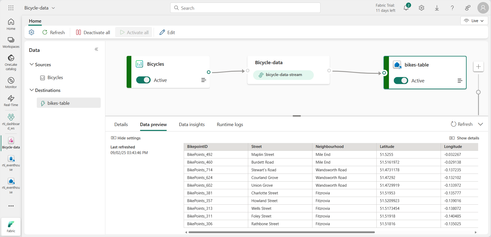
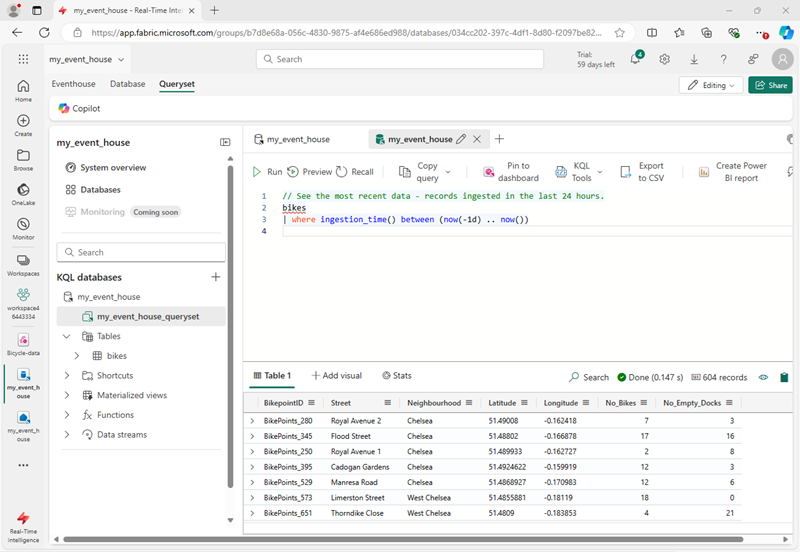

---
lab:
  title: Microsoft Fabric の Eventstream を使用してリアルタイム データを取り込む
  module: Ingest real-time data with Eventstream in Microsoft Fabric
---
# Microsoft Fabric の Eventstream を使用してリアルタイム データを取り込む

Eventstream とは、リアルタイム イベントをキャプチャし、変換し、さまざまな宛先にルーティングする Microsoft Fabric の機能です。 イベント データ ソース、変換先、変換を eventstream に追加できます。

この演習では、市内で自転車をレンタルできるシェアサイクルシステムの自転車回収ポイントの観察に関連する、イベントのストリームを出力するサンプル データ ソースからデータを取り込みます。

このラボの所要時間は約 **30** 分です。

> **注**: この演習を完了するには、[Microsoft Fabric テナント](https://learn.microsoft.com/fabric/get-started/fabric-trial)が必要です。

## ワークスペースの作成

Fabric でデータを操作する前に、Fabric 容量を有効にしてワークスペースを作成する必要があります。

1. ブラウザーで [Microsoft Fabric ホーム ページ](https://app.fabric.microsoft.com/home?experience=fabric) (`https://app.fabric.microsoft.com/home?experience=fabric`) に移動し、Fabric 資格情報でサインインします。
1. 左側のメニュー バーで、 **[ワークスペース]** を選択します (アイコンは &#128455; に似ています)。
1. 任意の名前で新しいワークスペースを作成し、Fabric 容量を含むライセンス モード ("試用版"、*Premium*、または *Fabric*) を選択します。**
1. 開いた新しいワークスペースは空のはずです。

    

## イベントハウスを作成する

ワークスペースが作成されたので、リアルタイム インテリジェンス ソリューションに必要な Fabric 項目の作成を開始できます。 まず、イベントハウスを作成します。

1. 先ほど作成したワークスペースで、**[+ 新しい項目]** を選択します。 *[新しい項目]* ペインで、**[イベントハウス]** を選択し、任意の一意の名前を設定します。
1. 新しい空のイベントハウスが表示されるまで、表示されているヒントまたはプロンプトを閉じます。

    

1. 左側のペインで、イベントハウスに Eventhouse と同じ名前の KQL データベースが含まれていることに注意してください。
1. KQL データベースを選択して表示します。

    現段階では、データベースにテーブルはありません。 この演習の残りの部分では、eventstream を使用して、リアルタイム ソースからテーブルにデータを読み込みます。

## Eventstream を作成する

1. KQL データベースのメイン ページで、 **[データの取得]** を選択します。
2. データ ソースで、**[Eventstream** > **新しい Eventstream]** を選択します。 Eventstream `Bicycle-data` に名前を付けます。

    ワークスペース内での新しいイベント ストリームの作成はすぐに完了します。 確立が完了すると、プライマリ エディターに自動的にリダイレクトされ、ソースをイベント ストリームに統合する準備が整います。

    

## ソースを追加する

1. Eventstream キャンバスで、**[サンプル データの使用]** を選択します。
2. ソース `Bicycles` に名前を付けて、**[Bicycles]** サンプル データを選択します。

    ストリームがマップされ、**Eeventstream キャンバス**に自動的に表示されます。

   

## 宛先の追加

1. **イベントの変換または変換先の追加**タイルを選択し、**Eventhouse** を検索します。
1. **Eventhouse** ペインで、次のセットアップ オプションを構成します。
   - **データ インジェスト モード:** インジェスト前イベント処理
   - **変換先の名前:**`bikes-table`
   - **ワークスペース: ***この演習の開始時に作成したワークスペースを選択します*
   - **Eventhouse**: *イベントハウスを選択します*
   - **KQL データベース: ***KQL データベースを選択します*
   - **変換先テーブル:** `bikes` という名前の新しいテーブルを作成します
   - **入力データ形式:** JSON

   

1. **Eventhouse** ペインで、**[保存]** を選択します。 
1. ツールバーの **[発行]** を選択します。
1. データ変換先がアクティブになるまで 1 分ほど待ちます。 次に、デザイン キャンバスで **bikes-table** ノードを選択し、下の **データのプレビュー** ペインを表示して、取り込まれた最新のデータを表示します。

   

1. 数分待ってから、**[更新]** ボタンを使用して **データのプレビュー** ペインを更新します。 ストリームは永続的に実行されているため、新しいデータがテーブルに追加されている可能性があります。
1. Eventstream デザイン キャンバスの下で、**[データの分析情報]** タブを表示して、キャプチャされたデータ イベントの詳細を表示します。

## キャプチャされたデータに対してクエリを実行する

作成した Eventstream は、bicycle データのサンプル ソースからデータを取得し、Eventhouse 内のデータベースに読み込みます。 データベース内のテーブルに対してクエリを実行すると、キャプチャされたデータを表示できます。

1. 左側のメニュー バーで、KQL データベースを選択します。
1. **データベース** タブの KQL データベースのツール バーで、**[更新]** ボタンを使用して、データベースの下に **bikes** テーブルが表示されるまでビューを更新します。 次に、**bikes** テーブルを選択します。

   

1. **bikes** テーブルの **...** メニューで、過去 24 時間以内に取り込まれた **Query テーブル** > **Records を選択します**。
1. クエリ ペインで、次のクエリが生成されて実行され、結果が下に表示されることに注意してください。

    ```kql
    // See the most recent data - records ingested in the last 24 hours.
    bikes
    | where ingestion_time() between (now(-1d) .. now())
    ```

1. クエリ コードを選んで実行すると、テーブルの 24 時間のデータが表示されます。

    

## イベント データを変換する

キャプチャしたデータはソースから変更されていません。 多くのシナリオでは、イベント ストリーム内のデータを変換先に読み込む前に変換することができます。

1. 左側のメニュー バーで、**Bicycle-data** Eventstream を選択します。
1. ツール バーで **[編集]** を選択して、Eventstream を編集します。
1. **[変換イベント]** メニューで、**[グループ化]** を選択して、Eventstream に新しい**グループ化**ノードを追加します。
1. 接続を **Bicycle-data** ノードの出力から新しい**グループ化**ノードの入力にドラッグし、**グループ化**ノードの*鉛筆*アイコンを使用して編集します。

   

1. **グループ化**設定セクションのプロパティを次のように構成します。
    - **操作名:** GroupByStreet
    - **集計の種類:** Sum を*選択*します
    - **フィールド:** No_Bikes を*選択*します。 *次に、**[追加]** を選択して次の関数を作成します: *SUM_No_Bikes
    - **次で集計をグループ化 (オプション):** Street
    - **時間ウィンドウ**: タンブリング
    - **期間**: 5 秒
    - **オフセット**: 0 秒

    > **注**: この構成により、Eventstream は各道路の自転車の合計数を 5 秒ごとに計算します。
      
1. 構成を保存し、エラーが示されている Eventstream キャンバスに戻ります (変換からの出力をどこかに格納する必要があるため)。

1. **GroupByStreet** ノードの右側にある **+** アイコンを使用して、新しい **Eventhouse** ノードを追加します。
1. 次のオプションを使用して、新しい Eventhouse ノードを構成します。
   - **データ インジェスト モード:** インジェスト前イベント処理
   - **変換先の名前:**`bikes-by-street-table`
   - **ワークスペース: ***この演習の開始時に作成したワークスペースを選択します*
   - **Eventhouse**: *イベントハウスを選択します*
   - **KQL データベース: ***KQL データベースを選択します*
   - **変換先テーブル:** `bikes-by-street` という名前の新しいテーブルを作成します
   - **入力データ形式:** JSON

    

1. **Eventhouse** ペインで、**[保存]** を選択します。 
1. ツールバーの **[発行]** を選択します。
1. 変更がアクティブになるまで 1 分ほど待ちます。
1. デザイン キャンバスで、 **bikes-by-street-table** ノードを選択し、キャンバスの下にある **データのプレビュー** ペインを表示します。

    

    変換されたデータには、指定したグループ化フィールド (**Street**)、指定した集計 (**SUM_no_Bikes**)、イベントが発生した 5 秒のタンブリング ウィンドウの終了を示すタイムスタンプ フィールド (**Window_End_Time**) が含まれていることに注意してください。

## 変換されたデータに対してクエリを実行する

これで、Eventstream によって変換されてテーブルに読み込まれた bicycle のデータに対してクエリを実行できるようになりました

1. 左側のメニュー バーで、KQL データベースを選択します。
1. 1. **データベース** タブの KQL データベースのツール バーで、**[更新]** ボタンを使用して、データベースの下に **bikes-by-street** テーブルが表示されるまでビューを更新します。
1. **bikes-by-street** テーブルの **...** メニューで、**[クエリ データ]** > **[100個のデータを表示する]** を選択します。
1. クエリ ウィンドウで、次のクエリが生成されて実行されることに注意してください。

    ```kql
    ['bikes-by-street']
    | take 100
    ```

1. KQL クエリを変更して、各 5 秒のウィンドウ内のストリートあたりの自転車の合計数を取得します。

    ```kql
    ['bikes-by-street']
    | summarize TotalBikes = sum(tolong(SUM_No_Bikes)) by Window_End_Time, Street
    | sort by Window_End_Time desc , Street asc
    ```

1. 変更したクエリを選択して実行します。

    結果は、各 5 秒間に各ストリートで観察された自転車の数を示しています。

    

<!--
## Add an Activator destination

So far, you've used an eventstream to load data into tables in an eventhouse. You can also direct streams to an activator and automate actions based on values in the event data.

1. In the menu bar on the left, return to the **Bicycle-data** eventstream. Then in the eventstream page, on the toolbar, select **Edit**.
1. In the **Add destination** menu, select **Activator**. Then drag a connection from the output of the **Bicycle-data** stream to the input of the new Activator destination.
1. Configure the new Activator destination with the following settings:
    - **Destination name**: `low-bikes-activator`
    - **Workspace**: *Select your workspace*
    - **Activator**: *Create a **new** activator named `low-bikes`*
    - **Input data format**: Json

    

1. Save the new destination.
1. In the menu bar on the left, select your workspace to see all of the items you have created so far in this exercise - including the new **low-bikes** activator.
1. Select the **low-bikes** activator to view its page, and then on the activator page select **Get data**.
1. On the **select a data source** dialog box, scroll down until you see **Data streams** and then select the **Bicycle-data-stream**.

    

1. Use the **Next**,  **Connect**, and **Finish** buttons to connect the stream to the activator.

    > **Tip**: If the data preview obscures the **Next** button, close the dialog box, select the stream again, and click **Next** before the preview is rendered.

1. When the stream has been connected, the activator page displays the **Events** tab:

    

1. Add a new rule, and configure its definition with the following settings:
    - **Monitor**:
        - **Event**: Bicycle-data-stream-event
    - **Condition**
        - **Condition 1**:
            - **Operation**: Numeric state: Is less than or equal to
            - **Column**: No_Bikes
            - **Value**: 3
            - **Default type**: Same as window size
    - **Action**:
        - **Type**: Email
        - **To**: *The email address for the account you are using in this exercise*
        - **Subject**: `Low bikes`
        - **Headline**: `The number of bikes is low`
        - **Message**: `More bikes are needed.`
        - **Context**: *Select the **Neighborhood**, **Street**, and **No-Bikes** columns.

    

1. Save and start the rule.
1. View the **Analytics** tab for the rule, which should show each instance if the condition being met as the stream of events is ingested by your eventstream.

    Each instance will result in an email being sent notifying you of low bikes, which will result in a large numbers of emails, so...

1. On the toolbar, select **Stop** to stop the rule from being processed.

-->

## リソースをクリーンアップする

この演習では、Eventstream を使用して、イベントハウスを作成し、そのデータベースにテーブルを設定しました。

KQL データベースの探索が完了したら、この演習用に作成したワークスペースを削除できます。

1. 左側のバーで、ワークスペースのアイコンを選択します。
2. ツール バーで、**[ワークスペース設定]** を選択します。
3. **[全般]** セクションで、**[このワークスペースの削除]** を選択します。
から始めます。
