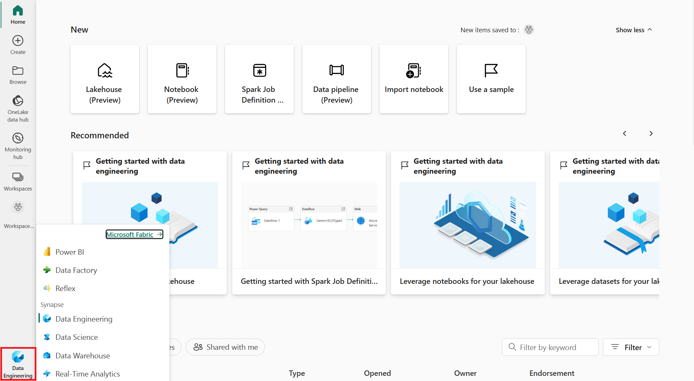
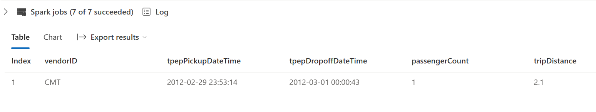

---
lab:
  title: Spark と Microsoft Fabric ノートブックを使用してデータを取り込む
  module: Ingest data with Spark and Microsoft Fabric notebooks
---

# Spark と Microsoft Fabric ノートブックを使用してデータを取り込む

このラボでは、Microsoft Fabric ノートブックを作成し、PySpark を使用して Azure Blob Storage パスに接続し、書き込み最適化を使用してレイクハウスにデータを読み込みます。

このラボは完了するまで、約 **30** 分かかります。

このエクスペリエンスでは、複数のノートブックのコード セル間でコードをビルドします。これは、お使いの環境内での方法とは異なる場合がありますが、デバッグに役立つ可能性があります。

サンプル データセットも使用しているため、最適化の内容が大規模な運用環境に反映されない可能性があります。それでも、改善は確認できます。ミリ秒単位を重要視する場合は、最適化が重要になります。

> **注**: この演習を完了するには、**Microsoft Fabric ライセンス**が必要です。 無料の Fabric 試用版ライセンスを有効にする方法の詳細については、[Fabric の概要](https://learn.microsoft.com/fabric/get-started/fabric-trial)に関するページを参照してください。
>
> これを行うには、Microsoft の "学校" または "職場" アカウントも必要です。** ** お持ちでない場合は、[Microsoft Office 365 の試用版にサインアップ](https://www.microsoft.com/microsoft-365/business/compare-more-office-365-for-business-plans)できます。

## ワークスペースとレイクハウスの宛先を作成する

まず、Fabric の試用版が有効になっているワークスペース、新しいレイクハウス、およびレイクハウス内の宛先フォルダーを作成します。

1. [Microsoft Fabric](https://app.fabric.microsoft.com) (`https://app.fabric.microsoft.com`) にサインインし、**Synapse Data Engineering** エクスペリエンスを選択します。

    

1. 左側のメニュー バーで、 **[ワークスペース]** を選択します。

1. 任意の名前で新しいワークスペースを作成し、Fabric 容量を含むライセンス モード ("試用版"、*Premium*、または *Fabric*) を選択します。**

1. 新しく開くワークスペースは、次に示すように、ワークスペース名の横にダイヤモンドが付いた空の状態になるはずです。

    

1. ワークスペースから **[+ 新規] > [レイクハウス]** を選択し、名前を指定して、 **[作成]** を選択します。

    > :memo: **注:** **テーブル**や**ファイル**がない新しいレイクハウスを作成するには数分かかる場合があります。

    

1. **[ファイル]** から **[...]** を選択して **RawData** という名前の**新しいサブフォルダー**を作成します。

1. レイクハウス内のレイクハウス エクスプローラーから、 **[ファイル] > [...] > [プロパティ]** を選択します。

1. 後で使用するために、 **[RawData]** フォルダーの **ABFS パス**を空のメモ帳にコピーします。これは次のようになります。`abfss://{workspace_name}@onelake.dfs.fabric.microsoft.com/{lakehouse_name}.Lakehouse/Files/{folder_name}/{file_name}`

これで、レイクハウスと [RawData] 宛先フォルダーを含むワークスペースが作成されました。

## Fabric ノートブックを作成して外部データを読み込む

新しい Fabric ノートブックを作成し、PySpark を使用して外部データ ソースに接続します。

1. レイクハウスの上部のメニューから、 **[ノートブックを開く] > [新しいノートブック]** を選択します。これは、作成後に開きます。

    > :bulb: **ヒント:** レイクハウス エクスプローラーにはこのノートブック内からアクセスできます。また、最新の情報に更新すると、この演習を完了するまでの進行状況を確認できます。

1. 既定のセルで、コードが **PySpark (Python)** に設定されていることに注目してください。

1. 次のコードをコード セルに挿入します。次を行います。
    1. 接続文字列のパラメーターを宣言する
    1. 接続文字列をビルドする
    1. DataFrame にデータを読み取る

    ```Python
    # Azure Blob Storage access info
    blob_account_name = "azureopendatastorage"
    blob_container_name = "nyctlc"
    blob_relative_path = "yellow"
    
    # Construct connection path
    wasbs_path = f'wasbs://{blob_container_name}@{blob_account_name}.blob.core.windows.net/{blob_relative_path}'
    print(wasbs_path)
    
    # Read parquet data from Azure Blob Storage path
    blob_df = spark.read.parquet(wasbs_path)
    ```

1. コード セルの横にある **&#9655; [セルの実行]** を選択して、DataFrame に接続してデータを読み取ります。

    **予想される結果:** コマンドは成功し、`wasbs://nyctlc@azureopendatastorage.blob.core.windows.net/yellow` と印刷されます

    > :memo: **注:** Spark セッションは最初のコード実行で開始されるため、完了までに時間がかかる場合があります。

1. ファイルにデータを書き込むには、 **[RawData]** フォルダーの **ABFS パス**が必要になります。

1. **新しいコード セル**に次のコードを挿入します。

    ```python
        # Declare file name    
        file_name = "yellow_taxi"
    
        # Construct destination path
        output_parquet_path = f"**InsertABFSPathHere**/{file_name}"
        print(output_parquet_path)
        
        # Load the first 1000 rows as a Parquet file
        blob_df.limit(1000).write.mode("overwrite").parquet(output_parquet_path)
    ```

1. **output_parquet_path** は次のようになります。`abfss://Spark@onelake.dfs.fabric.microsoft.com/DPDemo.Lakehouse/Files/RawData/yellow_taxi`

1. コード セルの横にある **&#9655; [セルの実行]** を選択して、yellow_taxi.parquet ファイルに 1000 行を書き込みます。

1. レイクハウス エクスプローラーからのデータの読み込みを確認するには、 **[ファイル] > [...] > [最新の情報に更新]** を選択します。

これで、新しいフォルダー **[RawData]** に **yellow_taxi.parquet** "ファイル" が表示されます。- "これは、パーティション ファイルが含まれるフォルダーとして表示されます"。**

## データをデルタ テーブルに変換して読み込む

データ インジェストのタスクは、ファイルの読み込みだけで終わらない可能性があります。 レイクハウス内にデルタ テーブルがあると、スケーラブルで柔軟なクエリとストレージが可能になるため、ここで作成しましょう。

1. 新しいコード セルを作成し、次のコードを挿入します。

    ```python
    from pyspark.sql.functions import col, to_timestamp, current_timestamp, year, month
    
    # Add dataload_datetime column with current timestamp
    filtered_df = raw_df.withColumn("dataload_datetime", current_timestamp())
    
    # Filter columns to exclude any NULL values in storeAndFwdFlag
    filtered_df = filtered_df.filter(raw_df["storeAndFwdFlag"].isNotNull())
    
    # Load the filtered data into a Delta table
    table_name = "yellow_taxi"  # Replace with your desired table name
    filtered_df.write.format("delta").mode("append").saveAsTable(table_name)
    
    # Display results
    display(filtered_df.limit(1))
    ```

1. コード セルの横にある **&#9655; [セルの実行]** を選択します。

    * これにより、データがデルタ テーブルに読み込まれたときにログするタイムスタンプ列 **dataload_datetime** が追加されます
    * **storeAndFwdFlag** で NULL 値をフィルター処理します
    * フィルター処理されたデータをデルタ テーブルに読み込みます
    * 検証のために 1 つの行を表示します

1. 次の図のような、表示された結果をレビューして確認します。

    

これで、外部データへの接続、parquet ファイルへの書き込み、データの DataFrame への読み込み、データの変換、デルタ テーブルへの読み込みが完了しました。

## デルタ テーブルの書き込みを最適化する

組織でビッグ データを使用している可能性があるため、データ インジェスト用に Fabric ノートブックを選択しました。データのインジェストと読み取りを最適化する方法についても説明しましょう。 最初に、書き込み最適化を含めた状態でデルタ テーブルへの変換と書き込みのステップを繰り返します。

1. 新しいコード セルを作成し、次のコードを挿入します。

    ```python
    from pyspark.sql.functions import col, to_timestamp, current_timestamp, year, month
    
    # Read the parquet data from the specified path
    raw_df = spark.read.parquet("**InsertYourABFSPathHere**")
    
    # Add dataload_datetime column with current timestamp
    opt_df = raw_df.withColumn("dataload_datetime", current_timestamp())
    
    # Filter columns to exclude any NULL values in storeAndFwdFlag
    opt_df = opt_df.filter(opt_df["storeAndFwdFlag"].isNotNull())
    
    # Enable V-Order
    spark.conf.set("spark.sql.parquet.vorder.enabled", "true")
    
    # Enable automatic Delta optimized write
    spark.conf.set("spark.microsoft.delta.optimizeWrite.enabled", "true")
    
    # Load the filtered data into a Delta table
    table_name = "yellow_taxi_opt"  # New table name
    opt_df.write.format("delta").mode("append").saveAsTable(table_name)
    
    # Display results
    display(opt_df.limit(1))
    ```

1. **ABFS パス**をもう一度取得し、セルを実行する**前に**、ブロック内のコードを更新します。

1. 最適化コードの前と同じ結果になっていることを確認します。

ここで、両方のコード ブロックの実行時間をメモしておきます。 時間は異なりますが、最適化されたコードを使用すると、パフォーマンスの明確な向上を確認できます。

## SQL クエリを使用してデルタ テーブルのデータを分析する

このラボでは、"抽出、変換、読み込み" プロセスについて実際に説明するデータ インジェストに焦点を当てていますが、データをプレビューすることも重要です。**

1. 新しいコード セルを作成し、下記のコードを挿入します。

    ```python
    # Load table into df
    delta_table_name = "yellow_taxi"
    table_df = spark.read.format("delta").table(delta_table_name)
    
    # Create temp SQL table
    table_df.createOrReplaceTempView("yellow_taxi_temp")
    
    # SQL Query
    table_df = spark.sql('SELECT * FROM yellow_taxi_temp')
    
    # Display 10 results
    display(table_df.limit(10))
    ```

1. 別のコード セルを作成し、次のコードも挿入します。

    ```python
    # Load table into df
    delta_table_name = "yellow_taxi_opt"
    opttable_df = spark.read.format("delta").table(delta_table_name)
    
    # Create temp SQL table
    opttable_df.createOrReplaceTempView("yellow_taxi_opt")
    
    # SQL Query to confirm
    opttable_df = spark.sql('SELECT * FROM yellow_taxi_opt')
    
    # Display results
    display(opttable_df.limit(3))
    ```

1. 次に、上部のメニュー バーで **[すべて実行]** を選択します。

これにより、すべてのコード セルが実行され、完全なプロセスを最初から最後まで確認できます。 最適化されたコード ブロックと非コード ブロックの間の実行時間を確認できます。

## リソースをクリーンアップする

この演習では、以下の作成方法を学習しました。

* Workspaces
* レイクハウス
* Fabric ノートブック
* PySpark コードは次を行います。
  * 外部データ ソースに接続する
  * DataFrame にデータを読み取る
  * DataFrame データを parquet ファイルに書き込む
  * Parquet ファイルからデータを読み取る
  * DataFrame 内のデータを変換する
  * DataFrame データをデルタ テーブルに読み込む
  * デルタ テーブルの書き込みを最適化する
  * SQL を使用してデルタ テーブルのデータにクエリを実行する

探索が完了したら、この演習用に作成したワークスペースを削除できます。

1. 左側のバーで、ワークスペースのアイコンを選択して、それに含まれるすべての項目を表示します。
2. ツール バーの **[...]** メニューで、 **[ワークスペースの設定]** を選択します。
3. **[その他]** セクションで、 **[このワークスペースの削除]** を選択してください。
