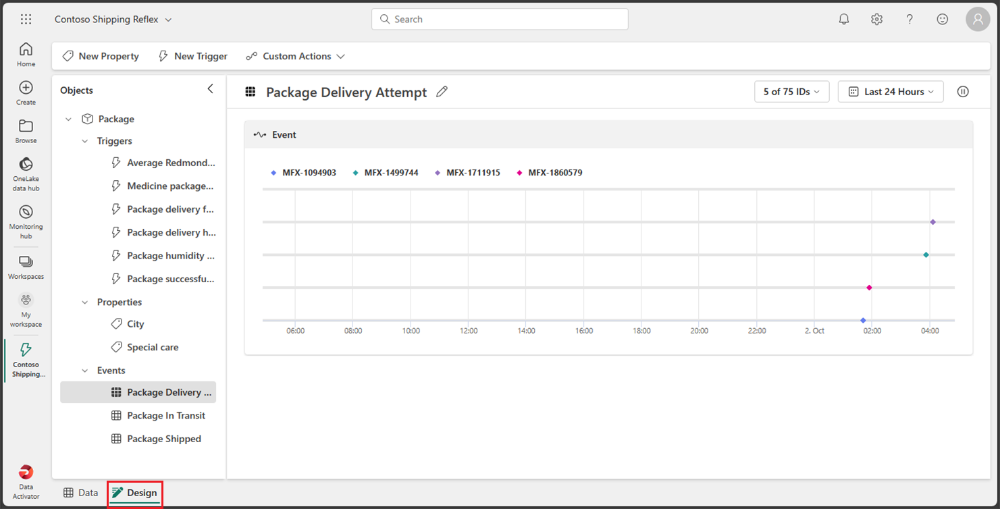
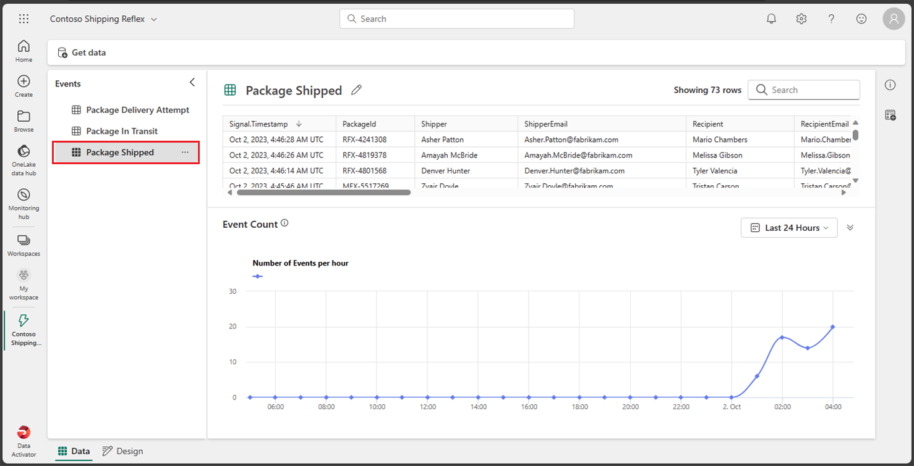
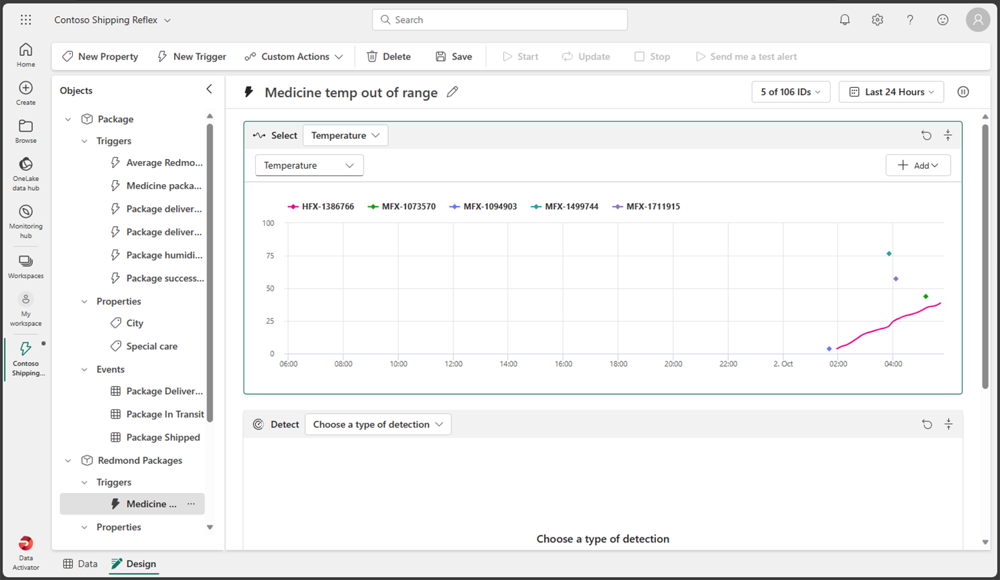
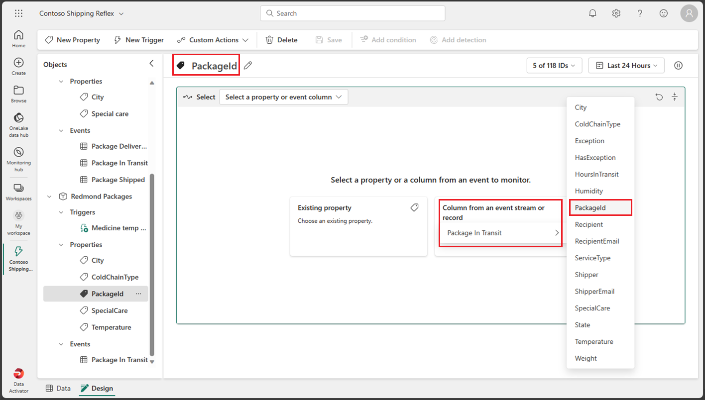

---
lab:
  title: Fabric で Data Activator を使う
  module: Get started with Data Activator in Microsoft Fabric
---

# Fabric で Data Activator を使う

Microsoft Fabric の Data Activator は、データで発生している内容に基づいてアクションを実行します。 Data Activator を使用すると、データを監視し、データの変更に対応するトリガーを作成できます。

このラボの所要時間は約 **30** 分です。

> **注**:この演習を完了するには、[Microsoft Fabric 試用版](https://learn.microsoft.com/fabric/get-started/fabric-trial)が必要です。

## ワークスペースの作成

Fabric でデータを操作する前に、Fabric 試用版を有効にしてワークスペースを作成してください。

1. [Microsoft Fabric ホーム ページ](https://app.fabric.microsoft.com)で、**[Data Activator]** を選択します。
1. 左側のメニュー バーで、 **[ワークスペース]** を選択します (アイコンは &#128455; に似ています)。
1. 任意の名前で新しいワークスペースを作成し、Fabric 容量を含むライセンス モード ("試用版"、*Premium*、または *Fabric*) を選択します。**
1. 開いた新しいワークスペースは空のはずです。

    

このラボでは、Fabric の Data Activator を使用して *Reflex* を作成します。 Data Activator には、Data Activator の機能を探索するために使用できる便利なサンプル データ セットが用意されています。 このサンプル データを使用して、いくつかのリアルタイム データを分析する *Reflex* を作成し、条件が満たされたときにメールを送信するトリガーを作成します。

> **注**: Data Activator のサンプル プロセスにより、バックグラウンドでランダム データが生成されています。 条件とフィルターの複雑さが増すほど、それらのトリガーにかかる時間が長くなります。 グラフにデータが表示されない場合は、数分待ってからページを最新の情報に更新してください。 ラボを続行するために、グラフにデータが表示されるのを待つ必要はありません。

## シナリオ

このシナリオでは、あなたはさまざまな製品を販売および出荷する会社のデータ アナリストです。  あなたは、Redmond 市へのすべての出荷と販売のデータに対して責任を負います。 あなたは、配達中の荷物を監視する Reflex を作成したいと考えています。 出荷する製品のカテゴリの 1 つは、輸送中に特定の温度で冷蔵する必要がある医療処方薬です。 あなたは、処方薬が入った荷物の温度が特定のしきい値より高いまたは低い場合に、出荷部門にメールを送信する Reflex を作成したいと考えています。 理想的な温度は 33 度から 41 度の間です。 Reflex イベントには既に同様のトリガーが含まれているため、Redmond 市に発送される荷物専用のトリガーを作成します。 それでは始めましょう。

## Reflex を作成する

1. 右下のアイコンに Data Activator が反映されていることを確認して、Data Activator のホーム画面にいることを確認します。 **[Reflex (プレビュー)]** ボタンを選択して、新しい Reflex を作成しましょう。

    

1. 実際の運用環境では、独自のデータを使用します。 しかし、このラボでは、Data Activator によって提供されるサンプル データを使用します。 **[サンプル データの使用]** ボタンを選択して、Reflex の作成を完了します。

    

1. 既定では、Data Activator によって *Reflex YYYY-MM-DD hh:mm:ss* という名前の Reflex が作成されます。 ワークスペースには複数の Reflex が存在する可能性があるため、既定の Reflex の名前をよりわかりやすいものに変更する必要があります。 この例では、左上隅にある現在の Reflex 名の横にあるプルダウンを選び、名前を ***Contoso Shipping Reflex*** に変更します。

    

これで Reflex が作成されたので、それへのトリガーとアクションの追加を開始できます。

## Reflex のホーム画面に慣れ親しむ

Reflex のホーム画面は、"デザイン" モードと "データ "モードの 2 つのセクションに分かれています。**** モードを選択するには、画面の左下にあるそれぞれのタブを選択します。  [デザイン] モード タブでは、トリガー、プロパティ、イベントを使用してオブジェクトを定義します。** "データ" モード タブでは、データ ソースを追加し、Reflex が処理するデータを表示できます。** "デザイン" モード タブを見てみましょう。これは Reflex の作成時に既定で開かれているはずです。**

### デザイン モード

現在 "デザイン" モードではない場合は、画面左下の **[デザイン]** タブを選択します。**

"デザイン" モードに慣れるため、画面のさまざまなセクション、トリガー、プロパティ、イベントを選択します。** 各セクションの詳細については、以降のセクションで説明します。

### データ モード

現在 "データ" モードではない場合は、画面左下の **[データ]** タブを選択します。** 実際の例では、EventStreams と Power BI ビジュアルから独自のデータ ソースをここに追加します。 このラボでは、Data Activator によって提供されるサンプル データを使用しています。 このサンプルは、パッケージの配信状態を監視する 3 つの EventStream が既に設定されています。

それぞれのイベントを選択し、ストリームで使用されているデータを確認してください。

次は Reflex にトリガーを追加しますが、まずは新しいオブジェクトを作成しましょう。

##  オブジェクトを作成します

実際のシナリオでは、Data Activator サンプルには *Package* というオブジェクトが既に含まれているため、この Reflex 用に新しいオブジェクトを作成する必要がない場合があります。 しかし、このラボでは、作成方法を示すために新しいオブジェクトを作成します。 *Redmond Packages* という名前の新しいオブジェクトを作成しましょう。

1. 現在 "データ" モードではない場合は、画面左下の **[データ]** タブを選択します。**

1. ***Package In Transit*** (輸送中の荷物) イベントを選択します。 *PackageId*、*Temperature*、*ColdChainType*、*City*、*SpecialCare* の各列の値に細心の注意を払います。 これらの列を使用してトリガーを作成します。

1. 右側に [データの割り当て] ダイアログがまだ開いていない場合は、画面の右側にある **[データの割り当て]** ボタンを選びます。**

    ![Data Activator Reflex データ モードの [データの割り当て] ボタンのスクリーンショット。](./Images/data-activator-data-tab-assign-data-button.png)

1. [データの割り当て] ダイアログで、***[新しいオブジェクトに割り当てる]*** タブを選び、次の値を入力します。**

    - **[オブジェクト名]** : *Redmond Packages*
    - **[キー列の割り当て]** : *PackageId*
    - **プロパティの割り当て**: *City、ColdChainType、SpecialCare、Temperature*

    ![Data Activator Reflex データ モードの [データの割り当て] ダイアログのスクリーンショット。](./Images/data-activator-data-tab-assign-data.png)

1. **[保存]** 、 **[保存してデザイン モードに切り替える]** の順に選択します。

1. これで "デザイン" モードに戻ります。** ***Redmond Packages*** という名前の新しいオブジェクトが追加されています。 この新しいオブジェクトを選択し、その *Events* を展開し、**Package in Transit** イベントを選択します。

    

次はトリガーを作成します。

## トリガーを作成する

トリガーで何を実行するかを確認しましょう。*あなたは、処方薬が入った荷物の温度が特定のしきい値より高いまたは低い場合に、出荷部門にメールを送信する Reflex を作成したいと考えています。理想的な温度は 33 度から 41 度の間です。Reflex イベントには既に同様のトリガーが含まれているため、Redmond 市に発送される荷物専用のトリガーを作成します*。

1. **Redmond Packages** オブジェクトの *Package In Transit* イベント内で、上部メニューの **[新しいトリガー]** ボタンを選択してください。 新しいトリガーは、既定の名前の *Untitled* で作成されます。トリガーをより適切に定義するために、名前を ***Medicine temp out of range*** (薬の温度が範囲外) に変更します。

    ![Data Activator Reflex デザインの [新しいトリガーの作成] のスクリーンショット。](./Images/data-activator-trigger-new.png)

1. 次に Reflex をトリガーするプロパティまたはイベント列を選択します。 オブジェクトの作成時にいくつかのプロパティを作成したため、 **[既存のプロパティ]** ボタンを選び、***Temperature*** プロパティを選択します。 

    ![Data Activator Reflex デザインの [プロパティの選択] のスクリーンショット。](./Images/data-activator-trigger-select-property.png)

    このプロパティを選択すると、過去の温度値のサンプルを含むグラフが返されます。

    

1. 次は、このプロパティからトリガーする条件の種類を決定する必要があります。 この場合、温度が 41 度を超えるか 33 度を下回るときに Reflex をトリガーする必要があります。 数値範囲を探しているので、 **[数値]** ボタンを選択し、 **[終了範囲]** 条件を選択します。

    ![Data Activator Reflex デザインの [条件の種類の選択] のスクリーンショット。](./Images/data-activator-trigger-select-condition-type.png)

1. 次に、条件の値を入力する必要があります。 範囲値として「***33***」と「***41***」を入力します。 "数値範囲の終了条件" を選んでいるため、温度が *33* 度を下回るか *41* 度を超えたときにトリガーを起動する必要があります。**

    ![Data Activator Reflex デザインの [条件値の入力] のスクリーンショット。](./Images/data-activator-trigger-select-condition-define.png)

1. ここまでは、トリガーを起動するプロパティと条件を定義しましたが、必要なすべてのパラメーターが含まれているわけではありません。 *city* が **Redmond** の場合と、*special care* の種類の **Medicine** に対してのみトリガーが起動することを引き続き確認する必要があります。 次は、これらの条件に対していくつかのフィルターを追加してみましょう。  **[フィルターの追加]** ボタンを選択し、プロパティを ***City*** に設定し、リレーションシップを ***[等しい]*** に設定し、値として「***Redmond***」と入力してください。 次に、***SpecialCare*** プロパティを持つ新しいフィルターを追加し、これを ***[等しい]*** に設定し、値として「***Medicine***」と入力してください。

    ![Data Activator Reflex デザインの [フィルターの追加] のスクリーンショット。](./Images/data-activator-trigger-select-condition-add-filter.png)

1. 薬が冷蔵されていることを確認するために、フィルターをもう 1 つ追加しましょう。 **[フィルターの追加]** ボタンを選択し、***ColdChainType*** プロパティを設定し、これを ***[等しい]*** に設定し、値として「***Refrigerated***」と入力してください。

    ![Data Activator Reflex デザインの [フィルターの追加] のスクリーンショット。](./Images/data-activator-trigger-select-condition-add-filter-additional.png)

1. もう少しです。 トリガーの起動時に実行するアクションを定義するだけです。 この場合は、出荷部門にメールを送信します。 **[Email]** ボタンを選択します。

    

1. メール アクションに次の値を入力します。

    - **[送信先]** : 現在のユーザー アカウントが既定で選択されているはずです。このラボではこれで問題ありません。
    - **[件名]** : "Redmond Medical Package が許容温度範囲外です"**
    - **見出し**: "温度が高すぎるか低すぎます"**
    - **[追加情報]** : チェックボックスの一覧から *Temperature* プロパティを選択します。

    ![[データ アクティベーターの定義] アクションのスクリーンショット。](./Images/data-activator-trigger-define-action.png)

1. **[保存]** を選び、上部のメニューから **[開始]** を選択します。

これで、Data Activator でトリガーを作成して開始しました。

## トリガーを更新して停止する

このトリガーの唯一の問題は、トリガーによって温度を含むメールが送信されたが、荷物の *PackageId* が送信されなかったことです。 次に進み、*PackageId* を含めるようにトリガーを更新しましょう。

1. **Redmond Packages** オブジェクトから **Packages in Transit** イベントを選択し、上部のメニューから **[新しいプロパティ]** を選択します。

    

1. *Packages in Transit* イベントから列を選択して、**PackageId** プロパティを追加しましょう。 プロパティ名を *Untitled* から *PackageId* に忘れずに変更してください。

    

1. トリガー アクションを更新しましょう。 **Medical temp out of range** トリガーを選択し、下部の **[実行]** セクションまでスクロールし、 **[追加情報]** を選択して、**PackageId** プロパティを追加します。 **[保存]** ボタンはまだ選択しないでください。

    

1. トリガーを更新したので、トリガーを更新して保存しないのが正しいアクションですが、このラボでは逆の操作を行い、 **[更新]** ボタンの代わりに **[保存]** ボタンを選択して、何が起こるかを確認します。 [更新] ボタンを選択する必要がある理由は、トリガーの [更新] を選択すると、トリガーが保存され、現在実行中のトリガーが新しい条件で更新されるためです。** ** [保存] ボタンを選んだだけの場合、トリガーの更新を選ぶまで、現在実行中のトリガーで新しい条件が適用されることはありません。** 次に進み、 **[保存]** ボタンを選択します。

1. [更新] の代わりに [保存] を選択したため、画面の上部に "プロパティの更新が利用可能です。トリガーに最新の変更が適用されるように、今すぐ更新してください。" というメッセージが表示されていることがわかります。** ** ** そのメッセージにはさらに [更新] ボタンも含まれています。** 次に進み、 **[保存]** ボタンを選択します。

    

1. 上部のメニューから **[停止]** ボタンを選択して、トリガーを停止してください。

## リソースをクリーンアップする

この演習では、Data Activator でトリガー付きの Reflex を作成しました。 これで、Data Activator インターフェイスと、Reflex とそのオブジェクト、トリガー、プロパティの作成方法について理解できたはずです。

Data Activator Reflex の詳細の確認が完了したら、この演習用に作成したワークスペースを削除して構いません。

1. 左側のバーで、ワークスペースのアイコンを選択して、それに含まれるすべての項目を表示します。
2. ツール バーの **[...]** メニューで、 **[ワークスペースの設定]** を選択してください。
3. **[その他]** セクションで、 **[このワークスペースの削除]** を選択してください。
