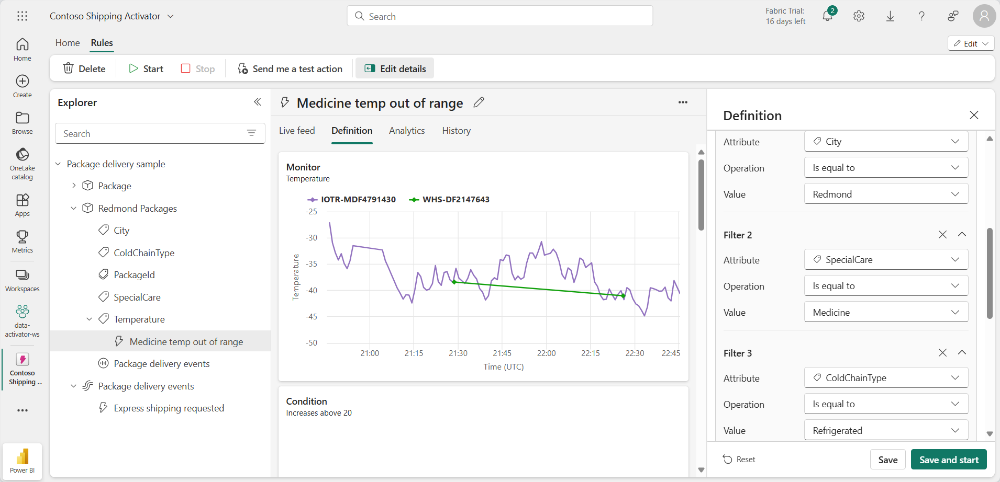

# Fabric で Data Activator を使う

Microsoft Fabric の Data Activator は、データで発生している内容に基づいてアクションを実行します。 Activator を使用すると、データを監視し、データの変更に対応するトリガーを作成できます。

このラボの所要時間は約 **30** 分です。

> **注**:この演習を完了するには、[Microsoft Fabric 試用版](https://learn.microsoft.com/fabric/get-started/fabric-trial)が必要です。

## シナリオ

このシナリオでは、あなたはさまざまな製品を販売および出荷する会社のデータ アナリストです。  あなたは、Redmond 市へのすべての出荷と販売のデータの責任者です。 あなたは、配達中の荷物を監視するアラート ルールを作成したいと考えています。 出荷する製品のカテゴリの 1 つは、輸送中に特定の温度で冷蔵する必要がある医療処方薬です。 あなたは、処方薬が入った荷物の温度が特定のしきい値より高いまたは低い場合に、出荷部門にメールを送信するアラートを作成したいと考えています。 理想的な温度は 33 度から 41 度の間です。 Activator イベントには既に同様のトリガーが含まれているため、Redmond 市に発送される荷物専用のトリガーを作成します。 それでは始めましょう。

## ワークスペースの作成

Fabric でデータを操作する前に、Fabric 試用版を有効にしてワークスペースを作成してください。

1. ブラウザーの `https://app.fabric.microsoft.com/home?experience=fabric-developer` で [Microsoft Fabric ホーム ページ](https://app.fabric.microsoft.com/home?experience=fabric-developer)に移動し、Fabric 資格情報でサインインします。
1. 左側のメニュー バーで、 **[ワークスペース]** を選択します (アイコンは &#128455; に似ています)。
1. 任意の名前で新しいワークスペースを作成し、Fabric 容量を含むライセンス モード ("試用版"、*Premium*、または *Fabric*) を選択します。**
1. 開いた新しいワークスペースは空のはずです。

    

このラボでは、Fabric の Activator を使用して、データの変更に基づいてトリガーを作成します。 Fabric の Activator には、Activator の機能を探索するために使用できる便利なサンプル データ セットが用意されています。 このサンプル データを使用して、いくつかのリアルタイム データ ストリーミングを分析し、条件が満たされたときにメールを送信するトリガーを作成します。

> **注**:Activator のサンプル プロセスにより、バックグラウンドでランダム データが生成されます。 条件とフィルターの複雑さが増すほど、それらのトリガーにかかる時間が長くなります。 グラフにデータが表示されない場合は、数分待ってからページを最新の情報に更新してください。 ラボを続行するために、グラフにデータが表示されるのを待つ必要はありません。

## Activator を作成する

次に、作成したワークスペースに Activator を作成します。

1. 左側のメニュー バーで、**[作成]** を選択します。 *[新規]* ページの *[Real-Time Intelligence]* セクションで、**[Activator]** を選択します。

    >**注**: **[作成]** オプションがサイド バーにピン留めされていない場合は、最初に省略記号 (**...**) オプションを選択する必要があります。

    1 分ほどで、新しい Activator が作成されます。

    

    実際の運用環境では、独自のデータを使用します。 しかし、このラボでは、Activator によって提供されるサンプル データを使用します。 

1. **[サンプルを試す]** タイルを選択して、Activator にサンプル データを設定します。

    既定では、Activator は *Activator YYYY-MM-DD hh:mm:ss* という名前で作成されます。 ワークスペースには複数の Activator が存在する可能性があるため、既定の名前をよりわかりやすいものに変更する必要があります。

1. この例では、左上隅にある現在の Activator 名の横にあるプルダウンを選び、名前を ***Contoso Shipping Activator*** に変更します。

    

これで Activator プロジェクトが作成され、そのオブジェクト、プロパティ、ルール間の移動を開始できます。

## Activator のホーム画面に慣れる

このサンプルが構築されている Eventstream データを調べてみましょう。

1. **エクスプローラー** ペインで、下にスクロールし、**[パッケージ配信イベント]** ストリームを選択します。

    これらのイベントは、配達中の荷物のリアルタイムの状態を示します。

    ![[イベントの詳細] ライブ テーブルのスクリーンショット。](./Images/activator-event-details.png)

1. **[イベントの詳細]** ライブ テーブルのデータを確認します。 各データ ポイントには、受信イベントに関する情報が含まれています。 すべて表示するには、スクロールしなければならない場合があります。

    **[エクスプローラー]** ペインに、Eventstream のデータを使用するオブジェクトが表示されます。 これらのオブジェクトには、ルールの作成に使用できるプロパティがあります。 この例では、**Package** は、**[パッケージ配信イベント]** Eventstream から作成されたオブジェクトです。

1. **[エクスプローラー]** ペインの **[温度]** プロパティで、**[薬品には高温すぎる]** ルールを選択します。
1. **[定義]** ウィンドウで、ルールの動作を確認します。 **[監視]** セクションでは、監視対象の属性として **[温度]** プロパティが選択されています。 温度の値は、先ほど Eventstream で確認した **[イベントの詳細]** テーブルの温度の列から取得されます。 

     

1. **[条件]** セクションには、20°C を超える温度を監視するルールの条件が表示されています。
1. **[プロパティ フィルター]** セクションには、薬品を含むパッケージにのみルールが適用されるようにカスタマイズされたフィルターが表示されています。 Eventstream テーブルでは、ルールは **SpecialCare** という列を参照しますが、ここではプロパティ*特別なケアの内容*として表されています。 *特別なケアの内容* プロパティでは、一部のパッケージの値は "薬品" です。
1. 最後に、**[アクション]** セクションがあります。 このルールは、条件が満たされた場合に Teams メッセージを送信するように設定されています。 代わりに、メールを送信するように設定することもできます。
1. 目的のアクションの種類を選択し、自分が受信者であることを確認してから、**[テスト アクションを送信する]** を選択します。 **[メッセージ]** フィールドに、アクティブ化の時刻やパッケージ ID など、トリガーに関する詳細を含むメッセージ セットが表示されます。

##  オブジェクトを作成します

実際のシナリオでは、Activator サンプルに *Package* というオブジェクトが既に含まれているため、この Eventstream 用に新しいオブジェクトを作成する必要がない場合があります。 しかし、このラボでは、作成方法を示すために新しいオブジェクトを作成します。 *Redmond Packages* という名前の新しいオブジェクトを作成しましょう。

1. **[パッケージ配信イベント]** Eventstream を選択し、リボンの **[新規オブジェクト]** を選択します。

1. 右側の **[オブジェクトのビルド]** ペインで、次の値を入力します。
    - **オブジェクト名**: `Redmond Packages`
    - **一意識別子**:**PackageId**
    - **[プロパティ]**:**都市**、**ColdChainType**、**SpecialCare**、**温度**

1. **［作成］** を選択します

    ![Activator の [オブジェクトのビルド] ペインのスクリーンショット。](./Images/activator-build-object.png)

**[エクスプローラー]** ペインに、**Redmond Packages** という名前の新しいオブジェクトが追加されました。 次はルールを作成します。

## 規則を作成する

ルールで実行する内容を確認しましょう。*あなたは、処方薬が入った荷物の温度が特定のしきい値より高いまたは低い場合に、出荷部門にメールを送信するアラート ルールを作成したいと考えています。理想的な温度は 20 度以下である必要があります。Package オブジェクトには既に同様のルールが含まれているので、Redmond に出荷されるパッケージ専用のルールを作成します*。

1. *Redmond Packages* オブジェクト内の**温度**プロパティを選択し、リボンの **[新規ルール]** ボタンを選択します (まだ選択されていない場合)。
1. **[ルールを作成する]** ウィンドウに、次の値を入力します。
    - **条件**:より上に上昇
    - **値**: `20`
    - **発生頻度**:条件が満たされるたび
    - **アクション**: メールを送信する

1. **［作成］** を選択します
1. *温度アラート*という既定の名前で新しいルールが作成されます。 中央のウィンドウでルールの名前の横にある鉛筆アイコンを選択して、名前を「***範囲外の温度の薬品***」に変更します。

    

    ここまでは、ルールを起動するプロパティと条件を定義しましたが、必要なすべてのパラメーターが含まれているわけではありません。 *city* が **Redmond** の場合と、*special care* の種類の **Medicine** に対してのみトリガーが起動することを引き続き確認する必要があります。 次は、これらの条件に対していくつかのフィルターを追加してみましょう。  

1. **[定義]** ペインで、**[プロパティ フィルター]** セクションを展開します。
1. **[フィルター 1]** ボックスで、属性を **[市区町村]** に設定し、操作を **[次の値に等しい]** に、値は **[Redmond]** を選択します。
1. **[フィルター]** を選択し、次に **SpecialCare** 属性を持つ新しいフィルターを追加し、これを **[次の値に等しい]** に設定し、値には「**薬品**」と入力してください。
1. 薬が冷蔵されていることを確認するために、フィルターをもう 1 つ追加しましょう。 **[フィルターの追加]** ボタンを選択し、***ColdChainType*** 属性を設定し、これを **[次の値に等しい]** に設定し、値として「**冷蔵**」と入力してください。

    

    もう少しです。 トリガーの起動時に実行するアクションを定義するだけです。 この場合は、出荷部門にメールを送信します。

1. **[アクション]** セクションで、次の値を入力します。
    - **種類**: 電子メール
    - **送信先**: 現在のユーザー アカウントが既定で選択されているはずです。このラボではこれで問題ありません。
    - **[件名]** : "Redmond Medical Package が許容温度範囲外です"**
    - **見出し**:*温度が高すぎる*
    - **コンテキスト**:チェック ボックスの一覧から*温度*プロパティを選択します。

    ![[データ アクティベーターの定義] アクションのスクリーンショット。](./Images/activator-define-action.png)

1. **[保存して開始]** を選択します。

    これで、Activator でルールを作成して開始できました。 このルールは、1 時間ごとに数回トリガーされるはずです。

1. ルールが動作することを確認したら、リボンの **[停止]** ボタンを使用してオフにすることができます。

## リソースをクリーンアップする

この演習では、アラート ルールを使用して Activator を作成しました。 これで、Activator インターフェイスと、オブジェクト、プロパティ、およびルールを作成する方法に学習しました。

Activator の探索が完了したら、この演習用に作成したワークスペースを削除できます。

1. 左側のナビゲーション バーで、ワークスペースのアイコンを選択して、それに含まれるすべての項目を表示します。
2. 上部のツール バーのメニューで、**[ワークスペース設定]** を選択します。
3. **[全般]** セクションで、**[このワークスペースの削除]** を選択します。
