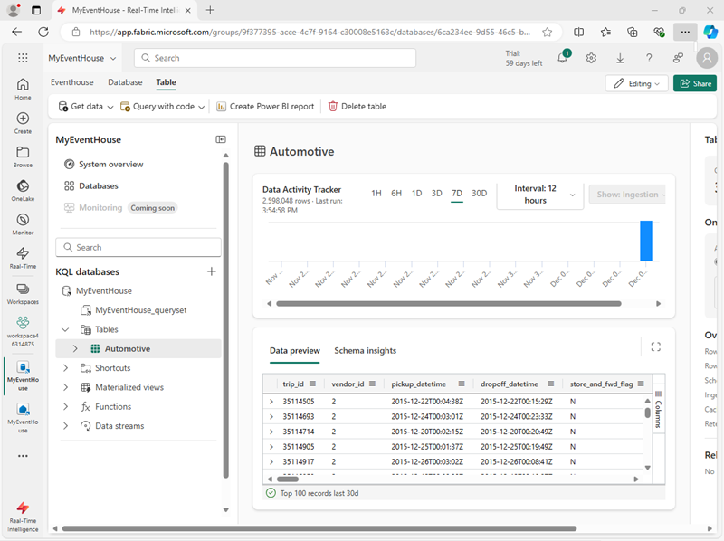

---
lab:
  title: Microsoft Fabric イベントハウスでリアルタイム データを操作する
  module: Work with data in a Microsoft Fabric eventhouse
---

# Microsoft Fabric イベントハウスでリアルタイム データを操作する

Microsoft Fabric では、*eventhouse* は、イベントに関連するリアルタイム データを格納するために使用されます。多くの場合、*eventstream* によってストリーミング データ ソースからキャプチャされます。

イベントハウス内では、データは 1 つ以上の KQL データベースに格納されます。各データベースには、Kusto 照会言語 (KQL) または 構造化照会言語 (SQL) のサブセットを使用してクエリを実行できるテーブルとその他のオブジェクトが含まれています。

この演習では、タクシー乗車に関連するサンプル データをイベントハウスに作成して設定し、KQL と SQL を使用してデータのクエリを実行します。

この演習の所要時間は約 **25** 分です。

## ワークスペースの作成

Fabric でデータを操作する前に、Fabric 容量を有効にしてワークスペースを作成してください。

1. `https://app.fabric.microsoft.com/home?experience=fabric` の [Microsoft Fabric ホーム ページ](https://app.fabric.microsoft.com/home?experience=fabric)で、**[リアルタイム インテリジェンス]** を選択します。
1. 左側のメニュー バーで、 **[ワークスペース]** を選択します (アイコンは &#128455; に似ています)。
1. 任意の名前で新しいワークスペースを作成し、Fabric 容量を含むライセンス モード ("試用版"、*Premium*、または *Fabric*) を選択します。**
1. 開いた新しいワークスペースは空のはずです。

    

## Eventhouse を作成する

Fabric 容量をサポートするワークスペースが作成されたので、その中にイベントハウスを作成できます。

1. **リアルタイム インテリジェンス**のホーム ページで、任意の名前で新しい**イベントハウス**を作成します。 イベントハウスが作成されたら、イベントハウス ページが表示されるまで、表示されているプロンプトまたはヒントを閉じます。

   

1. 左側のペインで、イベントハウスに Eventhouse と同じ名前の KQL データベースが含まれていることに注意してください。
1. KQL データベースを選択して表示します。

    現段階では、データベースにテーブルはありません。 この演習の残りの部分では、eventstream を使用して、リアルタイム ソースからテーブルにデータを読み込みます。
   
1. KQL データベースのページで、**[データの取得]**、**[サンプル]** を選択します。 次に、**[自動車の動作分析]** サンプル データを選択します。

1. データの読み込みが完了したら、**[自動車]** テーブルが作成されていることを確認します。

   

## KQL を使用してデータのクエリを実行する

Kusto 照会言語 (KQL) は、KQL データベースのクエリに使用できる直感的で包括的な言語です。

### KQL を使用してテーブルからデータを取得する

1. イベントハウス ウィンドウの左側のウィンドウで、KQL データベースの下にある既定の**クエリセット** ファイルを選択します。 このファイルには、開始するためのサンプル KQL クエリがいくつか含まれています。
1. 最初のクエリ例を次のように変更します。

    ```kql
    Automotive
    | take 100
    ```

    > **注:** KQL では、パイプ文字 ( | ) は 2 つの目的で使われます。1 つは、表形式の式ステートメントでクエリ演算子を区切るためです。 また、パイプ文字で区切られた項目の 1 つを指定できることを示すために、角かっこまたは丸かっこ内の論理 OR 演算子としても使用されます。

1. クエリ コードを選択して実行し、テーブルから 100 行を返します。

   

    `project` キーワードを使用して、クエリを実行する特定の属性を追加してから、`take` キーワードを使用して、返すレコード件数をエンジンに指示すると、精度を高めることができます。

1. 次のクエリを入力し、選択し、実行します。

    ```kql
    // Use 'project' and 'take' to view a sample number of records in the table and check the data.
    Automotive 
    | project vendor_id, trip_distance
    | take 10
    ```

    > **注:** // の使用はコメントを表します。

    分析で一般的に使われるもう 1 つの方法は、クエリセット内の列の名前をよりわかりやすい名前に変更することです。

1. 次のクエリを実行します。

    ```kql
    Automotive 
    | project vendor_id, ["Trip Distance"] = trip_distance
    | take 10
    ```

### KQL を使用してデータを要約する

*要約*キーワードを関数と共に使用して、データを集計したり、それ以外の操作を行うことができます。

1. **SUM** 関数を使用して走行データを集計し、合計走行マイル数を確認する次のクエリを試してみましょう。

    ```kql

    Automotive
    | summarize ["Total Trip Distance"] = sum(trip_distance)
    ```

    集計データは、指定した列または式でグループ化できます。

1. 次のクエリを実行して、NY タクシー システム内の地区ごとの走行距離をグループ化し、各地区からの走行距離の合計を決定します。

    ```kql
    Automotive
    | summarize ["Total Trip Distance"] = sum(trip_distance) by pickup_boroname
    | project Borough = pickup_boroname, ["Total Trip Distance"]
    ```

    結果には空白の値が含まれますが、分析には適しません。

1. *CASE* 関数と共に *ISEMPTY* および *ISNULL* 関数を使用して、フォローアップのために、地区が不明なすべての走行を***未確認***カテゴリにグループ化するように、次に示すようにクエリを変更します。

    ```kql
    Automotive
    | summarize ["Total Trip Distance"] = sum(trip_distance) by pickup_boroname
    | project Borough = case(isempty(pickup_boroname) or isnull(pickup_boroname), "Unidentified", pickup_boroname), ["Total Trip Distance"]
    ```

### KQL を使用してデータを並べ替える

データの意味をよりわかりやすくするために、通常はデータを列で並べ替えます。KQL では、このプロセスは *sort by* 演算子または *order by* 演算子を使用して行われますが、どちらも同じように動作します。

1. 次のクエリを実行します。

    ```kql
    Automotive
    | summarize ["Total Trip Distance"] = sum(trip_distance) by pickup_boroname
    | project Borough = case(isempty(pickup_boroname) or isnull(pickup_boroname), "Unidentified", pickup_boroname), ["Total Trip Distance"]
    | sort by Borough asc
    ```

1. 次のようにクエリを変更し、もう一度実行します。*order by* 演算子は *sort by* と同じように動作します。

    ```kql
    Automotive
    | summarize ["Total Trip Distance"] = sum(trip_distance) by pickup_boroname
    | project Borough = case(isempty(pickup_boroname) or isnull(pickup_boroname), "Unidentified", pickup_boroname), ["Total Trip Distance"]
    | order by Borough asc 
    ```

### KQL を使用してデータをフィルター処理する

KQL では、*where* 句を使用してデータをフィルター処理します。 *and* および *or* 論理演算子を使用して、*where* 句の条件を組み合わせることができます。

1. 次のクエリを実行して、マンハッタンからの走行のみを含むように走行データをフィルター処理します。

    ```kql
    Automotive
    | where pickup_boroname == "Manhattan"
    | summarize ["Total Trip Distance"] = sum(trip_distance) by pickup_boroname
    | project Borough = case(isempty(pickup_boroname) or isnull(pickup_boroname), "Unidentified", pickup_boroname), ["Total Trip Distance"]
    | sort by Borough asc
    ```

## Transact-SQL を使用してデータのクエリを実行する

KQL データベースでは、Transact-SQL はネイティブにサポートされませんが、Microsoft SQL Server をエミュレートし、データに対して T-SQL クエリを実行できるようにする T-SQL エンドポイントが提供されます。 T-SQL エンドポイントには、いくつかの制限と、ネイティブの SQL Server との違いがあります。 たとえば、T-SQL エンドポイントでは、テーブルの作成、変更、または削除や、データの挿入、更新、または削除はサポートされません。 また、KQL と互換性のない一部の T-SQL 関数と構文もサポートされません。 T-SQL エンドポイントは、KQL をサポートしていないシステムで、T-SQL を使用して KQL データベース内のデータに対してクエリを実行できるようにするために作成されました。 したがって、KQL の方が T-SQL よりも多くの機能を提供し、高いパフォーマンスを発揮するため、KQL データベースのプライマリ クエリとして KQL を使用することをお勧めします。 また、count、sum、avg、min、max など、一部の SQL 関数は KQL でもサポートされており、これらを使用することもできます。

### Transact-SQL を使用してテーブルからデータを取得する

1. クエリセットで、次の Transact-SQL クエリを追加して実行します。 

    ```sql
    SELECT TOP 100 * from Automotive
    ```

1. 特定の列を取得するようにクエリを次のように変更する

    ```sql
    SELECT TOP 10 vendor_id, trip_distance
    FROM Automotive
    ```

1. クエリを変更し、**trip_distance** をよりわかりやすい名前に変更した別名を割り当てます。

    ```sql
    SELECT TOP 10 vendor_id, trip_distance as [Trip Distance]
    from Automotive
    ```

### Transact-SQL を使用してデータを要約する

1. 次のクエリを実行して、合計走行距離を調べます。

    ```sql
    SELECT sum(trip_distance) AS [Total Trip Distance]
    FROM Automotive
    ```

1. 乗車区別に合計距離をグループ化するようにクエリを変更します。

    ```sql
    SELECT pickup_boroname AS Borough, Sum(trip_distance) AS [Total Trip Distance]
    FROM Automotive
    GROUP BY pickup_boroname
    ```

1. クエリをさらに変更し、*CASE* ステートメントを使用して、フォローアップのために、乗車地不明の走行を***未確認***カテゴリにグループ化します。 

    ```sql
    SELECT CASE
             WHEN pickup_boroname IS NULL OR pickup_boroname = '' THEN 'Unidentified'
             ELSE pickup_boroname
           END AS Borough,
           SUM(trip_distance) AS [Total Trip Distance]
    FROM Automotive
    GROUP BY CASE
               WHEN pickup_boroname IS NULL OR pickup_boroname = '' THEN 'Unidentified'
               ELSE pickup_boroname
             END;
    ```

### Transact-SQL を使用してデータを並べ替える

1. 次のクエリを実行して、グループ化された結果を地区別に並べ替える
 
    ```sql
    SELECT CASE
             WHEN pickup_boroname IS NULL OR pickup_boroname = '' THEN 'unidentified'
             ELSE pickup_boroname
           END AS Borough,
           SUM(trip_distance) AS [Total Trip Distance]
    FROM Automotive
    GROUP BY CASE
               WHEN pickup_boroname IS NULL OR pickup_boroname = '' THEN 'unidentified'
               ELSE pickup_boroname
             END
    ORDER BY Borough ASC;
    ```

### Transact-SQL を使用してデータをフィルター処理する
    
1. 次のクエリを実行して、グループ化されたデータをフィルター処理して、結果にマンハッタン地区を持つ行のみが含まれるようにする

    ```sql
    SELECT CASE
             WHEN pickup_boroname IS NULL OR pickup_boroname = '' THEN 'unidentified'
             ELSE pickup_boroname
           END AS Borough,
           SUM(trip_distance) AS [Total Trip Distance]
    FROM Automotive
    GROUP BY CASE
               WHEN pickup_boroname IS NULL OR pickup_boroname = '' THEN 'unidentified'
               ELSE pickup_boroname
             END
    HAVING Borough = 'Manhattan'
    ORDER BY Borough ASC;
    ```

## リソースをクリーンアップする

この演習では、KQL と SQL を使用してイベントハウスを作成し、データのクエリを実行しました。

KQL データベースの探索が完了したら、この演習用に作成したワークスペースを削除できます。

1. 左側のバーで、ワークスペースのアイコンを選択します。
2. ツール バーで、**[ワークスペース設定]** を選択します。
3. **[全般]** セクションで、**[このワークスペースの削除]** を選択します。
