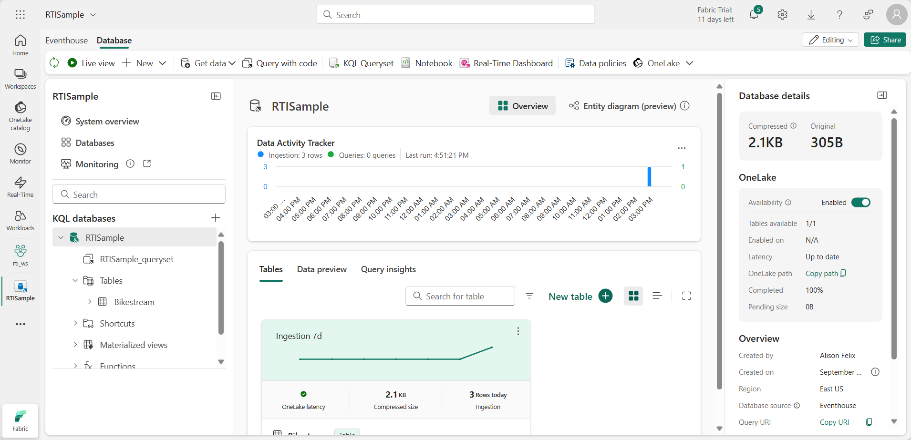
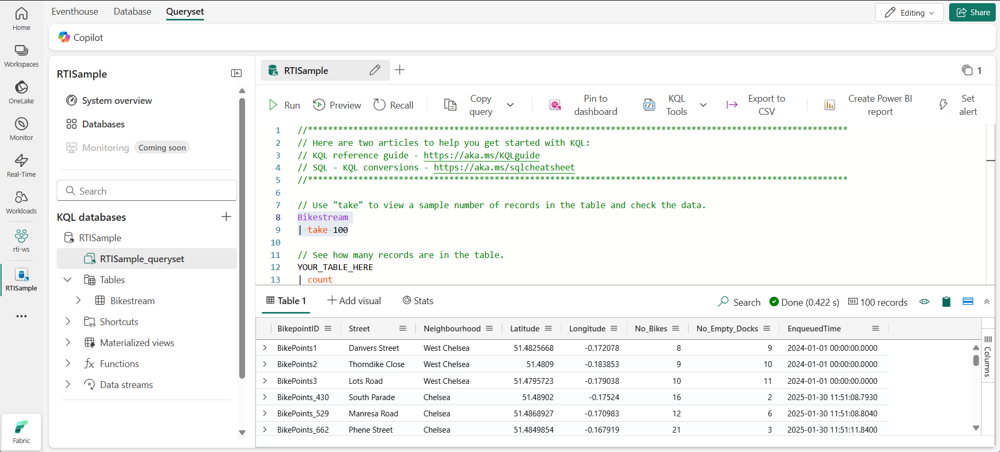

---
lab:
  title: Microsoft Fabric イベントハウスでリアルタイム データを操作する
  module: Work with data in a Microsoft Fabric eventhouse
---

# Microsoft Fabric イベントハウスでリアルタイム データを操作する

Microsoft Fabric では、*eventhouse* は、イベントに関連するリアルタイム データを格納するために使用されます。多くの場合、*eventstream* によってストリーミング データ ソースからキャプチャされます。

イベントハウス内では、データは 1 つ以上の KQL データベースに格納されます。各データベースには、Kusto 照会言語 (KQL) または 構造化照会言語 (SQL) のサブセットを使用してクエリを実行できるテーブルとその他のオブジェクトが含まれています。

この演習では、タクシー乗車に関連するサンプル データをイベントハウスに作成して設定し、KQL と SQL を使用してデータのクエリを実行します。

この演習の所要時間は約 **25** 分です。

## ワークスペースの作成

Fabric でデータを操作する前に、Fabric 容量を有効にしてワークスペースを作成してください。

1. ブラウザーで [Microsoft Fabric ホーム ページ](https://app.fabric.microsoft.com/home?experience=fabric) (`https://app.fabric.microsoft.com/home?experience=fabric`) に移動し、Fabric 資格情報でサインインします。
1. 左側のメニュー バーで、 **[ワークスペース]** を選択します (アイコンは &#128455; に似ています)。
1. 任意の名前で新しいワークスペースを作成し、Fabric 容量を含むライセンス モード ("試用版"、*Premium*、または *Fabric*) を選択します。**
1. 開いた新しいワークスペースは空のはずです。

    

## Eventhouse を作成する

Fabric 容量をサポートするワークスペースが作成されたので、その中にイベントハウスを作成できます。

1. 左側のメニュー バーで **[ワークロード]** を選択します。 次に、**[Real-Time Intelligence]** タイルを選択します。
1. **Real-Time Intelligence** ホーム ページで、**[Real-Time Intelligence のサンプルを探索する]** タイルを選択します。 **RTISample** というイベントハウスが自動的に作成されます。

   

1. 左側のペインで、イベントハウスに Eventhouse と同じ名前の KQL データベースが含まれていることに注意してください。
1. **Bikestream** テーブルも作成されていることを確認します。

## KQL を使用してデータのクエリを実行する

Kusto 照会言語 (KQL) は、KQL データベースのクエリに使用できる直感的で包括的な言語です。

### KQL を使用してテーブルからデータを取得する

1. イベントハウス ウィンドウの左側のウィンドウで、KQL データベースの下にある既定の**クエリセット** ファイルを選択します。 このファイルには、開始するためのサンプル KQL クエリがいくつか含まれています。
1. 最初のクエリ例を次のように変更します。

    ```kql
    Bikestream
    | take 100
    ```

    > **注:** KQL では、パイプ文字 ( | ) は 2 つの目的で使われます。1 つは、表形式の式ステートメントでクエリ演算子を区切るためです。 また、パイプ文字で区切られた項目の 1 つを指定できることを示すために、角かっこまたは丸かっこ内の論理 OR 演算子としても使用されます。

1. クエリ コードを選択して実行し、テーブルから 100 行を返します。

   

    `project` キーワードを使用して、クエリを実行する特定の属性を追加してから、`take` キーワードを使用して、返すレコード件数をエンジンに指示すると、精度を高めることができます。

1. 次のクエリを入力し、選択し、実行します。

    ```kql
    // Use 'project' and 'take' to view a sample number of records in the table and check the data.
    Bikestream
    | project Street, No_Bikes
    | take 10
    ```

    > **注:** // の使用はコメントを表します。

    分析で一般的に使われるもう 1 つの方法は、クエリセット内の列の名前をよりわかりやすい名前に変更することです。

1. 次のクエリを実行します。

    ```kql
    Bikestream 
    | project Street, ["Number of Empty Docks"] = No_Empty_Docks
    | take 10
    ```

### KQL を使用してデータを要約する

*要約*キーワードを関数と共に使用して、データを集計したり、それ以外の操作を行うことができます。

1. **sum** 関数によりレンタル データを集計して、利用可能な自転車の合計台数を表示する、次のクエリを試してください。

    ```kql

    Bikestream
    | summarize ["Total Number of Bikes"] = sum(No_Bikes)
    ```

    集計データは、指定した列または式でグループ化できます。

1. 次のクエリを実行して、自転車の台数を地区別にグループ化し、各地区で利用可能な自転車の台数を決定します。

    ```kql
    Bikestream
    | summarize ["Total Number of Bikes"] = sum(No_Bikes) by Neighbourhood
    | project Neighbourhood, ["Total Number of Bikes"]
    ```

    地区に対して null 値または空のエントリがある自転車のポイントがある場合、集計の結果に空白の値が含まれます。これは分析に不適切です。

1. *case* 関数と共に *isempty* 関数と *isnull* 関数を使用して、フォローアップのために、地区が不明なすべての走行を ***Unidentified*** カテゴリにグループ化するように、次に示すようにクエリを変更します。

    ```kql
    Bikestream
    | summarize ["Total Number of Bikes"] = sum(No_Bikes) by Neighbourhood
    | project Neighbourhood = case(isempty(Neighbourhood) or isnull(Neighbourhood), "Unidentified", Neighbourhood), ["Total Number of Bikes"]
    ```

    >**注**: このサンプル データセットは適切に管理されているため、クエリ結果に Unidentified フィールドがない場合があります。

### KQL を使用してデータを並べ替える

データの意味をよりわかりやすくするために、通常はデータを列で並べ替えます。KQL では、このプロセスは *sort by* 演算子または *order by* 演算子を使用して行われますが、どちらも同じように動作します。

1. 次のクエリを実行します。

    ```kql
    Bikestream
    | summarize ["Total Number of Bikes"] = sum(No_Bikes) by Neighbourhood
    | project Neighbourhood = case(isempty(Neighbourhood) or isnull(Neighbourhood), "Unidentified", Neighbourhood), ["Total Number of Bikes"]
    | sort by Neighbourhood asc
    ```

1. 次のようにクエリを変更し、もう一度実行します。*order by* 演算子は *sort by* と同じように動作します。

    ```kql
    Bikestream
    | summarize ["Total Number of Bikes"] = sum(No_Bikes) by Neighbourhood
    | project Neighbourhood = case(isempty(Neighbourhood) or isnull(Neighbourhood), "Unidentified", Neighbourhood), ["Total Number of Bikes"]
    | order by Neighbourhood asc
    ```

### KQL を使用してデータをフィルター処理する

KQL では、*where* 句を使用してデータをフィルター処理します。 *and* および *or* 論理演算子を使用して、*where* 句の条件を組み合わせることができます。

1. 次のクエリを実行して、チェルシー地区の自転車のポイントのみを含むように自転車データをフィルター処理します。

    ```kql
    Bikestream
    | where Neighbourhood == "Chelsea"
    | summarize ["Total Number of Bikes"] = sum(No_Bikes) by Neighbourhood
    | project Neighbourhood = case(isempty(Neighbourhood) or isnull(Neighbourhood), "Unidentified", Neighbourhood), ["Total Number of Bikes"]
    | sort by Neighbourhood asc
    ```

## Transact-SQL を使用してデータのクエリを実行する

KQL データベースでは、Transact-SQL はネイティブにサポートされませんが、Microsoft SQL Server をエミュレートし、データに対して T-SQL クエリを実行できるようにする T-SQL エンドポイントが提供されます。 T-SQL エンドポイントには、いくつかの制限と、ネイティブの SQL Server との違いがあります。 たとえば、T-SQL エンドポイントでは、テーブルの作成、変更、または削除や、データの挿入、更新、または削除はサポートされません。 また、KQL と互換性のない一部の T-SQL 関数と構文もサポートされません。 T-SQL エンドポイントは、KQL をサポートしていないシステムで、T-SQL を使用して KQL データベース内のデータに対してクエリを実行できるようにするために作成されました。 したがって、KQL の方が T-SQL よりも多くの機能を提供し、高いパフォーマンスを発揮するため、KQL データベースのプライマリ クエリとして KQL を使用することをお勧めします。 また、count、sum、avg、min、max など、一部の SQL 関数は KQL でもサポートされており、これらを使用することもできます。

### Transact-SQL を使用してテーブルからデータを取得する

1. クエリセットで、次の Transact-SQL クエリを追加して実行します。 

    ```sql
    SELECT TOP 100 * from Bikestream
    ```

1. 特定の列を取得するようにクエリを次のように変更する

    ```sql
    SELECT TOP 10 Street, No_Bikes
    FROM Bikestream
    ```

1. クエリを変更して、**No_Empty_Docks** をよりわかりやすい名前に変更した別名を割り当てます。

    ```sql
    SELECT TOP 10 Street, No_Empty_Docks as [Number of Empty Docks]
    from Bikestream
    ```

### Transact-SQL を使用してデータを要約する

1. 次のクエリを実行して、利用可能な自転車の合計台数を取得します。

    ```sql
    SELECT sum(No_Bikes) AS [Total Number of Bikes]
    FROM Bikestream
    ```

1. クエリを変更して、自転車の合計台数を地区別にグループ化します。

    ```sql
    SELECT Neighbourhood, Sum(No_Bikes) AS [Total Number of Bikes]
    FROM Bikestream
    GROUP BY Neighbourhood
    ```

1. クエリをさらに変更して、フォローアップのために、*CASE* ステートメントにより、出発地不明の自転車のポイントを ***Unidentified*** カテゴリにグループ化します。 

    ```sql
    SELECT CASE
             WHEN Neighbourhood IS NULL OR Neighbourhood = '' THEN 'Unidentified'
             ELSE Neighbourhood
           END AS Neighbourhood,
           SUM(No_Bikes) AS [Total Number of Bikes]
    FROM Bikestream
    GROUP BY CASE
               WHEN Neighbourhood IS NULL OR Neighbourhood = '' THEN 'Unidentified'
               ELSE Neighbourhood
             END;
    ```

### Transact-SQL を使用してデータを並べ替える

1. 次のクエリを実行して、グループ化された結果を地区別に並べ替えます。
 
    ```sql
    SELECT CASE
             WHEN Neighbourhood IS NULL OR Neighbourhood = '' THEN 'Unidentified'
             ELSE Neighbourhood
           END AS Neighbourhood,
           SUM(No_Bikes) AS [Total Number of Bikes]
    FROM Bikestream
    GROUP BY CASE
               WHEN Neighbourhood IS NULL OR Neighbourhood = '' THEN 'Unidentified'
               ELSE Neighbourhood
             END
    ORDER BY Neighbourhood ASC;
    ```

### Transact-SQL を使用してデータをフィルター処理する
    
1. 次のクエリを実行して、地区が "チェルシー" である行のみが結果に含まれるように、グループ化されたデータをフィルター処理します。

    ```sql
    SELECT CASE
             WHEN Neighbourhood IS NULL OR Neighbourhood = '' THEN 'Unidentified'
             ELSE Neighbourhood
           END AS Neighbourhood,
           SUM(No_Bikes) AS [Total Number of Bikes]
    FROM Bikestream
    GROUP BY CASE
               WHEN Neighbourhood IS NULL OR Neighbourhood = '' THEN 'Unidentified'
               ELSE Neighbourhood
             END
    HAVING Neighbourhood = 'Chelsea'
    ORDER BY Neibourhood ASC;
    ```

## リソースをクリーンアップする

この演習では、KQL と SQL を使用してイベントハウスを作成し、データのクエリを実行しました。

KQL データベースの探索が完了したら、この演習用に作成したワークスペースを削除できます。

1. 左側のバーで、ワークスペースのアイコンを選択します。
2. ツール バーで、**[ワークスペース設定]** を選択します。
3. **[全般]** セクションで、**[このワークスペースの削除]** を選択します。
