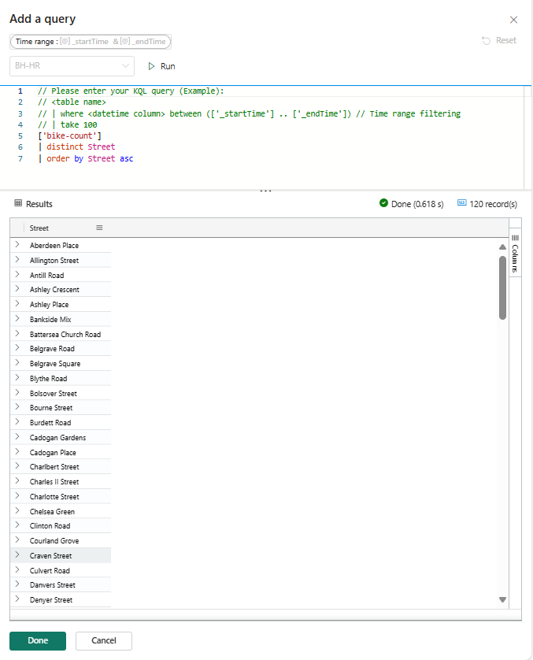
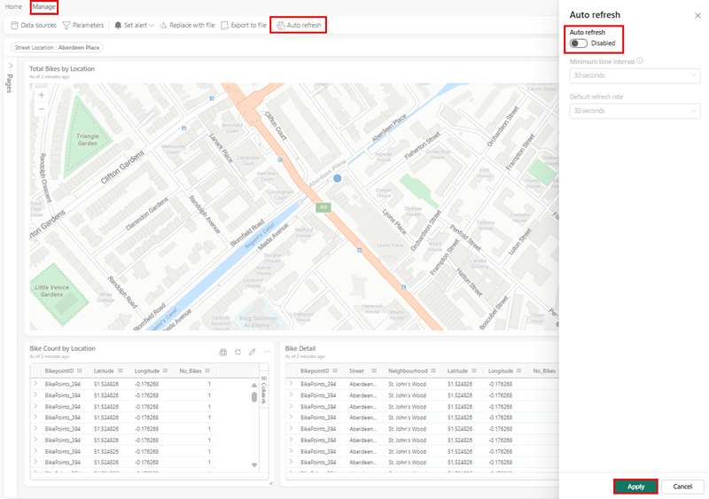

---
lab:
  title: Microsoft Fabric のリアルタイム ダッシュボードの概要
  module: Get started with Real-Time Dashboards in Microsoft Fabric
---

# Microsoft Fabric のリアルタイム ダッシュボードの概要

リアルタイム ダッシュボードでは、Kusto 照会言語 (KQL) を使って構造化データと非構造化データの両方を取得して Microsoft Fabric 内から分析情報を収集し、Power BI 内のスライサーと同様にリンクできるグラフ、散布図、テーブルなどをパネル内にレンダリングできます。 

このラボの所要時間は約 **25** 分です。

> **注**:[Microsoft Fabric 試用版](https://learn.microsoft.com/fabric/get-started/fabric-trial)が、 この演習を完了するには必要です。

## ワークスペースの作成

Fabric でデータを操作する前に、Fabric 試用版を有効にしてワークスペースを作成してください。

1. `https://app.fabric.microsoft.com/home?experience=fabric` の [Microsoft Fabric ホーム ページ](https://app.fabric.microsoft.com/home?experience=fabric)で、**[リアルタイム インテリジェンス]** を選択します。
1. 左側のメニュー バーで、 **[ワークスペース]** を選択します (アイコンは &#128455; に似ています)。
1. 任意の名前で新しいワークスペースを作成し、Fabric 容量を含むライセンス モード ("試用版"、*Premium*、または *Fabric*) を選択してください。** または、既存のワークスペースを使用して、リアルタイム ダッシュボードを作成することもできます。
1. 開いた新しいワークスペースは空のはずです。

    

このラボでは、Fabric のリアルタイム インテリジェンスを使用して、リアルタイム ダッシュボードを作成します。 リアルタイム インテリジェンスには、リアルタイム インテリジェンスの機能を調べるために使用できる便利なサンプル データセットが用意されています。 このサンプル データを使い、リアルタイム データを分析する KQL と、SQL のクエリとクエリセットを作成し、ダウンストリームのプロセスで他の目的に使用できるようにします。

## リアルタイム ダッシュボードの作成

1. **リアルタイム インテリジェンス**内で、**[リアルタイム ダッシュボード]** ボックスを選択します。

   

2. リアルタイム ダッシュボードに**名前**を付けるためのメッセージが表示されます。

   

3. プライマリ ソースに基づく名前など、リアルタイム ダッシュボードに覚えている名前を付けて、**[作成]** を押します。

4. **[データベースの詳細]** パネルで、鉛筆アイコンを選択して OneLake で可用性を有効にします。

   [](./Images/real-time-dashboard-details-large.png#lightbox)

## データ ソースを追加する

データ ソースは、リアルタイム ダッシュボードと同じワークスペース内の特定のデータベース、またはクエリへの再利用可能な参照として機能し、さまざまなタイルでデータのニーズに合わせた個別のデータ ソースを利用できます。

1. **[管理]** タブを選択し、***メニュー バー***の **[新しいデータ ソース]** を選択します。
1. **[データ ソース]** ウィンドウで **[+ 追加]** ボタンを選択します。

    [](./Images/add-data-source-to-real-time-dashboard-large.png#lightbox)

1. **OneLake データ ハブ**または **Azure Data Explorer** の 2 つの主要なオプションのいずれかを選択します。

    

1. ビジネス ニーズを満たす**データソース**を選択し、**[接続]** ボタンを選択します。

    [](./Images/select-onelake-data-hub-large.png#lightbox)

    > **注:** データソースに接続すると、選択した場所内でデータソースを確認する能力が得られ、追加のデータソースを作成できます。

1. **[新しいデータ ソースの作成]** ウィンドウで、**データソース接続**を確認し、**[作成]** を選択します。

    [![[新しいデータ ソースの作成] でデータベースを確認します。](./Images/conected-now-create-datasource.png)](./Images/conected-now-create-datasource-large.png#lightbox)

1. この時点で、**[n ページ]** の右側にある **[...]** を選択し、**[ページ名の変更]** を選択し、ページの名前をタイルの使用方法に適した名前に変更します。
1. 次に、**[+ タイルの追加]** を選択します。

    [](./Images/rename-page-add-tile-large.png#lightbox)

1. **タイル クエリ ウィンドウ**にリダイレクトされます。このウィンドウでは、パラメーターを追加し、タイルをサポートするための基本クエリをプルできます。 

    [](./Images/write-query-for-tile-large.png#lightbox)

    > **注:** 同じウィンドウのドロップダウン ウィンドウに、新しいデータ ソースを追加するオプションがあります。 このソースは、個人用ワークスペース内、またはアクセス権を持つ Evenhouse 内の別の KQL データベースが格納されている任意のワークスペースがある場合はそこに配置できます。

## クエリを作成する

これは、リアルタイム ダッシュボード タイルでは、データの取得とビジュアルのレンダリングに Kusto クエリ言語スニペットを使用するためです。 各タイルとクエリは 1 つのビジュアルをサポートできます。

1. 各タイル内で、それらを新規または既存のタイルにピン留めし、ニーズに合わせて変更する場合は、**Copilot** に書き込む、またはここに貼り付けられます。 単純なクエリから、自転車の数に基づいてマップ上のサイズを使用するマップの視覚化を作成できます。

```kusto

['Bike-count']
BikepointID, Latitude, Longitude, No_Bikes

```

## 視覚化の作成

視覚化が完了したら、**[変更の適用]** を選択し、リアルタイム ダッシュボードをサポートする視覚エフェクトを追加するか、**パラメーター**や**スケジュール**などの追加の手順を実行します。

   [](./Images/create-visual-in-tiles-large.png#lightbox)

変更が適用されると、データが表示され、これをユーザーが読みやすく理解しやすくなるように調整できます。

   [](./Images/first-published-visual-large.png#lightbox)

引き続き、テーブル情報と視覚化情報を含む**新しいタイル**を作成して、ユーザー コミュニティを理解しやすく表現できます。 前述のように、**ページを追加**し、**新しいデータ ソースを**追加することもできます。 次に、ユーザーに表示される情報の量を操作して減らすのに役立つパラメーターを追加することに重点を置きます。

## パラメータを追加
パラメーターによって、ダッシュボードのレンダリング効率を高められ、クエリ プロセスの最も早い段階でフィルター値を使用可能にできます。 タイルにリンクされたクエリにパラメーターを含めると、フィルター機能がアクティブになります。 パラメーターはダッシュボード全体で使用でき、複数のパラメーターで、基になる視覚化で表されるデータ (テーブルを含む) をフィルター処理できます。

パラメーターの作成は簡単に開始できます。 

1. 上部メニューの[新しいパラメーター]ボタンを選択します。 [パラメーター] ペインが開きます。
1. 右側のペインの上部で、[追加]ボタンを選択します。

    [](./Images/add-new-parameter-large.png#lightbox)

1. パラメーターに関連するプロパティを入力します。

    [](./Images/configure-parameter-large.png#lightbox)

1. パラメーターに関するより重要な機能の 1 つは、ユーザーに対して、基になる情報に関連するオプションのみを提供する**クエリの追加**機能です。

    

1. [完了] を選択してパラメーターを作成します。

    [](./Images/complete-parameter-settings-large.png#lightbox)

### パラメーターのプロパティ

| フィールド            | 説明 |
|------------------|-------------|
| **ラベル**        | ダッシュボードまたは編集カードに表示されるパラメーターの名前。 |
| **パラメーターの型** | 以下のいずれかのタイプです: <ul><li>Single selection (単一選択) :パラメーターの入力としてフィルターで値を 1 つのみ選択できます。</li><li>[複数選択] :パラメーターの入力としてフィルターで値を 1 つまたは複数選択できます。</li><li>時間の範囲:時間に基づいてクエリとダッシュボードをフィルター処理するための追加パラメーターの作成を有効にします。 すべてのダッシュボードに、既定の時間範囲のピッカーがあります。</li><li>自由記載:ユーザーは、事前入力された値なしで、フィルター フィールドに値を入力するか貼り付け、使用した最近の値を保持できます。</li></ul> |
| **説明**  | パラメーターの説明 (省略可能)。 |
| **変数名** | クエリ内のパラメーターに使用される名前。 |
| **データの種類**    | パラメーター値が表すデータの型。 |
| **[Show on pages](ページに表示)** | パラメーターが表示されるページ。すべてのページを選択するオプションがあります。 |
| **ソース**       | パラメーター値の原点。次の値を指定できます。 <ul><li>固定値:手動で入力された静的フィルター値。</li><li>クエリ：KQL クエリを使用して導入された動的な値。</li></ul> |
| **[すべて選択]の値を追加** | 単一および複数の選択パラメーター型に適用できるこのオプションは、すべてのパラメーター値のデータを取得し、機能のためにクエリに統合される必要があります。 |
| **既定値** | ダッシュボードの初期レンダリング時に設定されるフィルターの既定値。 |

6. タイル内の各クエリにパラメーターを追加し、**[変更の適用]** を選択します。

**KQL クエリの前**
```kusto
//Add the street parameter to each tile's query
['bike-count']
| where No_Bikes > 0
| project BikepointID, Latitude, Longitude, No_Bikes

```

**KQL クエリの後**
```kusto
//Add the street parameter to each tile's query
['bike-count']
| where No_Bikes > 0 and Street == street
| project BikepointID, Latitude, Longitude, No_Bikes

```
   [](./Images/update-each-query-large.png#lightbox)

## 自動更新を有効にする

自動更新は、手動でのページ再読み込みや更新ボタンを押す必要なく、ダッシュボード データの自動更新を有効にする機能です。 自動更新の初期頻度は、データベース エディターによって構成できます。 エディターとビューアーの両方に、ダッシュボードの表示中に実際の自動更新レートを変更する機能があります。 データベース エディターには、クラスターに対する過剰な負荷を軽減するための最小リフレッシュ レートを確立する権限があります。 この最小レートを設定すると、データベース ユーザーは、指定された最小値より低い更新レートを選択できなくなります。 これにより、リソースに過剰な負荷をかけることなく、システムのパフォーマンスが維持されます。

1. [管理] タブ > [自動更新] を選択します。

    [](./Images/enable-auto-refresh-large.png#lightbox)

1. 自動更新が [有効] になるようにオプションを切り替えます。
1. [Minimum time interval]\(最小時間間隔\) と [Default refresh rate]\(既定の更新頻度\) の値を選択します。
1. [適用] を選択してから、ダッシュボードを保存します。

    [](./Images/enable-and-configure-refresh-rate-large.png#lightbox)

## リソースをクリーンアップする

この演習では、KQL データベースを作成し、クエリ用のサンプル データセットを設定しました。 その後、KQL と SQL を使ってデータにクエリを実行しました。 KQL データベースの探索が完了したら、この演習用に作成したワークスペースを削除できます。
1. 左側のバーで、ワークスペースの**アイコン**を選択します。
2. ツール バーの [...] メニューで、**[ワークスペース設定]** を選択します。
3. **[全般]** セクションで、**[このワークスペースの削除]** を選択します。

