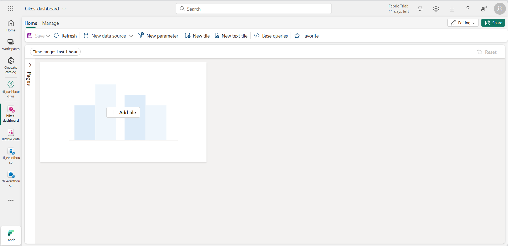

---
lab:
  title: Microsoft Fabric のリアルタイム ダッシュボードの概要
  module: Get started with Real-Time Dashboards in Microsoft Fabric
---

# Microsoft Fabric のリアルタイム ダッシュボードの概要

Microsoft Fabric のリアルタイム ダッシュボードを使用すると、Kusto 照会言語 (KQL) を使用してストリーミング データを視覚化し探索できます。  この演習では、リアルタイム データ ソースに基づいてリアルタイム ダッシュボードを作成して使用する方法について説明します。

このラボの所要時間は約 **25** 分です。

> **注**: この演習を完了するには、[Microsoft Fabric テナント](https://learn.microsoft.com/fabric/get-started/fabric-trial)が必要です。

## ワークスペースの作成

Fabric でデータを操作する前に、Fabric 容量を有効にしてワークスペースを作成する必要があります。

1. ブラウザーで [Microsoft Fabric ホーム ページ](https://app.fabric.microsoft.com/home?experience=fabric) (`https://app.fabric.microsoft.com/home?experience=fabric`) に移動し、Fabric 資格情報でサインインします。
1. 左側のメニュー バーで、 **[ワークスペース]** を選択します (アイコンは &#128455; に似ています)。
1. 任意の名前で新しいワークスペースを作成し、Fabric 容量を含むライセンス モード ("試用版"、*Premium*、または *Fabric*) を選択します。**
1. 開いた新しいワークスペースは空のはずです。

    

## イベントハウスを作成する

ワークスペースが作成されたので、リアルタイム インテリジェンス ソリューションに必要な Fabric 項目の作成を開始できます。 まず、イベントハウスを作成します。

1. 左側のメニュー バーで、**[作成]** を選択します。 *[新規]* ページの *[Real-Time Intelligence]* セクションで、**[イベントハウス]** を選択します。 任意の一意の名前を設定します。

    >**注**: **[作成]** オプションがサイド バーにピン留めされていない場合は、最初に省略記号 (**...**) オプションを選択する必要があります。

1. 新しい空のイベントハウスが表示されるまで、表示されているヒントまたはプロンプトを閉じます。

    

1. 左側のペインで、イベントハウスに Eventhouse と同じ名前の KQL データベースが含まれていることに注意してください。
1. KQL データベースを選択して表示します。

## Eventstream を作成する

現段階では、データベースにテーブルはありません。 Eventstream を使用して、リアルタイム ソースからテーブルにデータを読み込みます。

1. KQL データベースのメイン ページで、 **[データの取得]** を選択します。
2. データ ソースで、**[Eventstream** > **新しい Eventstream]** を選択します。 Eventstream `Bicycle-data` に名前を付けます。

    

    ワークスペース内での新しいイベント ストリームの作成はすぐに完了します。 確立されると、Eventstream のデータ ソースを選択するように自動的にリダイレクトされます。

1. **[サンプル データの使用]** を選択します。
1. ソース名に `Bicycles` と名前を付け、**[Bicycles]** サンプル データを選択します。

    ストリームがマップされ、**Eeventstream キャンバス**に自動的に表示されます。

   

1. **変換先を追加する** ドロップダウン リストで、**[Eventhouse]** を選択します。
1. **Eventhouse** ペインで、次のセットアップ オプションを構成します。
   - **データ インジェスト モード:** インジェスト前イベント処理
   - **変換先の名前:**`bikes-table`
   - **ワークスペース: ***この演習の開始時に作成したワークスペースを選択します*
   - **Eventhouse**: *イベントハウスを選択します*
   - **KQL データベース: ***KQL データベースを選択します*
   - **変換先テーブル:** `bikes` という名前の新しいテーブルを作成します
   - **入力データ形式:** JSON

   

1. **Eventhouse** ペインで、**[保存]** を選択します。 
1. **Bicycles-data** ノードの出力を **bikes-table** ノードに接続し、**[発行]** を選択します。
1. データ変換先がアクティブになるまで 1 分ほど待ちます。 次に、デザイン キャンバスで **bikes-table** ノードを選択し、下の **データのプレビュー** ペインを表示して、取り込まれた最新のデータを表示します。

   

1. 数分待ってから、**[更新]** ボタンを使用して **データのプレビュー** ペインを更新します。 ストリームは永続的に実行されているため、新しいデータがテーブルに追加されている可能性があります。

## リアルタイム ダッシュ ボードの作成

イベントハウスのテーブルにリアルタイム データのストリームが読み込まれたので、リアルタイム ダッシュボードを使用して視覚化できます。

1. 左側のメニュー バーで、**ホーム** ハブを選択します。 次に、ホーム ページで、`bikes-dashboard` という名前の新しい **リアルタイム ダッシュボード** を作成します。

    新しい空のダッシュボードが作成されます。


    

1. ツール バーの **[新しいデータ ソース]** を選択し、新しい **OneLake データ ハブ** データ ソースを追加します。 次に、イベントハウスを選択し、次の設定で新しいデータ ソースを作成します。
    - **表示名**: `Bike Rental Data`
    - **データベース**: *イベントハウス内の既定のデータベース*。
    - **パススルー ID**: *Selected*

1. **[データ ソース]** ペインを閉じ、ダッシュボード デザイン キャンバスで **[タイトルを追加]** を選択します。
1. クエリ エディターで、**自転車レンタル データ** ソースが選択されていることを確認し、次の KQL コードを入力します。

    ```kql
    bikes
        | where ingestion_time() between (ago(30min) .. now())
        | summarize latest_observation = arg_max(ingestion_time(), *) by Neighbourhood
        | project Neighbourhood, latest_observation, No_Bikes, No_Empty_Docks
        | order by Neighbourhood asc
    ```

1. クエリを実行すると、過去 30 分間に各近隣で観察された自転車の数と空の自転車ドックの数が表示されます。
1. 変更を適用して、ダッシュボードのタイルのテーブルに表示されるデータを表示します。

   

1. タイルで、**編集**アイコン (鉛筆マーク) を選択します。 次に、**ビジュアルの書式設定**ペインで、次のプロパティを設定します。
    - **タイル名**: 自転車とドック
    - **視覚化タイプ**: 横棒グラフ
    - **表示形式**: 積み上げ横棒グラフ
    - **Y 列**: No_Bikes、No-Empty_Docks
    - **X 列**: 近隣
    - **系列の列**: 推論
    - **凡例の場所**: 下

    ご利用の編集時間は、次のようになります。

   

1. 変更を適用し、タイルのサイズを変更して、ダッシュボードの左側の高さを最大限に高くします。

1. ツール バーの **[新しいタイル]** を選択します。
1. クエリ エディターで、**自転車レンタル データ** ソースが選択されていることを確認し、次の KQL コードを入力します。

    ```kql
    bikes
        | where ingestion_time() between (ago(30min) .. now())
        | summarize latest_observation = arg_max(ingestion_time(), *) by Neighbourhood
        | project Neighbourhood, latest_observation, Latitude, Longitude, No_Bikes
        | order by Neighbourhood asc
    ```

1. クエリを実行します。このクエリは、過去 30 分間に各近隣で観察された自転車の場所と数を示します。
1. 変更を適用して、ダッシュボードのタイルのテーブルに表示されるデータを表示します。
1. タイルで、**編集**アイコン (鉛筆マーク) を選択します。 次に、**ビジュアルの書式設定**ペインで、次のプロパティを設定します。
    - **タイル名**: 自転車の場所
    - **視覚化タイプ**: マップ
    - 緯度と経度 **で場所を定義**します
    - **緯度列**: 緯度
    - **経度列**: 経度
    - **ラベル列**: 近隣
    - **サイズ**: 表示
    - **サイズ列**: No_Bikes

1. 変更を適用し、ダッシュボードの使用可能なスペースの右側を埋めるようにマップ タイルのサイズを変更します。

   

## 基本的なクエリの作成

ダッシュボードには、同様のクエリに基づく 2 つのビジュアルが含まれています。 重複を回避し、ダッシュボードの保守性を高めるために、共通データを 1 つの*ベース クエリ*に統合できます。

1. ダッシュボード のツール バーで、**[ベース クエリ]** を選択します。 次に、 **[+追加]** を選択します。
1. ベース クエリ エディターで、**[変数名]** を `base_bike_data` に設定し、**[自転車レンタル データ]** ソースが選択されていることを確認します。 次のクエリを入力します。

    ```kql
    bikes
        | where ingestion_time() between (ago(30min) .. now())
        | summarize latest_observation = arg_max(ingestion_time(), *) by Neighbourhood
    ```
1. クエリを実行し、ダッシュボード (およびその他) の両方のビジュアルに必要なすべての列が返されることを確認します。

   

1. **完了**を選択してから、**基本クエリ** ペインを閉じます。
1. **自転車と置き場**横棒グラフのビジュアルを編集し、クエリを次のコードに変更します。

    ```kql
    base_bike_data
    | project Neighbourhood, latest_observation, No_Bikes, No_Empty_Docks
    | order by Neighbourhood asc
    ```

1. 変更を適用し、横棒グラフにすべての近隣のデータが表示されていることを確認します。

1. **[自転車の場所]** マップ ビジュアルを編集し、クエリを次のコードに変更します。

    ```kql
    base_bike_data
    | project Neighbourhood, latest_observation, No_Bikes, Latitude, Longitude
    | order by Neighbourhood asc
    ```

1. 変更を適用し、マップにすべての近隣のデータが表示されていることを確認します。

## パラメーターを追加する

ダッシュボードには現在、すべての地域の最新の自転車、ドック、場所データが表示されています。 次に、特定の地域を選択できるようにパラメーターを追加します。

1. ダッシュボード ツール バーの **[管理]** タブで、**[パラメーター]** を選択します。
1. 自動的に作成された既存のパラメーター (たとえば、*時間の範囲*パラメーター) に注意してください。 次にこれらを**削除**します。
1. **[+ 追加]** を選択します。
1. 次の設定でパラメーターを追加します。
    - **ラベル:** `Neighbourhood`
    - **パラメーターの種類**: 複数選択
    - **説明**: `Choose neighbourhoods`
    - **変数名**: `selected_neighbourhoods`
    - **データ型**: 文字列
    - **ページに表示**: すべて選択
    - **ソース**：クエリー
    - **データ ソース**: 自転車レンタル データ
    - **クエリを編集します**:

        ```kql
        bikes
        | distinct Neighbourhood
        | order by Neighbourhood asc
        ```

    - **値列**: 近隣
    - **ラベル列**: 一致する値の選択
    - **[すべて選択] の値を追加します**: *選択済み*
    - **[すべて選択] は空の文字列を送信します**: *選択済み*
    - **既定値への自動リセット**: 選択済み
    - **既定値**: すべて選択

1. **[完了]** を選択してパラメーターを作成します。

    パラメーターを追加したので、基本クエリを変更して、選択した近隣に基づいてデータをフィルター処理する必要があります。

1. ツール バーで、**[基本クエリ]** を選択します。 次に、次のコードに示すように、**base_bike_data** クエリを選択し、それを編集して **and** 条件を **where** 句に追加し、選択したパラメーター値に基づいてフィルター処理します。

    ```kql
    bikes
        | where ingestion_time() between (ago(30min) .. now())
          and (isempty(['selected_neighbourhoods']) or Neighbourhood  in (['selected_neighbourhoods']))
        | summarize latest_observation = arg_max(ingestion_time(), *) by Neighbourhood
    ```

1. **[完了]** を選択して基本クエリを保存します。

1. ダッシュボードで、**近隣**パラメーターを使用して、選択した近隣に基づいてデータをフィルター処理します。

   

1. **[リセット]** を選択して、選択したパラメーター フィルターを削除します。

## ページを追加

ダッシュボードは現在、1 つのページで構成されています。 さらにページを追加して、より多くのデータを提供できます。

1. ダッシュボードの左側にある **[ページ]** ウィンドウを展開し、**[ + ページの追加]** を選択します。
1. 新しいページに **Page 2** という名前を付けます。 そしてこれを選択します。
1. 新しいページで、**[+ タイルの追加]** を選択します
1. 新しいタイルのクエリ エディターで、次のクエリを入力します。

    ```kql
    base_bike_data
    | project Neighbourhood, latest_observation
    | order by latest_observation desc
    ```

1. 変更を適用します。 次に、ダッシュボードの高さに合わせてタイルのサイズを変更します。

   

## 自動更新を構成する

ユーザーはダッシュボードを手動で更新できますが、設定された間隔でデータを自動的に更新すると便利な場合があります。

1. ダッシュボードのツール バーの **[管理]** テーブルで、**[自動更新]** 選択します。
1. **[自動更新]** ウィンドウで、次の設定を構成します。
    - **有効**: *選択済み*
    - **最小時間間隔**: すべての更新間隔を許可する
    - **既定のリフレッシュ レート**: 30 分
1. 自動更新設定を適用します。

## ダッシュボードを保存して共有する

これで便利なダッシュボードが作成され、保存して他のユーザーと共有できます。

1. ダッシュボード ツール バーの **[保存]** を選択します。
1. ダッシュボードが保存されたら、**[共有]** を選択します。
1. **[共有]** ダイアログ ボックスで、**[リンクをコピー]** を選択し、ダッシュボードへのリンクをクリップボードにコピーします。
1. 新しいブラウザー タブを開き、コピーしたリンクを貼り付けて共有ダッシュボードに移動します。 プロンプトが表示されたら、Fabric の資格情報で再度サインインします。
1. ダッシュボードを使用して、市内の自転車と空の自転車ドックに関する最新情報を確認します。

## リソースをクリーンアップする

ダッシュボードの探索が完了したら、この演習用に作成したワークスペースを削除できます。

1. 左側のバーで、ワークスペースの**アイコン**を選択します。
2. ツール バーで、**[ワークスペース設定]** を選択します。
3. **[全般]** セクションで、**[このワークスペースの削除]** を選択します。
