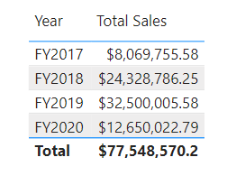

---
lab:
  title: スケーラブルなセマンティック モデルを設計する
  module: Design scalable semantic models
---

# スケーラブルなセマンティック モデルを設計する

この演習では、DAX 関数を使用して、特に計算グループやフィールド パラメーターなどの機能を使用して、データ モデルの柔軟性と効率を向上させます。 これらの機能を組み合わせて使用することで、複数のビジュアルや複雑な DAX 式を必要とせずに対話型レポートを作成でき、柔軟性と拡張性に優れたセマンティック モデルを作成できます。

この演習では、次の方法を学習します。

- リレーションシップの動作を変更する DAX 関数を使用します。
- 計算グループを作成し、動的タイム インテリジェンス計算に適用します。
- フィールド パラメーターを作成して、さまざまなフィールドとメジャーを動的に選択して表示します。

このラボの所要時間は約 **30** 分です。

## 開始する前に

1. `https://github.com/MicrosoftLearning/mslearn-fabric/raw/main/Allfiles/Labs/15/15-scalable-semantic-models.zip` から[売上分析スターター ファイル](https://github.com/MicrosoftLearning/mslearn-fabric/raw/main/Allfiles/Labs/15/15-scalable-semantic-models.zip)をダウンロードし、ローカルに保存します。

2. フォルダーを **C:\Users\Student\Downloads\15-scalable-semantic-models** フォルダーに展開します。

3. **15-Starter-Sales Analysis.pbix** ファイルを開きます。

    > 変更の適用を求める警告を無視して閉じます。*[変更を破棄する]* を選択しないでください。

## 関係に関する作業

このタスクでは、事前に開発された Power BI Desktop ソリューションを開き、データ モデルについて学習します。 その後、アクティブなモデル リレーションシップの動作を調べていきます。

1. Power BI Desktop で、左側にある **[モデル]** ビューに切り替えます。

    

2. モデル図を使って、モデルの設計を確認します。

    

3. **Date** と **Sales** のテーブルの間には 3 つのリレーションシップがあることがわかります。

    

    > **日付**テーブルの**日付**列は、リレーションシップの「一」側面を表す一意の列です。 **日付**テーブルの任意の列に適用されるフィルターは、リレーションシップのいずれかを使用して**売上**テーブルに反映されます。*

4. 3 つのリレーションシップのそれぞれにカーソルを合わせると、**Sales** テーブルの "多" 側の列が強調表示されます。

5. **日付**と**注文日**の間のリレーションシップがアクティブであることに注意してください。 現在のモデル デザインは、**日付**テーブルがロールプレイング ディメンションであることを示します。 このディメンションは、注文日、期限、または出荷日のロールを果たします。 どのロールがレポートの分析要件に依存するか。

> 後で DAX を使用して、別のテーブルを作成せずにこれらの非アクティブなリレーションシップを使用し、異なる日付列に対して 2 つのアクティブなリレーションシップを取得します。

### 日付別に売上データを視覚化する

このタスクでは、年別の売上合計を視覚化し、非アクティブなリレーションシップを使用します。

1. **レポート** ビューに切り替えます。

    

2. テーブル ビジュアルを追加するには、 **[視覚化]** ペインで**テーブル** ビジュアル アイコンを選択します。

    

3. テーブル ビジュアルに列を追加するには、 **[データ]** ペイン (右側にあります) で、まず **Date** テーブルを展開します。

4. **年**列をドラッグして、テーブル ビジュアルにドロップします。

5. **売上**テーブルを展開して開いてから、**売上合計**列をドラッグしてテーブル ビジュアルにドロップします。

6. テーブル ビジュアルを確認します。



> テーブル ビジュアルには、年別にグループ化された**売上合計**列の合計が表示されます。 しかし、**年**とはどういう意味ですか? **日付**テーブルと**売上**テーブルの間には**注文日**列とのアクティブなリレーションシップがあるため、**年**は注文が行われた会計年度を意味します。

### 非アクティブなリレーションシップを使用する

このタスクでは、`USERELATIONSHIP` 関数を使用して非アクティブなリレーションシップをアクティブにします。

1. **[データ]** ペインで、**Sales** テーブルを右クリックし、 **[新しいメジャー]** を選択します。

    

2. 数式バー (リボンの下にあります) で、テキストを次のメジャー定義に置き換え、**Enter** キーを押します。

    ```DAX
    Sales Shipped =
    CALCULATE (
    SUM ('Sales'[Sales]),
    USERELATIONSHIP('Date'[Date], 'Sales'[ShipDate])
    )
    ```

    > この数式は、CALCULATE 関数を使用してフィルター コンテキストを変更します。 それは、このメジャーに対してのみ、**出荷日**リレーションシップをアクティブにする USERELATIONSHIP 関数です。

3. **Sales Shipped** メジャーをテーブル ビジュアルに追加します。

4. テーブル ビジュアルの幅を広げて、すべての列が表示されるようにします。 **合計**行は同じですが、**売上合計**と**出荷済み売上**の各年の売上金額が異なっていることを確認します。 その違いは、ある特定の年に注文を受けたのに、次の年に出荷されているか、まだ出荷されていないことによります。


> リレーションシップをアクティブとして一時的に設定するメジャーを作成することは、ロールプレイング ディメンションを操作する 1 つの方法です。 ただし、多くのメジャーでロールプレイング バージョンを作成する必要がある場合は、面倒になる可能性があります。 たとえば、売上関連のメジャーが 10 個あり、ロールプレイ日が 3 日ある場合は、30 個のメジャーを作成することを意味する可能性があります。 計算グループを使用して作成すると、プロセスが簡単になります。

## 計算グループを作成する

このタスクでは、タイム インテリジェンス分析用の計算グループを作成します。

1. **[モデル]** ビューに切り替えます。

2. モデル ビューで、**計算グループ**を選択して、新しい計算グループ テーブル、グループ列、および項目を作成します。 警告ウィンドウが表示されたら、**[はい]** を選択して計算グループの作成を確認します。

   

    > 注: 暗黙的なメジャーは、[レポート] ビューで、ビジュアル内の [データ] ペインから直接データ列を使用すると実行されます。 ビジュアルを使用すると、SUM、AVERAGE、MIN、MAX、またはその他の基本的な集計演算として集計でき、これが暗黙的なメジャーになります。 計算グループを作成すると、Power BI Desktop は暗黙的なメジャーを作成しなくなります。つまり、データ列を集計するには、メジャーを明示的に作成する必要があります。

3. 計算グループの名前を*時間計算*に変更し、計算列の名前を*年間計算*に変更します。

4. **[データ]** ペインの **[モデル]** タブで、計算グループで自動的に作成される計算項目を選択します。

5. 項目の数式を次のように置き換えてコミットします。

    ```DAX
   Year-to-Date (YTD) = CALCULATE(SELECTEDMEASURE(), DATESYTD('Date'[Date]))
    ```

6. **計算項目**フィールドを右クリックし、**新しい計算項目**を選択します。

7. 新しい項目には、次の DAX 数式を使用します。

    ```DAX
   Previous Year (PY) = CALCULATE(SELECTEDMEASURE(), PREVIOUSYEAR('Date'[Date]))
    ```

8. 次の DAX 数式を使用して 3 番目の項目を作成します。

    ```DAX
   Year-over-Year (YoY) Growth = 
   VAR MeasurePriorYear =
   CALCULATE(
       SELECTEDMEASURE(),
       SAMEPERIODLASTYEAR('Date'[Date])
   )
   RETURN
   DIVIDE(
       (SELECTEDMEASURE() - MeasurePriorYear),
       MeasurePriorYear
   )
    ```

最後の計算項目はパーセンテージのみで値を返す必要があるため、影響を受けるメジャーの形式を変更するには動的書式指定文字列が必要です。

9. 前年比項目の **[プロパティ]** ペインで、**動的書式指定文字列**機能を有効にします。

10. DAX 数式バーで、左側のフィールドが**形式**として設定されていることを確認し、次の書式指定文字列を書き込みます: `"0.##%"`

11. 計算グループが次のように表示されることを確認します。

    

### メジャーに計算グループを適用する

このタスクでは、計算項目がビジュアルのメジャーに与える影響を視覚化します。

1. **レポート** ビューに切り替えます。

2. キャンバスの下部にある **[概要]** タブを選択します。

3. キャンバスに既に作成されているマトリックス ビジュアルを選択し、**[データ]** ペインの**年間計算**計算列を **[視覚化]** ペインの**列**フィールドにドラッグします。

    

4. マトリックスに各計算項目の売上数値のセットがあることを確認します。 

   

> この情報をすべて一度に 1 つのビジュアルに含めると読みにくいため、ビジュアルを一度に 1 つの売上数値に制限すると便利です。 そのためには、フィールド パラメーターを使用できます。

## フィールド パラメーターを作成する

このタスクでは、ビジュアルを変更するフィールド パラメーターを作成します。

1. 上部のリボンの **[モデリング]** タブを選択してから、**[新規パラメーター]** ボタンを展開して**フィールド**を選択します。

    

2. [パラメーター] ウィンドウで、パラメーターの名前を**売上数値**に変更して、**[スライサーをこのページに追加する]** オプションがオンになっていることを確認し、**売上**テーブルから次のフィールドを追加します。

   - Total Sales
   - Profit
   - 利益率
   - Orders (注文)

    

3. **［作成］** を選択します

4. スライサーが作成されたら、マトリックスを選択し、[視覚化] ウィンドウで**数値**からすべてのフィールドを削除して、代わりに売上数値フィールド パラメーターを追加できます。

    

5. スライサーのさまざまな売上数値と、それぞれの選択時にマトリックスがどのように変化するかを確認します。

6. 売上数値フィールド パラメータのスライサーを使用して利益フィールドを選択する方法を確認します。 これは上記と同じマトリックスであるため、3 つの計算項目 (前年、前年比、年間累計) を確認できますが、スライサーのために利益にのみ適用されます。

    

### フィールド パラメーターを編集する

このタスクでは、DAX 式を直接変更して、**売上数値**フィールド パラメーターを編集します。

1. キャンバスの下部にある **[営業担当者のパフォーマンス]** タブを選択します。 クラスター化された棒グラフに注目して、グラフを月別の売上と月別のターゲットに切り替えます。

    > ブックマーク ボタンを作成すると、各オプションでビジュアルの種類を変更できます。多くのメジャーを切り替える必要がある場合は、それぞれのブックマーク ボタンを作成する必要があり、非常に時間がかかる場合があります。 代わりに、分析するすべてのメジャーでフィールド パラメーターを使用し、すばやく切り替えることができます。

    

2. 棒グラフのビジュアルを選択し、**X 軸**の **"売上合計"** フィールドを **"売上数値"** フィールド パラメーターに置き換えます。

3. **スライサー** ビジュアルを作成し、**売上数値**パラメーターを**フィールド**領域にドラッグします。

このビジュアルでは、フィールド パラメーターに含まれていない月別のターゲットを評価する必要があります。

4. [データ] ペインで**売上数値**パラメーターを選択し、次のようにパラメーターの DAX 式にターゲット フィールドを追加します。

    ```DAX
   Sales Figures = {
    ("Total Sales", NAMEOF('Sales'[Total Sales]), 0),
    ("Profit", NAMEOF('Sales'[Profit]), 1),
    ("Profit Margin", NAMEOF('Sales'[Profit Margin]), 2),
    ("Orders", NAMEOF('Sales'[Orders]), 3),
    ("Target", NAMEOF('Targets'[Target]), 4)
   }
    ```

5. 変更をコミットし、別の売上数値を選択するときにビジュアルが変更されることを確認します。

6. ブックマーク ボタンを削除し、レポート ページの最終的な状態を確認します。

    

## ラボが完了しました

演習を終了するには、Power BI Desktop を閉じます。ファイルを保存する必要はありません。
