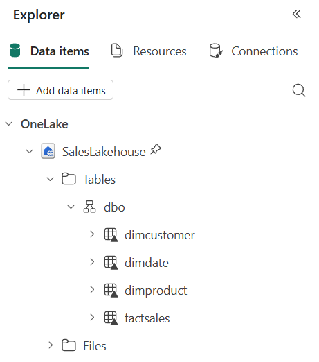
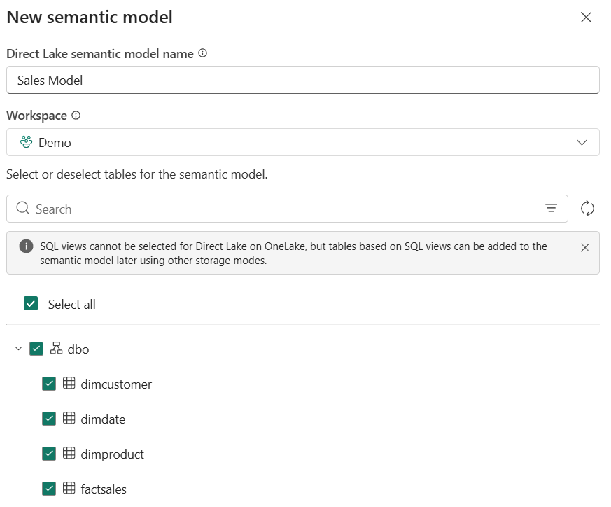
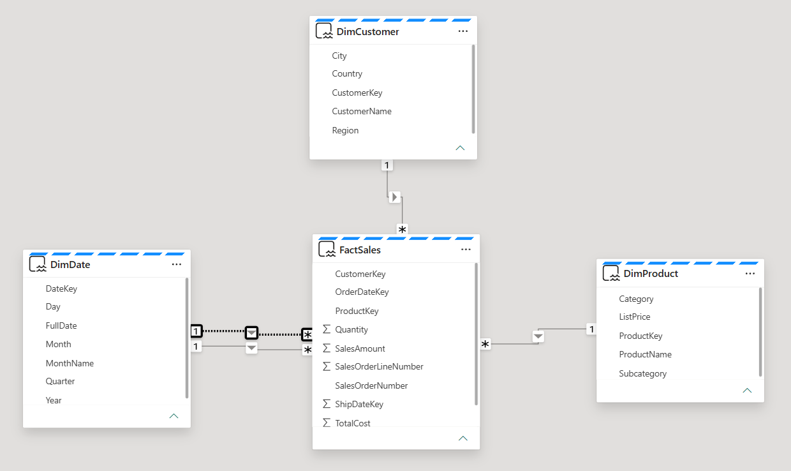
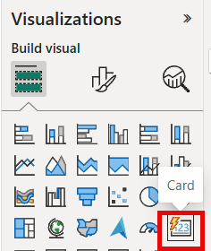
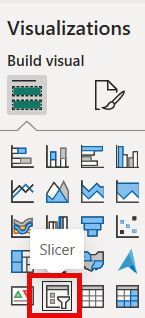
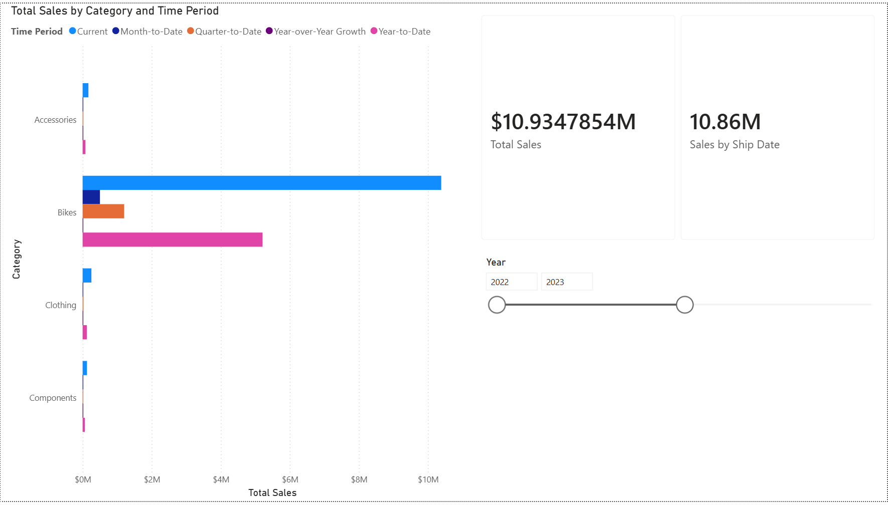

---
lab:
  title: スケールのセマンティック モデルを設計する
  module: Design semantic models for scale in Microsoft Fabric
  description: このラボでは、Microsoft Fabric サービスでスケールのセマンティック モデルを設計します。 Direct Lake を使用してレイクハウス データに接続し、スター スキーマ リレーションシップを構築し、タイム インテリジェンス用の計算グループを作成し、大規模なデータセットと同時使用をサポートする設定を構成します。
  duration: 30 minutes
  level: 300
  islab: true
  primarytopics:
    - Microsoft Fabric
  categories:
    - Semantic models
    - Get started with Fabric
  courses:
    - DP-600
---

# スケールのセマンティック モデルを設計する

この演習では、Microsoft Fabric サービスでスケールのセマンティック モデルを設計します。 Direct Lake を使用してレイクハウス データに接続し、スター スキーマ リレーションシップを構築し、タイム インテリジェンス用の計算グループを作成し、大規模なデータセットと同時使用をサポートする設定を構成します。 学習内容は次のとおりです。

- Direct Lake を介してレイクハウス データに接続するセマンティック モデルを作成する。
- 適切なフィルターの方向と参照整合性を使用してスター スキーマ リレーションシップを設計する。
- 複数のメジャーにわたるタイム インテリジェンスの計算グループを作成する。
- クエリのスケールアウトや OneLake 統合など、スケールの設定を構成する。

このラボの所要時間は約 **30** 分です。

> **ヒント:** 関連するトレーニング コンテンツについては、「[Microsoft Fabric でのスケールの設計セマンティック モデル](https://learn.microsoft.com/training/modules/design-semantic-models-scale/)」を参照してください。

## 環境を設定する

> **注**: この演習を完了するには、Fabric の有料または試用版の容量にアクセスする必要があります。 有料容量には Power BI 機能が含まれている必要があります。または、別の Power BI Pro か Premium Per User ライセンスが必要です。 無料の Fabric 試用版については、[Fabric 試用版](https://aka.ms/fabrictrial)に関するページを参照してください。

1. ブラウザーの `https://app.fabric.microsoft.com/home?experience=fabric` で [Microsoft Fabric ホーム ページ](https://app.fabric.microsoft.com/home?experience=fabric)に移動し、Fabric 資格情報でサインインします。
1. 左側のメニュー バーで、 **[ワークスペース]** を選択します (アイコンは &#128455; に似ています)。
1. 任意の名前で新しいワークスペースを作成し、Fabric 容量を含むライセンス モード ("試用版"、*Premium*、または *Fabric*) を選択します。**
1. 開いた新しいワークスペースは空のはずです。

モデル化するデータを含むレイクハウスが必要です。 サンプルの売上データを作成するノートブックをインポートし、レイクハウスを作成してから、それに対してノートブックを実行します。

1. `https://github.com/MicrosoftLearning/mslearn-fabric/raw/main/Allfiles/Labs/15/Create-Sales-Data.ipynb` から [Create-Sales-Data.ipynb](https://github.com/MicrosoftLearning/mslearn-fabric/raw/main/Allfiles/Labs/15/Create-Sales-Data.ipynb) ノートブックをダウンロードして保存します。

1. ワークスペースで、**[インポート]** > **[Notebook]** を選択し、ダウンロードした **Create-Sales-Data.ipynb** ファイルをアップロードします。 インポート後にワークスペースにノートブックが表示されます。

1. ワークスペースで、**[+ 新しい項目]** を選択し、**レイクハウス**を作成します。 **SalesLakehouse** という名前を付けます。

    1 分ほどすると、新しいレイクハウスが作成されます。

1. レイクハウスの **[ホーム]** メニュー タブで、**[ノートブックを開く]** > **[既存のノートブック]** を選択し、**[Create-Sales-Data]** を選びます。

1. ノートブックが開き、レイクハウスがアタッチされます。 各ブロックの動作を説明するコメントを含む 2 つのコード セルが含まれています。最初のセルでは 3 つのディメンション テーブル (`DimDate`、`DimProduct`、`DimCustomer`) を作成し、2 番目のセルでは 5,000 個のファクト テーブル行 (`FactSales`) を生成します。

1. ツールバーで **[すべて実行]** を選択して両方のセルを実行します。 両方のセルが完了するまで待ちます。

1. 両方のセルが完了したら、左側のレイクハウス エクスプローラーを使用して、次のテーブルが **[テーブル]** の下に表示されることを確認します。
    - `DimCustomer`
    - `DimDate`
    - `DimProduct`
    - `FactSales`

    > *テーブルが表示されない場合は、ツール バーの **[更新]** ボタンを選択します。*



## セマンティック モデルを作成する

このセクションでは、スケール用に設計されたセマンティック モデルを作成します。 このモデルでは、Direct Lake を使用して、コピーをインポートせずにレイクハウス Delta テーブルから直接データにクエリを実行し、大規模なデータセットを制約する更新のボトルネックとメモリ制限を排除します。 次に、スター スキーマ リレーションシップ、明示的なメジャー、計算グループ、ロールプレイング ディメンション (テーブル、メジャー、ユーザーの数の増加に合わせてモデルのパフォーマンスと保守性を維持するパターン) を使用してモデルを構成します。

1. **[レイクハウス エクスプローラー]** メニュー バーで、**[新しいセマンティック モデル]** を選択します。

1. モデルに **Sales Model** という名前を付け、含める次の表を選択します。
    - `DimCustomer`
    - `DimDate`
    - `DimProduct`
    - `FactSales`

1. **[確認]** を選択してセマンティック モデルを作成します。 Web モデリング エクスペリエンスでモデルが開かれるまで、1 分間待つ必要がある場合があります。

    > セマンティック モデルでは、レイクハウス Delta テーブルに接続するため、既定で Direct Lake モードを使用します。 データのインポートや更新スケジュールは必要ありません。



### スター スキーマのリレーションシップを設計する

このタスクでは、スター スキーマを形成するようにファクト テーブルとディメンション テーブルの間のリレーションシップを構成します。 スター スキーマを使用すると、クエリ エンジンにフィルターからファクトへのシンプルで予測可能なパスが提供されます。 単一方向のリレーションシップと想定される参照整合性により、INNER 結合が有効になり、クエリごとにエンジンによって行われる作業が減ります。これは、行数が数百万に増加するにつれて重要になります。

1. モデル ダイアグラムで、`FactSales` が中央に配置され、3 つのディメンション テーブルがその周囲に配置されるようにテーブルを配置します。

1. リレーションシップが自動的に検出されなかった場合は、手動で作成します。 リボンから **[リレーションシップの管理]** を選択し、**[新しいリレーションシップ]** を選んで次のように構成します。

    > **注**: Direct Lake テーブルでは、リレーションシップ ダイアログにデータ プレビューは表示されません。 カーディナリティはテーブルの行数によって決まります。1 つのクロスフィルター方向が常に設定されますが、これらの設定を手動で確認する必要がある場合があります。

    - テーブルから: `FactSales`
      - `OrderDateKey` 列を選択します
    - テーブルへ: `DimDate`
      - `DateKey` 列を選択します
    - カーディナリティ: **多対一 (*:1)**
    - クロスフィルター方向: **単一**
    - **[このリレーションシップをアクティブにする]** をオンにします
    - **[参照整合性を想定]** をオンにします
    - **[保存]** を選びます。

    > 参照整合性オプションでは、LEFT OUTER 結合の代わりに INNER 結合を使用するようにエンジンに指示します。これにより、すべての外部キーに一致するディメンション キーがある場合のクエリ パフォーマンスが向上します。

    

1. 2 つ目のリレーションシップを作成します。

    - テーブルから: `FactSales`
      - `CustomerKey` 列を選択します
    - テーブルへ: `DimCustomer`
      - `CustomerKey` 列を選択します
    - カーディナリティ: **多対一 (*:1)**
    - クロスフィルター方向: **単一**
    - **[このリレーションシップをアクティブにする]** をオンにします
    - **[参照整合性を想定]** をオンにします
    - **[保存]** を選びます。

1. 3 つ目のリレーションシップを作成します。

    - テーブルから: `FactSales`
      - `ProductKey` 列を選択します
    - テーブルへ: `DimProduct`
      - `ProductKey` 列を選択します
    - カーディナリティ: **多対一 (*:1)**
    - クロスフィルター方向: **単一**
    - **[このリレーションシップをアクティブにする]** をオンにします
    - **[参照整合性を想定]** をオンにします
    - **[保存]** を選びます。

    > 単一方向のフィルター処理では、スター スキーマで予測可能なフィルター伝達が提供されます。

1. 出荷日の 4 つ目のリレーションシップを作成します。

    - テーブルから: `FactSales`
      - `ShipDateKey` 列を選択します
    - テーブルへ: `DimDate`
      - `DateKey` 列を選択します
    - カーディナリティ: **多対一 (*:1)**
    - クロスフィルター方向: **単一**
    - **[このリレーションシップをアクティブにする]** をオフにします。一度に 2 つのテーブル間に存在できるアクティブなリレーションシップは 1 つだけであるためです
    - **[参照整合性を想定]** をオンにします
    - **[保存]** を選びます。

これでモデル ダイアグラムでは、中央に `FactSales` があるスター スキーマと、単一方向リレーションシップを介して内側にフィルター処理する 3 つのディメンション テーブルが表示されるはずです。

> テーブルの上部に青い点線が表示されていることに注目してください。 これは、これらのテーブルで Direct Lake ストレージ モードが使用されていることを示します。



### メジャーの作成

このタスクでは、ファクト テーブルに明示的な DAX メジャーを作成します。 明示的なメジャーは計算グループの前提条件です。これは、モデルを大規模に管理しやすい状態を保つための最も重要なパターンの 1 つです。

`FactSales` テーブルには、行レベルの値を保持する `SalesAmount` や `TotalCost` などの列が既に含まれています。 既定では、Power BI では、*暗黙的なメジャー*を使用してビジュアルでこれらを自動集計できます。 ただし、次のタスクで計算グループを作成すると、暗黙的なメジャーは無効になるため、適用する計算グループ項目の*明示的な* DAX メジャーを定義する必要があります。

1. **[データ]** ペインで、`FactSales` テーブルを右クリックし、**[新しいメジャー]** を選択します。

> **ヒント**: すべてのメジャー、計算グループ、および USERELATIONSHIP メジャーの DAX 数式は、前にインポートした **Create-Sales-Data** ノートブックからコピーできます。 ワークスペースからノートブックを開き、マークダウン セル内の数式を見つけます。

1. 数式バーに次のように入力して、**Enter** キーを押します。

    ```dax
    Total Sales = SUM(FactSales[SalesAmount])
    ```

1. `FactSales` テーブルに 2 つ目のメジャーを作成します。

    ```dax
    Total Cost = SUM(FactSales[TotalCost])
    ```

1. 3 つ目のメジャーを作成します。

    ```dax
    Profit =
    VAR TotalRevenue = [Total Sales]
    VAR TotalExpense = [Total Cost]
    RETURN
        TotalRevenue - TotalExpense
    ```

1. 4 つ目のメジャーを作成します。

    ```dax
    Profit Margin =
    VAR ProfitAmount = [Profit]
    VAR TotalRevenue = [Total Sales]
    RETURN
        DIVIDE(ProfitAmount, TotalRevenue)
    ```

    > これらのメジャーでは、変数を使用して中間結果を格納します。 変数は読みやすさを向上させ、エンジンが同じ式を複数回評価するのを防ぎます。

これで、`FactSales` テーブルに、電卓アイコンで表される 4 つの新しいメジャーが作成されました。


### 計算フィールドを作成する

このタスクでは、組み合わせごとに個別のメジャーを作成せずに、4 つの基本メジャーすべてに適用されるタイム インテリジェンスの計算グループを作成します。 計算グループは、メジャーの急増を防ぎます。各基本メジャーの YTD、QTD、および前年度のバリアントを個別に作成する代わりに、パターンを 1 回定義し、すべてのメジャーに自動的に適用します。 これにより、モデル メタデータが小さく維持され、メンテナンスが低く維持されます。これは、モデルが数十または数百の基本メジャーにスケーリングされるにつれて重要になります。

1. モデル ビューで、リボンから **[計算グループ]** を選択して、新しい計算グループを作成します。

    > モデルで暗黙的なメジャーが推奨されないことを確認するメッセージが表示されたら、**[はい]** を選択します。

1. 計算グループ テーブルの名前を `Time Calculations` に変更し、列の名前を `Time Period` に変更します。

1. **[データ]** ペインで、自動的に作成された計算項目を選択し、その数式を次のように置き換えます。

    ```dax
    Current = SELECTEDMEASURE()
    ```

1. **[計算項目]** フィールドを右クリックし、**[新しい計算項目]** を選択します。 次の項目を一度に 1 つずつ作成します。

    ```dax
    Year-to-Date =
    CALCULATE(
        SELECTEDMEASURE(),
        DATESYTD('DimDate'[FullDate])
    )
    ```

    ```dax
    Quarter-to-Date =
    CALCULATE(
        SELECTEDMEASURE(),
        DATESQTD('DimDate'[FullDate])
    )
    ```

    ```dax
    Month-to-Date =
    CALCULATE(
        SELECTEDMEASURE(),
        DATESMTD('DimDate'[FullDate])
    )
    ```

    ```dax
    Previous Year =
    CALCULATE(
        SELECTEDMEASURE(),
        PREVIOUSYEAR('DimDate'[FullDate])
    )
    ```

1. 前年比成長に対してもう 1 つの計算項目を作成します。

    ```dax
    Year-over-Year Growth =
    VAR MeasurePriorYear =
        CALCULATE(
            SELECTEDMEASURE(),
            SAMEPERIODLASTYEAR('DimDate'[FullDate])
        )
    RETURN
        DIVIDE(
            (SELECTEDMEASURE() - MeasurePriorYear),
            MeasurePriorYear
        )
    ```

1. `Year-over-Year Growth` 項目を選択し、**[プロパティ]** ペインで **[動的書式指定文字列]** 機能を有効にします。

   - 書式指定文字列を `"0.##%"` に設定します

    > この動的書式指定文字列を使用すると、ビジュアルで `Year-over-Year Growth` が選択されている場合に、適用される基本メジャーに関係なく、結果が生の 10 進数ではなくパーセンテージで表示されます。

1. 計算グループに、`Current`、`Year-to-Date`、`Quarter-to-Date`、`Month-to-Date`、`Previous Year`、`Year-over-Year Growth` の 6 つの項目があることを確認します。

> これら 6 つの項目は、4 つの基本メジャーすべてに自動的に適用されるようになりました。 計算グループがない場合は、24 個の個別のメジャー (4 つの基本メジャー x 6 時間パターン) が必要になります。 モデルが 50 または 100 の基本メジャーに増加すると、このパターンによってメジャーの急増が防止されます。


### 非アクティブな出荷日リレーションシップに USERELATIONSHIP を使用する

このタスクでは、非アクティブな出荷日リレーションシップをアクティブにするメジャーを作成します。 ロールプレイング ディメンションを使用すると、Date テーブルを複製することなく、さまざまな日付列 (注文日、出荷日) でデータを分析できます。 テーブルの重複を回避すると、モデルのサイズが小さくなり、リレーションシップがシンプルに維持され、どちらもスケールがサポートされます。

1. **[データ]** ペインで、`FactSales` テーブルを右クリックし、**[新しいメジャー]** を選択します。

1. 次の数式を入力し、**Enter** キーを押します。

    ```dax
    Sales by Ship Date =
    CALCULATE(
        [Total Sales],
        USERELATIONSHIP(FactSales[ShipDateKey], DimDate[DateKey])
    )
    ```

    > このメジャーでは、USERELATIONSHIP を使用して、`FactSales.ShipDateKey` と `DimDate.DateKey` の間の非アクティブなリレーションシップを一時的にアクティブ化します。 このパターンを使用すると、Date テーブルを複製することなく、さまざまな日付列でデータを分析できます。

### スケールの設定を構成する

このタスクでは、運用環境で使用するモデルを準備するワークスペース レベルの設定を構成します。 これらの設定によって、次に作成するレポートに表示される内容は変更されませんが、ラボ プロトタイプと運用対応モデルが区別されます。

1. ワークスペースに戻り、ワークスペース項目の一覧で **Sales Model** を見つけます。 その横の **[...]** (省略記号) メニューを選択し、**[設定]** を選択します。

1. **[クエリ スケールアウト]** セクションを展開します。 **[クエリ スケールアウト]** を **[オン]** に切り替えます。

    > クエリ スケールアウトを有効にすると、Fabric ではモデルの読み取り専用レプリカを作成して、レポートを同時に実行する複数のユーザーが同じリソースに対して競合しないようにすることができます。 これは、大規模なチーム間でダッシュボードが共有されている場合に重要です。 Direct Lake モデルでは、既に大規模なセマンティック モデル ストレージ形式が有効になっているため (前提条件)、この設定をすぐに使用できます。

1. **[OneLake 統合]** セクションを展開します。 **[OneLake 統合]** を **[オン]** に切り替えます。

    > OneLake 統合により、セマンティック モデル内のデータに OneLake の Delta テーブルとしてアクセスできるようになります。 つまり、データ エンジニアは、ノートブック、パイプライン、またはその他の Fabric 項目で同じキュレーションされたデータを複製せずに使用でき、モデルを信頼できる唯一の情報源として維持できます。

## レポートを使用してモデルを検証する

このセクションでは、リレーションシップ、メジャー、計算グループが正しく機能することを確認するレポートを作成します。

1. ワークスペースに戻り、ワークスペース項目の一覧で **Sales Model** を見つけます。 その横の **[...]** (省略記号) メニューを選択し、**[レポートの作成]** を選びます。

1. レポート キャンバスで、**集合横棒グラフ** ビジュアルを作成します。 以下のフィールドを追加します。

    - Y 軸の `DimProduct` > `Category`
    - X 軸の `Total Sales`

    

1. 製品カテゴリ別に売上データが表示されることを確認します。 これにより、ディメンション テーブルとファクト テーブルの間のリレーションシップが機能していることを確認できます。

1. 横棒グラフを選択したまま、`Time Calculations` テーブルの `Time Period` 列を **[凡例]** 領域に追加します。 グラフには、カテゴリごとの各タイム インテリジェンス計算のグループ化されたバーが表示され、計算グループが機能していることを確認できます。

1. **カード** ビジュアルを作成し、`Total Sales` メジャーと `Sales by Ship Date` メジャーの両方を追加して、それらを並べて表示できるようにします。

    

1. **スライサー** ビジュアルを作成し、`DimDate` > `Year` を追加します。 スライサーは、既定で [指定の値の間] スライダーに設定されます。

    

1. スライダーを異なる年の範囲 (たとえば、**2022-2023** または **2023- 2024**) に調整し、カードの `Total Sales` と `Sales by Ship Date` の値がどのように変化するかを確認します。

> 2 つの値が異なるのは、`Total Sales` では `OrderDateKey` でアクティブなリレーションシップが使用され、`Sales by Ship Date` では `ShipDateKey` で非アクティブなリレーションシップをアクティブ化するために `USERELATIONSHIP` が使用されるためです。
>
> 出荷日は注文日から 14 から 60 日後であるため、年の境界に近い注文は、使用される日付に応じて異なる年に分類される場合があります。 スライサーで全範囲 (2022 から 2024) がカバーされる場合、フィルター処理される日付キーに関係なくほとんどの行が含まれるため、値はより近くなります。



## Copilot を使ってみる (省略可能)

Copilot は、適切に構造化されたセマンティック モデルで最適に機能します。 このセクションでは、作成したスター スキーマに対して Copilot が正確に質問に回答できるかどうかをテストします。

ワークスペースで Copilot がサポートされている場合は、モデル データについて質問してみてください。

1. レポートで、リボンの **[Copilot]** ボタン (使用可能な場合) を選択します。

1. Copilot に質問する: `"What was the total sales for each product category last year?"`

1. Copilot が正確な回答を返すかどうかを確認します。 作成したスター スキーマでは、1 つのファクト テーブル、明確な多対 1 のリレーションシップ、明示的な DAX メジャーを使用して、Copilot に質問を解決するための簡単なパスを提供します。 あいまいなリレーションシップを持つモデルやメジャーが欠落しているモデルは、Copilot が正しく解釈するのが困難です。

## リソースをクリーンアップする

この演習では、Direct Lake ストレージ モード、スター スキーマ リレーションシップ、計算グループ、スケール設定を使用してセマンティック モデルを作成しました。

1. 保存せずにレポートを閉じるか、保存した場合は削除します。
1. ワークスペースに移動します。
1. **Sales Model** と **SalesLakehouse** の横にある **[...]** メニューを選択し、**[削除]** を選択してワークスペースから削除します。
