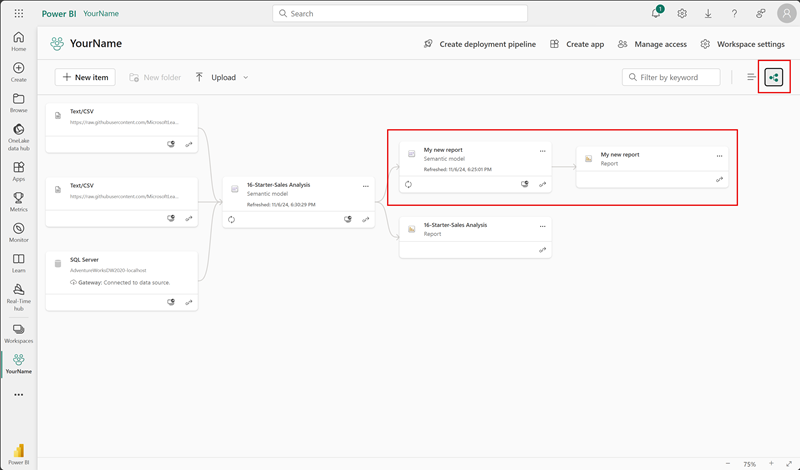

---
lab:
  title: 再利用可能な Power BI アセットを作成する
  module: Create reusable Power BI assets
---

# 再利用可能な Power BI アセットを作成する

この演習では、セマンティック モデルとレポートの開発をサポートする再利用可能なアセットを作成します。 このアセットには、Power BI プロジェクト ファイルやテンプレート ファイル、共有セマンティック モデルが含まれます。 最後に、これらのアイテムがPower BI サービス内でどのように相互に関連しているかを系列ビューで確認します。

   > 注: この演習は、Fabric ライセンスは必要なく、Power BI または Microsoft Fabric 環境ですべて行うことができます。

この演習の所要時間は約 **30** 分です。

## 開始する前に

この演習を開始するには、Web ブラウザーを開き、次の URL を入力して zip フォルダーをダウンロードする必要があります。

`https://github.com/MicrosoftLearning/mslearn-fabric/raw/refs/heads/main/Allfiles/Labs/16b/16-reusable-assets.zip`

フォルダーを **C:\Users\Student\Downloads\16-reusable-assets** フォルダーに展開します。

## レポートを Power BI サービスに発行する

このタスクでは、既存のレポートを使用して、他のレポートの開発に再利用する共有セマンティック モデルを作成します。

1. Web ブラウザーから、Fabric サービス ([https://app.fabric.microsoft.com](https://app.fabric.microsoft.com)) にアクセスしてサインインします。
1. Power BI エクスペリエンスに移動し、任意の一意の名前で新しいワークスペースを作成します。

    ![[+ 新しいワークスペース] ボタンが強調表示された [ワークスペース] ペインのスクリーンショット。](./Images/power-bi-new-workspace.png)

1. 新しいワークスペースの上部のリボンで、**[アップロード]、[参照]** の順に選択します。
1. 新しいエクスプローラー ダイアログ ボックスで、スターター *.pbix* ファイルに移動して選択し、**[開く]** を選択してアップロードします。
1. ワークスペース内に同じ名前の 2 つの異なるアイテムがあることが確認できます。

    - Report
    - セマンティック モデル

1. レポートを開き、使用されている色のテーマに注意します。 *これはタスクの後半で変更します。*
1. 今は Web ブラウザーを閉じることができます。

> Power BI *.pbix* ファイルには、セマンティック モデルとレポートのビジュアルの両方が入っています。 サービスにレポートを発行すると、これらのアイテムは分離されます。 この分離は後でもう一度確認します。

## 新しい Power BI プロジェクトを作成する

このタスクでは、発行したセマンティック モデルに接続してレポートを作成し、Power BI プロジェクト ファイル (*.pbip*) として保存します。 Power BI プロジェクト ファイルでは、ソース管理を使用するフラット ファイルにレポートとセマンティック モデルの詳細が格納されます。 Visual Studio Code を使用して、これらのファイルを変更したり、Git により変更を追跡したりできます。

1. デスクトップから Power BI Desktop アプリを開き、空のレポートを作成します。

    > メッセージが表示されたら、Fabric サービスで使用しているものと同じアカウントでサインインします。

1. **[ファイル]** >  - **[オプションと設定]** >  - **[オプション]** >  - **[プレビュー機能]** を選択して、**[TMDL 形式を使用してセマンティック モデルを保存する]** オプション、**[OK]** の順に選択します。

    > すると、現在プレビュー機能である表形式モデル定義言語 (TMDL) を使用してセマンティック モデルを保存するオプションが有効になります。

1. Power BI Desktop の再起動を求められた場合は、演習を続行する前に再起動してください。

    ![[プレビュー機能] カテゴリで使用できるオプションのスクリーンショット。](./Images/power-bi-enable-tmdl.png)

1. **[名前を付けて保存]** を選択し、ファイルの名前を設定するときにドロップダウン メニューの矢印を選択することでファイルの種類を選択します。
1. **.pbip** ファイル拡張子を選択し、レポートの名前を選択して、忘れにくいフォルダーに保存します。

    ![ドロップダウン メニューが展開された [名前を付けて保存] 選択のスクリーンショット。](./Images/power-bi-save-file-types.png)

1. Power BI Desktop ウィンドウの上部で、レポート名の横に **"(Power BI プロジェクト)"** が表示されていることに注意してください。
1. [ホーム] リボンで、**[データを取得] - [Power BI セマンティック モデル]** に移動し、発行したセマンティック モデルに接続します。

    ![[データを取得] セクションの Power BI セマンティック モデル コネクタのスクリーンショット。](./Images/power-bi-connect-semantic-models.png)

1. 接続すると、[データ] ペインに 9 つのテーブルが表示されるはずです。
1. ファイルをもう一度**保存**します。

### Power BI プロジェクト ファイルの詳細を確認する

Power BI Desktop の変更が .tmdl ファイルにどのように反映されるかを見てみましょう。

1. デスクトップからファイル エクスプローラーを使用して、**.pbip** ファイルを保存したフォルダーに移動します。
1. 次のアイテムが表示されるはずです。

    - YourReport.pbip ファイル
    - YourReport.Report フォルダー
    - YourReport.SemanticModel フォルダー
    - .gitignore Git Ignore ソース ファイル

## レポートに新しいテーブルを追加する

セマンティック モデルには必要なすべてのデータが揃っていないため、このタスクでは新しいテーブルを追加します。

1. Power BI Desktop で、**[データを取得] - [Web]** に移動して、新しいデータを追加します。
1. DirectQuery 接続が必要というメッセージを確認します。 **[ローカル モデルの追加]** を選択して次に進みます。
1. 新しいダイアログ ボックスに、選択できるデータベースとテーブルが表示されます。 すべて選択し、**送信**します。

    > セマンティック モデルは、SQL Server Analysis Server データベースとして扱われています。

1. 接続すると、[Web から] ダイアログ ボックスがポップアップ表示されます。 [基本] ラジオ ボタンは選択したままにします。 URL パスとして次のファイル パスを入力します。

    `C:\Users\Student\Downloads\16-reusable-assets\us-resident-population-estimates-2020.html`

1. **[HTML Tables] - [Table 2]** のボックスを選択し、**[データの変換]** を選択して次に進みます。

    ![読み込むまたは変換するコンテンツを選択する [ナビゲーター] ダイアログ ボックスのスクリーンショット。](./Images/power-bi-navigator-html.png)

1. 新しい Power Query エディター ウィンドウが、Table 2 のデータ プレビューが表示されて開きます。
1. **テーブル 2** の名前を「*US Population*」（米国の人口）に変更します。
1. STATE の名前を「**State**」(州) に、NUMBER の名前を「**Population**」(人口) に変更します。
1. [RANK] 列を削除します。
1. **[閉じて適用]** を選択して、変換されたデータをセマンティック モデルに読み込みます。
1. *潜在的なセキュリティ リスク*のダイアログ ボックスが表示された場合は、**[OK]** を選択します。
1. ファイルを**保存**します。
1. メッセージが表示された場合は、Power BI レポートの拡張形式に**アップグレードしないでください**。

### Power BI プロジェクト ファイルの詳細を確認する

このタスクでは、Power BI Desktop でレポートに変更を加え、フラットな .tmdl ファイルの変更を確認します。

1. エクスプローラーで、***YourReport*.SemanticModel** ファイル フォルダーを見つけます。
1. 定義フォルダーを開き、さまざまなファイルがあることを確認します。
1. メモ帳で **relationships.tmdl** ファイルを開き、9 つのリレーションシップが記載されていることを確認します。  ファイルを閉じます。
1. Power BI Desktop に戻り、リボンの **[モデリング]** タブにアクセスします。
1. **[リレーションシップの管理]** を選択し、9 つのリレーションシップがあることを確認します。
1. 新しいリレーションシップを次のように作成します。
    - **リレーションシップ元**: State-Province がキー列である 「Reseller」(リセラー)
    - **リレーションシップ先**: State がキー列である 「US Population」(米国の人口)
    - **カーディナリティ**: 多対一 (*:1)
    - **クロス フィルターの方向**: 両方

    

1. ファイルを**保存**します。
1. **relationships.tmdl** ファイルに戻り、新しいリレーションシップが追加されたことを確認します。

> フラット ファイルでのこれらの変更は、バイナリである *.pbix* ファイルとは異なり、ソース管理システムで追跡できます。

## メジャーとビジュアルをレポートに追加する

このタスクでは、メジャーとビジュアルを追加してセマンティック モデルを拡張し、そのメジャーをビジュアルで使用します。

1. Power BI Desktop で、[データ] ペインに移動し、"売上" テーブルを選択します。
1. コンテキストの [テーブル ツール] リボンにある **[新しいメジャー]** を選択します。
1. 数式バーに次のコードを入力してコミットします。

    ```DAX
    Sales per Capita =
    DIVIDE(
        SUM(Sales[Sales]),
        SUM('US Population'[Population])
    )
    ```

1. 新しい **[Sales per Capita]** (1 人当たりの売上) メジャーを見つけて、キャンバスにドラッグします。
1. **Sales \| Sales** と **US Population \| State** と **US Population \| Population** フィールドを同じビジュアルにドラッグします。

   > "このラボでは、フィールドを参照するために簡略表記を使用します。*次のようになります。**Sales \| Unit Price**。この例では、**Sales** はテーブル名、**Unit Price** はフィールド名です。"*

1. ビジュアルを選択し、**テーブル**に変更します。
1. "1 人当たりの売上" データと人口データの書式に一貫性がないことを確認します。
1. [データ] ペインで各フィールドを選択し、書式と小数点以下の桁数を変更します。
    - 1 人当たりの売上: 通貨 \| 小数点以下 4 桁
    - 人口: 整数 \| コンマ区切り \| 小数点以下 0 桁

    ![書式設定が構成された [1 人当たりの売上] メジャーのスクリーンショット。](./Images/power-bi-measure-details.png)

    > ヒント: 誤って間違ったテーブルにメジャーを作成した場合は、前の画像に示すように、[ホーム] テーブルを簡単に変更できます。

1. ファイルを保存します。

> テーブルは、4 つの列と正しく書式設定された数値で構成されて次の画像のようになるはずです。

![[州]、[人口]、[1 人当たりの売上]、[売上の合計] を示す数行で構成されたテーブル ビジュアルのスクリーンショット。](./Images/power-bi-sales-per-capita-table.png)

## Power BI テンプレート (.pbit) ファイルを構成する

このタスクでは、軽量ファイルを他のユーザーと共有してコラボレーションを向上できるように、テンプレート ファイルを作成します。

1. Power BI Desktop のリボンの [挿入] タブに移動し、**[画像]** を選択します。 ダウンロード フォルダーに移動し、`AdventureWorksLogo.jpg` ファイルを選択します。
1. この画像を左上隅に配置します。
1. 新しいビジュアルを選択し、**Sales \| Profit** および **Product \| Category** を追加します。

    > 次のスクリーンショットでは、ドーナツ グラフを使用しました。

    ![[利益] と [カテゴリ] のドーナツ グラフと、直前のタスクで作成されたテーブルのスクリーンショット。](./Images/power-bi-donut-table-default.png)

1. 凡例に 4 つの異なる色があることに注意してください。
1. リボンの **[表示]** タブに移動します。
1. **[テーマ]** の横にある矢印を選択して、すべての選択肢を展開して表示します。
1. このレポートに適用する**アクセシビリティ対応テーマ**のいずれかを選択します。

    > これらのテーマは、レポート閲覧者のアクセシビリティを高めるために特別に作成されています。

1. [テーマ] をもう一度展開し、**[現在のテーマをカスタマイズ]** を選択します。

    ![展開された [テーマ] セクションのスクリーンショット。](./Images/power-bi-theme-blade.png)

1. [テーマのカスタマイズ] ウィンドウで、**[テキスト]** タブに移動します。各セクションのフォント ファミリを Segoe UI フォントに変更します。

    ![[テキスト] セクションと Segoe UI Semibold が展開されて強調表示されたフォント ファミリのスクリーンショット。](./Images/power-bi-customize-theme-fonts.png)

1. 完了したら、変更を**適用**します。
1. 新しいテーマが適用されたビジュアルのさまざまな色に注意してください。

    

1. **[ファイル]、[名前を付けて保存]** の順に選択して、*.pbit* ファイルを作成します。
1. ファイルの種類を *.pbit* に変更し、*.pbip* ファイルと同じ場所に保存します。
1. このテンプレートを使用した場合にユーザーが期待できることの説明を入力し、[OK] を選択します。
1. エクスプローラーに戻って *.pbit* ファイルを開き、見た目が *.pbip* ファイルとまったく同じであることを確認します。

    > この演習では、セマンティック モデルのない標準のレポート テーマ テンプレートのみが目的です。

1. この同じ新しいファイルで、キャンバスから 2 つのビジュアルを削除します。
1. ホーム リボンで **[データの変換]** を選択します。
1. Power Query エディターで、**[US Population]** クエリを選択し、右クリックして削除します。
1. リボンで [データ ソースの設定] を選択し、**[AS への DirectQuery - Power BI セマンティック モデル]** データ ソースを削除して**閉じます**。
1. **閉じて適用**
1. [テーマ] に戻り、変更したアクセシビリティ対応テーマが引き続きレポートに適用されていることを確認します。
1. また、[データ] ペインの *"データがまだ読み込まれていない"* というメッセージにも注意してください。
1. 以前に使用したものと同じ名前の *.pbit* ファイルで**保存**して、ファイルを上書きします。
1. 無題ファイルを保存せずに閉じます。 他の *.pbip* ファイルはまだ開いたままのはずです。

> これで、事前に読み込まれたデータのない一貫したテーマのテンプレートが作成されました。

## アセットを公開して探索する

このタスクでは、Power BI プロジェクト ファイルを発行し、サービスの系列ビューを使用して関連アイテムを確認します。

> 重要: HTML データ ソースを追加したときに、ローカル DirectQuery モデルを作成しました。 発行されたレポートでは、ゲートウェイがオンプレミスのデータにアクセスする必要があるため、エラーが発生します。 これは、このタスクの内容には影響しませんが、混乱を招く可能性があります。

1. Power BI プロジェクト ファイルで、**[発行]** を選択します。
1. メッセージが表示された場合は、ファイルを**保存**します。
1. メッセージが表示された場合に、*PBIR* バージョンを**アップグレードしないでください**。
1. この演習の開始時に作成したワークスペースを選択します。
1. ファイルが発行されたが切断されたことを示すメッセージが表示されたときは、**['YourReport.*.pbip*' を Power BI で開く]** を選択します。

    

1. ワークスペースに移動すると、前のセマンティック モデルとレポート、および新しいセマンティック モデルとレポートを確認できます。
1. [ワークスペースの設定] の下の右隅にある **[系列ビュー]** を選択して、新しいレポートが他のデータ ソースにどのように依存しているかを確認します。

    

> セマンティック モデルが他のセマンティック モデルに関連する場合、この状態をチェーンといいます。 このラボでは、スターター セマンティック モデルが新しく作成されたセマンティック モデルにチェーンされ、専用の目的での再利用が可能になっています。

## クリーンアップ

この演習が無事完了しました。 Power BI プロジェクトファイルとテンプレート ファイル、および特殊なセマンティック モデルとレポートを作成しました。 ワークスペースとすべてのローカル アセットを安全に削除できます。
