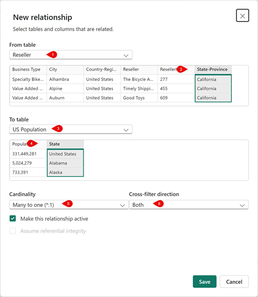

---
lab:
  title: 再利用可能な Power BI アセットを作成する
  module: Create reusable Power BI assets
---

# 再利用可能な Power BI アセットを作成する

この演習では、セマンティック モデルとレポートの開発をサポートする再利用可能な資産を作成します。 これらの資産には、Power BI のプロジェクトとテンプレートのファイルが含まれます。

   > 注: この演習では、Fabric ライセンスは必要なく、Power BI または Power BI ライセンスを使用した Microsoft Fabric 環境で完了できます。

この演習の所要時間は約 **30** 分です。

## 開始する前に

この演習を開始するには、Web ブラウザーを開き、次の URL を入力して zip フォルダーをダウンロードする必要があります。

`https://github.com/MicrosoftLearning/mslearn-fabric/raw/refs/heads/main/Allfiles/Labs/16b/16-reusable-assets.zip`

zip ファイルを **C:\Users\Student\Downloads\16-reusable-assets** フォルダーに抽出します。

## 新しい Power BI プロジェクトを作成する

このタスクでは、レポートを Power BI プロジェクト ファイル (*.pbip*) として保存します。 Power BI プロジェクト ファイルでは、ソース管理を使用するフラット ファイルにレポートとセマンティック モデルの詳細が格納されます。 Visual Studio Code を使用して、これらのファイルを変更したり、Git により変更を追跡したりできます。

1. **16-reusable-assets** フォルダー内の **16-Starter-Sales Analysis.pbix** ファイルを開きます。

1. **[ファイル]** >  - **[オプションと設定]** >  - **[オプション]** >  - **[プレビュー機能]** を選択して、**[TMDL 形式を使用してセマンティック モデルを保存する]** オプション、**[OK]** の順に選択します。

    > すると、現在プレビュー機能である表形式モデル定義言語 (TMDL) を使用してセマンティック モデルを保存するオプションが有効になります。 Power BI Desktop の再起動を求められた場合は、演習を続行する前に再起動してください。

    ![[プレビュー機能] カテゴリで使用できるオプションのスクリーンショット。](./Images/power-bi-enable-tmdl.png)

1. **[名前を付けて保存]** を選択し、ファイルに名前を付けるときにドロップダウン メニューの矢印を選択して、ファイルの種類を選択します。

1. **.pbip** ファイル拡張子を選択し、レポートの名前を選択して、忘れにくいフォルダーに保存します。

    ![ドロップダウン メニューが展開された [名前を付けて保存] 選択のスクリーンショット。](./Images/power-bi-save-file-types.png)

1. Power BI Desktop ウィンドウの上部で、レポート名の横に **"(Power BI プロジェクト)"** が表示されていることに注意してください。

1. Power BI Desktop を**閉じて**、メッセージが表示されたら変更を保存します。

1. Power BI Desktop を**再度開き**、保存した **.pbip** ファイルを開きます。

1. TMDL 形式を使用するようにプロジェクトに**アップグレード**を求められたら、**[アップグレード]** を選択して、セマンティック モデルの表形式モデル定義言語形式を有効にします。

    > このアップグレードは、TMDL 形式を使用してセマンティック モデルを格納するために必要です。これにより、次の手順で .tmdl ファイルを確認できます。

1. ファイルを**保存**します。

### Power BI プロジェクト ファイルの詳細を確認する

Power BI Desktop の変更が .tmdl ファイルにどのように反映されるかを見てみましょう。

1. デスクトップからファイル エクスプローラーを使用して、**.pbip** ファイルを保存したフォルダーに移動します。
1. 次のアイテムが表示されるはずです。

    - YourReport.pbip ファイル
    - YourReport.Report フォルダー
    - YourReport.SemanticModel フォルダー
    - .gitignore Git Ignore ソース ファイル

## レポートに新しいテーブルを追加する

セマンティック モデルには必要なすべてのデータが揃っていないため、このタスクでは新しいテーブルを追加します。

1. Power BI Desktop で、**[データを取得] - [Web]** に移動して、新しいデータを追加します。

1. 接続すると、[Web から] ダイアログ ボックスがポップアップ表示されます。 **[基本]** ラジオ ボタンは選択したままにします。 URL パスとして次のファイル パスを入力します。

    `C:\Users\Student\Downloads\16-reusable-assets\us-resident-population-estimates-2020.html`

1. **[HTML Tables] - [Table 2]** のボックスを選択し、**[データの変換]** を選択して次に進みます。

    ![読み込むまたは変換するコンテンツを選択する [ナビゲーター] ダイアログ ボックスのスクリーンショット。](./Images/power-bi-navigator-html.png)

1. 新しい Power Query エディター ウィンドウが、Table 2 のデータ プレビューが表示されて開きます。
1. **テーブル 2** の名前を「*US Population*」（米国の人口）に変更します。
1. STATE の名前を「**State**」(州) に、NUMBER の名前を「**Population**」(人口) に変更します。
1. [RANK] 列を削除します。
1. **[閉じて適用]** を選択して、変換されたデータをセマンティック モデルに読み込みます。
1. *潜在的なセキュリティ リスク*のダイアログ ボックスが表示された場合は、**[OK]** を選択します。
1. ファイルを**保存**します。
1. メッセージが表示された場合は、Power BI レポートの拡張形式に**アップグレードしないでください**。

### リレーションシップの作成

このタスクでは、Power BI Desktop でレポートに変更を加え、フラットな .tmdl ファイルの変更を確認します。

1. エクスプローラーで、***YourReport*.SemanticModel** ファイル フォルダーを見つけます。
1. 定義フォルダーを開き、さまざまなファイルがあることを確認します。
1. メモ帳で **relationships.tmdl** ファイルを開き、9 つのリレーションシップが記載されていることを確認します。  ファイルを閉じます。
1. Power BI Desktop に戻り、リボンの **[モデリング]** タブにアクセスします。
1. **[リレーションシップの管理]** を選択し、9 つのリレーションシップがあることを確認します。
1. 新しいリレーションシップを次のように作成します。
    - **リレーションシップ元**: State-Province がキー列である 「Reseller」(リセラー)
    - **リレーションシップ先**: State がキー列である 「US Population」(米国の人口)
    - **カーディナリティ**: 多対一 (*:1)
    - **クロス フィルターの方向**: 両方

    

1. ファイルを**保存**します。
1. **relationships.tmdl** ファイルに戻り、新しいリレーションシップが追加されたことを確認します。

> フラット ファイルでのこれらの変更は、バイナリである *.pbix* ファイルとは異なり、ソース管理システムで追跡できます。

## メジャーとビジュアルをレポートに追加する

このタスクでは、メジャーとビジュアルを追加してセマンティック モデルを拡張し、そのメジャーをビジュアルで使用します。

1. Power BI Desktop で、[データ] ペインに移動し、"売上" テーブルを選択します。
1. コンテキストの [テーブル ツール] リボンにある **[新しいメジャー]** を選択します。
1. 数式バーに次のコードを入力してコミットします。

    ```DAX
    Sales per Capita =
    DIVIDE(
        SUM(Sales[Sales]),
        SUM('US Population'[Population])
    )
    ```

1. 新しい **[Sales per Capita]** (1 人当たりの売上) メジャーを見つけて、キャンバスにドラッグします。
1. **Sales \| Sales** と **US Population \| State** と **US Population \| Population** フィールドを同じビジュアルにドラッグします。

   > "このラボでは、フィールドを参照するために簡略表記を使用します。*次のようになります。**Sales \| Unit Price**。この例では、**Sales** はテーブル名、**Unit Price** はフィールド名です。"*

1. ビジュアルを選択し、**テーブル**に変更します。
1. "1 人当たりの売上" データと人口データの書式に一貫性がないことを確認します。
1. [データ] ペインで各フィールドを選択し、書式と小数点以下の桁数を変更します。
    - 1 人当たりの売上: 通貨 \| 小数点以下 4 桁
    - 人口: 整数 \| コンマ区切り \| 小数点以下 0 桁

    ![書式設定が構成された [1 人当たりの売上] メジャーのスクリーンショット。](./Images/power-bi-measure-details.png)

    > ヒント: 誤って間違ったテーブルにメジャーを作成した場合は、前の画像に示すように、[ホーム] テーブルを簡単に変更できます。

1. ファイルを保存します。

    > 注:テーブルは、4 つの列と正しく書式設定された数値を含む次の図のようになるはずです。

    ![[州]、[人口]、[1 人当たりの売上]、[売上の合計] を示す数行で構成されたテーブル ビジュアルのスクリーンショット。](./Images/power-bi-sales-per-capita-table.png)


1. メモ帳を開く
1. ファイルを開きます: `C:\Users\Student\Downloads\16-Starter-Sales Analysis.SemanticModel\definition\tables\Sales.tmdl`
1. 次のようにメジャーが追加されたことを確認できる 163 行目付近のコードを見つけます。
   
    ```tmdl
    
        measure 'Sales per Capita' =
                
                DIVIDE(
                    SUM(Sales[Sales]),
                    SUM('US Population'[Population])
                )
            formatString: \$#,0.0000;(\$#,0.0000);\$#,0.0000
            lineageTag: c95a1828-af50-484b-8310-64614fe2504b
    
            annotation PBI_FormatHint = {"currencyCulture":"en-US"}
    ```

1. メモ帳を閉じます。
2. Power BI Desktop を閉じます。 変更を保存する必要はありません。

## 再利用可能な Power BI テンプレート (PBIT) を作成する

演習のこの次のパートの目標は、Power Query パラメーター (この場合は **Region** パラメーター) を使用して、**Power BI テンプレート (PBIT ファイル)** のデータからレポート ロジックを分離する方法を示すことです。 小さなレポートを作成し、どの地域のデータを読み込むかを制御するパラメーターを定義してから、レポートを再利用可能なテンプレートとしてエクスポートします。 テンプレートを再度開くと、ユーザーは地域の値を選択するだけで、対応するデータセットがレポートによって自動的に読み込まれます。これにより、テンプレートによって、同じデータ モデルの複数のバリエーションにわたるスケーラブルで標準化されたレポートがどのように可能になるかが示されます。

### 地域の売上データを調べる

1. エクスプローラーを開き、地域のデータが格納されているフォルダーに移動します。 これは、`C:\Users\student\Downloads\16-reusable-assets\data` のようになります。 このフォルダー内には、次の 2 つの CSV ファイルがあります。
   
   - region-north.csv
   - region-south.csv

1. 各ファイルを開き (メモ帳、Excel、または任意のテキスト エディターを使用できます)、内容を調べます。 データの構造、使用可能な列、および 2 つの地域のデータセットの類似性を確認します。 北と南の地域に注目してください。 この知識は、Power BI が後で読み込む内容と、Region パラメーターを使用してそれらを切り替える方法を理解するのに役立ちます。

### Power BI レポートの作成とデータの読み込み

1. Power BI Desktop を開き、空白のレポートを作成します。
1. **[ホーム]** リボンで、**[データの取得]** を選択し、**[テキスト/CSV]** を選択します。
1. `C:\Users\Student\Downloads\16-reusable-assets\data\region-north.csv` ファイルを読み込みます。
1. **[データの変換]** を選択します
1. クエリの名前を `sales` に変更します


### Power Query パラメーターを作成する

1. Power Query で、**[ホーム]** リボンの **[パラメーターの管理]** を選択し、**[新しいパラメーター]** を選択します。
1. 次の値でパラメーターを作成します。
   
    | プロパティ         | [値]                 |
    | ---------------- | --------------------- |
    | 名前             | `Region`.             |
    | Type             | Text                  |
    | 提案された値 | 値の一覧        |
    | テーブル            | north、south          |
    | Default Value    | north                 |
    | 現在の値    | north                 |

    ![Power BI Desktop の [パラメーターの管理] ダイアログのスクリーンショット。](./Images/manage-parameter.png)

### パラメーターを使用するようにクエリを変更する

ユーザーがテンプレートを開いたときに、Power BI で地域を選択できるようにする必要があります。

1. **sales** クエリをもう一度選択します。
1. **[表示]** リボンで、**[詳細エディター]** を選択します。
1. クエリが region-north.csv にハードコーディングされていることに注目してください

    ```powerquery
    let
        Source = Csv.Document(File.Contents("C:\Users\Student\Downloads\16-reusable-assets\data\region-north.csv"),[Delimiter=",", Columns=5, Encoding=1252, QuoteStyle=QuoteStyle.None]),
        #"Promoted Headers" = Table.PromoteHeaders(Source, [PromoteAllScalars=true]),
        #"Changed Type" = Table.TransformColumnTypes(#"Promoted Headers",{ {"Date", type date}, {"Region", type text}, {"Product", type text}, {"Units", Int64.Type}, {"Revenue", Int64.Type} })
    in
        #"Changed Type"
    ```
    
1. ハードコーディングされた地域 (north) をパラメーター **Region** に置き換えます。 
    
    ```m
    let
        Source = Csv.Document(File.Contents("C:\Users\Student\Downloads\16-reusable-assets\data\region-" & Region & ".csv"),[Delimiter=",", Columns=5, Encoding=1252, QuoteStyle=QuoteStyle.None]),
        #"Promoted Headers" = Table.PromoteHeaders(Source, [PromoteAllScalars=true]),
        #"Changed Type" = Table.TransformColumnTypes(#"Promoted Headers",{ {"Date", type date}, {"Region", type text}, {"Product", type text}, {"Units", Int64.Type}, {"Revenue", Int64.Type} })
    in
        #"Changed Type"
    ```
    
    > **注**:Power Query (M 言語) では、テキスト値を引用符 " " で囲む必要があります。また、アンパサンド & 演算子を使用してテキスト部分を結合 (連結) する必要があります。

1. **[ホーム]** リボンから **[閉じて適用]** を選択します。

### シンプルなレポートを作成する

1. レポート ビューに戻ります。
1. 作成:
   - 合計収益を示すカード
   - 製品別の収益を示す縦棒グラフ
   - すべてのフィールドを示すテーブル

1. タイトル `Regional Sales Report Template` を追加します。

レポートはこのようになります。 レイアウトについては気にしないでください。


### テンプレートとして保存 (PBIT)

1. **[ホーム]** リボンで、**[ファイル]** > **[名前を付けて保存]** を選択します。
1. フォルダーの場所 (例: **[ダウンロード]**) を選択し、ファイル名を入力します。 たとえば、「 `regional-sales` 」のように指定します。
1. ファイル拡張子として **[PBIT]** を選択します。

    

1. テンプレートの説明を入力するように求められたら、次のテキストを入力します。

    ```txt
    Select your region.
    ```
    
    ![Power BI Desktop の [テンプレートのエクスポート] ダイアログのスクリーンショット。](./Images/export-template.png)

### テンプレートをテストする

1. Power BI Desktop を閉じます。 変更を保存するように求められたら、**[保存しない]** を選択できます。
1. `regional-sales.pbit` ファイルを開きます。
1. 地域の選択を求めるパラメーター プロンプトが表示されるはずです。 

    

1. ドロップダウン リストから **[south]** を選択します。
1. データを読み込み、レポートを開きます。

レポートが south-region の値で正しく開いていることに注目してください。


これで、完全に再利用可能なパラメーター化されたレポート フレームワークが作成されました。 

1. レポートを閉じます。保存する必要はありません。


## クリーンアップ

この演習が無事完了しました。 Power BI のプロジェクトとテンプレートのファイルを作成しました。 ワークスペースとすべてのローカル アセットを安全に削除できます。
