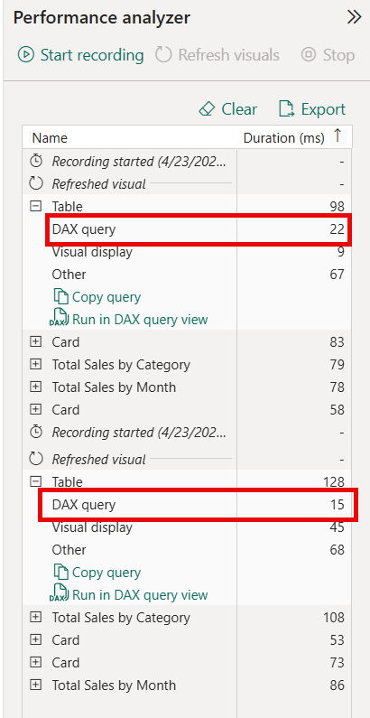

---
lab:
  title: セマンティック モデルのパフォーマンスを最適化する
  module: Optimize semantic model performance
  description: Power BI Desktop のパフォーマンス アナライザーを使用して、レポートのビジュアル パフォーマンスの診断、コストの高い DAX パターンの特定、最適化の適用、改善の確認を行います。
  duration: 30 minutes
  level: 300
  islab: true
  primarytopics:
    - Power BI
    - Semantic models
    - DAX optimization
    - Performance analyzer
  categories:
    - Semantic models
  courses:
    - DP-600
---

# セマンティック モデルのパフォーマンスを最適化する

この演習では、AdventureWorks の売上データに基づいて構築された Power BI Desktop レポートを開きます。 このレポートには、非効率的な DAX パターンを使用するメジャーが含まれています。 パフォーマンス アナライザーを使用して、タイミング データのキャプチャ、最もコストの高いビジュアルの特定、DAX クエリの分析、最適化の適用、改善を確認するための再測定を行います。 また、モデルの列統計を調べて、カーディナリティを調べます。 学習内容は次のとおりです。

- パフォーマンス アナライザーを使用して、レポート ビジュアルのタイミング データをキャプチャして解釈する。
- 低速な DAX クエリをエクスポートし、DAX クエリ ビューで分析する。
- 変数を使用して、コストの高い DAX パターンを特定して修正する。
- 列のカーディナリティを調べて、メモリ消費量が最も多い場所を把握する。
- 測定前と測定後を比較して、パフォーマンスの向上を確認する。

このラボの所要時間は約 **30** 分です。

> **ヒント:** 関連するトレーニング コンテンツについては、「[セマンティック モデルのパフォーマンスを最適化する](https://learn.microsoft.com/training/modules/optimize-semantic-model-performance/)」を参照してください。

## 開始する前に

この演習を完了するには、[Power BI Desktop](https://www.microsoft.com/download/details.aspx?id=58494) (2025 年 11 月以降) がインストールされている必要があります。 "注: UI 要素は、お使いのバージョンによって多少異なる場合があります。"**

1. Web ブラウザーを開き、次の URL を入力して、[16-optimize-performance zip フォルダー](https://github.com/MicrosoftLearning/mslearn-fabric/raw/refs/heads/main/Allfiles/Labs/16/16-optimize-performance.zip)をダウンロードします。

    `https://github.com/MicrosoftLearning/mslearn-fabric/raw/refs/heads/main/Allfiles/Labs/16/16-optimize-performance.zip`

1. このファイルを **[ダウンロード]** に保存し、zip ファイルの内容を **16-optimize-performance** フォルダーに抽出します。

1. 抽出したフォルダーから **16-Starter-Sales Analysis.pbix** ファイルを開きます。

    > **注**: 変更の適用を求める警告をすべて無視して閉じます。ただし、[変更の破棄] を選択しないでください。**

このファイルには、複数のビジュアルを含むレポート ページを使用する AdventureWorks 売上モデルが含まれています。 このモデルの一部のメジャーでは、非効率な DAX パターンが意図的に使用されており、それらを特定して修正します。

## パフォーマンス ベースラインをキャプチャする

このタスクでは、パフォーマンス アナライザーを使用して、各ビジュアルの読み込みに要する時間を測定します。 これらのタイミングはベースラインとして機能するため、最適化を適用した後に比較することができます。

1. Power BI Desktop で、**[Sales Overview]** レポート ページに移動します。

1. **[最適化]** リボンで、**[パフォーマンス アナライザー]** を選択します。

    レポート キャンバスの右側に [パフォーマンス アナライザー] ペインが開きます。

1. [パフォーマンス アナライザー] ペインで、**[記録の開始]** を選択します。

1. **[ビジュアルの更新]** を選択して、現在のページ上のすべてのビジュアルを再読み込みします。

1. すべてのビジュアルの読み込みが完了するまで待ってから、**[記録の停止]** を選択します。

1. パフォーマンス アナライザーの結果で、**[テーブル]** ビジュアルのエントリを展開します。 このテーブルには、Year、Total Sales、Sales YoY Growth が表示されます。

1. このビジュアルの **[DAX クエリ]** 時間 (ミリ秒) を書き留めます。 これがベースラインです。

    > **注**: AdventureWorks データセットの場合、クエリ時間が短くなる (500 ミリ秒未満) 場合があります。 これは想定内のことです。このデータセットは大きくないためです。 目標は、診断プロセスを学習することです。 80 ミリ秒から 30 ミリ秒に変化しただけでも、最適化が機能したことを示しています。 すべてのタイミングが同じに見える場合は、**[クリア]** を選択し、**[ビジュアルを更新]** をもう一度選択して、キャッシュされていない測定値を取得します。

## 速度の遅い DAX クエリを分析する

このタスクでは、**[テーブル]** ビジュアルの DAX クエリをエクスポートし、その構造を調べます。 次に、基になるメジャー数式を調べて、非効率なパターンを検出します。

1. [パフォーマンス アナライザー] ペインで、**[テーブル]** ビジュアルのエントリがまだ展開されていない場合は展開します。

1. **[DAX クエリ ビューで実行]** を選択します。 Power BI Desktop により、ビジュアルの生成されたクエリを含む DAX クエリ ビューが開かれます。

1. **[実行]** を選択して、クエリを実行します。 結果グリッドには、各会計年度の値 (`Total_Sales` と `Sales_YoY_Growth`) が表示されます。

1. 生成されたクエリを確認します。 次のような画面が表示されます。

    ```DAX
    DEFINE
        VAR __DS0Core = 
            SUMMARIZECOLUMNS(
                ROLLUPADDISSUBTOTAL('Date'[Year], "IsGrandTotalRowTotal"),
                "Total_Sales", 'Sales'[Total Sales],
                "Sales_YoY_Growth", 'Sales'[Sales YoY Growth]
            )

        VAR __DS0PrimaryWindowed = 
            TOPN(502, __DS0Core, [IsGrandTotalRowTotal], 0, 'Date'[Year], 1)

    EVALUATE
        __DS0PrimaryWindowed

    ORDER BY
        [IsGrandTotalRowTotal] DESC, 'Date'[Year]
    ```

    > このクエリは、メジャー定義そのものではありません。 Power BI によってこのクエリが生成され、ビジュアルが設定されます。 `SUMMARIZECOLUMNS` はデータを年別にグループ化し、`ROLLUPADDISSUBTOTAL` は総計行を追加し、`TOPN` は行数を制限します。 メジャー (`[Total Sales]` と `[Sales YoY Growth]`) は名前で参照されますが、モデル内に存在するため、それらの数式はここには表示されません。 実際のメジャー ロジックを表示するには、数式バーを見る必要があります。

1. もう一度**レポート ビュー**に切り替えます。 **[データ]** ペインで、**Sales** テーブルを展開し、**[Sales YoY Growth]** メジャーを選択します。 数式バーに、メジャー定義が表示されます。

    ```DAX
    Sales YoY Growth =
    DIVIDE(
        [Total Sales] - CALCULATE([Total Sales], SAMEPERIODLASTYEAR('Date'[Date])),
        CALCULATE([Total Sales], SAMEPERIODLASTYEAR('Date'[Date]))
    )
    ```

1. 数式を確認します。 `CALCULATE([Total Sales], SAMEPERIODLASTYEAR('Date'[Date]))` 式は、分子と分母に 2 回表示されますが、どちらの場合も同じ値が計算されます。 つまり、エンジンはクエリの各行に対して前年の売上計算を 2 回評価します。これは無駄です。

    このような非効率なパターンとしては一般的に次のようなものがあります。

    - **繰り返される部分式**: 同じ `CALCULATE` が複数回評価され、その結果は `VAR` に格納されない。
    - **テーブル全体に対する FILTER**: `CALCULATE` で列述語を使用するのではなく、`FILTER(Sales, ...)` で各行を反復処理する。
    - **COUNTROWS(FILTER(...))**: `CALCULATE(COUNTROWS(...), ...)`を使用するのではなく、フィルター処理されたテーブルを反復処理して行をカウントする。

**[Sales YoY Growth]** メジャーには繰り返される部分式があり、前年の計算が 2 回評価されます。 次のタスクでは、その部分式を変数に格納して、これを修正します。

## DAX メジャーを最適化する

このタスクでは、変数を使用して **[Sales YoY Growth]** メジャーを書き換え、前年の計算が 1 回だけ評価されるようにします。

1. **レポート ビュー**で、**[データ]** ペインから **[Sales YoY Growth]** メジャーを選択すると、数式が数式バーに表示されます。

1. 数式バー内のすべてのテキストを選択し、次の最適化されたバージョンに置き換えます。

    ```DAX
    Sales YoY Growth =
    VAR SalesPriorYear =
        CALCULATE([Total Sales], SAMEPERIODLASTYEAR('Date'[Date]))
    RETURN
        DIVIDE([Total Sales] - SalesPriorYear, SalesPriorYear)
    ```

    `VAR` は、前年の結果を 1 回格納します。 `RETURN` 式は、再計算せずに `SalesPriorYear` を 2 回参照します。

1. **Enter** キーを押して、数式の変更を確認します。

1. 数式を変更してもメジャーが正しい値を返すことを確認するには、**DAX クエリ ビュー** に切り替え、新しいクエリ タブを開き、次のクエリを実行します。

    ```DAX
    EVALUATE
    SUMMARIZECOLUMNS(
        'Date'[Year],
        "YoY Growth", [Sales YoY Growth]
    )
    ```

    その結果と前に確認した結果を比較します。 値は同じになるはずです。たとえば、依然として、2019 年度は約 0.7、2020 年度は約 0.18 と表示されます。 最適化によって速度は変化しますが、結果は変わりません。

    

## 列のカーディナリティを調べる

このタスクでは、`COLUMNSTATISTICS()` DAX 関数を使用して、各列に含まれる異なる値の数を確認します。 カーディナリティが高い列は、圧縮効率が低く、より多くのメモリを消費します。 カーディナリティが最も高い場所を把握すると、モデル設計について、情報に基づいた意思決定を行うのに役立ちます。

1. Power BI Desktop の **DAX クエリ ビュー**に切り替えます。

1. 新しいクエリ タブで、次のクエリを入力し、**[実行]** を選択します。

    ```DAX
    DEFINE
        VAR _stats = COLUMNSTATISTICS()
    EVALUATE
        FILTER(_stats, NOT CONTAINSSTRING([Column Name], "RowNumber-"))
    ORDER BY [Cardinality] DESC
    ```

    > 結果グリッドには、モデル内の列ごとに 1 行が返され、異なる値の数で並べ替えられます。 `FILTER` により、モデルの一部ではない内部システム列は除外されます。 カーディナリティが最も高い列が上部に表示されます。

1. 結果を確認し、カーディナリティが最も高い列が生成される場所を確認します。

    - カーディナリティが最も高いのは、**Sales** テーブルの **SalesOrderNumber** (3,616) で、ほぼ 1 行あたり 1 つの異なる値が含まれています。 これは、ファクト テーブルのトランザクション識別子では一般的です。
    - 2 番目は、**Date** テーブルの **Date** (1,826) です。 カレンダー テーブルは、実際の売上データよりも日付範囲が広いため、異なる値の数は、**Sales** テーブルの **OrderDate** (990) よりも多くなります。
    - **Cost** (1,430) と **Sales** (1,411) は、数値列のカーディナリティが高く、多くの異なる 10 進値が含まれます。 小数点以下の桁数を小さく丸めるのは、数値列のカーディナリティを減らす 1 つの方法です。
    - **ResellerKey** (701) と **Reseller** (699) はほぼ 1:1 であり、これはディメンション キーとそのラベルとしては想定どおりです。

1. ファクト テーブルの列 (**Sales**) が一覧の一番上に配置されていることに注意してください。 スター スキーマでは、ディメンション テーブルは小さいまま維持されますが、ファクト テーブルによってメモリ消費が促進されます。 これが、ファクト テーブルの最適化が最も大きな効果をもたらす理由です。

## 改善を確認する

Sales YoY Growth メジャーを最適化したので、このタスクでは、パフォーマンス アナライザーを再実行してベースラインと比較します。

1. **レポート ビュー**に切り替え、[パフォーマンス アナライザー] ペインがまだ開いていない場合は開きます。

1. **[クリア]** を選択し、**[記録の開始]** を選択します。

1. **[ビジュアルの更新]** を選択し、すべてのビジュアルの読み込みが完了するまで待ちます。

1. **[記録の停止]** を選択します。

1. **[テーブル]** ビジュアルのエントリを展開し、その **[DAX クエリ]** 時間と前に記録したベースラインを比較します。

    > **注**: このデータセットでは、絶対差が小さい場合があります。 重要なポイントはプロセス (測定 → 診断 → 修正→検証) です。

    

## Copilot を使ってみる (省略可能)

このタスクでは、DAX クエリ ビューで Copilot を使用して、DAX クエリを簡略化および最適化するための AI を利用した提案を取得します。

Power BI Desktop 環境で Copilot を使用できる場合は、次の追加の手順を試してください。

1. パフォーマンス アナライザーで、ビジュアルの **[クエリのコピー]** を選択します。

1. DAX クエリ ビューに切り替えます。 クエリを貼り付けて、Copilot に質問します。

    `Simplify this DAX query and suggest performance improvements.`

1. Copilot の提案を確認します。 それらを、適用した手動の最適化と比較します。

1. Copilot に質問する:

    `Explain why evaluating the same CALCULATE expression twice is slower than using a variable.`

1. 必要に応じて、最初からベスト プラクティスを使用して新しいメジャーを生成するように Copilot に依頼します。

    `Write a measure that calculates profit margin percentage using variables for Sales and Cost.`

> **注**: Copilot は、既に最適化したメジャーを変更することなく、新しい分析情報と提案を生成します。

## リソースをクリーンアップする

1. Power BI Desktop を閉じます。 ファイルを保存する必要はありません。
