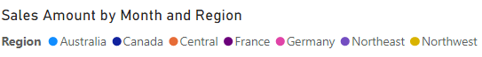
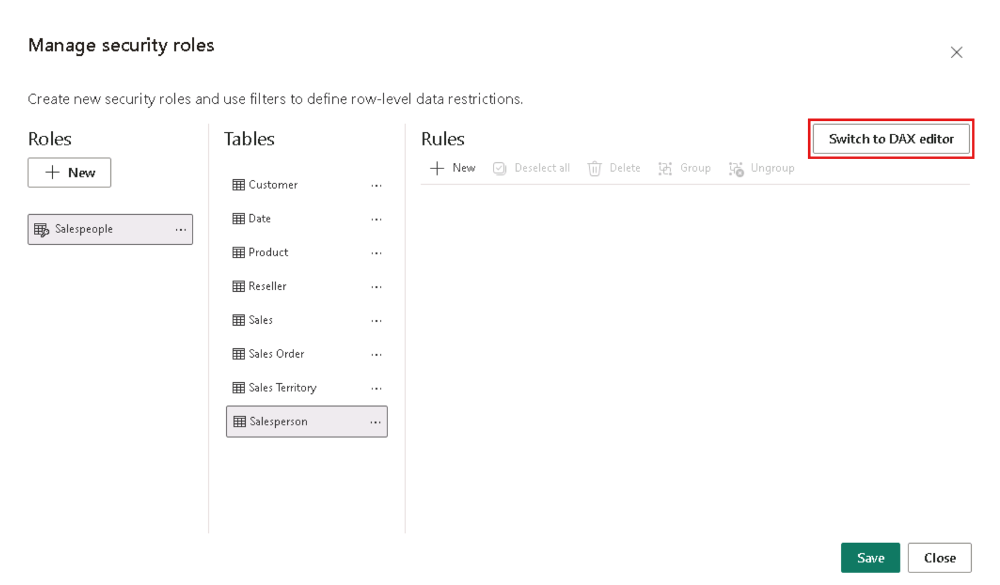

---
lab:
  title: セマンティック モデルのセキュリティを適用する
  module: Enforce semantic model security
  description: セキュリティ マッピング テーブルをインポートし、リレーションシップ フィルターの伝達を構成し、静的および動的な行レベルのセキュリティを Power BI セマンティック モデルに実装します。
  duration: 30 minutes
  level: 300
  islab: true
  primarytopics:
    - Power BI
    - Row-level security
  categories:
    - Semantic models
    - Security and governance
  courses:
    - DP-600
---

# セマンティック モデルのセキュリティを適用する

この演習では、Power BI セマンティック モデルに行レベル セキュリティ (RLS) を実装します。 まず、モデルを確認し、静的ロールを作成した後、営業担当者マッピング テーブルをインポートし、ユーザー ID に基づいてデータをフィルター処理する動的ロールを構成します。

この演習では、次の方法を学習します。

- Power Query を使用して、セキュリティ マッピング テーブルをインポートして準備する。
- セキュリティ フィルターの伝達を使用して双方向リレーションシップを構成する。
- DAX を使用して静的および動的ロールを作成する。
- さまざまなユーザー ID を使用してテストを行い、ロールの動作を検証する。

このラボの所要時間は約 **30** 分です。

> **ヒント:** 関連するトレーニング コンテンツについては、「[セマンティック モデルのセキュリティを適用する](https://learn.microsoft.com/training/modules/enforce-semantic-model-security/)」を参照してください。

## 環境を設定する

この演習を完了するには、[Power BI Desktop](https://www.microsoft.com/download/details.aspx?id=58494) (2025 年 11 月以降) がインストールされている必要があります。 "注: UI 要素は、お使いのバージョンによって多少異なる場合があります。"**

1. Web ブラウザーを開き、次の URL を入力して [17-enforce-security zip フォルダー](https://github.com/MicrosoftLearning/mslearn-fabric/raw/refs/heads/main/Allfiles/Labs/17/17-enforce-security.zip)をダウンロードします。

    `https://github.com/MicrosoftLearning/mslearn-fabric/raw/refs/heads/main/Allfiles/Labs/17/17-enforce-security.zip`

1. このファイルを **[ダウンロード]** に保存し、zip ファイルの内容を **17-enforce-security** フォルダーに抽出します。

1. 抽出したフォルダーから **17-Starter-Sales Analysis.pbix** を開きます。

    > **注**: セキュリティの警告で変更の適用が求められた場合は、**[無視]** または **[閉じる]** を選択します。 **[変更の破棄]** を選択しないでください。 データ ソース接続に関するメッセージが表示されたら、警告を無視します。このラボではデータを更新する必要はありません。

## データ モデルを確認する

このタスクでは、セマンティックモデルの構造を確認し、テーブル間の関係やセキュリティ フィルターを適用する必要がある場所を把握します。

1. Power BI Desktop で、左側にある **[モデル]** ビューに切り替えます。

    ![Power BI Desktop のナビゲーション ウィンドウで選択された [モデル ビュー] アイコンのスクリーンショット。](Images/model-view-pbid.png)

1. モデル ダイアグラムを確認して、テーブルのリレーションシップを確認します。

   > このモデルは、スター スキーマ内の 6 つのディメンション テーブルと 1 つのファクト テーブルで構成されます。 `Sales` ファクト テーブルには、販売注文の詳細が保存されます。

    

1. `Sales Territory` テーブルを展開して、その列を表示します。

1. テーブル内で `Region` 列を見つけます。 `Region` 列には、Adventure Works の販売地域が格納されます。

この組織では、営業担当者は、割り当てられた販売地域に関連するデータの表示のみが許可されています。

## 静的ロールを作成する

RLS の最も簡単な形式は静的ロールであり、DAX フィルターによってフィールド値がハードコーディングされます。 静的ロールは、データ ドリブン アプローチに移行する前に RLS のしくみを理解するのに役立ちます。 このセクションでは、2 つの静的ロール (地域ごとに 1 つ) を作成し、それぞれが正しくフィルター処理されることを検証します。

このタスクでは、2 つの地域の `Sales Territory` テーブルに対する静的フィルターを定義します。

1. **レポート** ビューに切り替えます。

1. 積み上げ縦棒グラフにすべての地域のデータが表示されていることに注意してください。 これは、RLS が適用されると変更されます。

    

1. **[モデリング]** リボンの **[セキュリティ]** グループで、**[ロールの管理]** を選択します。

    ![[セキュリティ] グループの [ロールの管理] オプションがある [モデリング] リボンのスクリーンショット。](Images/enforce-model-security-image13.png)

1. **[+ 新規]** を選択し、ロールに `Australia` という名前を付け、`Sales Territory` テーブルを選択します。

1. **[ルール]** セクションで、**[+ 新規]** を選択し、フィルターを構成します。

    - **列** = `Region`
    - **条件**: 次の値と等しい
    - **Value** = `Australia`

    ![オーストラリア地域のフィルター構成を示す [ルール] セクションのスクリーンショット。](Images/enforce-model-security-image16.png)

1. **[ロール]** セクションで **[+ 新規]** をもう一度選択して、`Canada` という名前の 2 つ目のロールを追加し、`Canada` に同じフィルターを適用し、**[保存]** します。

### 静的ロールを検証する

このタスクでは、各ロールによって、レポートが割り当てられたリージョンに制限されることを確認します。

1. **[モデリング]** リボンで、**[表示方法]** を選択し、`Australia` ロールを選択して、**[OK]** を選択します。

1. グラフにオーストラリアのデータのみが表示されていることを確認し、**[表示の停止]** を選択します。

1. `Canada` ロールに対して繰り返し、カナダのデータのみが表示されたことを確認した後、**[表示の停止**] を選択します。

静的ロールは機能しますが、スケーリングされません。 すべての新しい地域には新しいロール定義が必要であり、変更はセマンティック モデルの更新と再発行を意味します。 Adventure Works の 11 の地域では、11 個のロールを作成して維持する必要があり、その数はビジネスに合わせて増加します。

## Salesperson テーブルを追加する

動的 RLS には、各ユーザー ID を販売地域にリンクするマッピング テーブルが必要です。 このセクションでは、`Salesperson` テーブルを CSV ファイルからインポートし、Power Query で準備し、セキュリティ フィルターが正しく伝達されるようにリレーションシップを構成します。

### CSV をインポートする

このタスクでは、Power Query を使用して、抽出された zip フォルダーに含まれる CSV ファイルから `Salesperson` データをインポートします。

1. **[ホーム]** リボンで、**[データの取得]**  >  **[テキスト/CSV]** の順に選択します。

1. 抽出した **17-enforce-security** フォルダーに移動し、**[Salesperson.csv]** を選択して、**[開く]** を選択します。

1. プレビュー ウィンドウで、`EmployeeKey`、`SalesTerritoryKey`、`EmailAddress` の 3 つの列が表示されていることを確認します。

1. **[データの変換]** を選択して、Power Query エディターを開きます。

    > **注**: **[読み込み]** ではなく **[データの変換]** を選択すると、列をモデルに読み込む前にその名前を変更できます。

### 列名の変更

このタスクでは、動的 RLS の ID フィールドとしての目的を明確にするために、`EmailAddress` 列の名前を `UPN` (ユーザー プリンシパル名) に変更します。

1. Power Query エディターで、`EmailAddress` 列のヘッダーを右クリックし、**[名前の変更]** を選択します。

1. テキストを `UPN` に置き換え、**Enter** キーを押します。

    "UPN はユーザー プリンシパル名の略です。この列の値は、DAX 関数 USERPRINCIPALNAME() で返される Microsoft Entra アカウント名と一致します。"**

1. **[ホーム]** リボンで、**[閉じて適用]** を選択して、テーブルをモデルに読み込みます。

### リレーションシップを作成して構成する

このタスクでは、`Salesperson` テーブルと `Sales Territory` テーブルの間にリレーションシップを作成し、セキュリティ フィルターが双方向に伝達されるように構成します。

1. **[モデル]** ビューに切り替えます。

1. `Salesperson` テーブルの `SalesTerritoryKey` フィールドを `Sales Territory` テーブルの `SalesTerritoryKey` フィールドにドラッグしてリレーションシップを作成します。

    > **注**: テーブルの読み込み時にリレーションシップが自動的に作成された場合は、このドラッグ手順をスキップして、リレーションシップのプロパティの構成に進むことができます。

1. `Salesperson` と `Sales Territory` の間のリレーションシップを右クリックし、**[プロパティ]** を選択します。

1. **[リレーションシップの編集]** ウィンドウで、**[クロス フィルター方向]** を **[両方]** に設定します。

1. **[両方向にセキュリティ フィルターを適用する]** チェックボックスをオンにし、**[OK]** を選択します。

    ![[クロス フィルター方向] が [両方] に設定され、[両方向にセキュリティ フィルターを適用する] チェックボックスがオンになっている [リレーションシップの編集] ダイアログ ボックスのスクリーンショット。](Images/enforce-model-security-image58.png)

`Sales Territory` テーブルには、`Salesperson` テーブルとの一対多リレーションシップがあります。 既定では、フィルターは "一" 側 (`Sales Territory`) から "多" 側 (`Salesperson`) にのみフローします。

`Salesperson` のセキュリティ フィルターを `Sales Territory` に伝達し、次に `Sales` に伝達するには、セキュリティ フィルター オプションを使用して双方向のクロスフィルター処理を有効にする必要があります。

### Salesperson テーブルを非表示にする

このタスクでは、`Salesperson` テーブルを非表示にして、レポート作成ツールや Q&A に表示されないようにします。

1. モデル ビューで、`Salesperson` テーブルのヘッダーを選択します。

1. 右クリックして、**[レポート ビューで非表示]** を選択します (または、テーブルの右上にある目のアイコンを選択します)。

    `Salesperson` テーブルは、データ アクセス許可を適用するためだけに存在します。これを非表示にすると、レポート作成者が誤ってビジュアルで使用したり、`UPN` データを公開したりするのを防止できます。**

## 動的ロールを作成する

動的 RLS を使用すると、地域ごとに 1 つのロールを作成して維持することを回避できます。 サインインしているユーザー ID に行をフィルター処理すると、単一のロールですべてのユーザーに対応できます。

このセクションでは、`Salesperson` テーブルをユーザー プリンシパル名でフィルター処理する動的ロールを 1 つ作成します。

1. **[モデリング]** リボンの **[セキュリティ]** グループで、**[ロールの管理]** を選択します。

    ![[セキュリティ] グループの [ロールの管理] オプションが強調表示されている [モデリング] リボンのスクリーンショット。](Images/enforce-model-security-image39.png)

1. **[+ 新規]** を選択し、ロールに `Salespeople` という名前を付け、`Salesperson` テーブルを選択した後、**[DAX エディターに切り替える]** を選択します。

    

1. 次の式を入力します。

    ```DAX
    [UPN] = USERPRINCIPALNAME()
    ```

1. **[保存]** を選択します。

この式は、`UPN` の値が認証されたユーザーの ID と一致する行のみを保持します。 前に構成した双方向セキュリティ フィルターのため、このフィルターは `Salesperson`  ->  `Sales Territory`  ->  `Sales` の順に伝達され、ユーザーは割り当てられた地域のデータのみに制限されます。

## 動的ロールを検証する

このセクションでは、マッピングされたユーザーとマッピングされていないユーザーの動的ロールをテストし、単一のロールがユーザー ID に基づいて異なる結果を返すことを実証します。

### ロールを別のモデル ユーザーとしてテストする

このタスクでは、別の ID の評価時に、同じロールが別のフィルター処理された結果を返すことを確認します。

1. **[モデリング]** リボンで、**[表示方法]** を選択します。

1. **[他のユーザー]** をオンにし、「`michael9@adventure-works.com`」と入力します。

1. `Salespeople` ロールをオンにし、**[OK]** を選択します。

    ![電子メールとロールの選択を含む [他のユーザーとして表示] ダイアログのスクリーンショット。](Images/enforce-model-security-image70.png)

1. レポートに `Northeast` 地域 (michael9 の割り当てられた地域) のみのデータが表示されるようになったことを確認します。

1. **[表示の停止]** を選択します。

### マップされていないユーザーとしてテストする

このタスクでは、一致する UPN 行が存在しない場合に動的 RLS によってデータが拒否されることを確認します。

1. **[表示方法]**  >  **[他のユーザー]** の順に選択します。

1. 「`nomatch@adventure-works.com`」と入力し、`Salespeople` をオンにして、**[OK]** を選択します。

1. レポートにデータが表示されていないことを確認します。

    

1. **[表示の停止]** を選択します。

## リソースをクリーンアップする

1. 保存せずに Power BI Desktop を閉じます。
