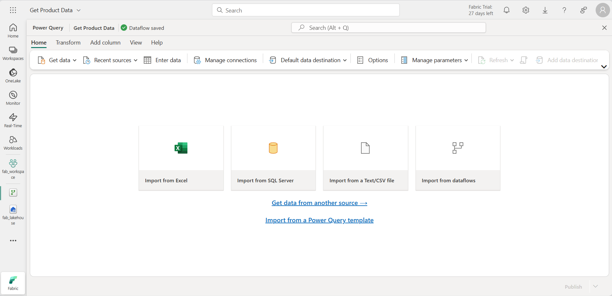

---
lab:
  title: 監視ハブで Fabric アクティビティを監視する
  module: Monitoring Fabric
---

# 監視ハブで Fabric アクティビティを監視する

Microsoft Fabric の*監視ハブ*は、アクティビティを監視できる中心的な場所を提供します。 監視ハブを使用することで、表示のアクセス許可を持つアイテムに関連するイベントを確認できます。

このラボの所要時間は約 **30** 分です。

> **注**: この演習を完了するには、[Microsoft Fabric テナント](https://learn.microsoft.com/fabric/get-started/fabric-trial)へのアクセス権が必要です。

## ワークスペースの作成

Fabric でデータを操作する前に、Fabric 容量を有効にしてテナントにワークスペースを作成します。

1. ブラウザーで [Microsoft Fabric ホーム ページ](https://app.fabric.microsoft.com/home?experience=fabric-developer) (`https://app.fabric.microsoft.com/home?experience=fabric-developer`) に移動し、Fabric 資格情報でサインインします。
1. 左側のメニュー バーで、 **[ワークスペース]** を選択します (アイコンは &#128455; に似ています)。
1. 新しいワークスペースを任意の名前で作成し、 **[詳細]** セクションで、Fabric 容量を含むライセンス モード ("*試用版*"、*Premium*、または *Fabric*) を選択します。
1. 開いた新しいワークスペースは空のはずです。

    

## レイクハウスを作成する

ワークスペースが作成されたので、次に自分のデータ用のデータ レイクハウスを作成します。

1. 左側のメニュー バーで、**[作成]** を選択します。 *[新規]* ページの [*[Data Engineering]* セクションで、**[レイクハウス]** を選択します。 任意の一意の名前を設定します。

    >**注**: **[作成]** オプションがサイド バーにピン留めされていない場合は、最初に省略記号 (**...**) オプションを選択する必要があります。

    1 分ほどすると、新しいレイクハウスが作成されます。

    

1. 新しいレイクハウスを表示します。左側の **[レイクハウス エクスプローラー]** ペインを使用すると、レイクハウス内のテーブルとファイルを参照できることに注意してください。

    現在、レイクハウスにはテーブルやファイルはありません。

## Dataflow の作成と監視

Microsoft Fabric では、Dataflow (Gen2) を使用して、さまざまなソースからデータを取り込むことができます。 この演習では、データフローを使用して CSV ファイルからデータを取得し、それをレイクハウスのテーブルに読み込みます。

1. レイクハウスの **[ホーム]** ページの **[データの取得]** メニューで、**[新しい Dataflow Gen2]** を選択します。
1. 新しいデ―タフローに名前を付け`Get Product Data`、**[作成する]** を選択します。

    

1. データフロー デザイナーで、**[テキスト/CSV ファイルからインポート]** を選択します。 次に [データの取得] ウィザードを完了し、匿名認証を使用して `https://raw.githubusercontent.com/MicrosoftLearning/dp-data/main/products.csv` にリンクし、データ接続を作成します。 ウィザードを完了すると、データフロー デザイナーに次のようなデータのプレビューが表示されます。

    

1. データフローを発行します。
1. 左側のナビゲーション バーで **[監視]** を選択して監視ハブを表示し、データフローが進行中であることを確認します (そうでない場合は、そのような表示になるまでビューを更新します)。

    

1. 数秒待ち、データフローの状態が **[成功]** になるまでページを更新します。
1. ナビゲーション ウィンドウで、レイクハウスを選択します。 次に、**Tables** フォルダーを展開して、**products** という名前のテーブルがデータフローによって作成され読み込まれたことを確認します (**Tables** フォルダーを更新することが必要な場合があります)。

    

## Spark ノートブックの作成と監視

Microsoft Fabric では、ノートブックを使用して Spark コードを実行できます。

1. 左側のメニュー バーで、**[作成]** を選択します。 *[新規]* ページの [*[Data Engineering]* セクションで、**[Notebook]** を選択します。

    **Notebook 1** という名前の新しいノートブックが作成されて開きます。

    

1. ノートブックの左上にある **[Notebook 1]** を選択して詳細を表示し、名前を `Query Products` に変更します。
1. ノートブック エディターの **[エクスプローラー]** ペインで **[データ項目の追加]** を選択し、続いて **[既存のデータ ソース]** を選択します。
1. 前の手順で作成したレイクハウスを追加します。
1. **[Products]** テーブルに到達するまで、レイクハウス項目を展開します。
1. **[Products]** テーブルの **[...]** メニューで、**[データの読み込み]** > 、**[Spark]** の順に選択します。 すると、次のようにノートブックに新しいコード セルが追加されます。

    

1. **[&#9655; すべて実行]** ボタンを使用して、ノートブック内のすべてのセルを実行します。 Spark セッションが開始するまでに少し時間がかかります。そして、クエリの結果がコード セルの下に表示されます。

    

1. ツール バーで、**&#9723;** (*セッションの停止*) ボタンを使用して Spark セッションを停止します。
1. ナビゲーション バーで **[監視]** を選択して監視ハブを表示し、ノートブック アクティビティが一覧表示されていることを確認します。

    

## アイテムの履歴を監視する

ワークスペース内の一部のアイテムは複数回実行される場合があります。 監視ハブを使用すれば、実行履歴を表示できます。

1. ナビゲーション バーで、ワークスペースのページに戻ります。 次に、**"製品データの取得"** データフローの **&#8635;** (*今すぐ最新の情報に更新*) ボタンを使用して再実行します。
1. ナビゲーション ウィンドウで、**[監視]** ページを選択して監視ハブを表示し、データフローが進行中であることを確認します。
1. **"製品データの取得"** データフローの **[...]** メニューで **[実行履歴]** を選択して、データフローの実行履歴を表示します。

    

1. 任意の実行履歴の **[...]** メニューで **[詳細の表示]** を選択して、実行の詳細を表示します。
1. **[詳細]** ペインを閉じ、**[メイン ビューに戻る]** ボタンを使用して、監視ハブのメイン ページに戻ります。

## 監視ハブ ビューのカスタマイズ

この演習では、少数のアクティビティしか実行していないので、監視ハブでイベントを見つけるのがかなり簡単なはずです。 ただし、実際の環境では、多数のイベントから検索することが必要な場合があります。 フィルターやその他のビューのカスタマイズを使用することで、この作業を簡単にすることができます。

1. 監視ハブで、**[フィルター]** ボタンを使用して、次のフィルターを適用します。
    - **状態**: 成功
    - **アイテムの種類**: Dataflow Gen2

    フィルターを適用すると、成功したデータフローの実行のみが一覧表示されます。

    

1. **[列のオプション]** ボタンを使用して、ビューに次の列を入れます (変更を適用するには **[適用]** ボタンを使用します)。
    - アクティビティ名
    - 状態
    - 項目の種類
    - [開始時間]
    - 送信元
    - Location
    - 終了時刻
    - Duration
    - 更新の種類

    すべての列を表示するには、横にスクロールすることが必要な場合があります。

    

## リソースをクリーンアップする

この演習では、レイクハウス、データフロー、および Spark ノートブックを作成しました。また、監視ハブを使用してアイテムのアクティビティを表示しました。

レイクハウスの探索が完了したら、この演習用に作成したワークスペースを削除できます。

1. 左側のバーで、ワークスペースのアイコンを選択して、それに含まれるすべての項目を表示します。
2. ツール バーの **[...]** メニューで、 **[ワークスペースの設定]** を選択してください。
3. **[全般]** セクションで、**[このワークスペースの削除]** を選択します。
