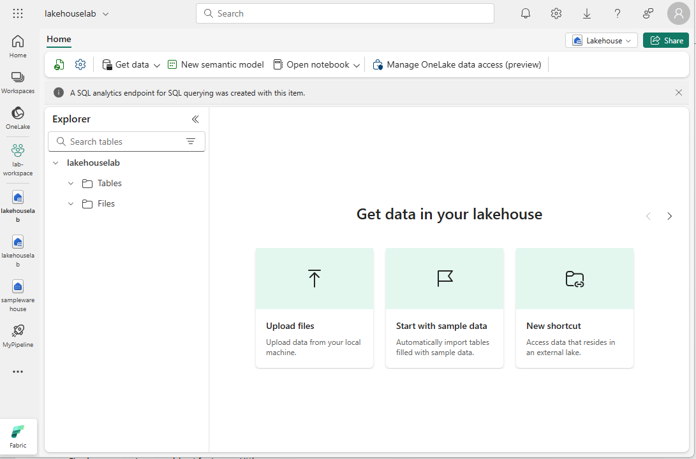
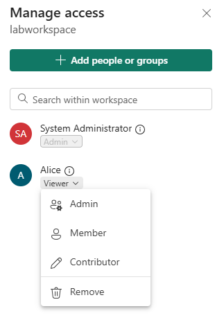
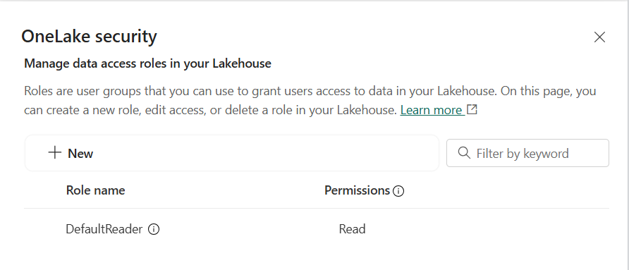

---
lab:
  title: Microsoft Fabric でデータ アクセスをセキュリティで保護する
  module: Secure data access in Microsoft Fabric
---

# Microsoft Fabric でデータ アクセスをセキュリティで保護する

Microsoft Fabric には、データ アクセスを管理するためのマルチレイヤー セキュリティ モデルが用意されています。 セキュリティは、ワークスペース全体、個々の項目、または各 Fabric エンジンの詳細なアクセス許可を使用して設定できます。 この演習では、ワークスペースと項目アクセス制御と OneLake データ アクセス ロールを使用してデータをセキュリティで保護します。

このラボの所要時間は約 **45** 分です。

## ワークスペースの作成

Fabric でデータを操作する前に、Fabric 試用版を有効にしてワークスペースを作成してください。

1. ブラウザーで [Microsoft Fabric ホーム ページ](https://app.fabric.microsoft.com/home?experience=fabric) (`https://app.fabric.microsoft.com/home?experience=fabric`) に移動し、Fabric 資格情報でサインインします。
1. 左側のメニュー バーで、 **[ワークスペース]** を選択します (アイコンは &#128455; に似ています)。
1. 任意の名前で新しいワークスペースを作成し、Fabric 容量を含むライセンス モード ("試用版"、*Premium*、または *Fabric*) を選択します。**
1. 開いた新しいワークスペースは空のはずです。

    

> **注**:ワークスペースを作成すると、自分は自動的にワークスペース管理者ロールのメンバーになります。

## データ ウェアハウスの作成

次に、作成したワークスペースにデータ ウェアハウスを作成します。

1. **[+ 新しい項目]** をクリックします。 *[新しい項目]* ページの *[データの保存]* セクションで、**[サンプル ウェアハウス]** を選択し、任意の名前の新しいデータ ウェアハウスを作成します。

     1 分ほどで、新しいレイクハウスが作成されます。

    

## レイクハウスを作成する
次に、作成したワークスペースにレイクハウスを作成します。

1. 左側のメニュー バーで、**[ワークスペース]** を選択します (アイコンは 🗇 に似ています)。
2. 前に作成したワークスペースを選択します。
3. ワークスペースで、**[+ 新しい項目]** ボタンを選択してから、**[レイクハウス]** を選択します。 任意の名前で新しいレイクハウスを作成します。

   1 分ほどすると、新しいレイクハウスが作成されます。

    

4. **[サンプル データで開始]** タイルを選択したあと、**祝日**サンプルを選択します。 1 分ほどすると、レイクハウスにデータが設定されます。

## ワークスペースのアクセス制御を適用する

ワークスペース ロールは、ワークスペースとその中のコンテンツへのアクセスを制御するために使用されます。 ワークスペース ロールは、ユーザーがワークスペース内のすべての項目を表示する必要がある場合、ワークスペースへのアクセスを管理する必要がある場合、または新しい Fabric 項目を作成する必要がある場合、またはワークスペース内のコンテンツを表示、変更、または共有するために特定のアクセス許可が必要な場合に割り当てることができます。  

この演習では、ワークスペース ロールにユーザーを追加し、アクセス許可を適用し、アクセス許可の各セットが適用されたときに表示可能な内容を確認します。 2 つのブラウザーを開き、別のユーザーとしてサインインします。 1 つのブラウザーでは**ワークスペース管理者**になり、もう 1 つのブラウザーでは 2 番目の特権のないユーザーとしてサインインします。 1 つのブラウザーでは、ワークスペース管理者が 2 番目のユーザーのアクセス許可を変更し、2 番目のブラウザーでは、アクセス許可の変更の影響を確認できます。  

1. 左側のメニュー バーで、 **[ワークスペース]** を選択します (アイコンは &#128455; に似ています)。
2. 次に、前に作成したワークスペースを選択します。
3. 画面上部で、**[アクセスの管理]** を選択します。

> **注**: ワークスペースを作成したため、ログに記録されているユーザー (**ワークスペース管理者**　ロールのメンバー) が表示されます。 他のユーザーには、ワークスペースへのアクセス権がまだ割り当てられません。

4. 次に、ワークスペースに対するアクセス許可のないユーザーが表示できる内容を確認します。 ブラウザーで InPrivate ウィンドウを開きます。 Microsoft Edge ブラウザーで、右上隅にある省略記号を選択し、**[新しい InPrivate ウィンドウ]** を選択します。
5. テストに使用している 2 番目のユーザーとして https://app.fabric.microsoft.com を入力してサインインします。  
6. 画面の左下隅で、**[Microsoft Fabric]** を選択し、**[Data Warehouse]** を選択します。 次に、**[ワークスペース]** を選択します (アイコンは &#128455; に似ています)。  

> **注:** 2 番目のユーザーはワークスペースにアクセスできないため、表示できません。

7. 次に、2 番目のユーザーに **ワークスペース ビューアー** ロールを割り当て、そのロールによってワークスペース内のウェアハウスへの読み取りアクセスが許可されることを確認します。  
8. ワークスペース管理者としてログインしているブラウザー画面に戻ります。作成したワークスペースが表示されているページにまだ残っていることを確認します。 ページの下部に、新しいワークスペース項目とサンプル ウェアハウスとレイクハウスが表示されている必要があります。
9. 画面右上の **[アクセスの管理]** を選択します。
10. **[ユーザーまたはグループの追加]** を選択します。 テストする 2 番目のユーザーのメールアドレスを入力します。 **[追加]** を選択して、ユーザーをワークスペース **ビューアー** ロールに割り当てます。 
11. 2 番目のユーザーとしてログインしている InPrivate ブラウザー画面に戻り、ブラウザーの [更新] ボタンを選択して、2 番目のユーザーに割り当てられているセッションのアクセス許可を更新します。
12. 左側のメニュー バーの **[ワークスペース]** アイコン (アイコンは &128455; に似ています) を選択し、ワークスペース管理者ユーザーとして作成したワークスペース名を選択します。 2 番目のユーザーには、**ワークスペース ビューアー** ロールが割り当てられているため、ワークスペース内のすべての項目を表示できるようになりました。

    

13. ウェアハウスを選択して開きます。
14. **日付**テーブルを選択し、行が読み込まれるのを待ちます。 ワークスペース ビューアー ロールのメンバーとして、ウェアハウス内のテーブルに対する CONNECT および ReadData アクセス許可があるため、行を表示できます。 ワークスペース ビューアー ロールに付与されるアクセス許可の詳細については、「[ワークスペースのロール](https://learn.microsoft.com/en-us/fabric/data-warehouse/workspace-roles)」をご覧ください。
15. 次に、左側のメニュー バーの **[ワークスペース]** アイコンを選択し、レイクハウスを選択します。
16. レイクハウスが開いたら、画面の右上隅にある **[レイクハウス]** というドロップダウン ボックスをクリックし、**[SQL 分析エンドポイント]** を選択します。
17. **祝日**テーブルを選択し、データが表示されるのを待ちます。 ユーザーは SQL 分析エンドポイントに対する読み取りアクセス許可を付与するワークスペース ビューアー ロールのメンバーであるため、レイクハウス テーブル内のデータは SQL 分析エンドポイントから読み取り可能です。

## 項目アクセス制御を適用する

項目のアクセス許可は、ウェアハウス、レイクハウス、セマンティック モデルなど、ワークスペース内の個々の Fabric 項目へのアクセスを制御します。 この演習では、前の演習で適用した**ワークスペース ビューアー**のアクセス許可を削除してから、ウェアハウスに項目レベルのアクセス許可を適用して、あまり特権のないユーザーが、レイクハウス データではなく、ウェアハウス データのみを表示できるようにします。

1. ワークスペース管理者としてログインしているブラウザー画面に戻ります。左側のナビゲーション ウィンドウから **[ワークスペース]** を選択します。 
2. 前に作成したワークスペースを選択して開きます。
3. 画面上部から、**[アクセスの管理]** を選択します。
4. 2 番目のユーザーの名前の下にある単語**ビューアー**を選択します。 表示されるメニューから **[削除]** を選択します。

   

5. **[アクセスの管理]** セクションを閉じます。
6. ワークスペースで、ウェアハウスの名前にカーソルを合わせると、省略記号 (**...**) が表示されます。 省略記号を選択してから、**[アクセス許可の管理]** を選択します。

7. **[ユーザーの追加]** を選択し、2 番目のユーザーの名前を入力します。 
8. 表示されるボックスの **[追加のアクセス許可]** で、**[SQL を使用してすべてのデータを読み取る (ReadData)]** チェックボックスをオンにし、他のすべてのボックスをオフにします。

    

9. **[許可]** を選択します。

10. 2 番目のユーザーとしてログインしているブラウザー画面に戻ります。 ブラウザー ビューを更新します。  

11. 2 番目のユーザーはワークスペースにアクセスできなくなり、代わりにウェアハウスにのみアクセスできます。 左側のナビゲーション ウィンドウでワークスペースを参照してウェアハウスを見つけることができなくなります。 左側のナビゲーション メニューで **[OneLake]** を選択して、ウェアハウスを見つけます。 

12. ウェアハウスを選択します。 表示された画面で、上部のメニュー バーから **[開く]** を選択します。

13. ウェアハウス ビューが表示されたら、**日付**テーブルを選択してテーブル データを表示します。 ユーザーがウェアハウスに対する読み取りアクセス許可を持っているため、行は表示可能です。これは、ウェアハウスに対する項目のアクセス許可を使用して ReadData アクセス許可が適用されたためです。

## レイクハウスで OneLake データ アクセス ロールを適用する

OneLake データ アクセス ロールを使用すると、レイクハウス内にカスタム ロールを作成し、指定したフォルダーに読み取りアクセス許可を付与できます。 現在、OneLake データ アクセス ロールはプレビュー機能です。

この演習では、項目のアクセス許可を割り当てて OneLake データ アクセス ロールを作成し、それらが連携してレイクハウス内のデータへのアクセスを制限する方法を試します。  

1. 2 番目のユーザーとしてログインしているブラウザーに留まります。  
2. 左側のナビゲーション バーで **[OneLake]** を選択します。 2 番目のユーザーには、レイクハウスが表示されません。  
3. ワークスペース管理者としてログインしているブラウザーに戻ります。
4. 左側のメニューで **[ワークスペース]** を選択して、ワークスペースを選択します。 レイクハウスの名前にカーソルを合わせます。  
5. 省略記号の右側にある省略記号 (**...**) を選択し、**[アクセス許可の管理]** を選択します。

      

6. 表示された画面で、**[ユーザーの追加]** を選択します。 
7. 2 番目のユーザーをレイクハウスに割り当て、**[ユーザー アクセスの許可]** ウィンドウのチェックボックスがオフになっていることを確認します。  

      ![Fabric の [アクセス権の付与] レイクハウス ウィンドウのスクリーンショット。](./Images/grant-people-access-window.png)

8. **[許可]** を選択します。 2 番目のユーザーは、レイクハウスに対する読み取りアクセス許可を持つようになりました。 読み取りアクセス許可では、ユーザーはレイクハウスのメタデータのみを表示できますが、基になるデータは表示できません。 次に、これを検証します。
9. 2 番目のユーザーとしてログインしているブラウザーに戻ります。 ブラウザーを更新します。
10. 左側のナビゲーション ウィンドウで **[OneLake]** を選択します。  
11. レイクハウスを選択して開きます。 
12. 上部のメニュー バーで、**[開く]** を選択します。 読み取りアクセス許可が付与されている場合でも、テーブルまたはファイルを展開できません。 次に、OneLake データ アクセス許可を使用して、2 番目のユーザーに特定のフォルダーへのアクセス権を付与します。
13. ワークスペース管理者としてログインしているブラウザーに戻ります。
14. 左側のナビゲーション バーから **[ワークスペース]** を選択します。
15. ワークスペース名を選択します。
16. レイクハウスを選択します。
1. レイクハウスが開いたら、上部のメニュー バーで **[OneLake データ アクセスの管理]** を選択し、**[続行]** ボタンをクリックして機能を有効にします。

      

14. 表示される **OneLake データ アクセスの管理 (プレビュー)** 画面で新しいロールを選択します。
  
      

15. 次のスクリーンショットに示すように、祝日フォルダーにのみアクセスできる**祝日**という新しいロールを作成します。

      

16. ロールの作成が完了したら、**[ロールの割り当て]** を選択し、2 番目のユーザーにロールを割り当て、**[追加]** を選択して、**[保存]** を選択します。
 
       

17. 2 番目のユーザーとしてログインしているブラウザーに戻ります。 レイクハウスが開いているページにまだ居残っていることを確認します。 ブラウザーを更新します。  
18. **祝日**テーブルを選択し、データが読み込まれるのを待ちます。 ユーザーがカスタム OneLake データ アクセス ロールに割り当てられたため、祝日テーブル内のデータにのみユーザーがアクセスできます。 ロールは、他のテーブル、ファイル、またはフォルダーのデータではなく、祝日テーブル内のデータのみを表示することを許可します。

## リソースをクリーンアップする

この演習では、ワークスペースのアクセス制御、項目のアクセス制御、および OneLake データ アクセス ロールを使用してデータをセキュリティで保護しました。

1. 左側のナビゲーション バーで、ワークスペースのアイコンを選択して、それに含まれるすべての項目を表示します。
2. 上部のツール バーのメニューで、**[ワークスペース設定]** を選択します。
3. **[全般]** セクションで、**[このワークスペースの削除]** を選択します。
