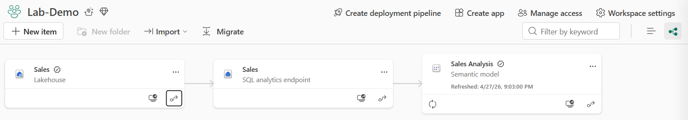
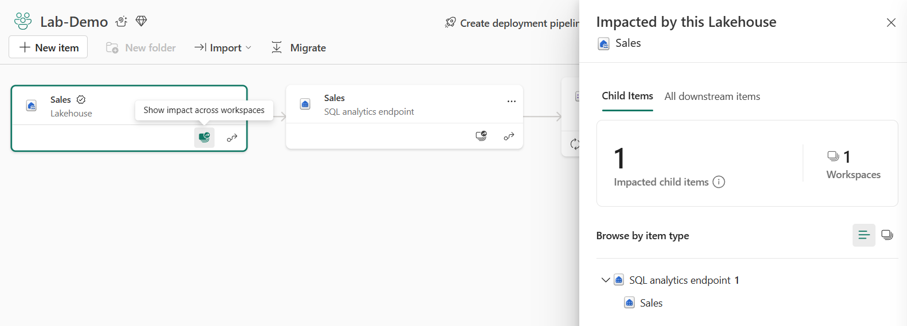

---
lab:
  title: Microsoft Fabric で分析データを管理する
  module: Govern analytics data in Microsoft Fabric
  description: Microsoft Fabric で分析資産を作成し、承認、文書化、系列分析などのガバナンス プラクティスを適用して、データ資産の信頼性と検出可能性を高めます。
  duration: 30 minutes
  level: 200
  islab: true
  primarytopics:
    - Microsoft Fabric
    - Data governance
    - OneLake catalog
---

# Microsoft Fabric で分析データを管理する

拡大する分析環境では、データ資産がワークスペース間で急速に増加します。 レイクハウス、セマンティック モデル、レポートがさまざまなチームによって作成されるため、ガバナンスがなければ、どの資産が信頼でき、組織で使用できる状態であるかを判断することが困難になります。 保証、文書化、系列分析などのガバナンス プラクティスは、ユーザーが適切なデータを見つけて信頼するのに役立ちます。

Microsoft Fabric には、追加のライセンスや外部ツールを必要としない組み込みのガバナンス機能が用意されています。 項目を昇格して準備状況を通知し、説明を追加して検出可能性を向上し、OneLake カタログを使用してデータ資産全体のガバナンス カバレッジを監視できます。 系列ビューと影響分析は、項目間のデータ フローを示し、変更を行う前に変更の結果を理解するのに役立ちます。

この演習では、レイクハウスとセマンティック モデルを作成し、保証、文書化、系列分析などのガバナンス プラクティスを適用します。 OneLake カタログを使用して、ガバナンスに関する分析情報を調べ、これらのシグナルがデータ資産の信頼性をどのように高めるかを確認します。

このラボの所要時間は約 **30** 分です。

## 環境を設定する

この演習を完了するには、Fabric 対応ワークスペースが必要です。 Fabric 試用版の詳細については、[Fabric の概要](https://learn.microsoft.com/fabric/get-started/fabric-trial)に関するページを参照してください。

### ワークスペースの作成

1. ブラウザーの `https://app.fabric.microsoft.com/home?experience=fabric` で [Microsoft Fabric ホーム ページ](https://app.fabric.microsoft.com/home?experience=fabric)に移動し、Fabric 資格情報でサインインします。
1. 左側のメニュー バーで、 **[ワークスペース]** を選択します (アイコンは &#128455; に似ています)。
1. 任意の名前で新しいワークスペースを作成し、Fabric 容量を含むライセンス モード ("試用版"、*Premium*、または *Fabric*) を選択してください。** 有料の容量を使用している場合は、F2 SKU 以上で十分です。
1. 開いた新しいワークスペースは空のはずです。

    

### レイクハウスを作成してデータを読み込む

このタスクでは、レイクハウスを作成し、サンプルの売上データをテーブルに読み込みます。

1. ワークスペースで **[+ 新しい項目]** を選択し、次に **[レイクハウス]** を選択します。 **Sales** という名前を付けます。

    1 分ほど経つと、空の **Tables** および **Files** フォルダーを含む新しいレイクハウスが作成されます。

1. `https://github.com/MicrosoftLearning/dp-data/raw/main/sales.csv` からサンプル売上データ ファイル [sales.csv](https://github.com/MicrosoftLearning/dp-data/raw/main/sales.csv) をダウンロードします。 **sales.csv** として保存します。

    > **ヒント**: ファイルをブラウザーで開いている場合は、ページ上の任意の場所を右クリックし、**[名前を付けて保存]** を選択して、CSV ファイルとして保存します。

1. ブラウザーでレイクハウスに戻ります。 **Files** フォルダーの **[...]** メニューで、**[アップロード]**  >  **[ファイルのアップロード]** の順に選択し、ローカル コンピューターから**sales.csv** ファイルをアップロードします。

1. ファイルがアップロードされたら、**sales.csv** ファイルの **[...]** メニューで、**[テーブルに読み込む]**  >  **[新しいテーブル]** の順に選択します。

1. **[テーブルに読み込む]** ダイアログで、テーブル名を **sales** に設定し、読み込み操作を確認します。 テーブルが作成されて読み込まれるのを待ちます。

    > **ヒント**: **sales** テーブルが自動的に表示されない場合は、**Tables** フォルダーの **[...]** メニューで **[最新の情報に更新]** を選択します。

1. **[エクスプローラー]** ペインで、**sales** テーブルを選択して、データが正しく読み込まれたかどうかを確認します。

### セマンティック モデルを作成する

このタスクでは、レイクハウスの sales テーブルからセマンティック モデルを作成します。

1. [レイクハウス] ページの右上で、**[レイクハウス]** から **[SQL 分析エンドポイント]** に切り替えます。 SQL 分析エンドポイントが開くのを待ちます。

    

1. [ホーム] リボンで、**[新しいセマンティック モデル]** を選択します。

1. **[新しいセマンティック モデル]** ダイアログ ボックスで、セマンティック モデルに **Sales Analysis** という名前を付けます。

1. 既定の選択のままにして、`sales` テーブルを選択し、**[確認]** を選択してモデルを作成します。

    しばらくすると、ワークスペースにセマンティック モデルが作成されます。

1. ページの上部にある階層リンクでワークスペース名を選択して、ワークスペース ビューに戻ります。 これで、**Sales** レイクハウス、その **SQL 分析エンドポイント**、作成した **Sales Analysis** セマンティック モデルなど、いくつかの項目が表示されます。

    

## データ資産を承認して文書化する

承認と説明は連携して機能し、項目の信頼性と検出可能性を高めます。 このセクションでは、ユーザーが OneLake カタログでレイクハウスとセマンティック モデルを検出して評価できるように、それらを昇格して文書化します。

### レイクハウスを承認して文書化する

このタスクでは、**Sales** レイクハウスを昇格し、説明を追加します。

1. ワークスペース ビューで、**Sales** レイクハウスを見つけます。 このレイクハウスの **[...]** メニューを選択し、**[設定]** を選択します。

1. 設定ウィンドウで、**[承認]** セクションを展開します。

1. **[昇格]**、**[適用]** の順に選択します。

    ![[昇格] が選択されている承認設定のスクリーンショット。](./Images/endorse-promoted.png)

1. **[情報]** セクションで、次の説明を入力します。

    `Retail sales transactions including order date, item, category, quantity, and unit price. Refreshed manually with sample data for training purposes.`

1. 設定ウィンドウを閉じて、変更を保存し、ワークスペース ビューに戻ります。

### セマンティック モデルを承認して文書化する

このタスクでは、**Sales Analysis** セマンティック モデルを昇格し、説明を追加します。

1. ワークスペース ビューで、**Sales Analysis** セマンティック モデルを見つけます。 **[...]** メニューを選択し、**[設定]** を選択します。

1. **[承認と検出]** セクションを展開し、**[昇格]** を選択します。

    > この時点で、**[検出可能にする]** オプションが自動的に選択されていることに注意してください。 アクセスはまだ制限されていますが、結果にはこのセマンティック モデルが表示されるため、ユーザーはアクセスを要求できます。

1. **[説明]** フィールドに、次のように入力します。

    `Semantic model built from the Sales lakehouse. Contains retail sales data with revenue by item and category. Promoted for team use.`

1. 設定ウィンドウを閉じて、ワークスペース ビューに戻ります。 ワークスペースの一覧で、昇格された項目には、その名前の横に **[昇格済み]** バッジが表示されるようになったことに注意してください。

    

## OneLake カタログでガバナンスを調べる

OneLake カタログには、Fabric 環境内のデータ資産が一元的に表示されます。 このセクションでは、さまざまなタブを使用して、項目の検出、ガバナンスに関する分析情報の確認、アクセス制御の確認を行います。

1. 左側のナビゲーション ウィンドウで、**[OneLake]** アイコンを選択して OneLake カタログを開きます。

    ![[探索] タブに項目が表示されている OneLake カタログのスクリーンショット。](./Images/onelake-catalog-explore.png)

1. **[探索]** タブで、項目の一覧を参照します。 **Sales** レイクハウスを見つけて選択すると、その詳細がサイド ペインに表示されます。

1. 詳細ウィンドウの **[概要]** タブに、次の情報が表示されることに注意してください。
    - 前に追加した説明。
    - **場所**: 項目が格納されているワークスペースを示します。
    - **データ更新日時**: データが最後に更新された日時を示します。
    - **所有者**: 項目を所有するユーザーを示します。
    - **承認**: 適用した昇格済みバッジを示します。
    - **テーブル**: 存在するテーブルを示します。

1. ナビゲーション ウィンドウで、**[承認済み項目]** セクションを選択します。 承認したレイクハウスとセマンティック モデルのみが表示されることに注意してください。

    > **注**: 承認でフィルター処理すると、信頼性が高く、品質チェック済みの資産に焦点を絞るのに役立ちます。

1. OneLake カタログの上部にある **[ガバナンス]** タブを選択します。 [ガバナンス] タブには、所有するドメイン、ワークスペース、項目の数を示すサマリー カードを含む **[ガバナンス状態の概要]** ダッシュボードが表示されます。 グラフでは、項目を種類、最終更新日、説明カバレッジ別に分類します。 **[推奨されるアクション]** セクションでは、承認済み項目の割合を増やすなどの改善が提案されます。

    ![ガバナンスに関する分析情報を示す OneLake カタログの [ガバナンス] タブのスクリーンショット。](./Images/onelake-catalog-govern.png)

1. **[さらに表示]** を選択して、**[All insights]** レポートを開きます。 この対話型のレポートは Power BI ダッシュボードに似ており、右側にフィルター ペインが表示されます。 これには、データ資産に関する詳細なグラフ (種類別の項目、ドメインに割り当てられたワークスペース、最後の更新に失敗した項目 (種類別)、最終アクセス日別の項目、最終更新日別の項目など) が含まれます。

1. グラフをフィルター処理してスクロールし、レポートを探索します。 完了したら、戻る矢印を選択して OneLake カタログに戻ります。

1. **[セキュリティ]** タブを選択して、セキュリティ情報を表示します。 [セキュリティ] タブには、ワークスペース ロールと項目全体の OneLake セキュリティ ロールが表示され、ユーザーとそのアクセス許可を一元的に確認できます。

## 系列を表示して影響分析を実行する

系列はワークスペース内のアイテム間でデータがどのように流れるかを示し、影響分析はダウンストリームの依存関係を特定します。 このセクションでは、レイクハウスからセマンティック モデルまでのデータ系列を追跡し、影響分析を実行して、変更の影響を受ける項目を特定します。

1. 左側のナビゲーション ウィンドウで **[ワークスペース]** を選択し、お使いのワークスペースを選択して、ワークスペースに戻ります。

1. ワークスペースのツール バーで、**[ワークスペースの設定]** の下にある **[系列ビュー]** アイコンを選択します。

    系列ビューには、ワークスペース内のすべての項目がカードとして表示され、データ フローを示す矢印で接続されます。

    

1. **Sales** レイクハウス カードを見つけます。 矢印をたどって、レイクハウスからその SQL 分析エンドポイントまで、およびそこから **Sales Analysis** セマンティック モデルまでデータがどのように流れるかを確認します。

    この視覚化は、データの完全な系統を示しています。レイクハウスがソースであり、SQL 分析エンドポイントが SQL アクセスを提供し、セマンティック モデルによってレポートと AI の利用が可能になります。

    

1. **Sales** レイクハウス カードで、右下隅にある矢印アイコンを選択して、その系列を強調表示します。 Fabric は、関連のない項目を暗くし、レイクハウスに接続されている項目のみを強調表示します。

1. **Sales** レイクハウス カードで、**[ワークスペース全体の影響を表示]** アイコンを選択します。

    

1. 影響分析ペインで、**[すべてのダウンストリーム項目]** を選択し、レイクハウスに依存するものを確認します。
    - SQL 分析エンドポイント
    - エンドポイントから構築されたセマンティック モデル

    これらは、レイクハウス構造の変更、テーブルの削除、またはデータの変更を行った場合に影響を受ける項目です。 変更を行う前に、この依存関係チェーンを理解することが重要です。

1. 影響分析ペインを閉じ、ワークスペース ツール バーで **[リスト ビュー]** に戻ります。

## リソースをクリーンアップする

この演習では、サンプル データを含むレイクハウスを作成し、セマンティック モデルを構築し、承認、文書化、系列分析などのガバナンス プラクティスを適用しました。 OneLake カタログを使用して、データ資産全体のガバナンスに関する分析情報を調べました。

探索が完了したら、この演習用に作成したワークスペースを削除できます。

1. 左側のバーで、ワークスペースのアイコンを選択して、それに含まれるすべての項目を表示します。
1. ツール バーの **[ワークスペース設定]** を選択します。
1. **[全般]** セクションで、**[このワークスペースの削除]** を選択します。
