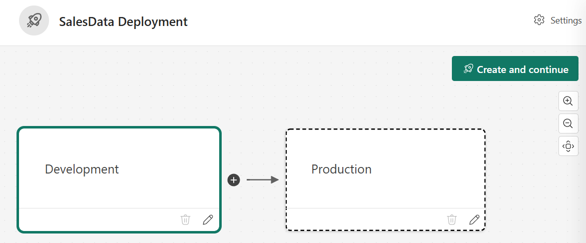
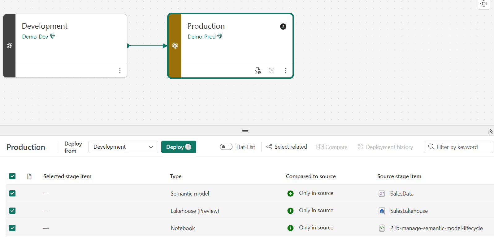

---
lab:
  title: セマンティック モデルのライフサイクルを管理する
  module: Manage the semantic model development lifecycle
  description: Fabric ノートブックで SemPy を使ってセマンティック モデルを検証し、ステージ間でコンテンツのレベルを上げる展開パイプラインを作成して、運用ワークスペースに展開されたコンテンツを確認します。
  duration: 45 minutes
  level: 200
  islab: true
  primarytopics:
    - Microsoft Fabric
    - Power BI
    - Semantic Link
    - Deployment pipelines
  categories:
    - Operations and lifecycle management
  courses:
    - DP-600
---

# セマンティック モデルのライフサイクルを管理する

分析チームが検証や構造化された展開を行わずに運用環境に直接発行すると、レポートを損なったり、変更履歴を失ったり、不適切なデータを提供したりするリスクがあります。 ライフサイクル プロセスを定義すると、コンテンツがビジネス ユーザーの手に渡る前にこれらの問題を把握して防止できます。

この演習では、サンプル データを含むレイクハウスを作成してから、Fabric ノートブックで SemPy を使ってセマンティック モデルの構造を検査し、データ品質を検証します。 検証で、不正確な DAX の結果の生成をもたらすリレーションシップの欠如が明らかになった場合は、SemPy の読み取り/書き込み TOM 接続を使って、プログラムでモデルを修正します。 モデルが正しいことを確認した後、Development と Production のステージを含む展開パイプラインを作成して、検証済みのコンテンツを開発から運用にレベル上げします。 これらのタスクは、セマンティック モデルのライフサイクルの**検証 → 修正 → 展開**ステージに従います。

このラボの所要時間は約 **45** 分です。

> **ヒント:** 関連するトレーニング コンテンツについては、「[セマンティック モデル開発ライフサイクルを管理する](https://learn.microsoft.com/training/modules/manage-semantic-model-lifecycle/)」を参照してください。

## 環境を設定する

> **注**: この演習を完了するには、Fabric の有料または試用版の容量にアクセスする必要があります。 有料容量には Power BI 機能が含まれている必要があります。または、別の Power BI Pro か Premium Per User ライセンスが必要です。 無料の Fabric 試用版の詳細については、[Fabric 試用版](https://aka.ms/fabrictrial)に関するページを参照してください。

### ワークスペースを作成する

このタスクでは、展開パイプラインのステージ (Development と Production) 用に 2 つのワークスペースを作成します。

1. ブラウザーの `https://app.fabric.microsoft.com/home?experience=fabric` で [Microsoft Fabric ホーム ページ](https://app.fabric.microsoft.com/home?experience=fabric)に移動し、Fabric 資格情報でサインインします。
1. 左側のメニュー バーで、 **[ワークスペース]** を選択します (アイコンは &#128455; に似ています)。
1. 任意の名前の後に `-dev` を付けて新しいワークスペースを作成し (例: `SalesLifecycle-dev`)、Fabric 容量を含むライセンス モードを選びます (*Trial*、*Premium*、または *Fabric*)。 このベース名は、運用ワークスペースと展開パイプラインに使うので、覚えておいてください。
1. 開いた新しいワークスペースは空のはずです。

    

1. この手順を繰り返し、同じベース名の後に `-prod` を付けて 2 つ目のワークスペースを作成します (例: `SalesLifecycle-prod`)。

    > **注意**: 展開パイプラインが機能するには、両方のワークスペースを Fabric または Premium 容量上に作成する必要があります。

1. **-dev** ワークスペースに戻り、演習を続けます。

### ノートブックをインポートする

このタスクでは、この演習用のすべての Python コードを含むラボ ノートブックをダウンロードします。

1. Web ブラウザーを開き、次の URL を入力して、[21b-manage-semantic-model-lifecycle.ipynb](https://github.com/MicrosoftLearning/mslearn-fabric/raw/main/Allfiles/Labs/21b/21b-manage-semantic-model-lifecycle.ipynb) ノートブックをダウンロードします。

    `https://github.com/MicrosoftLearning/mslearn-fabric/raw/main/Allfiles/Labs/21b/21b-manage-semantic-model-lifecycle.ipynb`

1. ローカル環境の**ダウンロード** フォルダー (またはホストされたラボ環境にいる場合は VM デスクトップ) にファイルを保存します。

1. ワークスペースで、**[インポート]** を選んでから **[ノートブック]** を選びます。

1. **[アップロード]** を選び、ダウンロードした **21b-manage-semantic-model-lifecycle.ipynb** ファイルを参照します。 **[開く]** を選んでから **[アップロード]** を選びます。

## レイクハウスを作成してデータを読み込む

このタスクでは、レイクハウスを作成してサンプル データを生成します。

1. ワークスペース ツール バーの **[+ 新しい項目]** を選んでから、**[レイクハウス]** を選びます。

1. レイクハウスに `SalesLakehouse` という名前を付けます。 レイクハウスの作成には 1 分かかる場合があります。

1. レイクハウスが開いたら、ツール バーから **[ノートブックを開く] > [既存のノートブック]** を選びます。

1. アップロードしたノートブック (`21b-manage-semantic-model-lifecycle`) を選んで、**[開く]** を選びます。

1. ノートブックに入ったら、`Generate sample data` という見出しの下にある最初のコード セルを実行します。

    > `Generate sample data` セクションの下にセルはまだ実行**しないでください**。 最初にセマンティック モデルを作成する必要があります。

1. 左側のレイクハウス エクスプローラーで、**[テーブル]** の横にある省略記号 **[...]** を選んでから **[最新の情報に更新]** を選んで、`products`、`customers`、`sales` テーブルが表示されることを確認します。

## セマンティック モデルを作成する

このタスクでは、SemPy を使って検証できるように、レイクハウスのテーブルから Power BI セマンティック モデルを作成します。

1. ワークスペースに戻り、**SalesLakehouse** レイクハウスを選びます。

1. 右上隅で **[SQL 分析エンドポイント]** に切り替えます。

    
   
1. ツール バーから **[新しいセマンティック モデル]** を選んで、次のように構成します。

    - **名前**: `SalesData`
    - **ワークスペース**: 自分の `-dev` ワークスペース
    - **ストレージ モード**: SQL 上の Direct Lake
    - **テーブル**: すべて選択します

1. 確認してモデルが作成されるまで待ちます。 セマンティック モデルを完全に使用できるようになるまで、1、2 分かかる場合があります。**

これで、ノートブックで SemPy を使って管理できるセマンティック モデルがレイクハウスに構築されました。

## SemPy を使用してセマンティック モデルを検証する

SemPy は Fabric ノートブックの Python ライブラリであり、XMLA エンドポイントを介してセマンティック モデルに接続します。 このタスクでは、展開の前に、SemPy を使って、モデル構造の検査、データ品質の確認、リレーションシップの検証を行います。

1. ノートブックに戻り、ノートブックの **Validate the semantic model with SemPy** という見出しまで下にスクロールします。 このセクションの各コード セルを一度に 1 つずつ実行し、出力を確認します。

1. `SalesData` セマンティック モデル内のすべてのテーブルの一覧を表示して、アクセスできることを確認します。
    - 出力では、`products`、`customers`、`sales` の 3 つのテーブルが示されます。

1. すべてのテーブルのすべての列を一覧表示し、名前、データ型、親テーブルが示されるようにします。 これは、Power BI Desktop を開かずに、よく知らないモデルを理解するのに役立ちます。
    - 出力では、テーブルと、各列の名前、データ型、それが属するテーブルが示されます。

1. すべての列の null 値と、重複する主キーを調べます。 外部キー列の null は、行とディメンション テーブルを結合できず、レポートで空白が発生することを意味します。 重複があると、集計が水増しされます。
    - 出力では、null 値の `CustomerKey` が 3 つあり、重複する `SalesKey` 値がないことが示されます。

1. SemPy を使って、列名パターン (`Key` サフィックスなど) の照合と値の重複のチェックを行い、テーブル間の潜在的なリレーションシップを検出します。
    - 出力では、`sales` と `products` テーブルの間に `ProductKey` での多対一のリレーションシップがあることが示されます。

1. 孤立した外部キー (ディメンション テーブルに一致する行がない、ファクト テーブル内の値) を調べます。 孤立したキーがあると、レポートに空白行が発生します。
    - 出力では、`CustomerKey` の値 99 に関する違反が示されます。これは、`customers` テーブルに一致するものがなく、10 個の販売レコードで空白の顧客名が生成されます。

1. セマンティック モデルに対して DAX クエリを評価し、Power BI Desktop を開かずに計算を検証します。
    - 出力では、すべての製品カテゴリに対して同じ合計が示されます。 **これは正しくありません**。各カテゴリには異なる価格の異なる製品が含まれているので、合計は異なるはずです。 同じ値になるのは、セマンティック モデルにリレーションシップがないためであり、DAX エンジンはカテゴリ別に売上をフィルター処理できません。

## SemPy を使用してセマンティック モデルを修正する

検証により、DAX クエリがすべてのカテゴリに対して同じ合計を返すことがわかりました。これは、セマンティック モデルにリレーションシップがないことを明確に示しています。 このタスクでは、SemPy の `connect_semantic_model` 関数を使って、モデルの表形式オブジェクト モデル (TOM) への読み取り/書き込み接続を開き、不足しているリレーションシップをプログラムで追加します。

1. ノートブックで、**Fix the semantic model with SemPy** という見出しまで下にスクロールします。 このセクションの各コード セルを一度に 1 つずつ実行し、出力を確認します。

1. `SalesData` セマンティック モデルへの読み取り/書き込み接続を開き、TOM API を使って 2 つの多対一リレーションシップ (`products[ProductKey]` への `sales[ProductKey]` と `customers[CustomerKey]` への `sales[CustomerKey]`) を作成します。 接続を閉じると変更が自動的に保存され、その後セルによってセマンティック モデルが更新されるので、新しいリレーションシップにデータが保持されます。
    - 確かに 2 つのリレーションシップが追加され、セマンティック モデルが更新されたことが、出力で示されます。

1. 検証ステップから同じ DAX クエリを再度実行します。 リレーションシップが存在するようになったので、DAX エンジンは製品カテゴリで売上をフィルター処理し、カテゴリごとの正しい合計を返します。
    - 出力では製品カテゴリ (Accessories、Bikes、Clothing) ごとに異なる合計が示されており、リレーションシップは確かに機能しています。

> **注意**: `connect_semantic_model` 関数では、セマンティック モデルに対する ReadWrite アクセス許可が必要であり、XMLA の読み取り/書き込みエンドポイントが使用されます。 Fabric Trial、Premium、Fabric 容量のワークスペースでは、このエンドポイントは既定で有効になっています。

ノートブックと、まだ開いている可能性がある他の項目を閉じてかまいません。

## デプロイ パイプラインを作成する

展開パイプラインは、定義されたステージを通じて、検証済みのコンテンツを開発から運用にレベル上げします。 このタスクでは、2 つのステージを含むパイプラインを作成し、前に作成したワークスペースを割り当てます。

1. **-dev** ワークスペースに移動します。

1. ワークスペース ツール バーで **[展開パイプラインの作成]** を選びます。

1. **[新しい展開パイプラインの追加]** ダイアログで、パイプラインの名前 (例: `SalesData Deployment Pipeline`) を入力して、**[次へ]** を選びます。

1. パイプライン構造ステップでは、既定の 3 つのステージ `Development`、`Test`、`Production` が表示されます。 `Test` ステージの削除アイコンを選んで削除し、`Development` と `Production` のみを残します。 **[作成して続行]** を選びます。

    

1. **Development** ステージで `-dev` ワークスペースを選び、チェック ボックスをオンにして設定を保存します。

1. **Production** ステージで **-prod** ワークスペースを選び、保存します。

パイプラインには 2 つのステージが表示されます。 `Development` ステージには、`SalesLakehouse` レイクハウス、ノートブック、セマンティック モデルが含まれます。 `Production` ステージには割り当てられたワークスペースが表示されていますが、コンテンツはまだありません。

## ステージ間でコンテンツを展開する

両方のステージを構成すると、コンテンツを比較してレベル上げできます。 このタスクでは、検証済みのコンテンツを Development から Production に展開し、結果を確認します。

1. パイプライン ビューで、ステージ間の比較を確認します。 Development 内の項目には、ソース ステージにだけ存在することを示すインジケーターが表示されているはずです。

1. **[Production]** カードを選んで、ステージング用にすべての項目を選びます。

    

1. **[デプロイ]** を選択します。 展開ダイアログで、必要に応じてメモ (`Initial deployment - validated with SemPy` など) を追加し、展開を確認します。

1. デプロイが完了するまで待ちます。 パイプライン ビューで、両方のステージが同期していることが示されるはずです。

1. **-prod** ワークスペースに移動して、展開された項目を確認します。 開発ワークスペースのレイクハウス、セマンティック モデル、その他の項目が表示されるはずです。

    > **注意**: 展開の後では、運用ワークスペースには開発からの項目のコピーが含まれます。 それ以降に開発で行った変更は、再び展開するまで運用に表示されません。これにより、エンド ユーザーに渡すものを制御できます。

### Copilot で試す (省略可能)

開発ワークスペースのノートブックで、Copilot に次のように指示します。

`Write a Python script using the Fabric REST API to automate a deployment pipeline deployment and send a notification on completion.`

生成されたコードを確認します。 これは、チームが手動の手順なしで展開を自動化する方法を示しています。 生成されたコードでは、実際の展開はトリガーされません。

`Write Python code to generate a data quality summary report for a FabricDataFrame. Include checks for null values, duplicate keys, and value distribution statistics.`

生成されたコードを確認します。 Copilot によって再利用可能な品質チェック スクリプトが生成され、ユーザーは既に作成したテーブルを変更することなく、他のセマンティック モデルの検証にそれを適用できます。

## リソースをクリーンアップする

この演習では、SemPy を使ってセマンティック モデルを検証し、展開パイプラインを作成して、開発から運用環境にコンテンツを展開しました。

調べ終わったら、この演習用に作成したリソースを削除します。

1. 展開パイプラインに移動します。 パイプラインの設定で、**[パイプラインの削除]** を選びます。

1. 左側のメニュー バーで、 **[ワークスペース]** を選択します。

1. **-dev** ワークスペースを開きます。 ツール バーで **[ワークスペースの設定]** を選んでから、**[全般]** セクションで **[このワークスペースの削除]** を選びます。

1. **-prod** ワークスペースを開きます。 ツール バーで **[ワークスペースの設定]** を選んでから、**[全般]** セクションで **[このワークスペースの削除]** を選びます。
