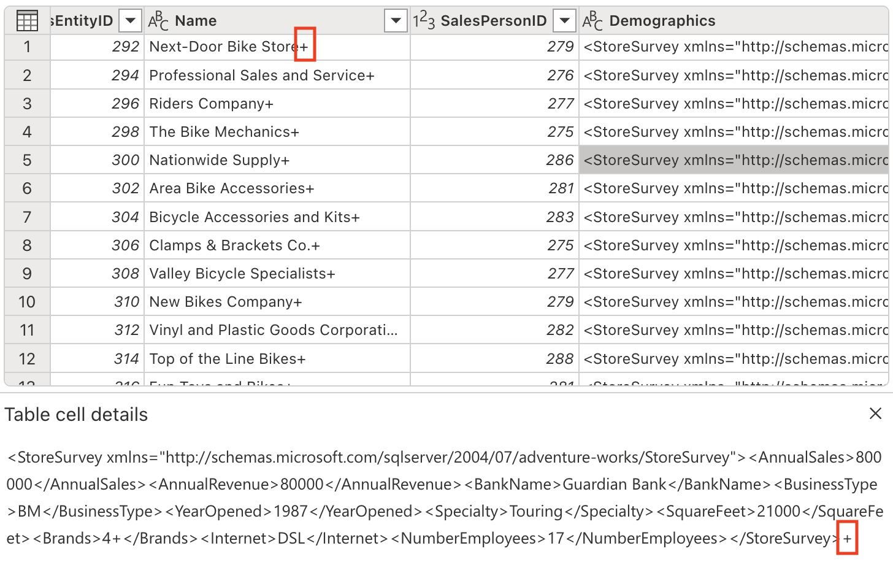

---
lab:
  title: Microsoft Fabric データフロー Gen2 で Copilot を使用してよりスマートに作業する
  module: Get started with Copilot in Fabric for data engineering
---

# Microsoft Fabric データフロー Gen2 で Copilot を使用してよりスマートに作業する

Microsoft Fabric では、データフロー (Gen2) でさまざまなデータ ソースに接続し、Power Query Online で変換を実行します。 その後はデータ パイプラインで使用して、レイクハウスやその他の分析ストアにデータを取り込んだり、Power BI レポートのデータセットを定義したりできます。 このラボでは、複雑なエンタープライズ ソリューションの構築に重点を置くのではなく、データフロー (Gen2) の Copilot の概要について説明します。

この演習の所要時間は約 **30** 分です。

## 学習内容

このラボでは、次のことを行います。

- Microsoft Fabric データフロー Gen2 で Copilot を使用してデータ変換タスクを高速化する方法を理解する。
- Power Query Online と Copilot の支援機能を使用したデータの取り込み、クリーニング、変換の方法について学ぶ。
- 列の名前変更、不要な文字の削除、適切なデータ型の設定など、データ品質に関するベスト プラクティスを適用する。
- データフロー内の XML データの解析と展開の経験を積む。
- 継続的なデータを、分析のために意味のあるグループに分類する。
- 変換されたデータをレイクハウスに発行し、結果を検証する。
- 生産性とデータ品質を高めるための AI 支援データ エンジニアリングの価値を認識する。

## 開始する前に

この演習を完了するには、Copilot が有効になっている [Microsoft Fabric Capacity (F2 以上)](https://learn.microsoft.com/fabric/fundamentals/copilot-enable-fabric) が必要です。

## 演習のシナリオ

グローバル小売企業である Contoso は、Microsoft Fabric を使用してデータ インフラストラクチャの最新化を進めています。 あなたはデータ エンジニアとして、分析用のストア情報を準備する作業を担当しています。 生データは CSV ファイルに保存されていて、埋め込み XML フィールド、一貫性のない列名、不要な文字が含まれています。 目標は、データフロー Gen2 で Copilot を使用して、このデータの取り込み、クリーニング、変換、エンリッチを行うことです。そうすることで、レイクハウスでのレポートと分析のための準備が整います。 この実践的な演習では、各手順について説明し、Copilot で一般的なデータ エンジニアリング タスクを高速化および簡素化する方法を示します。

## ワークスペースの作成

Fabric でデータを操作する前に、Fabric を有効にしてワークスペースを作成します。 ワークスペースは、すべての Fabric 項目のコンテナーとして機能し、コラボレーション機能をチームに提供します。

1. ブラウザーの `https://app.fabric.microsoft.com/home?experience=fabric` で [Microsoft Fabric ホーム ページ](https://app.fabric.microsoft.com/home?experience=fabric)に移動し、Fabric 資格情報でサインインします。

1. 左側のメニュー バーで、 **[ワークスペース]** を選択します (アイコンは &#128455; に似ています)。

1. 任意の名前で新しいワークスペースを作成し、Fabric 容量を含むライセンス モード (*Premium* または *Fabric*) を選択します。 "試用版" はサポートされていないのでご注意ください。**

    > **重要**: Fabric の Copilot 機能には、有料の容量 (F2 以上) が必要です。 試用版ワークスペースでは、Copilot 機能はサポートされていません。

1. 開いた新しいワークスペースは空のはずです。

    

## レイクハウスを作成する

ワークスペースが作成されたので、次にデータを取り込むデータ レイクハウスを作成します。

1. 左側のメニュー バーで、**[作成]** を選択します。 *[新規]* ページの [*[Data Engineering]* セクションで、**[レイクハウス]** を選択します。 任意の一意の名前を設定します。 [Lakehouse スキーマ (パブリック プレビュー)] オプションが無効になっていることを確認します。

    >**注**: **[作成]** オプションがサイド バーにピン留めされていない場合は、最初に省略記号 (**...**) オプションを選択する必要があります。

    1 分ほどすると、新しい空のレイクハウスが作成されます。

    

## データフロー (Gen2) を作成してデータを取り込む

レイクハウスが作成されたので、それにデータを取り込む必要があります。 これを行う 1 つの方法は、"抽出、変換、読み込み" (ETL) プロセスをカプセル化するデータフローを定義することです。**

1. ワークスペースのホーム ページで、**[データの取得]**、**[新しいデータフロー Gen2]** の順に選択します。 数秒後、次に示すように、新しいデータフローの Power Query エディターが開きます。

    

1. **[Text ファイルまたは CSV ファイルからイポート]** を選択し、次の設定を使用して新しいデータ ソースを作成します。

   - **ファイルへのリンク**: 選択**
   - **ファイル パスまたは URL**: `https://raw.githubusercontent.com/MicrosoftLearning/mslearn-fabric/refs/heads/main/Allfiles/Labs/22a/Store.csv`
   - **接続**: 新しい接続の作成
   - **接続名**: "一意の名前を指定します"**
   - **データ ゲートウェイ**: (なし)
   - **認証の種類**: 匿名
   - **プライバシー レベル**: なし
  
> **注**:接続が既にある場合は、新しい接続を作成する代わりに選択できます。

1. **[次へ]** を選択してファイル データをプレビューし、データ ソースを**作成**します。 Power Query エディターには、次に示すように、データ ソースと、データを書式設定するためのクエリ ステップの初期セットが表示されます。

    

1. 次に示すように、**[ホーム]** リボン タブの **[分析情報]** グループ内から、**[Copilot]** を選択します。
    
    

1. 現在の列名は一般的すぎて明確な意味を持っていません (列 1、列 2 などと表示するようなものです)。 わかりやすい列名は、データの理解とダウンストリーム処理のために不可欠です。 次のプロンプトを使用してそれらを調整し、意図した情報が正確に伝わるようにします。

    ```copilot-prompt
    Rename columns to BusinessEntityID, Name, SalesPersonID, Demographics, rowguid, ModifiedDate
    ```

    列名が正確でわかりやすくなったことに注意してください。 さらに、適用したステップの一覧に追加のステップが組み込まれ、Copilot がバックグラウンドでどのように Power Query M コードを自動的に生成したかが示されています。
    
    

1. 特定の列には、テキスト値の末尾に '+' 文字が含まれています。 これは、ダウンストリームでのデータ分析と処理の妨げになる可能性がある一般的なデータ品質の問題です。 

    
    
    次のプロンプトを使用して、これらの不要な文字を取り除きましょう。
    
    ```copilot-prompt
    Delete the last character from the columns Name, Demographics, rowguid
    ```
    
    **この重要性について**: 余分な文字を削除すると、データの整合性が確保され、プロセスの後半で文字列操作またはデータ結合を実行するときの問題が回避されます。

1. テーブルには冗長な列がいくつか含まれており、データセットを合理化して処理効率を高めるために、それらを削除する必要があります。 次のプロンプトを使用して、そのようにデータを調整します。

    
    
    ```copilot-prompt
    Remove the rowguid and Column7 columns
    ```
    
    **注**:`rowguid` 列は通常、内部データベース操作に使用され、分析には必要ありません。 `Column7` は、データセットに値を追加しない、空の列または無関係な列と見受けられます。
    
1. Demographics 列には、非表示の Unicode 文字であるバイト オーダー マーク (BOM) \ufeff が含まれており、XML データの解析を妨げています。 適切な処理を行うために、それを削除する必要があります。 [Copilot] ペインで、次のプロンプトを入力します。

    ```copilot-prompt
    Remove the Byte Order Mark (BOM) \ufeff from the Demographics column
    ```
    
    **BOM について**: バイト オーダー マークは、テキスト ファイルの先頭に記載される、テキスト エンコードのバイト順を示す Unicode 文字です。 ファイル エンコードの検出に役立ちますが、XML などの構造化データを解析するときに問題が発生する可能性があります。
    
    文字を削除するために生成された数式に注目してください。
    
    
    
1. これで、XML データを解析し、別の列に展開する準備ができました。 Demographics 列には、年間売上や平方フィート、その他のビジネス メトリックなどの貴重な店舗情報を保持する XML 形式のデータが含まれています。

    
    
    [Copilot] ペインで、次のプロンプトを入力します。
    
    ```copilot-prompt
    Parse this XML and expand it's columns
    ```
    
    **XML 解析について**: XML (拡張マークアップ言語) は、階層情報を格納するために一般的に使用される構造化データ形式です。 XML を解析して展開することで、入れ子になったデータを分析しやすいフラットな表形式の構造に変換します。
    
    テーブルに新しい列が追加されていることに注意してください (右にスクロールすることが必要な場合があります)。
    
    

1. すべての重要な情報を個別の列に抽出したので、必要なくなった Demographics 列を削除します。 [Copilot] ペインで、次のプロンプトを入力します。

    ```copilot-prompt
    Remove the Demographics column.
    ```

    **この列を削除する理由**: XML を解析し、情報ごとに個別の列を作成したので、生の XML を含む元の Demographics 列は冗長になり、データセットをクリーンに保つために安全に削除できます。

1. ModifiedDate 列の値の末尾にアンパサンド (&) があります。 適切なデータ処理を確実に行うには、解析前にそれを削除する必要があります。

    
    
    [Copilot] ペインで、次のプロンプトを入力します。
    
    ```copilot-prompt
    Remove the last character from the ModifiedDate
    ```

1. これで、適切な日付/時刻操作と分析のために、データ型を DateTime に変換する準備ができました。 [Copilot] ペインで、次のプロンプトを入力します。

    ```copilot-prompt
    Set the data type to DateTime
    ```

    **データ型の重要度**: 正しいデータ型に変換することは、ダウンストリーム分析での適切な並べ替え、フィルター処理、日付ベースの計算を可能にするために不可欠です。

    ModifiedDate データ型が DateTime に変更されたことに注意してください。
    
    
    
1. 数学演算と適切な集計を有効にするために、複数の列のデータ型を数値に調整します。 [Copilot] ペインで、次のプロンプトを入力します。

    ```copilot-prompt
    Set the data type to whole number for the following columns: AnnualSales, AnnualRevenue, SquareFeet, NumberEmployee
    ```
    
    **数値に変換する理由**: 数値データ型を使用すると、テキスト ベースのデータでは不可能な、適切な数学的計算、集計 (合計、平均など)、統計分析を行うことができます。
    
1. SquareFeet フィールドには、6,000 から 80,000 の範囲の数値が保持されます。 連続する数値データからカテゴリのグループを作成することは、データの解釈と分析を容易にする一般的な分析手法です。

    
    
    新しい列を生成し、店舗のサイズを適切に分類しましょう。 [Copilot] ペインで、次のプロンプトを入力します。
    
    ```copilot-prompt
    Add a column StoreSize, based on the SquareFeet:
        0 - 10000: Small
        10001 - 40000: Medium
        40001 - 80000: Large
    ```
    
    新しい列 StoreSize が追加され、SquareFeet 列に基づく数式が追加されたことに注目してください。 列プロファイルに 3 つの異なる値があることにも注意してください: Small、Medium、Large。
    
    
    
1. 現在指定された型がない列のデータ型を変更します。 [Copilot] ペインで、次のプロンプトを入力します。

    ```copilot-prompt
    Set the datatype of the following columns to text: Name, BankName, BusinessType, YearOpened, Specialty, Brands, Internet, StoreSize
    ```
    
    **データ型の整合性**: データ型を明示的に設定すると、ダウンストリーム プロセスでの予測可能な動作が保証され、予期しない結果につながる可能性がある自動型推論が防止されます。
    
## コードの説明

1. ここまで、いくつかの変換を実行しました。 実行した手順を要約するよう Copilot に依頼しましょう。

    ```copilot-prompt
    Describe this query
    ```
    
    Copilot ペインに結果が表示されたことを確認します。 表示される説明の例を次に示します。 AI 生成コンテンツには間違いがある可能性があるため、結果は若干異なる場合があります。
    
    
    
    ***Store** の説明は次のとおりです。CSV ファイルの読み込みと変換、XML データの解析、ストアのサイズ別の分類を行います。*
    
    - _**ソース**: パイプ区切り記号と特定のエンコードを使用して、URL から CSV ファイルを読み込みます。_
    - _**変更された列タイプ**:列のデータ型を変更します。_
    - _**列名の変更**: 列の名前をわかりやすい名前に変更します。_
    - _**カスタム**: "Name"、"Demographics"、"rowguid" 列から最後の文字を削除します。_
    - _**列の削除**: "rowguid" 列と "Column7" 列を削除します。_
    - _**カスタム 1**: "Demographics" 列から先頭の特殊文字を削除します。_
    - _**カスタム 2**: "Demographics" 列を XML として解析し、複数の列に展開します。_
    - _**列の削除 1**: 元の "Demographics" 列を削除します。_
    - _**列の変換**: "ModifiedDate" 列から最後の文字を削除します。_
    - _**列の変換 1**: "ModifiedDate" 列を datetime 型に変換します。_
    - _**型の変更**: "AnnualSales"、"AnnualRevenue"、"SquareFeet"、"NumberEmployees" の各列のデータ型を整数に変更します。_
    - _**条件列**: "SquareFeet" 値に基づいて新しい列 "StoreSize" を追加し、ストアを "Small"、"Medium"、または "Large" として分類します。_
    - _**型の変更 1**: 複数の列のデータ型をテキストに変更します。_
    
## データフローのデータ同期先を追加する

1. ツール バー リボンで、**[ホーム]** タブを選択します。次に、**[既定のデータ宛先]** ドロップダウン メニューで、**[追加]** を選択します。

    > **メモ:** このオプションが淡色表示されている場合は、既にデータ同期先が設定されている可能性があります。 Power Query エディターの右側にある [クエリの設定] ペインの下部でデータ同期先を確認します。 同期先が既に設定されている場合は、歯車を使用して変更できます。

1. **[レイクハウス]** を選択します。

1. **[既定のデータ宛先に接続]** ダイアログ ボックスで、接続を編集し、Power BI 組織アカウントを使用してサインインし、データフローからレイクハウスへのアクセスに使用する ID を設定します。

    

1. **[次へ]** を選択し、使用可能なワークスペースの一覧でご自分のワークスペースを見つけて、この演習の開始時に作成したレイクハウスを選択します。 次に、**Store** という名前の新しいテーブルを指定します。

    

1. **[次へ]** を選択し、**[コピー先の設定]** ページで、**[自動設定を使用する]** オプションを無効にして、**[追加]** を選択し、**[設定の保存]** を選択します。

    > **注:** データ型の更新には *Power Query* エディターを使用することを推奨しますが、必要に応じて、このページから行うこともできます。

    

1. **[保存して実行]** を選択してデータフローを発行します。 次に、ワークスペースにデータフロー **Dataflow 1** が作成されるまで待ちます。

## 作業を検証する

次に、データフローから ETL プロセスを検証し、すべての変換が正しく適用されたことを確認します。

1. ワークスペースに戻り、前に作成したレイクハウスを開きます。

1. レイクハウスで、**Store** テーブルを見つけて開きます。 (データフローでデータが処理されるときに、データが設定されるまで数分待つ必要がある場合があります。)

1. 変換されたデータの次の重要な側面を確認します。

   - **列名**: 指定したわかりやすい名前 (BusinessEntityID、Name、SalesPersonID など) と一致していることを確認します
   - **データ型**: 数値列が数値として表示され、DateTime 列が日付/時刻として表示され、テキスト列がテキストとして表示されることを確認します
   - **データ品質**: 不要な文字 (+、> ) が削除されたことを確認します
   - **XML 展開**: 元の XML の Demographics データから抽出された個々の列に注目してください
   - **StoreSize カテゴリ**: SquareFeet 値に基づいて、Small/Medium/Large のカテゴリが正しく作成されたことを確認します
   - **データの完全性**: 変換プロセス中に重要なデータが失われていないことを確認します

   

    **この重要性について**: 最終的なテーブルには、わかりやすい列名、適切なデータ型、新しい StoreSize カテゴリ列を含む、適切に構造化されたクリーンなデータが含まれている必要があります。 これは、生の乱雑なデータが、Copilot によってどのように分析に対応したクリーンなデータセットに変換されるかを示しています。

## リソースをクリーンアップする

Microsoft Fabric でのデータフローの調査が完了したら、この演習用に作成したワークスペースを削除できます。

1. ブラウザーで Microsoft Fabric に移動します。
1. 左側のバーで、ワークスペースのアイコンを選択して、それに含まれるすべての項目を表示します。
1. **[ワークスペースの設定]** を選択し、**[全般]** セクションで下にスクロールし、**[このワークスペースを削除する]** を選択します。
1. **[削除]** を選択して、ワークスペースを削除します。

