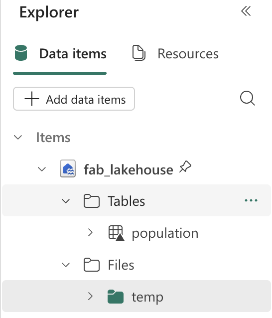
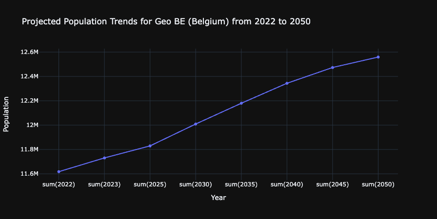

---
lab:
  title: Microsoft Fabric ノートブックで Apache Spark と Copilot を使用してデータを分析する
  module: Get started with Copilot in Fabric for data engineering
---

# Microsoft Fabric ノートブックで Apache Spark と Copilot を使用してデータを分析する

このラボでは、Fabric Data Engineering の Copilot を使い、ノートブックを使用してレイクハウスにデータを読み込み、変換し、保存します。 ノートブックには、コード、視覚化、説明テキストを 1 つのドキュメントにまとめた対話型環境が備わっています。 この形式により、ワークフローの文書化、推論の説明、他のユーザーとの結果の共有が簡単になります。 ノートブックを使用することで、コードの開発とテストを繰り返し行い、各ステップでデータを視覚化し、分析プロセスを明確に記録することができます。 このアプローチにより、コラボレーションを促進し、再現性を高め、理解を深めることができるようになるため、ノートブックはデータ エンジニアリングと分析のタスクにとって最適なツールになります。

従来、データ エンジニアリング用のノートブックを使用するには、Python や Scala などの言語でコードを記述し、Apache Spark や Pandas などのフレームワークとライブラリをしっかりと理解する必要があります。 これは、プログラミングが初めての人や、これらのツールに慣れていない人にとっては困難な場合があります。 Fabric ノートブックの Copilot を使用すると、自然言語でデータ タスクを記述でき、Copilot に必要なコードを生成してもらえます。Copilot が技術的に複雑な部分の多くを担うため、ユーザーは分析に集中できます。

この演習の所要時間は約 **30** 分です。

## 学習内容

このラボを完了すると、次のことができるようになります。

- データ エンジニアリング タスクを実施するために Microsoft Fabric ワークスペースとレイクハウスを作成して構成する。
- Fabric ノートブックで Copilot を使用して、自然言語プロンプトからコードを生成する。
- Apache Spark と Copilot 支援ワークフローを使用して、データの取り込み、クリーンアップ、変換を行う。
- データ型を分割、フィルター処理、変換することで、分析用の統計データセットを正規化して準備する。
- 変換されたデータをレイクハウス内のテーブルとして保存し、ダウンストリーム分析に使用する。
- Copilot を使用してクエリと視覚化を生成し、データの探索と検証に使用する。
- Microsoft Fabric のデータ クリーニング、変換、コラボレーション分析のベスト プラクティスについて理解する。

## 開始する前に

この演習を完了するには、Copilot が有効になっている [Microsoft Fabric Capacity (F2 以上)](https://learn.microsoft.com/fabric/fundamentals/copilot-enable-fabric) が必要です。

> **注**:参考までに、この演習で使用するすべてのプロンプトが掲載されたノートブックを以下からダウンロードできます。

`https://github.com/MicrosoftLearning/mslearn-fabric/raw/refs/heads/main/Allfiles/Labs/22b/Starter/eurostat-notebook.ipynb`

## 演習のシナリオ

総合病院ネットワーク Contoso Health が、ヨーロッパでサービスを拡張し、予測される人口データを分析したいと考えています。 この例では、[Eurostat](https://ec.europa.eu/eurostat/web/main/home) (欧州連合統計局) の人口予測データセットを使用します。

ソース:EUROPOP2023 1 月 1 日の年齢、性別、予測の種類別の人口 [[proj_23np](https://ec.europa.eu/eurostat/databrowser/product/view/proj_23np?category=proj.proj_23n)]、最終更新日: 2023 年 6 月 28 日。

## ワークスペースの作成

Fabric でデータを操作する前に、Fabric を有効にしてワークスペースを作成します。 Microsoft Fabric のワークスペースは、レイクハウス、ノートブック、データセットなど、データ エンジニアリングのすべての成果物を整理して管理できる、コラボレーション環境として機能します。 これは、データ分析に必要なすべてのリソースが入ったプロジェクト フォルダーと考えてください。

1. ブラウザーの `https://app.fabric.microsoft.com/home?experience=fabric` で [Microsoft Fabric ホーム ページ](https://app.fabric.microsoft.com/home?experience=fabric)に移動し、Fabric 資格情報でサインインします。

1. 左側のメニュー バーで、 **[ワークスペース]** を選択します (アイコンは &#128455; に似ています)。

1. 任意の名前で新しいワークスペースを作成し、Fabric 容量を含むライセンス モード (*Premium* または *Fabric*) を選択します。 "試用版" はサポートされていないのでご注意ください。**
   
    > **この重要性について**: Copilot が機能するには、有料の Fabric 容量が必要です。 これにより、このラボ全体を通してコードの生成を支援する、AI 搭載機能にアクセスできます。

1. 開いた新しいワークスペースは空のはずです。

    

## レイクハウスを作成する

ワークスペースが作成されたので、次はデータを取り込むレイクハウスを作成します。 レイクハウスは、データ レイクの利点 (生データをさまざまな形式で格納できる) とデータ ウェアハウスの利点 (分析用に最適化された構造化データ) の両方を兼ね備えています。 これは、人口の生データの格納場所と、クリーニングされて変換されたデータセットのターゲットの両方として機能します。

1. 左側のメニュー バーで、**[作成]** を選択します。 *[新規]* ページの [*[Data Engineering]* セクションで、**[レイクハウス]** を選択します。 任意の一意の名前を設定します。

    >**注**: **[作成]** オプションがサイド バーにピン留めされていない場合は、最初に省略記号 (**...**) オプションを選択する必要があります。

![Fabric の [作成] ボタンのスクリーンショット。](./Images/copilot-fabric-notebook-create.png)

1 分ほどすると、新しい空のレイクハウスが作成されます。


## ノートブックを作成する

これで、データを操作する Fabric ノートブックを作成できるようになりました。 ノートブックは、コードの記述と実行、結果の視覚化、データ分析プロセスの文書化を行うことができる、対話型環境を提供します。 これは探索的なデータ分析や反復的な開発に最適で、各ステップの結果をすぐに確認できます。

1. 左側のメニュー バーで、**[作成]** を選択します。 *[新規]* ページの [*[Data Engineering]* セクションで、**[Notebook]** を選択します。

    **Notebook 1** という名前の新しいノートブックが作成されて開きます。

    

1. Fabric は、Notebook 1、Notebook 2 などのように、作成する各ノートブックに名前を割り当てます。名前をよりわかりやすいものに変更するには、メニューの **[ホーム]** タブの上にある名前パネルをクリックします。

    

1. 最初のセル (今はコード セル) を選択し、右上のツール バーで **[M↓]** ボタンを使用して Markdown セルに変換します。 セルに含まれるテキストは、書式設定されたテキストで表示されます。

    > **Markdown のセルを使う理由**: Markdown のセルを使用すると、書式設定されたテキストを使って分析を文書化できるため、他のユーザーにとって (または自分が後で見返すときに) ノートブックが読みやすく、理解しやすくなります。

    

1. 🖉 ([編集]) ボタンを使用してセルを編集モードに切り替え、マークダウンを次のように変更します。

    ```md
    # Explore Eurostat population data.
    Use this notebook to explore population data from Eurostat
    ```
    
    
    
    完了したら、セルの外側のノートブック内の任意の場所をクリックして編集を停止します。

## ノートブックにレイクハウスをアタッチする

ノートブックからレイクハウス内のデータを操作するには、ノートブックにレイクハウスをアタッチする必要があります。 この接続により、ノートブックとストレージ間で読み取りと書き込みを行うことができます。これにより、分析環境とデータ ストレージの間にシームレスな統合が作成されます。

1. 左側のバーから新しいワークスペースを選択します。 ワークスペースに含まれるアイテム (レイクハウスやノートブックなど) の一覧が表示されます。

1. レイクハウスを選択して、[エクスプローラー] ペインを表示します。

1. 上部のメニューから **[ノートブックを開く]**、**[既存のノートブック]** を選択し、前に作成したノートブックを開きます。 これで [エクスプローラー] ペインの横にノートブックが開くはずです。 [レイクハウス] を展開し、Files リストを展開します。 次のように、ノートブック エディターの横にテーブルやファイルはまだ表示されていないので注意してください。

    ![[エクスプローラー] ビューの CSV ファイルの画面画像。](Images/copilot-fabric-notebook-step-2-lakehouse-attached.png)

    > **表示される内容**: 左側の [エクスプローラー] ペインに、レイクハウスの構造が表示されます。 現在は空ですが、データが読み込まれて処理されると、**Files** セクションにファイルが、**Tables** セクションにテーブルが表示されます。


## データの読み込み

次は、Copilot を使用して、Eurostat API からデータをダウンロードできるようにします。 Python コードをゼロから記述する代わりに、実行する内容を自然言語で記述すると、Copilot によって適切なコードが生成されます。 これは AI 支援コーディングの主な利点の 1 つを示しており、細かい技術的な実装ではなく、ビジネス ロジックに集中できます。

1. ノートブック内に新しいセルを作成し、次の命令をコピーします。 Copilot でコードを生成するよう指示するには、セルの最初の命令として `%%code` を使用します。 

    > **`%%code` マジック コマンドについて**: この特別な命令は、自然言語の記述に基づいて Python コードを生成するよう Copilot に指示します。 これは、Copilot との対話をより効果的に行うのに役立つ、"マジック コマンド" の 1 つです。

    ```copilot-prompt
    %%code
    
    Download the following file from this URL:
    
    https://ec.europa.eu/eurostat/api/dissemination/sdmx/2.1/data/proj_23np$defaultview/?format=TSV
     
    Then write the file to the default lakehouse into a folder named temp. Create the folder if it doesn't exist yet.
    ```
    
1. セルの左側にある ▷ **[セルの実行** を選択してコードを実行します。

    Copilot によって次のコードが生成されます。これは、環境と Copilot の最新の更新プログラムによって若干異なる場合があります。
    
    
    
    > **Copilot のしくみ**: Copilot が自然言語の要求を、どのようにして動作する Python コードに変換するかに注目してください。 HTTP 要求を行い、ファイル システムを処理し、レイクハウス内の特定の場所にデータを保存する必要があることを理解しています。
    
    実行中に例外が発生した際に役立つように、完全なコードを次に示します。
    
    ```python
    #### ATTENTION: AI-generated code can include errors or operations you didn't intend. Review the code in this cell carefully before running it.
    
    import requests
    import os
    
    # Define the URL and the local path
    url = "https://ec.europa.eu/eurostat/api/dissemination/sdmx/2.1/data/proj_23np$defaultview/?format=TSV"
    local_path = "/lakehouse/default/Files/temp/"
    file_name = "proj_23np.tsv"
    file_path = os.path.join(local_path, file_name)
    
    # Create the temporary directory if it doesn't exist
    if not os.path.exists(local_path):
        os.makedirs(local_path)
    
    # Download the file
    response = requests.get(url)
    response.raise_for_status()  # Check that the request was successful
    
    # Write the content to the file
    with open(file_path, "wb") as file:
        file.write(response.content)
    
    print(f"File downloaded and saved to {file_path}")
    ```

1. セルの左側にある ▷ **[セルの実行]** を選択してコードを実行し、出力を確認します。 ファイルはダウンロードされ、レイクハウスの一時フォルダーに保存されます。

    > **注**: 3 つのドット (...) を選択してレイクハウスの Files を更新する必要がある場合があります。
    
    

1. これでレイクハウスに生データ ファイルが作成されたので、それを分析して変換できるように Spark DataFrame に読み込む必要があります。 ノートブック内に新しいセルを作成し、次の命令をコピーします。

    > **Information**:DataFrame は、データベースやスプレッドシート内のテーブルと同様に、名前付き列に編成されたデータの分散コレクションです。

    ```copilot-prompt
    %%code
    
    Load the file 'Files/temp/proj_23np.tsv' into a spark dataframe.
    
    The fields are separated with a tab.
    
    Show the contents of the DataFrame using display method.
    ```

1. セルの左側にある ▷ **[セルの実行]** を選択してコードを実行し、出力を確認します。 データフレームには、TSV ファイルのデータが含まれているはずです。 生成されたコードは、次のようになります。

    ```python
    #### ATTENTION: AI-generated code can include errors or operations you didn't intend. Review the code in this cell carefully before running it.
    
    # Load the file 'Files/temp/proj_23np.tsv' into a spark dataframe.
    # The fields have been separated with a tab.
    file_path = "Files/temp/proj_23np.tsv"
    
    spark_df = spark.read.format("csv").option("delimiter", "\t").option("header", "true").load(file_path)
    
    # Show the contents of the DataFrame using display method
    display(spark_df)
    ```

出力は、たとえば、次のようになります。

| freq,projection,sex,age,unit,geo\TIME_PERIOD |      2022  |      2023  |   ...  |      2100  |
| -------------------------------------------- | ---------- | ---------- | ------ | ---------- |
|                         A,BSL,F,TOTAL,PER,AT |   4553444  |   4619179  |   ...  |   4807661  |
|                         A,BSL,F,TOTAL,PER,BE |   5883978  |   5947528  |   ...  |   6331785  |
|                         A,BSL,F,TOTAL,PER,BG |   3527626  |   3605059  |   ...  |   2543673  |
|                                          ... |       ...  |       ...  |   ...  |   5081250  |
|                         A,BSL,F,TOTAL,PER,CY |    463622  |    476907  |   ...  |    504781  |

> **データ構造について**: 最初の列にはコンマで区切られた複数の値 (頻度、予測型、性別、年齢、単位、地理的位置) が含まれていることに注目してください。残りの列は年と人口を示します。 この構造は統計データセットで一般的ですが、効果的な分析を行うにはクリーンアップする必要があります。

## データの変換: フィールドの分割

では、データを変換してみましょう。 最初のフィールドが別個の列に分割されていることを確認する必要があります。 さらに、正しいデータ型を使用していることと、フィルター処理を適用することも確認する必要があります。 

> **フィールドを分割する必要がある理由**: 最初の列には、複数の情報 (頻度、予測型、性別、年齢グループ、単位、地理コード) が連結されています。 適切な分析を行うには、これらを別個の列に配置する必要があります。 このプロセスは、データ構造の "正規化" と呼ばれます。

1. ノートブック内に新しいセルを作成し、次の命令をコピーします。


    ```copilot-prompt
    %%code
    
    From the currently loaded DataFrame, split the first field 'freq,projection,sex,age,unit,geo\TIME_PERIOD' using a comma into 6 separate fields.
    ```

1. セルの左側にある ▷ **[セルの実行]** を選択してコードを実行し、出力を確認します。 出力は、たとえば、次のようになります。

    ```python
    #### ATTENTION: AI-generated code can include errors or operations you didn't intend. Review the code in this cell carefully before running it.
    
    from pyspark.sql.functions import split, col
    
    # Split the first field 'freq,projection,sex,age,unit,geo\TIME_PERIOD' into 6 separate fields
    spark_df = spark_df.withColumn("freq", split(col("freq,projection,sex,age,unit,geo\\TIME_PERIOD"), ",").getItem(0)) \
                       .withColumn("projection", split(col("freq,projection,sex,age,unit,geo\\TIME_PERIOD"), ",").getItem(1)) \
                       .withColumn("sex", split(col("freq,projection,sex,age,unit,geo\\TIME_PERIOD"), ",").getItem(2)) \
                       .withColumn("age", split(col("freq,projection,sex,age,unit,geo\\TIME_PERIOD"), ",").getItem(3)) \
                       .withColumn("unit", split(col("freq,projection,sex,age,unit,geo\\TIME_PERIOD"), ",").getItem(4)) \
                       .withColumn("geo", split(col("freq,projection,sex,age,unit,geo\\TIME_PERIOD"), ",").getItem(5))
    
    # Show the updated DataFrame
    display(spark_df)
    ```

1. セルの左側にある ▷ **[セルの実行** を選択してコードを実行します。 テーブルに追加された新しいフィールドを表示するには、テーブルを右にスクロールすることが必要な場合があります。

    

## データの変換: フィールドの削除

テーブル内の一部のフィールドには、1 つの一意のエントリのみが含まれているため、意味のない値であることがあります。 ベスト プラクティスとして、データセットから削除することをおすすめします。

> **データ クリーニングの原則**: 一意の値が 1 つのみの列では分析値が提供されないため、データセットが不必要に複雑になるおそれがあります。 これらを削除すると、データ構造が簡略化され、パフォーマンスが向上します。 この場合、'freq' (頻度)、'age' (すべてのレコードは TOTAL)、'unit' (すべてのレコードは PER (person: 人)) はすべての行で一定です。

1. ノートブック内に新しいセルを作成し、次の命令をコピーします。

    ```copilot-prompt
    %%code
    
    From the currently loaded DataFrame, remove the fields 'freq', 'age', 'unit'.
    ```

1. セルの左側にある ▷ **[セルの実行]** を選択してコードを実行し、出力を確認します。 出力は、たとえば、次のようになります。

    ```python
    #### ATTENTION: AI-generated code can include errors or operations you didn't intend. Review the code in this cell carefully before running it.
    
    # Remove the fields 'freq', 'age', 'unit'
    spark_df = spark_df.drop("freq", "age", "unit")
    
    # Show the updated DataFrame
    display(spark_df)
    ```

1. セルの左側にある ▷ **[セルの実行** を選択してコードを実行します。

## データの変換: フィールドの位置変更

最も重要な識別列を最初に配置してデータを整理すると、読みやすく理解しやすくなります。 データ分析では、数値/メジャー列 (年ごとの人口値) の前にカテゴリ/ディメンション列 (予測型、性別、地理的位置など) を配置するのが一般的です。

1. ノートブック内に新しいセルを作成し、次の命令をコピーします。

    ```copilot-prompt
    %%code
    
    From the currently loaded DataFrame, the fields 'projection', 'sex', 'geo' should be positioned first.
    ```

1. セルの左側にある ▷ **[セルの実行]** を選択してコードを実行し、出力を確認します。 出力は、たとえば、次のようになります。

    ```python
    #### ATTENTION: AI-generated code can include errors or operations you didn't intend. Review the code in this cell carefully before running it.
    
    # Reorder the DataFrame with 'projection', 'sex', 'geo' fields first
    new_column_order = ['projection', 'sex', 'geo'] + [col for col in spark_df.columns if col not in {'projection', 'sex', 'geo'}]
    spark_df = spark_df.select(new_column_order)
    
    # Show the reordered DataFrame
    display(spark_df)
    ```

1. セルの左側にある ▷ **[セルの実行** を選択してコードを実行します。

## データの変換: 値の置換

予測フィールドには現在、暗号のようなコードが含まれており、ユーザー フレンドリではありません。 読みやすく分析しやすくするために、これらのコードを、各予測シナリオが表す内容を明確に説明する、わかりやすい名前に置き換えます。

> **予測シナリオを理解する**: 統計の組織は、多くの場合、さまざまなシナリオを使用して将来の人口変化をモデル化します。 ベースラインは最もあり得るシナリオを表し、感度テストでは、出生率、死亡率、人口移動パターンに関するさまざまな仮定の下で、人口がどのように変化するかを示します。

1. ノートブック内に新しいセルを作成し、次の命令をコピーします。


    ```copilot-prompt
    %%code
    
    The 'projection' field contains codes that should be replaced with the following values:
        _'BSL' -> 'Baseline projections'.
        _'LFRT' -> 'Sensitivity test: lower fertility'.
        _'LMRT' -> 'Sensitivity test: lower mortality'.
        _'HMIGR' -> 'Sensitivity test: higher migration'.
        _'LMIGR' -> 'Sensitivity test: lower migration'.
        _'NMIGR' -> 'Sensitivity test: no migration'.
    ```

1. セルの左側にある ▷ **[セルの実行]** を選択してコードを実行し、出力を確認します。 出力は、たとえば、次のようになります。

    ```python
    #### ATTENTION: AI-generated code can include errors or operations you didn't intend. Review the code in this cell carefully before running it.
    
    from pyspark.sql.functions import when
    
    # Replace projection codes
    spark_df = spark_df.withColumn("projection", 
                                   when(spark_df["projection"] == "BSL", "Baseline projections")
                                   .when(spark_df["projection"] == "LFRT", "Sensitivity test: lower fertility")
                                   .when(spark_df["projection"] == "LMRT", "Sensitivity test: lower mortality")
                                   .when(spark_df["projection"] == "HMIGR", "Sensitivity test: higher migration")
                                   .when(spark_df["projection"] == "LMIGR", "Sensitivity test: lower migration")
                                   .when(spark_df["projection"] == "NMIGR", "Sensitivity test: no migration")
                                   .otherwise(spark_df["projection"]))
    
    # Display the updated DataFrame
    display(spark_df)
    ```

1. セルの左側にある ▷ **[セルの実行** を選択してコードを実行します。

    
    
## データの変換: データのフィルター処理

人口予測テーブルには、存在しない国が 2 行あります。EU27_2020 (*欧州連合の合計 - 27 か国*) と EA20 (*ユーロ圏 - 20 か国*) です。 データの細分性を最も低いもののみに保つ必要があるため、この 2 行は削除する必要があります。

> **データの細分性の原則**: 詳細な分析を行うためには、可能な限り細かいレベルでデータを操作することが重要です。 集計された値 (ヨーロッパの合計など) は、必要に応じて常に計算できますが、ベース データセットに含めると、分析の二重カウントや混乱につながるおそれがあります。


1. ノートブック内に新しいセルを作成し、次の命令をコピーします。

    ```copilot-prompt
    %%code
    
    Filter the 'geo' field and remove values 'EA20' and 'EU27_2020' (these are not countries).
    ```

1. セルの左側にある ▷ **[セルの実行]** を選択してコードを実行し、出力を確認します。 出力は、たとえば、次のようになります。

    ```python
    #### ATTENTION: AI-generated code can include errors or operations you didn't intend. Review the code in this cell carefully before running it.
    
    # Filter out 'geo' values 'EA20' and 'EU27_2020'
    spark_df = spark_df.filter((spark_df['geo'] != 'EA20') & (spark_df['geo'] != 'EU27_2020'))
    
    # Display the filtered DataFrame
    display(spark_df)
    ```

1. セルの左側にある ▷ **[セルの実行** を選択してコードを実行します。

    人口予測テーブルにはフィールド 'sex' もあり、次の一意の値が入っています。
    
    - M: Male
    - F: 女性
    - T:合計 (男性と女性)

    ここでも、データの細分性を最も低いレベルに保つために、合計を削除する必要があります。

    > **合計を削除する理由**: 地理的集計と同様に、個々の性別カテゴリ (男性と女性) のみを保持するために、合計値を除外する必要があります。 これにより、より柔軟な分析が可能になります。合計は男性と女性の値を足していつでも取得できますが、合計を構成要素に分割することはできません。

1. ノートブック内に新しいセルを作成し、次の命令をコピーします。

    ```copilot-prompt
    %%code
    
    Filter the 'sex' field and remove 'T' (these are totals).
    ```

1. セルの左側にある ▷ **[セルの実行]** を選択してコードを実行し、出力を確認します。 出力は、たとえば、次のようになります。

    ```python
    #### ATTENTION: AI-generated code can include errors or operations you didn't intend. Review the code in this cell carefully before running it.
    
    # Filter out 'sex' values 'T'
    spark_df = spark_df.filter(spark_df['sex'] != 'T')
    
    # Display the filtered DataFrame
    display(spark_df)
    ```

1. セルの左側にある ▷ **[セルの実行** を選択してコードを実行します。

## データの変換: スペースのトリミング

人口予測テーブルの一部のフィールド名の末尾にスペースが入っています。 これらのフィールドの名前にトリミング操作を実行する必要があります。

> **データ品質に関する懸念**: 列名に余分なスペースが入っていると、データのクエリや視覚化の作成時に問題が発生することがあります。 これはデータ品質に関してよく見られる問題です。特に外部ソースから取得したデータであったり、他のシステムからエクスポートされたデータであったりする場合に見られます。 スペースをトリミングすると、一貫性が確保され、後でデバッグが困難になる問題を回避できます。

1. ノートブック内に新しいセルを作成し、次の命令をコピーします。

    ```copilot-prompt
    %%code
    
    Strip spaces from all field names in the dataframe.
    ```

1. セルの左側にある ▷ **[セルの実行]** を選択してコードを実行し、出力を確認します。 出力は、たとえば、次のようになります。

    ```python
    #### ATTENTION: AI-generated code can include errors or operations you didn't intend. Review the code in this cell carefully before running it.
    
    from pyspark.sql.functions import col
    
    # Strip spaces from all field names
    spark_df = spark_df.select([col(column).alias(column.strip()) for column in spark_df.columns])
    
    # Display the updated DataFrame
    display(spark_df)
    ```

1. セルの左側にある ▷ **[セルの実行** を選択してコードを実行します。

## データの変換: データ型の変換

後で (Power BI や SQL などを使用して) データをきちんと分析する場合は、データ型 (数値や日時など) が正しく設定されていることを確認する必要があります。 

> **データ型が正しいことの重要性**: テキスト ファイルから読み込まれたデータは、すべての列が最初は文字列として扱われます。 年の列を整数に変換すると、算術演算 (計算や集計など) ができるようになり、適切に並べ替えができるようになります。 このステップは、ダウンストリーム分析や視覚化ツールにとって非常に重要です。

1. ノートブック内に新しいセルを作成し、次の命令をコピーします。

    ```copilot-prompt
    %%code
    
    Convert the data type of all the year fields to integer.
    ```

1. セルの左側にある ▷ **[セルの実行]** を選択してコードを実行し、出力を確認します。 出力は、たとえば、次のようになります。

    ```python
    #### ATTENTION: AI-generated code can include errors or operations you didn't intend. Review the code in this cell carefully before running it.
    
    from pyspark.sql.functions import col
    
    # Convert the data type of all the year fields to integer
    year_columns = [col(column).cast("int") for column in spark_df.columns if column.strip().isdigit()]
    spark_df = spark_df.select(*spark_df.columns[:3], *year_columns)
    
    # Display the updated DataFrame
    display(spark_df)
    ```
    
1. セルの左側にある ▷ **[セルの実行** を選択してコードを実行します。 出力の例を次に示します (簡潔にするために列と行を削除しています)。

|          投影 (projection)|性別|geo|    2022|    2023|     ...|    2100|
|--------------------|---|---|--------|--------|--------|--------| 
|ベースライン予測|  F| AT| 4553444| 4619179|     ...| 4807661|
|ベースライン予測|  F| BE| 5883978| 5947528|     ...| 6331785|
|ベースライン予測|  F| BG| 3527626| 3605059|     ...| 2543673|
|...                 |...|...|     ...|     ...|     ...|     ...|
|ベースライン予測|  F| LU|  320333|  329401|     ...|  498954|

>[!TIP]
> すべての列を見るには、テーブルを右にスクロールすることが必要な場合があります。

## データを保存する

次は、変換したデータをレイクハウスに保存します。 

> **変換したデータを保存する理由**: データのクリーニングと変換が完了したら、結果を保持しましょう。 データをレイクハウスのテーブルとして保存すると、変換プロセスを何度も実行する必要がなくなり、さまざまな分析シナリオでこのクリーンなデータセットを使用できます。 また、Microsoft Fabric エコシステム内の他のツール (Power BI、SQL 分析エンドポイント、Data Factory など) でもこのデータを使用できます。

1. ノートブック内に新しいセルを作成し、次の命令をコピーします。

    ```copilot-prompt
    %%code
    
    Save the dataframe as a new table named 'Population' in the default lakehouse.
    ```
    
1. セルの左側にある ▷ **[セルの実行** を選択してコードを実行します。 Copilot によってコードが生成されます。これは、環境と Copilot の最新の更新プログラムによって若干異なる場合があります。

    ```python
    #### ATTENTION: AI-generated code can include errors or operations you didn't intend. Review the code in this cell carefully before running it.
    
    spark_df.write.format("delta").saveAsTable("Population")
    ```

1. セルの左側にある ▷ **[セルの実行** を選択してコードを実行します。

## 検証: 質問する

次は、データ分析のための Copilot の機能を確認しましょう。 複雑な SQL クエリや視覚化コードをゼロから記述する代わりに、Copilot に対してデータに関する質問を自然言語で行うことができ、その質問に回答する適切なコードが生成されます。

1. データが正しく保存されていることを検証するには、レイクハウス内のテーブルを展開して内容を確認します (場合によっては、3 つのドット (...)を選択して Tables フォルダーを更新する必要があります)。 

    

1. [ホーム] リボンで、[Copilot] オプションを選択します。

    > **Copilot のチャット インターフェイス**: [Copilot] パネルには、データに関する質問を自然言語で行うことができる会話インターフェイスが用意されています。 分析用のコードを生成したり、視覚化を作成したり、データセット内のパターンを探したりするのに役立ちます。

    ![[Copilot] パネルが開いているノートブックのスクリーンショット。](Images/copilot-fabric-notebook-step-6-copilot-pane.png)

1. 次のプロンプトを入力します。

    ```copilot-prompt
    What are the projected population trends for geo BE  from 2020 to 2050 as a line chart visualization. Make sure to sum up male and female numbers. Use only existing columns from the population table. Perform the query using SQL.
    ```

    > **これが示す内容**: このプロンプトは、コンテキスト (Population テーブル) を理解し、SQL クエリを生成して、視覚化を作成する Copilot の能力を示します。 これは、データ クエリと視覚化が 1 つの要求にまとめられているため、特に強力です。

1. 生成された出力を観察します。これは、環境と Copilot の最新の更新プログラムによって若干異なる場合があります。 コード フラグメントを新しいセルにコピーします。

    ```python
    #### ATTENTION: AI-generated code can include errors or operations you didn't intend. Review the code in this cell carefully before running it.
    
    import plotly.graph_objs as go
    
    # Perform the SQL query to get projected population trends for geo BE, summing up male and female numbers
    result = spark.sql(
        """
        SELECT projection, sex, geo, SUM(`2022`) as `2022`, SUM(`2023`) as `2023`, SUM(`2025`) as `2025`,
               SUM(`2030`) as `2030`, SUM(`2035`) as `2035`, SUM(`2040`) as `2040`,
               SUM(`2045`) as `2045`, SUM(`2050`) as `2050`
        FROM Population
        WHERE geo = 'BE' AND projection = 'Baseline projections'
        GROUP BY projection, sex, geo
        """
    )
    df = result.groupBy("projection").sum()
    df = df.orderBy("projection").toPandas()
    
    # Extract data for the line chart
    years = df.columns[1:].tolist()
    values = df.iloc[0, 1:].tolist()
    
    # Create the plot
    fig = go.Figure()
    fig.add_trace(go.Scatter(x=years, y=values, mode='lines+markers', name='Projected Population'))
    
    # Update the layout
    fig.update_layout(
        title='Projected Population Trends for Geo BE (Belgium) from 2022 to 2050',
        xaxis_title='Year',
        yaxis_title='Population',
        template='plotly_dark'
    )
    
    # Display the plot
    fig.show()
    ```

1. セルの左側にある ▷ **[セルの実行** を選択してコードを実行します。 

    作成されたグラフを観察します。
    
    
    
    > **ここまでに達成したこと**: Copilot を使用して、時間の経過に伴うベルギーの人口動向を示す視覚化を生成できました。 これは、データ インジェスト、変換、格納、分析をすべて AI の支援を受けて実行するという、エンドツーエンドのデータ エンジニアリング ワークフローを示しています。

## リソースをクリーンアップする

この演習では、Copilot と Spark を使って Microsoft Fabric のデータを操作する方法を学習しました。

データの探索が終了したら、Spark セッションを終了し、この演習用に作成したワークスペースを削除できます。

1.  ノートブック メニューで、 **[セッションの停止]** を選択して Spark セッションを終了します。
1.  左側のバーで、ワークスペースのアイコンを選択して、それに含まれるすべての項目を表示します。
1.  **[ワークスペースの設定]** を選択し、**[全般]** セクションで下にスクロールし、**[このワークスペースを削除する]** を選択します。
1.  **[削除]** を選択して、ワークスペースを削除します。
