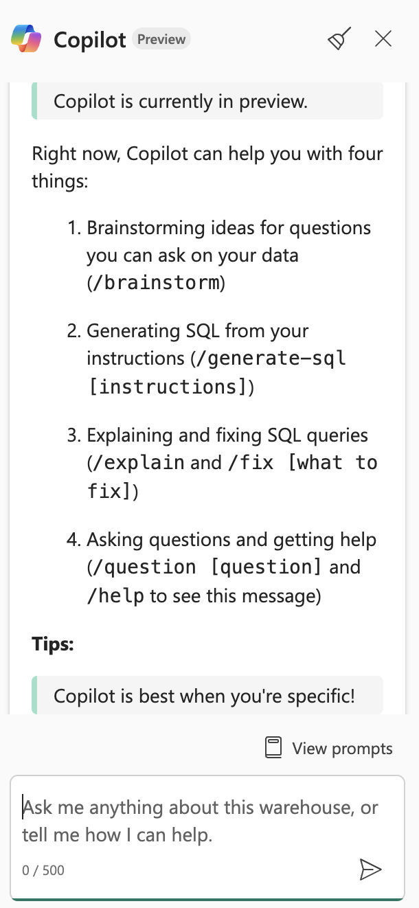

---
lab:
  title: Microsoft Fabric Data Warehouse で Copilot を使用する
  module: Get started with Copilot in Fabric for Data Warehouse
---

# Microsoft Fabric Data Warehouse で Copilot を使用する

Microsoft Fabric では、データ ウェアハウスによって大規模な分析用のリレーショナル データベースが提供されます。 レイクハウスで定義されているテーブルの既定の読み取り専用 SQL エンドポイントとは異なり、データ ウェアハウスは完全な SQL セマンティクスを提供します。これには、テーブル内のデータを挿入、更新、削除する機能が含まれます。 このラボでは、Copilot を利用して SQL クエリを作成する方法について説明します。

この演習の所要時間は約 **30** 分です。

## 学習内容

このラボを完了すると、次のことができるようになります。

- Microsoft Fabric のデータ ウェアハウスの役割について理解する。
- Fabric でワークスペースとデータ ウェアハウスを作成して構成する。
- SQL を使用してサンプル データを読み込んで探索する。
- Copilot を使用して自然言語プロンプトから SQL クエリの生成、調整、トラブルシューティングを行う。
- AI 支援による SQL 生成を使用してビューを作成し、高度なデータ分析を実行する。
- データの探索と分析のタスクを高速化するために、Copilot の機能を適用する。

## 開始する前に

この演習を完了するには、Copilot が有効になっている [Microsoft Fabric Capacity (F2 以上)](https://learn.microsoft.com/fabric/fundamentals/copilot-enable-fabric) が必要です。

## 演習のシナリオ

この演習では、あなたは、Microsoft Fabric を使用して販売実績をより深く理解したいと考えている小売企業のデータ アナリストです。 あなたのチームは最近、Fabric のデータ ウェアハウス機能を採用し、Copilot を活用してデータの探索とレポートを高速化することに関心を持っています。 新しいデータ ウェアハウスを作成し、サンプルの小売販売データを読み込み、Copilot を使用して SQL クエリを生成および調整します。 ラボを終えると、販売動向の分析、再利用可能なビューの作成、高度なデータ分析のすべてを Fabric 環境内で AI を使用して行う実践的な体験ができます。

## ワークスペースの作成

Fabric でデータを操作する前に、Fabric を有効にしてワークスペースを作成します。 Microsoft Fabric のワークスペースは、レイクハウス、ノートブック、データセットなど、データ エンジニアリングのすべての成果物を整理して管理できる、コラボレーション環境として機能します。 これは、データ分析に必要なすべてのリソースが入ったプロジェクト フォルダーと考えてください。

1. ブラウザーの `https://app.fabric.microsoft.com/home?experience=fabric` で [Microsoft Fabric ホーム ページ](https://app.fabric.microsoft.com/home?experience=fabric)に移動し、Fabric 資格情報でサインインします。

1. 左側のメニュー バーで、 **[ワークスペース]** を選択します (アイコンは &#128455; に似ています)。

1. 任意の名前で新しいワークスペースを作成し、Fabric 容量を含むライセンス モード (*Premium* または *Fabric*) を選択します。 "試用版" はサポートされていないのでご注意ください。**
   
    > **この重要性について**: Copilot が機能するには、有料の Fabric 容量が必要です。 これにより、このラボ全体を通してコードの生成を支援する、AI 搭載機能にアクセスできます。

1. 開いた新しいワークスペースは空のはずです。


## データ ウェアハウスの作成

これでワークスペースが作成されたので、次にデータ ウェアハウスを作成します。 Microsoft Fabric のデータ ウェアハウスは、分析ワークロード用に最適化されたリレーショナル データベースです。 トランザクション操作用に設計された従来のデータベースとは異なり、データ ウェアハウスは、大量のデータと複雑なクエリを効率的に処理するための構造になっています。 新しいウェアハウスを作成するためのショートカットを見つけます。

1. 左側のメニュー バーで、**[作成]** を選択します。 *[新規]* ページの *[データ ウェアハウス]* セクションで、**[ウェアハウス]** を選択します。 任意の一意の名前を設定します。 この名前はワークスペース内のデータ ウェアハウスを識別するため、目的を反映したわかりやすいものを選びます。

    >**注**: **[作成]** オプションがサイド バーにピン留めされていない場合は、最初に省略記号 (**...**) オプションを選択する必要があります。

    1 分ほどで、新しいレイクハウスが作成されます。 プロビジョニング プロセスでは、基になるインフラストラクチャが設定され、分析データベースに必要なコンポーネントが作成されます。

    

## テーブルを作成してデータを挿入する

ウェアハウスは、テーブルやその他のオブジェクトを定義できるリレーショナル データベースです。 Copilot の機能を示すには、使用するサンプル データが必要です。 ディメンション テーブル (顧客、日付、製品) とファクト テーブル (販売注文) を含む一般的な小売販売スキーマを作成します。これは、スター スキーマと呼ばれるデータ ウェアハウスの一般的なパターンです。

1. **[ホーム]** メニュー タブで、 **[新しい SQL クエリ]** ボタンを使用して新しいクエリを作成してください。 これにより、Transact-SQL コマンドを記述して実行できる SQL エディターが開きます。 次に、`https://raw.githubusercontent.com/MicrosoftLearning/mslearn-fabric/refs/heads/main/Allfiles/Labs/22c/create-dw.txt` から Transact-SQL コードをコピーして、新しいクエリのペインに貼り付けます。 このスクリプトには、サンプル データセットを構築するために必要なすべての CREATE TABLE と INSERT ステートメントが含まれています。

1. クエリを実行してください。これにより、シンプルなデータ ウェアハウス スキーマが作成され、データがいくつか読み込まれます。 スクリプトの実行には約 30 秒かかります。 この間、データベース エンジンによってテーブル構造が作成され、サンプルの小売販売データが設定されます。

1. ツール バーの **[更新]** ボタンを使用して、ビューを更新してください。 次に、 **[エクスプローラー]** ペインで、データ ウェアハウスの **dbo** スキーマに次の 4 つのテーブルが含まれていることを確認してください。
   
    - **DimCustomer** - 名前と住所などの顧客情報が含まれます
    - **DimDate** - カレンダー情報 (年、月、日の名前など) を含む日付ディメンション テーブル
    - **DimProduct** - カテゴリ、名前、価格情報を含む製品カタログ
    - **FactSalesOrder** - ディメンション テーブルへの外部キーがあり、販売トランザクションを含む中央のファクト テーブル

    > **ヒント**: スキーマの読み込みに時間がかかる場合は、ブラウザー ページを更新してください。 エクスプローラー ペインにデータベース構造が表示され、テーブルやその他のデータベース オブジェクトを簡単に参照できます。

## データ ウェアハウスのテーブルにクエリを実行する

データ ウェアハウスはリレーショナル データベースであるため、SQL を使用してそのテーブルにクエリを実行できます。 ただし、複雑な SQL クエリをゼロから記述すると、時間がかかり、エラーが発生しやすくなります。 Copilot を使用すると、SQL クエリの生成がさらに高速になります。 Copilot には人工知能が使用されていて、自然言語での要求を理解して適切な SQL 構文に変換するため、データ分析へのアクセスが容易になります。

1. 現在の **SQL query 1** を閉じます。 これによりワークスペースがクリアされるため、クエリの生成に Copilot を使用することに集中できます。

1. [ホーム] リボンで、[Copilot] オプションを選択します。 これにより、Copilot アシスタント ペインが開き、AI と対話してクエリを生成できます。

    

1. まず、Copilot で何ができるかについて調べてみましょう。 `What can Copilot do?` というラベルの付いた提案をクリックし、プロンプトとして送信します。

    出力を読み、Copilot が現在プレビュー段階であること、ブレーンストーミングや SQL クエリの生成、クエリの説明と修正などに役立つことを確認します。
    
    
    
1. ここでは、売上収益を月別に分析することを目指します。 これは一般的なビジネス要件です。時間の経過に伴う収益の傾向を理解すると、季節的なパターン、成長傾向、パフォーマンス メトリックを特定するのに役立ちます。 次のプロンプトを入力して送信します。

    ```copilot-prompt
    /generate-sql Calculate monthly sales revenue
    ```

1. 生成された出力を確認します。これは、環境と Copilot の最新の更新プログラムによって若干異なる場合があります。 Copilot がどのように要求を解釈し、ファクト テーブルとディメンション テーブルの間に適切な JOIN ステートメントを作成して、売上データを月別に集計するかに注目してください。

1. クエリの右上隅にある **[コードの挿入]** アイコンを選択します。 これにより、生成された SQL が Copilot ペインから SQL エディターに転送され、実行できるようになります。

    

1. クエリの上にある ▷ **[実行]** オプションを選択してクエリを実行し、出力を確認します。 月別の収益合計が表示され、複数の期間にわたって売上データがどのように集計されたかが示されます。

    

1. **新しい SQL クエリ**を作成し、フォローアップの質問をして、月の名前と販売地域も結果に含めます。 これは、Copilot を使用してクエリを繰り返し調整する方法を示しています。以前の要求を基にして、より詳細な分析を作成できます。

    ```copilot-prompt
    /generate-sql Retrieves sales revenue data grouped by year, month, month name and sales region
    ```

1. **[コードの挿入]** アイコンを選択し、クエリの ▷ **[実行]** を選択します。 返された出力を確認します。 中核となる収益計算ロジックを維持しながら追加のディメンションを含めるように、Copilot でクエリがどのように調整されるかに注目してください。

1. Copilot に次の質問をして、このクエリからビューを作成してみましょう。 ビューはクエリ ロジックを格納した仮想テーブルです。これにより複雑なクエリの再利用が容易になり、レポートと分析用の一貫したデータ アクセス パターンが提供されます。

    ```copilot-prompt
    /generate-sql Create a view in the dbo schema that shows sales revenue data grouped by year, month, month name and sales region
    ```

1. **[コードの挿入]** アイコンを選択し、クエリの ▷ **[実行]** を選択します。 生成された出力を確認します。 

    クエリは正常に実行されません。理由は、SQL ステートメントにデータベース名がプレフィックスとして含まれていることです。データ ウェアハウスでビューを定義するとき、これは許可されません。 これは、異なる複数のデータベース プラットフォームで作業する場合によくある構文の問題です。ある環境で動作するものでも、別の環境では調整が必要になる可能性があります。

1. **[クエリ エラーを修正する]** オプションを選択します。 Copilot によってクエリがどのように修正されるかを確認します。 これは、Copilot の強力な機能の 1 つを示しています。クエリを生成できるだけでなく、構文エラーのトラブルシューティングや修正を自動的に行うこともできます。

    
    
    修正されたクエリの例を次に示します。何が変更されたかを説明する `Auto-Fix` コメントに注目してください。
    
    ```sql
    -- Auto-Fix: Removed the database name prefix from the CREATE VIEW statement
    CREATE VIEW [dbo].[SalesRevenueView] AS
    SELECT 
        [DD].[Year],
        [DD].[Month],
        [DD].[MonthName],
        -- NOTE: I couldn't find SalesRegion information in your warehouse schema
        SUM([FS1].[SalesTotal]) AS [TotalRevenue]
    FROM 
        [dbo].[FactSalesOrder] AS [FS1] -- Auto-Fix: Removed the database name prefix
    JOIN 
        [dbo].[DimDate] AS [DD] ON [FS1].[SalesOrderDateKey] = [DD].[DateKey] -- Auto-Fix: Removed the database name prefix
    -- NOTE: I couldn't find SalesRegion information in your warehouse schema
    GROUP BY 
        [DD].[Year],
        [DD].[Month],
        [DD].[MonthName]; 
    ```
    
    Copilot によって構文エラーが修正されただけでなく、変更内容を説明し、販売地域の情報が現在のスキーマで利用できなかったことを示す、役に立つコメントが提供されたことに注目してください。

1. カテゴリ別に整理された詳細な製品一覧を取得する別のプロンプトを入力します。 このクエリにより、グループ内のデータをランク付けするためのウィンドウ関数など、より高度な SQL 機能が示されます。 製品カテゴリごとに、利用可能な製品とその定価を表示し、それらを価格に基づいてそれぞれのカテゴリ内でランク付けする必要があります。 

    ```copilot-prompt
    /generate-sql Retrieve a detailed product listing, organized by category. For each product category, it should display the available products along with their list prices and rank them within their respective categories based on price. 
    ```

1. **[コードの挿入]** アイコンを選択し、クエリの ▷ **[実行]** を選択します。 返された出力を確認します。 

    これにより、同じカテゴリ内の製品を簡単に比較でき、最も高価および安価な項目を特定するのに役立ちます。 ランク付け機能は、製品管理、価格分析、在庫決定に特に役立ちます。

## まとめ

この演習では、複数のテーブルを含むデータ ウェアハウスを作成しました。 Copilot を使用して SQL クエリを生成し、データ ウェアハウス内のデータを分析しました。 AI によってどのように複雑な SQL クエリの記述プロセスが高速化され、エラーが自動的に修正されて、データをより効率的に探索できるようになるかを経験しました。

このラボでは、次のことを学習しました。
- 自然言語プロンプトを活用して SQL クエリを生成する
- Copilot のエラー修正機能を使用して構文の問題を修正する
- AI の支援によってビューと複雑な分析クエリを作成する
- データ分析にランク付け関数とグループ化を適用する

## リソースをクリーンアップする

Microsoft Fabric データ ウェアハウスでの Copilot の探索が終了したら、この演習用に作成したワークスペースを削除できます。

1. ブラウザーで Microsoft Fabric に移動します。
1. 左側のバーで、ワークスペースのアイコンを選択して、それに含まれるすべての項目を表示します。
1. **[ワークスペースの設定]** を選択し、**[全般]** セクションで下にスクロールし、**[このワークスペースを削除する]** を選択します。
1. **[削除]** を選択して、ワークスペースを削除します。


