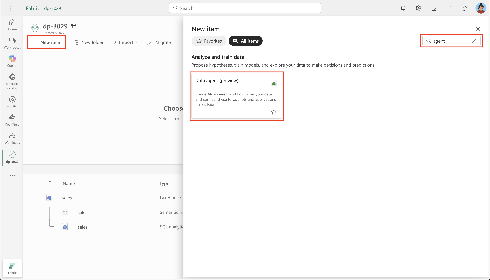

---
lab:
  title: Microsoft Fabric データ エージェントを使用してデータとチャットする
  module: Implement Fabric Data Agents
---

# Microsoft Fabric データ エージェントを使用してデータとチャットする

Microsoft Fabric データ エージェントを使用すると、平易な英語で質問して、人間が判読できる構造化された回答を受け取ることができるため、データとの自然な対話が可能になります。 データ エージェントを使用することで、SQL (構造化照会言語)、DAX (Data Analysis Expressions)、KQL (Kusto 照会言語) などのクエリ言語を理解する必要がなくなり、組織全体で、技術スキル レベルに関係なくデータ分析情報にアクセスできるようになります。

この演習の所要時間は約 **30** 分です。

## 学習内容

このラボでは、次のことを行います。

- 自然言語データ分析のための Microsoft Fabric データ エージェントの目的と利点を理解する。
- Fabric ワークスペースとデータ ウェアハウスを作成して構成する方法を学ぶ。
- スター スキーマの販売データセットの読み込みと探索を実際に体験する。
- データ エージェントによって平易な英語の質問がどのように SQL クエリに変換されるかを確認する。
- 効果的な分析のための質問を行い、AI 生成の結果を解釈するスキルを習得する。
- AI ツールを活用してデータ アクセスと分析情報を民主化することに対する自信を高める。

## 開始する前に

この演習を完了するには、Copilot が有効になっている [Microsoft Fabric Capacity (F2 以上)](https://learn.microsoft.com/fabric/fundamentals/copilot-enable-fabric) が必要です。

## 演習のシナリオ

この演習では、販売データ ウェアハウスを作成し、それにデータを読み込んでから、Fabric データ エージェントを作成します。 次に、さまざまな質問をして、そのデータ エージェントによってどのように自然言語が SQL クエリに変換され、分析情報が提供されるかを探ります。 この実践的なアプローチを通して、AI 支援データ分析の機能を見ていきます。SQL に関する深い知識は必要ありません。 始めましょう。

## ワークスペースの作成

Fabric でデータを操作する前に、Fabric を有効にしてワークスペースを作成します。 Microsoft Fabric のワークスペースは、レイクハウス、ノートブック、データセットなど、データ エンジニアリングのすべての成果物を整理して管理できる、コラボレーション環境として機能します。 これは、データ分析に必要なすべてのリソースが入ったプロジェクト フォルダーと考えてください。

1. ブラウザーの `https://app.fabric.microsoft.com/home?experience=fabric` で [Microsoft Fabric ホーム ページ](https://app.fabric.microsoft.com/home?experience=fabric)に移動し、Fabric 資格情報でサインインします。

1. 左側のメニュー バーで、 **[ワークスペース]** を選択します (アイコンは &#128455; に似ています)。

1. 任意の名前で新しいワークスペースを作成し、Fabric 容量を含むライセンス モード (*Premium* または *Fabric*) を選択します。 "試用版" はサポートされていないのでご注意ください。**
   
    > **この重要性について**: Copilot が機能するには、有料の Fabric 容量が必要です。 これにより、このラボ全体を通してコードの生成を支援する、AI 搭載機能にアクセスできます。

1. 開いた新しいワークスペースは空のはずです。


## データ ウェアハウスの作成

これでワークスペースが作成されたので、次にデータ ウェアハウスを作成します。 データ ウェアハウスは、分析クエリとレポート用に最適化された、さまざまなソースからの構造化データを格納する一元化されたリポジトリです。 ここでは、データ エージェントの対話の基になる簡単な販売データ ウェアハウスを作成します。 新しいウェアハウスを作成するためのショートカットを見つけます。

1. 左側のメニュー バーで、**[作成]** を選択します。 *[新規]* ページの *[データ ウェアハウス]* セクションで、**[ウェアハウス]** を選択します。 任意の一意の名前を設定します。

    >**注**: **[作成]** オプションがサイド バーにピン留めされていない場合は、最初に省略記号 (**...**) オプションを選択する必要があります。

    1 分ほどで、新しいレイクハウスが作成されます。

    

## テーブルを作成してデータを挿入する

ウェアハウスは、テーブルやその他のオブジェクトを定義できるリレーショナル データベースです。 データ エージェントを役立てるには、サンプルの販売データを入力する必要があります。 実行するスクリプトでは、ディメンション テーブル (説明的な属性を含む) とファクト テーブル (測定可能なビジネス イベントを含む) を使用する一般的なデータ ウェアハウス スキーマが作成されます。 このスター スキーマ設計は、データ エージェントによって生成される分析クエリ用に最適化されています。

1. **[ホーム]** メニュー タブで、 **[新しい SQL クエリ]** ボタンを使用して新しいクエリを作成してください。 次に、`https://raw.githubusercontent.com/MicrosoftLearning/mslearn-fabric/refs/heads/main/Allfiles/Labs/22d/create-dw.txt` から Transact-SQL コードをコピーして、新しいクエリのペインに貼り付けます。

    > **このスクリプトで行う処理**: これは、顧客情報、製品の詳細、日付ディメンション、販売トランザクションを含む完全な営業データ ウェアハウスを作成するスクリプトです。 この現実的なデータセットを使用して、データ エージェントに意味のあるビジネス上の質問をすることができます。

1. クエリを実行してください。これにより、シンプルなデータ ウェアハウス スキーマが作成され、データがいくつか読み込まれます。 スクリプトの実行には約 30 秒かかります。

1. ツール バーの **[更新]** ボタンを使用して、ビューを更新してください。 次に、 **[エクスプローラー]** ペインで、データ ウェアハウスの **dbo** スキーマに次の 4 つのテーブルが含まれていることを確認してください。
   
    - **DimCustomer** - 名前、所在地、連絡先の詳細などの顧客情報が含まれます
    - **DimDate** - 時間ベースの分析のための会計年度、四半期、月などの日付関連の属性が含まれます
    - **DimProduct** - 名前、カテゴリ、価格などの製品情報が含まれます
    - **FactSalesOrder** - 顧客、製品、日付を結び付ける実際の販売トランザクションが含まれます

    > **ヒント**: スキーマの読み込みに時間がかかる場合は、ブラウザー ページを更新してください。

## Fabric データ エージェントを作成する

Fabric データ エージェントは、AI 搭載アシスタントであり、データに関する自然言語の質問を理解し、それらに回答するための適切なクエリを自動的に生成できます。 これにより、SQL、KQL、DAX の構文をユーザーが知る必要がなくなり、しかも正確なデータドリブン分析情報が提供されます。 データ エージェントを作成して構成しましょう。

1. 新しいデータ エージェントを作成します。
   
    

1. **`sales-data-agent`** のような名前にします。

    > **名前付けが重要な理由**: わかりやすい名前を付けることは、このデータ エージェントの目的と範囲を自分とチームが理解するのに役立ちます。異なるデータ ドメイン用に複数のエージェントを管理する場合は特にそうです。
    
    

1. **データ ソースの追加**を選択します。 

    

1. 前に作成したデータ ウェアハウスを選択します。

    > **データへの接続**: データ エージェントは、スキーマとリレーションシップを理解するためにテーブルにアクセスする必要があります。 そうすることで、質問に基づいて正確な SQL クエリを生成できます。

1. データ ウェアハウスを展開し、**DimCustomer**、**DimDate**、**DimProduct**、**FactSalesOrder** を確認します。

    > **テーブルの選択戦略**: 4 つのテーブルをすべて選択することで、データ エージェントに完全なデータ モデルへのアクセス権を付与します。 これにより、顧客の所在地別の売上傾向や時間の経過に伴う製品の実績など、複数のテーブルにまたがる複雑な質問への回答が可能になります。

    

## 質問する

次に、実験を開始し、データ エージェントに質問します。 このセクションでは、どのように自然言語から SQL クエリへの変換が行われ、SQL の技術的な知識のないユーザーがデータ分析にアクセスできるようになるかを見ていきます。 各質問には、生成された回答と基になるクエリの両方が表示されます。

1. 次のプロンプトを入力して質問します。 

    ```copilot-prompt
    How many products did we sell by fiscal year?
    ```

    結果として示される回答に注目します: 2021 会計年度には合計 12,630 個の製品、2022 会計年度には 13,336 個の製品を販売しました。

1. 完了したステップとそのサブステップを展開します。 これにより、質問に回答するためにデータ エージェントによって生成された SQL クエリが表示されます。

    > **学習の機会**: 生成された SQL を調べることで、データ エージェントが質問をどのように解釈したかを理解し、基になるデータ リレーションシップの詳細を確認できます。 この透明性により、AI 生成の結果に対する信頼が構築されます。
    
    
    
    Copilot によって次の SQL コードが生成されました。これは、環境と Copilot の最新の更新プログラムによって若干異なる場合があります。
    
    ```sql
    SELECT d.Year, SUM(f.Quantity) AS TotalProductsSold
    FROM dbo.FactSalesOrder f
    JOIN dbo.DimDate d ON f.SalesOrderDateKey = d.DateKey
    GROUP BY d.Year
    ORDER BY d.Year;
    ```

    > **SQL の説明**: このクエリは、ファクト テーブル (FactSalesOrder) を日付ディメンション (DimDate) と結合して、年別に売上をグループ化し、数量を合計します。 "販売された製品" が "数量" フィールドを参照し、"会計年度" が日付ディメンションの "年" フィールドにマップされていることをデータ エージェントが自動的に認識していることがわかります。

1. 次の質問に進みます。 

    ```copilot-prompt
    What are the top 10 most popular products all time?
    ```

    > **予期されること**: この質問で、データ エージェントがランク付け操作を実行し、製品情報と売上データを結合してよく売れているものを特定する方法がわかります。

1. このフォローアップ質問をします。 

    ```copilot-prompt
    What are the historical trends across all my data?
    ```

    > **高度な分析**: より広範なこの質問では、売上、顧客行動、製品実績における時間ベースのパターンを含む可能性のある複数のディメンションにわたって、データ エージェントがどのように傾向分析を提供できるかがわかります。

1. その他の質問を試して、データのさまざまな側面を調べてみてください。

    ```copilot-prompt
    In which countries are our customers located?
    ```
    
    ```copilot-prompt
    How many products did we sell in the United States?
    ```
    
    ```copilot-prompt
    How much revenue did we make in FY 2022?
    ```
    
    ```copilot-prompt
    How much was our total sales revenue, by fiscal year, fiscal quarter and month name?
    ```

    > **Pro ヒント**: これらの各質問は、地理的分析、フィルター処理された集計、収益計算、階層的な時間分析など、さまざまな分析シナリオを対象とします。 バリエーションを試して、データ エージェントがさまざまな質問スタイルにどのように適応するかを確認します。

## データ構造について

質問を試す際は、次のデータ特性に留意して、より対象を絞った質問をします。

- **会計年度のタイミング**: 会計年度は 7 月 (7 番目の月) に始まります。 そのため、第 1 四半期は 7 月から 9 月まで、第 2 四半期は 10 月から 12 月まで、第 3 四半期は 1 月から 3 月まで、第 4 四半期は 4 月から 6 月まで継続します。

- **顧客の識別**: CustomerAltKey フィールドには、顧客固有のクエリに役立つ顧客のメール アドレスが含まれています。

- **通貨**: すべての定価と売上合計は、GBP (英国ポンド) で表されます。

- **データ リレーションシップ**: FactSalesOrder テーブルでは、顧客、製品、日付が外部キーを使用して結び付けられ、複雑な多次元分析が可能になります。

> **さらに実験する**: これらの要素を組み合わせた質問をしてみてください。たとえば、"2022 会計年度の第 1 四半期の収益は?" や、 "英国で最も高価な製品を購入した顧客は?" などです。 これらの質問に答えるために必要な、複雑な結合と計算がデータ エージェントで自動的に処理されます。

## まとめ

お疲れさまでした。 次の操作に成功しました。

- 現実的な販売データセットを使用して、**Fabric ワークスペース**とデータ ウェアハウスを作成しました
- データに関する自然言語の質問を理解できる**データ エージェントを構築して構成しました**
- 平易な英語で質問し、それらが SQL クエリにどのように変換されるかを確認することによって、**AI 搭載データ分析を経験しました**
- 簡単な集計から複雑な傾向分析まで、**さまざまな種類の分析のための質問を試しました**

### 要点

- **民主化されたデータ アクセス**: データ エージェントを使用すると、SQL の知識に関係なく、ユーザーが分析にアクセスできるようになります
- **透明性と信頼**: 生成された SQL をいつでも検査して、質問がどのように回答されたかを理解できます
- **自然言語の柔軟性**: AI は、質問の言い回しのバリエーションや軽微な入力ミスを処理できます
- **複雑なクエリの生成**: 自然言語の入力に基づいて、結合、集計、フィルターがエージェントで自動的に処理されます

### 次のステップ

次にことを検討してください。

- **カスタム指示**: ビジネス固有のコンテキストを追加してデータ エージェントの応答を改善します
- **追加のデータ ソース**: より多くのテーブルまたはデータセットを接続してエージェントの知識を拡大します
- **高度な質問**: 複数の期間、顧客セグメント、または製品カテゴリを含む、より複雑な分析シナリオを試します
- **統合**: レポート、ダッシュボード、またはビジネス アプリケーションにデータ エージェントの分析情報を埋め込みます

Fabric データ エージェントは、データと意思決定のギャップを埋め、データ分析情報を組織全体で真にアクセス可能なものにするための重要なステップになります。
