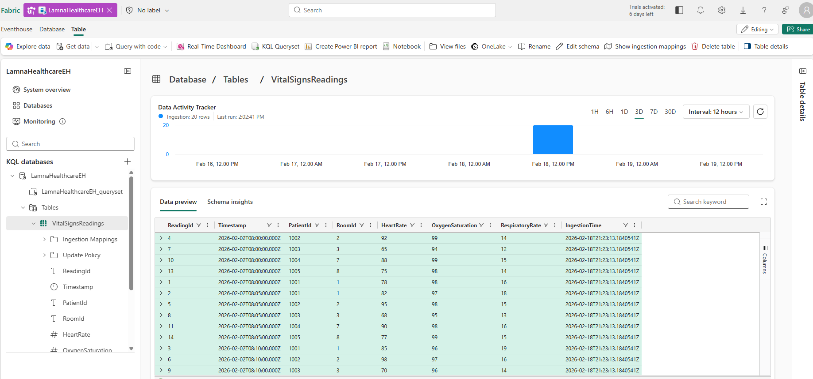
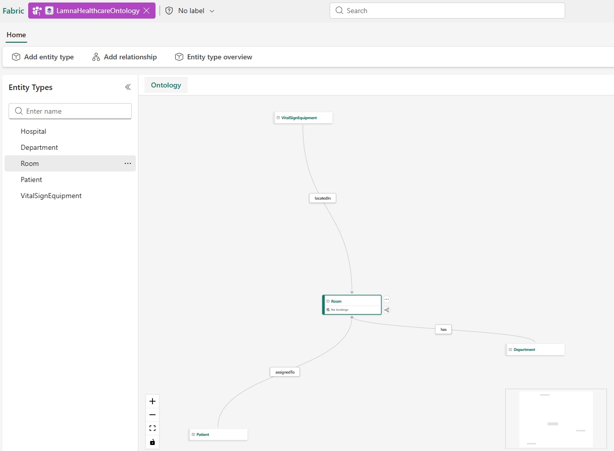
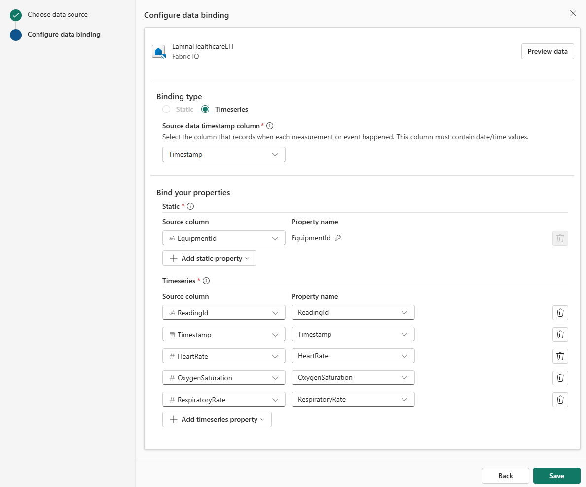
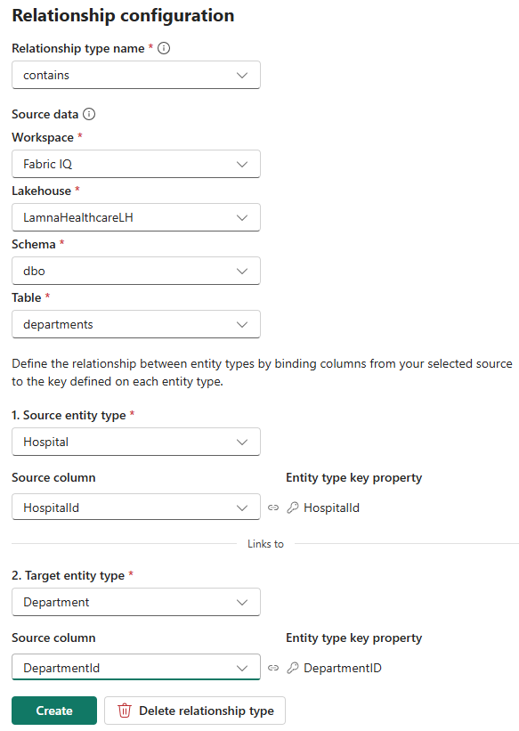
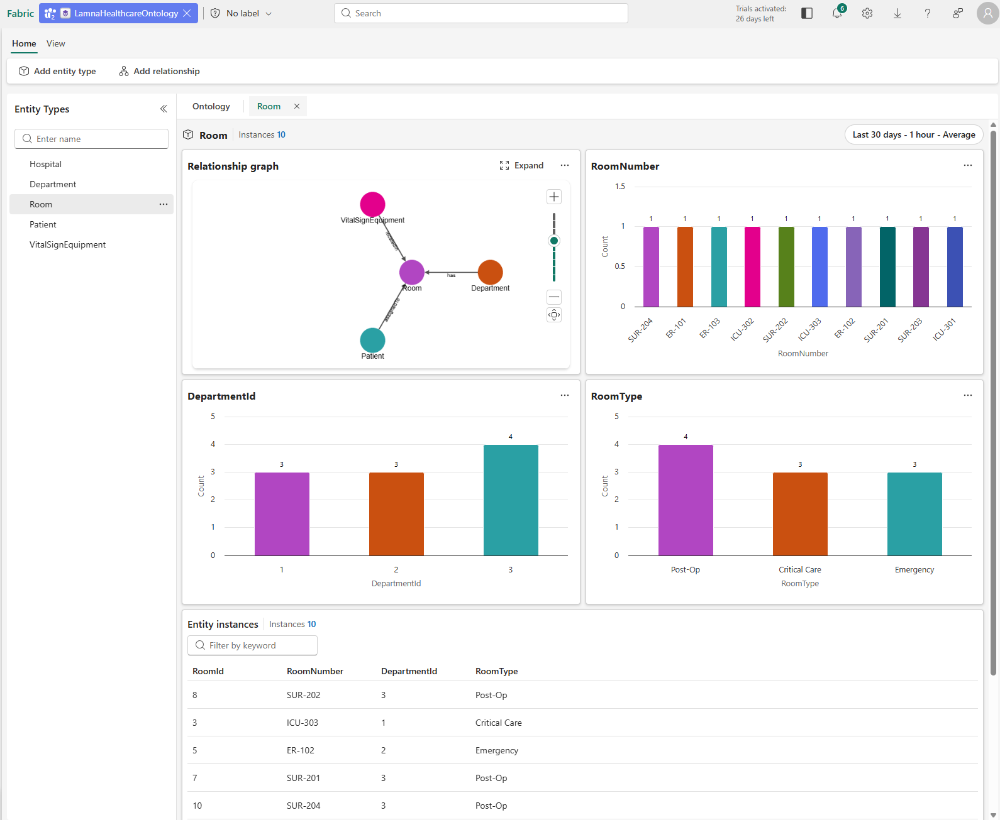

# Fabric IQ を使用してオントロジ (プレビュー) を作成する

このラボでは、ある架空の医療機関向けの完全な Fabric IQ オントロジを作成するために、各コンポーネント (エンティティ型、プロパティ、キー、リレーションシップ、データ バインディング) を手動で構築します。 サンプル データは、病院、診療部門、病室、患者、生存徴候機器、生存徴候測定値を表します。

このラボの所要時間は約 **40** 分です。

> **注**:この演習を完了するには、[Microsoft Fabric 試用版](https://learn.microsoft.com/fabric/get-started/fabric-trial)が必要です。 また、次の[テナント設定](https://learn.microsoft.com/fabric/iq/ontology/overview-tenant-settings)を有効にする必要があります: **オントロジ項目を有効にする (プレビュー)** および**ユーザーは Graph を作成可能 (プレビュー)**。

## ワークスペースの作成

Fabric でオントロジの作業を行うには、Fabric 容量が割り当てられたワークスペースが必要です。

1. ブラウザーの `https://app.fabric.microsoft.com/home?experience=fabric` で [Microsoft Fabric ホーム ページ](https://app.fabric.microsoft.com/home?experience=fabric)に移動し、Fabric 資格情報でサインインします。
1. 左側のメニュー バーで、 **[ワークスペース]** を選択します (アイコンは &#128455; に似ています)。
1. 任意の名前で新しいワークスペースを作成し、*Fabric*、*Fabric 試用版*、または *Power BI Premium* のいずれかの種類のワークスペースのライセンス モードを選択します。
1. 開いた新しいワークスペースは空のはずです。

## サンプル データを使用してレイクハウスを作成する

ここで、レイクハウスを作成して病院オペレーション データを読み込みます。これがあなたのオントロジの基礎となります。

1. ワークスペースの画面で、**[+ 新しい項目]** > **[レイクハウス]** を選択します。
1. このレイクハウスの名前を `LamnaHealthcareLH` として **[作成]** を選択します。
1. レイクハウスが開いたら、CSV ファイルをアップロードしてテーブルに変換します。

### 病院データ ファイルをダウンロードして読み込む

サンプル データ ファイルをダウンロードし、レイクハウスにアップロードし、テーブルに変換します。

1. [sample-data.zip](https://github.com/MicrosoftLearning/mslearn-fabric/raw/main/Allfiles/Labs/23-24/sample-data.zip) をダウンロードし、CSV ファイルを抽出して自分のローカル コンピューターに保存します。 ZIP ファイルには次のものが含まれています。
   - **Hospitals.csv** - ネットワーク内の医療施設
   - **Departments.csv** - 病院の診療部門 (ICU、救急、外科)
   - **Rooms.csv** - 診療部門内の個々の病室
   - **Patients.csv** - 現在の患者とその病室の割り当て
   - **VitalSignEquipment.csv** - 患者に割り当てられているモニタリング機器 (どの患者がモニタリングされており、モニタリングがいつ開始したか)
   - **VitalSignsReadings.csv** - モニターから経時的に収集された実際の患者の生存徴候測定値 (心拍数、酸素レベル)

1. 次の 5 つのレイクハウス ファイルをアップロードします。
   - レイクハウスの画面のメイン ビューから **[ファイルのアップロード]** を選択します
   - 参照画面で **Hospitals.csv**、**Departments.csv**、**Rooms.csv**、**Patients.csv**、**VitalSignEquipment.csv** の 5 つのファイルを選択します
   - **[開く]** を選択します
   - **[アップロード]** を選択して、5 つのファイルをすべて一度にアップロードします
   - アップロードが完了するまで待ちます
   
   > **注**: VitalSignsReadings.csv は後で、レイクハウスではなくイベントハウスにアップロードします。

1. アップロードされた各ファイルを次の手順でテーブルに変換します。
   - **[エクスプローラー]** で、**[Files]** フォルダーを選択します。ここに 5 つすべての CSV ファイルがあります
   - 各ファイルの名前の右にある省略記号 **(...)** を選択します
   - **[テーブルへの読み込み]** > **[新しいテーブル]** を選択します
   - 次のとおりにテーブルを構成します。
     - **テーブル名**: ファイル名を拡張子なしで使用し、小文字にします (例: `hospitals`、`departments`、`rooms`、`patients`、`vitalsignequipment`)
     - **列ヘッダー**: **[列名にヘッダーを使用する]** チェック ボックスをオンにします
     - **区切り**: コンマ (`,`) のままにします
   - **[読み込む]** を選択します
   - このプロセスを 5 つのファイルすべてに対して繰り返します

1. 次の画像に示すように、**[Tables]** セクションに 5 つのテーブル (`hospitals`、`departments`、`rooms`、`patients`、`vitalsignequipment`) があることを確認します。

     ![レイクハウスの [Tables] セクションに hospitals、departments、rooms、patients、vitalsignequipment の 5 つのテーブルがあることを示すスクリーンショット](Images/23-lakehouse-tables-complete.png)

## ストリーミング データを扱うイベントハウスを作成する

次に、リアルタイムの生存徴候データを格納するためのイベントハウスを作成します。これを後でオントロジにバインドします。

1. ワークスペースの画面で、**[+ 新しい項目]** > **[イベントハウス]** を選択します。
1. イベントハウスの名前を `LamnaHealthcareEH` として **[作成]** を選択します。
1. 既定の KQL データベースが、同じ名前で作成されます。 この KQL データベースを選択して開きます。

### 生存徴候データを取り込む

1. KQL データベースの画面で、**[データの取得]** > **[ローカル ファイル]** を選択します。
1. **[ターゲット テーブルを選択または作成する]** セクションで、**[+ 新しいテーブル]** を選択し、テーブル名として `VitalSignsReadings` を入力します。
1. **[最大 1,000 個のファイルを追加する]** で、**[ファイルを参照する]** を選択し、先ほどダウンロードした VitalSignsReadings.csv ファイルをアップロードします。
1. **[次へ]** を選択し、インジェスト ウィザードを最後まで実行します。既定の設定をそのままにしてください。
1. **[完了]** を選択して、インジェストを完了します。
1. **VitalSignsReadings** テーブルが KQL データベース内にあることを確認します。

   あなたの KQL データベースには VitalSignsReadings テーブルが次のように表示されます。

   

## オントロジを作成する

次に、空のオントロジを作成し、これを段階的に構築していきます。

1. ワークスペースの画面で、**[+ 新しい項目]** > **[オントロジ (プレビュー)]** を選択します。
1. オントロジの名前を `LamnaHealthcareOntology` として **[作成]** を選択します。
1. オントロジ キャンバスが開きます。これは空で、データ モデルを構築できる状態になっています。

## エンティティ型を作成する

この医療ドメインを表す 5 つのエンティティ型を作成します。 詳しい手順に従って最初のエンティティ型を作成してプロセスを学習してから、参照テーブルを使用して残りの 4 つを作成します。

### Hospital エンティティ型を作成する

1. オントロジ リボンで、**[エンティティ型の追加]** を選択します。
1. エンティティ型名を「**Hospital**」と入力し、**[エンティティ型の追加]** を選択します。
1. Hospital エンティティ型がキャンバス上に表示されます。
1. Hospital エンティティ型が選択された状態で、右側の **[エンティティ型の構成]** ペインに移動します。
1. **[プロパティ]** タブを選択し、**[プロパティの追加]** を選択します。
1. 次の各プロパティを追加します。1 つの詳細を入力したら **[+ 追加]** を選択してください。

   | プロパティ名 | データ型 | プロパティの種類 |
   |---------------|-----------|---------------|
   | HospitalId | Integer | 静的 |
   | HospitalName | String | 静的 |
   | City (市) | String | 静的 |
   | 状態 | String | 静的 |

1. プロパティをすべて追加したら、**[保存]** を選択します。

1. 次に、エンティティ キーを定義する必要があります。 エンティティ キーは、そのエンティティ型の各インスタンスを一意に識別するプロパティです。 病院の場合は、各病院に一意の HospitalId があるため、これがキーになります。
   
   **[キー: エンティティ型キーの追加]** を選択し、**HospitalId** をキーとして選択し、**[保存]** を選択します。

### 残りのエンティティ型を作成する

同じプロセスに従って、さらに次の 4 つのエンティティ型を作成し、それぞれのプロパティとキーを指定します。

| エンティティの種類 | プロパティ名 | データ型 | プロパティの種類 | エンティティ型キー |
|-------------|---------------|-----------|---------------|-----------------|
| **課** | `DepartmentId`<br>`DepartmentName`<br>`HospitalId`<br>`Floor` | Integer<br>String<br>整数<br>Integer | 静的<br>静的<br>静的<br>静的 | DepartmentId |
| **ルーム** | `RoomId`<br>`RoomNumber`<br>`DepartmentId`<br>`RoomType` | Integer<br>String<br>Integer<br>String | 静的<br>静的<br>静的<br>静的 | RoomId |
| **Patient** | `PatientId`<br>`FirstName`<br>`LastName`<br>`DateOfBirth`<br>`AdmissionDate`<br>`CurrentRoomId` | Integer<br>String<br>String<br>DateTime<br>DateTime<br>Integer | 静的<br>静的<br>静的<br>静的<br>静的<br>静的 | PatientId |
| **VitalSignEquipment** | `EquipmentId`<br>`PatientId`<br>`EquipmentType`<br>`MonitoringStartDate` | String<br>Integer<br>String<br>DateTime | 静的<br>静的<br>静的<br>静的 | EquipmentId |

これで、5 つのエンティティ型のプロパティとキーが定義された状態になりました。  次のように [エンティティ型] ペインに 5 つのエンティティ型すべてが表示されていることと、各エンティティのプロパティとエンティティ型キーが定義されていることを確認します。

   ![左側の [エンティティ型] ペインを示すスクリーンショット。次の 5 つのエンティティ型が一覧表示されています: Hospital、Department、Room、Patient、VitalSignEquipment](Images/23-entity-types-complete.png)

## リレーションシップ型を作成する

ここで、医療エンティティ関係と生存徴候モニタリングをモデル化するリレーションシップ型を作成します。Hospital → Department → Room → Patient で、VitalSignEquipment が Patient をモニタリングします。 詳しい手順に従って最初のリレーションシップを作成してから、参照テーブルを使用して残りの 3 つを作成します。

### Hospital-Department リレーションシップを作成する

1. リボンの **[リレーションシップの追加]** を選択します。
1. **[リレーションシップ型をオントロジに追加]** ダイアログで、次のとおりに構成します。
   - **リレーションシップ型の名前**: `contains`
   - **ソース エンティティ型**: `Hospital`
   - **ターゲット エンティティ型**: `Department`
1. **[リレーションシップ型の追加]** を選択します。

"Contains" というリレーションシップ線がキャンバス上に表示され、これで Hospital が Department に接続されます。 データ ソースは後で構成します。

### 残りのリレーションシップを作成する

同じプロセスに従って、さらに次の 4 つのリレーションシップを作成します。

| リレーションシップ名 | ソース エンティティ型 | ターゲット エンティティ型 | 意味 |
|-------------------|-------------------|-------------------|---------|
| **has** | 部署 | ルーム | 診療部門は病室を持つ |
| **assignedTo** | 患者 | ルーム | 患者は病室に割り当てられる |
| **monitors** | VitalSignEquipment | 患者 | 生存徴候機器は患者をモニタリングする |

   オントロジ キャンバスは、次の画像のようになります。 キャンバス レイアウトと、どのエンティティが選択されているかに応じて、すべてのエンティティ型とリレーションシップ線を見るためにパンまたはズームが必要になる場合があります。

   

オントロジ構造が完成しました。 次に、エンティティのプロパティを実際のデータ ソースにバインドする必要があります。

## エンティティ型をデータにバインドする

ここまでに、オントロジのスキーマ、つまりエンティティ型とプロパティおよびキーを定義しましたが、これらは単なる空のテンプレートです。 オントロジを機能させるには、各エンティティ型を実際のデータ ソースにバインドする必要があります。 これは、オントロジに入れる実際の医療データがどこにあるかを Fabric に伝えることです。

レイクハウス テーブルからの静的データを 4 つのエンティティにバインドしてから、静的と時系列の両方のバインディングを VitalSignEquipment エンティティに追加します。

### Hospital エンティティをバインドする

1. キャンバス上の **[Hospital]** エンティティ型を選択します。
1. **[エンティティ型の構成]** ペインで、**[バインディング]** タブに移動します。
1. **[エンティティ型にデータを追加]** を選択します。
1. **[OneLake カタログ]** で、自分のワークスペースから **LamnaHealthcareLH** (レイクハウス) を選択します。
1. **[接続]** を選択します。
1. **hospitals** テーブルを選択して **[次へ]** を選択します。
1. **[バインドの種類]** は、**[静的]** のままにします。
1. **[プロパティのバインド]** で、各プロパティを次のとおりに対応する列にマップします。
   - HospitalId → HospitalId
   - HospitalName → HospitalName
   - City → City
   - State → State

   通常は、名前が一致すると自動的にマップされます。

1. **[保存]** を選択します。

### Department、Room、Patient のエンティティをバインドする

この 3 つのエンティティに対して同じバインド プロセスに従います。これらは静的データ バインディングのみを必要します。 名前が一致すると、列がプロパティに自動的にマップされます。マッピングが正しいことを確認してください。

| エンティティの種類 | テーブル名 | ソース列 |
|-------------|------------|----------------|
| **課** | departments | `DepartmentId`<br>`DepartmentName`<br>`HospitalId`<br>`Floor` |
| **ルーム** | rooms | `RoomId`<br>`RoomNumber`<br>`DepartmentId`<br>`RoomType` |
| **Patient** | patients | `PatientId`<br>`FirstName`<br>`LastName`<br>`DateOfBirth`<br>`AdmissionDate`<br>`CurrentRoomId` |

### VitalSignEquipment エンティティをバインドする

VitalSignEquipment エンティティには 2 つのデータ バインディングが必要です。1 つは静的な機器属性用で、もう 1 つは時系列の測定値用です。 時系列バインディングを作成するには、最初に静的バインディングが必要です。 理由については、次のデータ ソースの内容に注目してください。

**VitalSignEquipment.csv** (レイクハウス - 静的な属性):
```
EquipmentId | PatientId | EquipmentType           | MonitoringStartDate
VS-1001     | 1001      | Continuous Monitoring   | 2026-02-01
VS-1002     | 1002      | Continuous Monitoring   | 2026-02-01
```

**VitalSignsReadings.csv** (イベントハウス - 時系列の測定値):
```
ReadingId | EquipmentId | Timestamp            | HeartRate | OxygenSaturation | RespiratoryRate
1         | VS-1001     | 2026-02-02T08:00:00Z | 78        | 98               | 16
2         | VS-1001     | 2026-02-02T08:05:00Z | 82        | 97               | 18
4         | VS-1002     | 2026-02-02T08:00:00Z | 92        | 99               | 14
```

時系列データの内容は測定値と EquipmentId のみであり、患者や機器の種類は含まれていないことに注意してください。 静的バインディングを作成すると、機器エンティティが完全なコンテキストを持つことになり (VS-1001 は継続的モニタリング機器であり患者 1001 をトラッキングする)、時系列バインディングの場合は、ストリーミング測定値がこれらのエンティティに、EquipmentId をマッチング キーとして使用してアタッチされます。

#### 静的モニター参照データをバインドする

1. **VitalSignEquipment** エンティティ型を選択します。
1. **[バインディング]** タブで、**[エンティティ型にデータを追加]** を選択します。
1. **[OneLake カタログ]** で、自分のワークスペースから **LamnaHealthcareLH** (レイクハウス) を選択します。
1. **[接続]** を選択します。
1. **vitalsignequipment** テーブルを選択して **[次へ]** を選択します。
1. バインドの種類は **[静的]** のままにします。
1. 次のとおりにプロパティを列にマップします (自動マップされるはずです)。
   - EquipmentId → EquipmentId
   - PatientId → PatientId
   - EquipmentType → EquipmentType
   - MonitoringStartDate → MonitoringStartDate
1. **[保存]** を選択します。

#### 時系列の生存徴候データをバインドする

次に、リアルタイムの生存徴候測定値を時系列プロパティとして追加します。

1. 引き続き VitalSignEquipment が選択された状態で、**[バインディング]** タブの **[エンティティ型にデータを追加]** をもう一度選択します。
1. **[OneLake カタログ]** で、自分のワークスペースから **LamnaHealthcareEH** (イベントハウス) を選択します。
1. **[接続]** を選択します。
1. **VitalSignsReadings** テーブルを選択して **[次へ]** を選択します。
1. **[バインディングの種類]** で、**[時系列]** を選択します。
2. **[ソース データ タイムスタンプ列]** には `Timestamp` を選択します

   > [!IMPORTANT]
   > 時系列バインディングには、静的データからの一致するキーが必要です。 静的バインディングが先に構成されている必要があります (先ほど行いました)。

3. 次のとおりに時系列バインディングを構成します。
   - **静的セクション** - ストリーミング データをエンティティにリンクするためのキーをマップします。
     - ストリーミング読み取り値を機器エンティティに接続する列として **EquipmentId** を選択します
     - これは、静的バインディングの EquipmentId 列と照合されます
   
   - **時系列セクション** - プロパティを列にマップします (自動マップされるはずです)。
     - ReadingId → ReadingId
     - Timestamp → Timestamp
     - HeartRate → HeartRate
     - OxygenSaturation → OxygenSaturation
     - RespiratoryRate → RespiratoryRate

   時系列バインディングの構成は次のようになります。

   

4. **[保存]** を選択して時系列バインディングを保存します。

これで、VitalSignEquipment エンティティは静的な参照データ (どのモニターがどこにあるか) と時系列データ (経時的な実際の生存徴候測定値) の両方を持つようになりました。

これで、5 つのエンティティ型すべてがデータ バインディングを持ち、それぞれのプロパティがデータ ソースに接続されるようになりました。

## リレーションシップを構成する

次に、各リレーションシップ型を構成します。具体的には、どのテーブルがエンティティ インスタンスどうしをリンクするかを指定します。 最初に、次に示す詳しい手順を使用してリレーションシップを 1 つ構成し、その後で参照テーブルを使用して残りの 4 つを構成します。

### Hospital-Department リレーションシップを構成する

1. オントロジ キャンバスで、**[Hospital]** エンティティを選択してから、[Hospital] と [Department] の間のリレーションシップ線の中の **[contains]** を選択します。
1. 右側の **[リレーションシップの構成]** ペインで、次のとおりにソース データの場所を構成します。
   - **ワークスペース**: 自分のワークスペースを選択します
   - **レイクハウス**: **LamnaHealthcareLH** を選択します
   - **スキーマ**: **dbo** を選択します
   - **テーブル**: **departments** を選択します
   
   > **注**: departments テーブルがリレーションシップ ソースとして機能するのは、この中に Hospital (HospitalId) と Department (DepartmentId) の両方のキーがあるからです。 hospitals テーブルには HospitalId しかないため、機能しません。

1. エンティティ型のマッピングを構成します。具体的には、各エンティティで定義されているキー プロパティに一致する列を選択します。
   
   - **1. ソース エンティティ型**: **Hospital** を選択します (必要に応じて既定値から変更)
     - **ソース列**: **HospitalId** を選択します (Hospital エンティティで定義されている HospitalId キーと一致します)
   - **2. ターゲット エンティティ型**: **Department** を選択します (必要に応じて既定値から変更)
     - **ソース列**: **DepartmentId** を選択します (Department エンティティで定義されている DepartmentId キーと一致します)

   リレーションシップの構成は次のようになります。

   

2. **[作成]** を選択します

### 残りのリレーションシップを構成する

残りの 4 つのリレーションシップについても、同じプロセスに従います。 それぞれについて、キャンバス上のリレーションシップ線を選択し、ソース データと列マッピングを [リレーションシップの構成] ペインで構成して **[作成]** を選択します。

| 関係 | ソース データ | ソース エンティティ列 | ターゲット エンティティ列 |
|--------------|-------------|---------------------|---------------------|
| **has** (Department → Room) | LamnaHealthcareLH > dbo > rooms | Department: DepartmentId | Room: RoomId |
| **assignedTo** (Patient → Room) | LamnaHealthcareLH > dbo > patients | Patient: PatientId | Room: CurrentRoomId |
| **monitors** (VitalSignEquipment → Patient) | LamnaHealthcareLH > dbo > vitalsignequipment | VitalSignEquipment: EquipmentId | Patient: PatientId |

これで、すべてのリレーションシップのソース データが構成済みになりました。 あなたのオントロジは、この医療データ モデル全体を理解しています。つまり病院 (hospitals) の中に診療部門 (departments) があり、診療部門の中に病室 (rooms) があり、患者 (patients) は病室に割り当てられ、生存徴候機器 (vital sign equipment) は患者をモニタリングします。

## オントロジをプレビューする

あなたのオントロジは完成し、エンティティ、リレーションシップ、静的データ、時系列データがそろっています。これらはすべて、一から手作業で構築しました。

1. [エンティティ型] リストから **[Room]** を選択します。
1. オントロジ リボンで、**[エンティティ型の概要]** を選択します。
1. システムがバックグラウンドでデータを処理している間、"オントロジの更新中" というメッセージが表示されます。 1 ～ 2 分後に、ブラウザーを最新の情報に更新するとエンティティ型の概要が表示されます。

   次のタイルが表示されます。
   - **リレーションシップ グラフ**: このエンティティの種類が他のエンティティの種類に接続する方法の視覚的表現
   - **プロパティ チャート**: プロパティ値の分布を示す縦棒グラフ (RoomType、RoomNumber、DepartmentId など)
   - **エンティティ インスタンス テーブル**: 個々の病室インスタンスすべてのリストとそれぞれのプロパティ

   

1. **[エンティティ インスタンス]** テーブルで、任意の病室インスタンス (例: **ICU-302**) を選択します。
1. インスタンス ビューが開き、この特定の病室のプロパティと、他のエンティティへの接続が表示されます。

これで、完全なオントロジを一から構築できました。この作業ではエンティティ型を定義し、リレーションシップを構成し、レイクハウス テーブルとイベントハウス ストリームの両方からのデータをバインドし、統合セマンティック レイヤーを作成しました。 あなたのオントロジは、この医療分野をビジネス ボキャブラリも含めて表現するとともにオペレーション データとリアルタイムの生存徴候モニタリングを接続するようになりました。 このオントロジは、グラフ クエリと AI エージェントに使える状態です。

## リソースをクリーンアップする (省略可能)

このワークスペースとオントロジを残しておき、引き続き Fabric IQ でできることの探究に利用することができます。 この演習で作成したリソースを削除するには、次の手順に従ってください。

1. 左側のバーで、ワークスペースのアイコンを選択して、それに含まれるすべての項目を表示します。
1. **[ワークスペースの設定]** を選択します。
1. **[全般]** セクションで、**[このワークスペースの削除]** を選択します。
