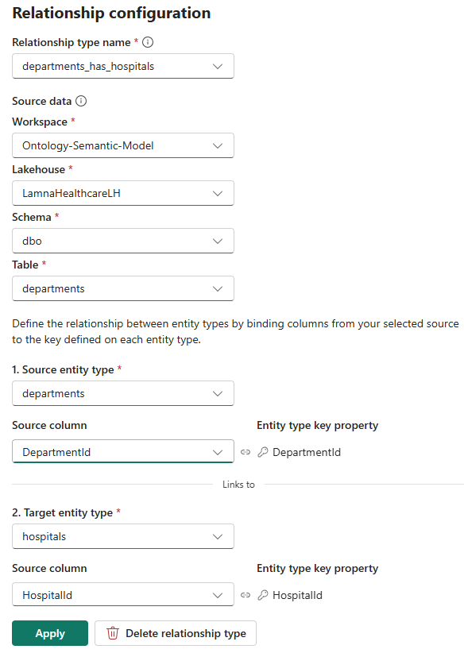
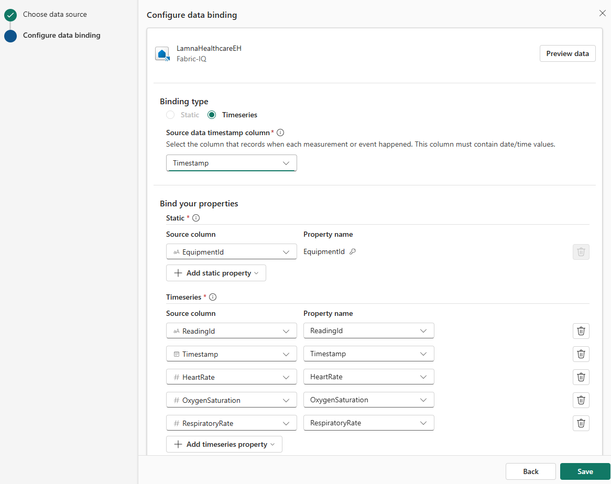
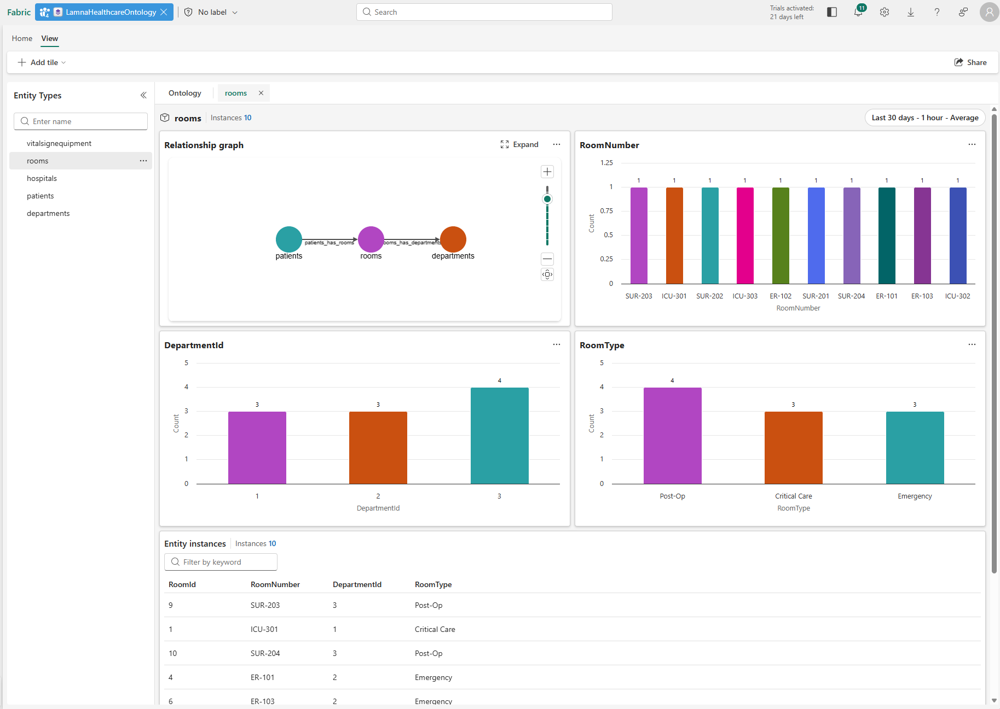

---
lab:
  title: Fabric IQ でセマンティック モデルからオントロジを構築する
  module: Create ontology with Microsoft Fabric IQ
  description: このラボでは、医療データを使用して Power BI セマンティック モデルから Fabric IQ オントロジを生成し、データ バインディングを使用してエンティティの種類とリレーションシップを構成し、レイクハウスの静的データとイベントハウスからの時系列データを組み合わせます。
  duration: 45 minutes
  level: 200
  islab: true
  primarytopics:
    - Microsoft Fabric
---

# Fabric IQ でセマンティック モデルからオントロジを構築する

Fabric IQ オントロジを構築するには、2 つの方法があります。手動で各エンティティの種類とリレーションシップを最初から作成するか、Power BI セマンティック モデルから構造を生成して自動的に作成するかです。 このラボでは、セマンティック モデルの手法を使用します。

このラボでは、架空の医療企業のサンプル データをレイクハウスとイベントハウスに読み込み、その上にセマンティック モデルを構築し、そのモデルからオントロジを生成します。 サンプル データは、病院、診療部門、病室、患者、生存徴候用の機器、生存徴候の測定値を表します。 セマンティック モデルの各テーブルはエンティティの種類になり、テーブル間の各リレーションシップはオントロジのリレーションシップの種類になります。

> [!IMPORTANT]
> Microsoft Fabric のオントロジは、現在[プレビュー段階](https://learn.microsoft.com/fabric/fundamentals/preview)です。

このラボの所要時間は約 **45** 分です。

> **注**:この演習を完了するには、[Microsoft Fabric 試用版](https://learn.microsoft.com/fabric/get-started/fabric-trial)が必要です。 また、次の[テナント設定](https://learn.microsoft.com/fabric/iq/ontology/overview-tenant-settings)を有効にする必要があります: **オントロジ項目を有効にする (プレビュー)** および**ユーザーは Graph を作成可能 (プレビュー)**。

## ワークスペースの作成

Fabric でオントロジの作業を行うには、Fabric 容量が割り当てられたワークスペースが必要です。

1. ブラウザーの `https://app.fabric.microsoft.com/home?experience=fabric` で [Microsoft Fabric ホーム ページ](https://app.fabric.microsoft.com/home?experience=fabric)に移動し、Fabric 資格情報でサインインします。
1. 左側のメニュー バーで、 **[ワークスペース]** を選択します (アイコンは &#128455; に似ています)。
1. 任意の名前で新しいワークスペースを作成し、*Fabric*、*Fabric 試用版*、または *Power BI Premium* のいずれかの種類のワークスペースのライセンス モードを選択します。
1. 開いた新しいワークスペースは空のはずです。

## サンプル データを使用してレイクハウスを作成する  

ここで、レイクハウスを作成して病院オペレーション データを読み込みます。これがあなたのオントロジの基礎となります。

1. ワークスペースの画面で、**[+ 新しい項目]** > **[レイクハウス]** を選択します。
1. このレイクハウスの名前を `LamnaHealthcareLH` として **[作成]** を選択します。
1. レイクハウスが開いたら、CSV ファイルをアップロードしてテーブルに変換します。

### 病院のデータ ファイルをダウンロードして読み込む

サンプル CSV ファイルをダウンロードし、それらをレイクハウスにアップロードして、テーブルに変換します。

1. [sample-data.zip](https://github.com/MicrosoftLearning/mslearn-fabric/raw/main/Allfiles/Labs/23-24/sample-data.zip) をダウンロードして、CSV ファイルをお使いのローカル コンピューターに抽出します。 ZIP ファイルには次のものが含まれています。
   - **Hospitals.csv** - ネットワーク内の医療施設
   - **Departments.csv** - 病院の診療部門 (ICU、救急、外科)
   - **Rooms.csv** - 診療部門内の個々の病室
   - **Patients.csv** - 現在の患者とその病室の割り当て
   - **VitalSignEquipment.csv** - 患者に割り当てられているモニタリング機器 (モニタリング対象の患者、およびモニタリングが開始されたタイミング)
   - **VitalSignsReadings.csv** - 生存徴候用の機器から一定期間にわたって収集された患者の生存徴候測定 (心拍数、酸素レベル、呼吸数)

1. 5 つのレイクハウス ファイルをアップロードします。
   - レイクハウスの画面のメイン ビューから **[ファイルのアップロード]** を選択します
   - 参照画面で **Hospitals.csv**、**Departments.csv**、**Rooms.csv**、**Patients.csv**、**VitalSignEquipment.csv** の 5 つのファイルを選択します
   - **[開く]** を選択します
   - **[アップロード]** を選択して、5 つのファイルをすべて一度にアップロードします
   - アップロードが完了するまで待ちます
   
   > **注**: **VitalSignsReadings.csv** はレイクハウスにアップロードしないでください。 これは次のセクションで、イベントハウスに読み込みます。そこで、時系列データとして扱います。

1. アップロードされた各ファイルをテーブルに変換します。
   - **[エクスプローラー]** で、**[Files]** フォルダーを選択します。ここに 5 つすべての CSV ファイルがあります
   - 各ファイルの名前の右にある省略記号 **(...)** を選択します
   - **[テーブルへの読み込み]** > **[新しいテーブル]** を選択します
   - テーブルを構成します。
     - **テーブル名**: Fabric により、ファイル名の先頭文字を小文字にしたもの (`hospitals`、`departments`、`rooms`、`patients`、`vitalSignEquipment`など) が事前に入力されます。 
     - **列ヘッダー**: **[列名にヘッダーを使用する]** にチェックを付けます
     - **区切り**: コンマ (`,`) のままにします
   - **[読み込む]** を選択します
   - 5 つすべてのファイルに対してこのプロセスを繰り返します

1. **[テーブル]** セクションに、`hospitals`、`departments`、`rooms`、`patients`、`vitalSignEquipment` の 5 つのテーブルがあることを確認します。

## ストリーミング データを使ったイベントハウスを作成する

次に、リアルタイム生存徴候データを時系列エンティティとしてオントロジに格納するイベントハウスを作成します。

1. ワークスペースで、**[+ 新しい項目]**  >  **[イベントハウス]** を選択します。
1. イベントハウスの名前を `LamnaHealthcareEH` として **[作成]** を選択します。
1. 既定の KQL データベースが、同じ名前で作成されます。 この KQL データベースを選択して開きます。

### 生存徴候データを取り込む

1. KQL データベース `LamnaHealthcareEH`を選択し、**[データの取得]**  >  **[ローカル ファイル]** を選択します。
1. **[ターゲット テーブルを選択または作成する]** セクションで、**[+ 新しいテーブル]** を選択し、テーブル名として `VitalSignsReadings` を入力します。
1. **[最大 1,000 個のファイルを追加する]** で、**[ファイルを参照する]** を選択し、先ほどダウンロードした **VitalSignsReadings.csv** ファイルをアップロードします。
1. **[次へ]** を選択し、インジェスト ウィザードを最後まで実行します。既定の設定をそのままにしてください。
1. **[完了]** を選択して、インジェストを完了します。
1. **VitalSignsReadings** テーブルが 20 行の KQL データベースに表示されていることを確認します。

## セマンティック モデルを作成する

次に、レイクハウスから Power BI セマンティック モデルを作成します。 各リレーションシップを定義するときには、それが実際の世界で何を意味するかについて考えます。診療部門は*病院に*所属し、病室は*診療部門の*一部で、患者は*病室に*入院し、機器は*患者に*割り当てられます。 こうしたビジネス上のリレーションシップこそが、最終的にオントロジに組み込まれるものです。

1. ワークスペースで、**LamnaHealthcareLH** レイクハウスを開きます。

1. レイクハウス リボンの **[新しいセマンティック モデル]** を選択します。

1. **[新しいセマンティック モデル]** ダイアログで、次のように操作します。
   - **[Direct Lake セマンティック モデル名]** フィールドに「`LamnaHealthcareModel`」と入力します。
   - **hospitals**、**departments**、**rooms**、**patients**、**vitalSignEquipment** の 5 つのテーブルをすべて選択します。
   - **確認** を選択します。
   
   > **注**: テーブルがリストに表示されない場合は、ブラウザーを更新してもう一度お試しください。
   
   - セマンティック モデルが直接開き、5 つのテーブルが表示されます。

   ![モデル名が入力され、5 つのテーブルが選択された [新しいセマンティック モデル] ダイアログを示すスクリーンショット](./Images/24-new-semantic-model.png)

 ### テーブル間の関連付けの定義

セマンティック モデルにおけるリレーションシップは、テーブルが相互にどのように関連付けられるかを定義します。 これらのリレーションシップは、オントロジでのリレーションシップの種類になります。

1. リボンで、**[リレーションシップの管理]**  >  **[+ 新しいリレーションシップ]** を選択します。

2. これらの設定を使用して最初のリレーションシップを作成し、**[保存]** を選択します。
   - **テーブルから**: departments | **Column**: HospitalId
   - **テーブルへ**: hospitals | **Column**: HospitalId
   - **カーディナリティ**: 多対一 (*:1)
   - **クロス フィルターの方向**: 双方向
   - **[保存]** を選びます。

3. **[+ 新しいリレーションシップ]** をもう一度選択し、さらに 3 つのリレーションシップを作成します。

   | テーブルから | 列から | テーブルへ | 列へ |
   |---|---|---|---|
   | rooms | DepartmentId | departments | DepartmentId |
   | patients | CurrentRoomId | rooms | RoomId |
   | vitalsignequipment | PatientId | patients | PatientId |

   それぞれについて同じ設定: カーディナリティ: **多対一 (\*:1)**、クロス フィルター: **双方向** を使用し、**[保存]** します。

4. **[リレーションシップの管理]** ペインに、下の画像のようにアクティブなリレーションシップが正確に 4 つ表示されていることを確認し、**[閉じる]** を選択します。

   ![4 つのアクティブなリレーションシップを含む [リレーションシップの管理] ペインを示すスクリーンショット](./Images/24-semantic-model-relationships.png)

5. 上部のナビゲーション バーで、**LamnaHealthcareModel** の横にある **[×]** を選択してセマンティック モデルを閉じます。 ワークスペース項目のリストに戻ります。

6. ワークスペース項目のリストで、**LamnaHealthcareModel** の横にある**省略記号 (...)** を選択し、**[セマンティック モデルを開く]** を選択します。

## オントロジを生成する

セマンティック モデルの準備が整い、レイクハウス データが配置されたので、セマンティック モデル エディターからオントロジを生成します。 セマンティック モデルは、病院、診療部門、病室、患者、生存徴候用機器などの静的な病院データをキャプチャします。 イベントハウスの生存徴候の読み取りデータは時系列データであり、生成後にオントロジに手動で追加されます。

1. 上部のリボンで、**[オントロジの生成]** を選択します。

   ![セマンティック モデル リボンの [オントロジの生成] ボタンを示すスクリーンショット](./Images/24-generate-ontology-button.png)

1. ドロップダウン ボックスからワークスペース名を選択します。

1. [名前] ダイアログで、「`LamnaHealthcareOntology`」を入力し、**[作成]** を選択します

   > **ヒント**: オントロジ名には、数字、文字、アンダースコアを含めることができます。スペースやダッシュは使用できません。

システムが **[オントロジの生成]** を行っている間、少し待ちます。

システムは、セマンティック モデルのリレーションシップに基づいて、**5 つのエンティティの種類** (Hospitals、Departments、Rooms、Patients、VitalSignEquipment) とそのすべてのプロパティ、**4 つのリレーションシップの種類**を生成します。 VitalSignEquipment エンティティには、レイクハウスからの静的プロパティが含まれますが、イベントハウスからの時系列の生存徴候測定値はまだありません。これは、リレーションシップ バインディングの設定後に、2 つ目のバインディングとして追加することになります。

オントロジが生成されたら、次のタスクを手動で完了する必要があります。

1. **エンティティの種類のキーを確認**し、不足しているキーを追加する
2. **リレーションシップの種類を確認して構成**し、リレーションシップがクエリ可能になるようにする
3. リアルタイムの生存徴候データの VitalSignEquipment に**時系列バインドを追加する**

これらのタスクは、以下のセクションで完了します。

## エンティティの種類のキーを確認して追加する

各エンティティの種類には、各インスタンスを一意に識別するキー プロパティが必要です。 オントロジの生成中、キーはセマンティック モデルのリレーションシップ構造から推論されます。 リレーションシップ内の各テーブルのロールに応じて、一部のキーは自動的に推論されますが、他のキーは手動で追加する必要があります。 各エンティティの種類にキーが定義されていることを確認します。

1. **[エンティティの種類]** のリストで、**hospitals** を選択します。
1. **[エンティティの種類の構成]** ペインの **[キー プロパティ]** で、**HospitalId** キーが定義されていることを確認します。
1. キーが表示されない場合は、**[+ キーの追加]** を選択し、**HospitalId** を選択して、**[保存]** を選択します。
1. 残りのエンティティ型について、必要に応じてキーを確認して追加します。

   | エンティティ型 | Key プロパティ |
   |---|---|
   | departments | DepartmentId |
   | rooms | RoomId |
   | patients | PatientId |
   | vitalsignequipment | EquipmentId |

## リレーションシップの種類を確認して構成する

生成されるオントロジには、リレーションシップの種類の定義が含まれます。 生成中、ソース データへのリレーションシップ バインディングは、セマンティック モデル構造に基づいて作成されます。 セマンティック モデルでキーとリレーションシップを定義する方法に応じて、一部のバインディングは自動的に構成されますが、その他には手動セットアップが必要です。 各リレーションシップを確認し、必要なリレーションシップを構成します。

**リレーションシップの構成について理解する:**

リレーションシップ バインディングは、リレーションシップの種類をソース データに接続します。 両方のエンティティの種類を識別する列を含むデータ テーブル (基本的には外部キー リレーションシップ) を選択します。 このテーブルの 2 つの列を使用して、リレーションシップの両側のエンティティ インスタンスが照合されます。

次の図は、`departments` テーブルを使用して構成されたリレーションシップを示しています。

- **セクション 1 (ソース エンティティの種類)**: `DepartmentId` — 診療部門インスタンスを識別します
- **セクション 2 (ターゲット エンティティの種類)**: `HospitalId` — 診療部門が属している病院を識別します

次に、オントロジのリレーションシップを確認しましょう。

1. オントロジ キャンバスで、**[エンティティの種類]** ナビゲーション バーの **departments** エンティティを選択します。
1. **Departments** と **Hospitals** の間のリレーションシップの線を選択して、**[リレーションシップの構成]** ペインを開きます。
1. **[ソース データ]** セクションを確認します。
   - **既に構成されている場合**: ペインには、ワークスペース、レイクハウス、スキーマ、テーブル、両方の列マッピングが表示されます。 構成が上記の画像と一致するかどうかを確認します。
   - **構成されていない場合**: [ソース データ] フィールドは空です。 次の構成手順に従います。

### 診療部門と病院のリレーションシップを構成する

リレーションシップに構成が必要な場合は、次の手順を行います。

1. **[リレーションシップの構成]** ペインで、ソース データの場所を構成します。
   - **ワークスペース**: ワークスペースを選択します
   - **レイクハウス**: **LamnaHealthcareLH** を選択します
   - **スキーマ**: **dbo** を選択します
   - **テーブル**: **Departments** を選択します
   
   > **注**: 診療部門の識別子と病院の参照の両方が含まれているため、Hospitals ではなく、Departments テーブルを選択します。 Hospitals テーブルには診療部門を指す列がないため、リレーションシップの方向を表すことはできません。

2. エンティティの種類のマッピングを構成します。
   - **[1. ソース エンティティの種類]** で、**Departments** を選択します
     - **[ソース列]** で、**DepartmentId** を選択します
   - **[2. ターゲット エンティティの種類]** で、**Hospitals** を選択します
     - **[ソース列]** で、**HospitalId** を選択します

3. **[適用]** または **[作成]** を選択します。

### 残りのリレーションシップを確認する

残りの 3 つのリレーションシップを確認します。 セットアップが必要な場合は、次のテーブルの値を使用して構成します。

| 関係 | ソース テーブル | ソース エンティティ テーブル: 列 | ターゲット エンティティ テーブル: 列 |
|---|---|---|---|
| rooms_has_departments | LamnaHealthcareLH > dbo > **Rooms** | Rooms: **RoomId** | Departments: **DepartmentId** |
| patients_has_rooms | LamnaHealthcareLH > dbo > **Patients** | Patients: **PatientId** | Rooms: **CurrentRoomId** |
| vitalsignequipment_has_patients | LamnaHealthcareLH > dbo > **VitalSignEquipment** | VitalSignEquipment: **EquipmentId** | Patients: **PatientId** |

これら 4 つのリレーションシップがすべて検証され、構成されると、オントロジは医療データ モデル全体を把握できるようになります。つまり、病院には診療部門が含まれ、診療部門には病室が含まれ、患者は病室に入院し、生存徴候測定機器は患者に割り当てられるという構造です。

## VitalSignEquipment に時系列バインディングを追加する

VitalSignEquipment エンティティには、現在、レイクハウスからの静的プロパティ (EquipmentId、PatientId、EquipmentType、MonitoringStartDate) のみが存在します。 次に、イベントハウスからの時系列の生存徴候測定値を取り込むために、2 つ目のバインディングを追加します。 これにより、単一のエンティティで静的な参照データとリアルタイムのストリーミング測定値を統合することが可能になります。

1. **[エンティティの種類]** のリストで、**vitalsignequipment** を選択します。

1. **[エンティティの種類の構成]** ペインで、**[バインディング]** タブに移動します。レイクハウスからの既存の静的バインディングが表示されます。

1. **[エンティティの種類にデータを追加する]** を選択して、2 つ目のバインディングを追加します。

1. **[OneLake カタログ]** で、ワークスペース内で **LamnaHealthcareEH** (イベントハウス) を探して選択します。

2. **[追加]** を選択します。

3. **VitalSignsReadings** テーブルを選択し、**[次へ]** を選択します。

4. **[バインディングの種類]** で、**[時系列]** を選択します。

5. **[ソース データ タイムスタンプ列]** で、**[タイムスタンプ]** を選択します。

   > [!IMPORTANT]
   > 時系列バインディングには、静的データからの一致するキーが必要です。 既存の静的バインディングでは、EquipmentId をキーとして、ストリーミングで読み取られた測定値を機器エンティティにリンクします。

6. 時系列バインディングを構成します。
   - **静的セクション** - ストリーミング データをエンティティにリンクするためのキーをマップします。
     - ストリーミング読み取り値を機器エンティティに接続する列として **EquipmentId** を選択します
     - これは、静的バインディングの EquipmentId と一致します
   
   - **時系列セクション** - プロパティを列にマップします (自動マップされます)。
     - ReadingId → ReadingId
     - Timestamp → Timestamp
     - HeartRate → HeartRate
     - OxygenSaturation → OxygenSaturation
     - RespiratoryRate → RespiratoryRate

   構成は次のようになります。

   

7. **[保存]** を選択して時系列バインディングを作成します。

VitalSignEquipment エンティティには、静的な参照データ (どの機器がどの患者をモニタリングしているか) と時系列データ (経時的な実際の生存徴候の測定値) の両方が格納されるようになりました。

これで、オントロジには **5 つのエンティティの種類**と **4 つのリレーションシップ**が含まれ、すべてのエンティティ データとリレーションシップのバインディングが完全に構成されました。

## オントロジをプレビューする

これで、レイクハウスからの静的エンティティとイベントハウスからの時系列データが、4 つのリレーションシップを通じてすべて結びつけられ、オントロジが完成しました。

1. [エンティティの種類] リストから **Rooms** を選択します。
1. [オントロジ] リボンで、**[エンティティの種類の概要]** を選択します。
1. システムがバックグラウンドでデータを処理している間、"オントロジの更新中" というメッセージが表示されます。 1 ～ 2 分後に、ブラウザーを最新の情報に更新するとエンティティ型の概要が表示されます。

   次のタイルが表示されます。
   - **リレーションシップ グラフ**: このエンティティの種類が他のエンティティの種類に接続する方法の視覚的表現
   - **プロパティ チャート**: プロパティ値の分布を示す縦棒グラフ (RoomType、RoomNumber、DepartmentId など)
   - **エンティティ インスタンス テーブル**: 個々の病室インスタンスすべてのリストとそれぞれのプロパティ

   

1. **[エンティティ インスタンス]** テーブルで、任意の病室インスタンス (例: **ICU-302**) を選択します。
1. インスタンス ビューが開き、この特定の病室のプロパティとその他のエンティティへの接続が表示されます。

レイクハウスからセマンティック モデルを構築し、オントロジ構造を自動的に生成し、イベントハウスからの時系列データでそれを拡張し、リレーションシップ バインディングですべてを結びつけることで、完全なオントロジの作成に成功しました。 オントロジが次の医療ドメインを表すようになりました。
- **5 つのエンティティの種類**: Hospitals、Departments、Rooms、Patients、VitalSignEquipment
- **4 つのリレーションシップ**: ソース データにすべてバインドされ、完全にクエリ可能
- **静的 + 時系列データ**: VitalSignEquipment は、レイクハウス参照データとイベントハウス ストリーミング測定を組み合わせたもの

## リソースをクリーンアップする (省略可能)

このワークスペースとオントロジを残しておき、引き続き Fabric IQ でできることの探究に利用することができます。 この演習で作成したリソースを削除するには、次の手順に従ってください。

1. 左側のバーで、ワークスペースのアイコンを選択して、それに含まれるすべての項目を表示します。
1. **[ワークスペースの設定]** を選択します。
1. **[全般]** セクションで、**[このワークスペースの削除]** を選択します。
