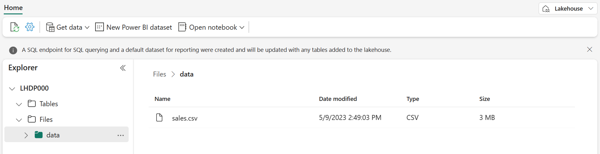
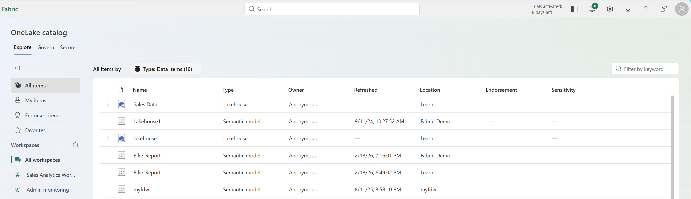
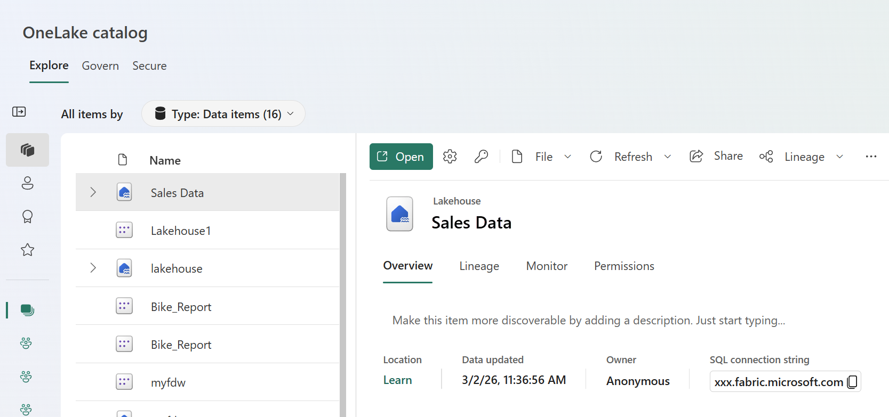
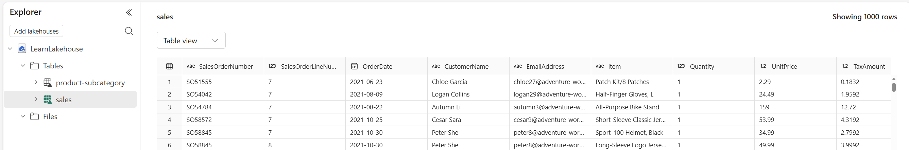
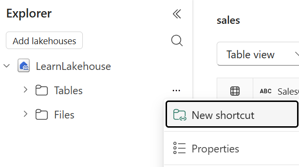
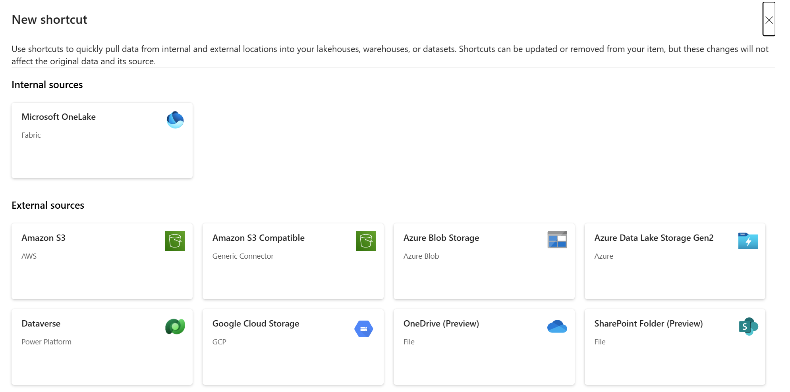
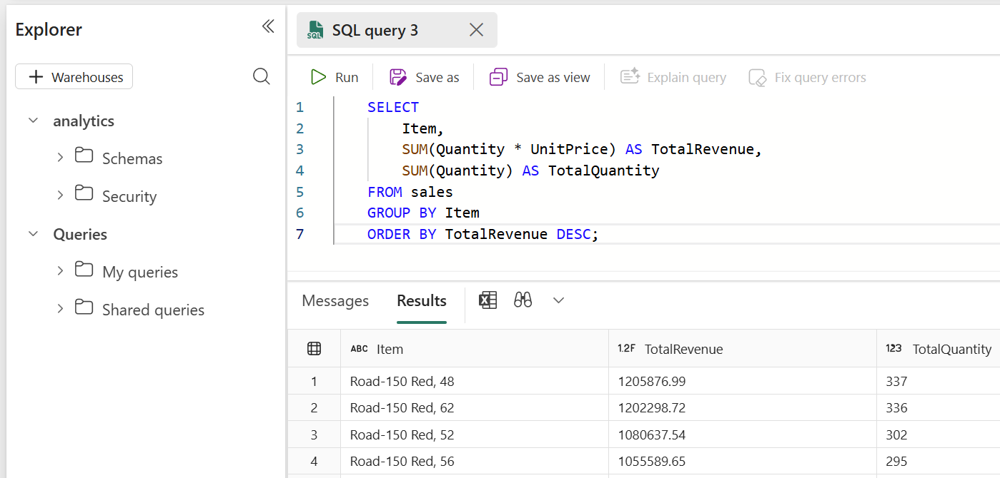

---
lab:
  title: OneLake でデータを検出して接続する
  module: Discover and connect to data in OneLake
  description: このラボでは、OneLake カタログを使用してデータ資産を検出し、それをコピーすることなくワークスペース間でデータにアクセスするためのショートカットを作成し、SQL 分析エンドポイントを使用してレイクハウス データにクエリを実行します。 また、セマンティック モデルを作成して探索し、Microsoft Fabric のデータ検出と接続機能を実際に確認します。
  duration: 30 minutes
  level: 200
  islab: true
  primarytopics:
    - Microsoft Fabric
---

# OneLake でデータを検出して接続する

最近の分析を担当する組織では多くの場合、複数のワークスペースとチームにまたがってデータが存在します。 データ エンジニアは生データとクレンジングされたデータを含むレイクハウスを作成し、他のチームはビジネス メトリックを使用してウェアハウスを構築し、アナリストはセマンティック モデルを開発します。 分析エンジニアは、このデータを変換したり、分析ソリューションを構築したりする前に、このデータを見つけて接続する必要があります。

Microsoft Fabric は、OneLake カタログを中央の検出エクスペリエンスとして提供します。 このカタログを使用すると、データ資産の検索、メタデータの確認、組織全体でどのようなデータが利用可能かを把握することができます。 必要なデータが見つかったら、ショートカットを使って接続したり、SQL でクエリを実行したり、セマンティック モデルを通じて分析したりすることができます。

この演習では、販売データを含むレイクハウスを使用してサンプル環境を作成します。 次に、OneLake カタログを通じてこのデータを検出する演習を行い、ワークスペースをまたいだアクセスを行うためのショートカットを作成し、SQL 分析エンドポイント経由でデータをクエリし、セマンティック モデルを詳しく確認します。

このラボの所要時間は約 **30** 分です。

> **注**: Fabric 対応ワークスペースにアクセスする必要があります。 お持ちでない場合は、[Microsoft Fabric 試用版](https://learn.microsoft.com/fabric/get-started/fabric-trial)を作成してこの演習を実行します。

## ワークスペースの作成

Fabric でデータを操作する前に、Fabric 試用版を有効にしてワークスペースを作成してください。

1. ブラウザーの `https://app.fabric.microsoft.com/home?experience=fabric` で [Microsoft Fabric ホーム ページ](https://app.fabric.microsoft.com/home?experience=fabric)に移動し、Fabric 資格情報でサインインします。

1. 左側のメニュー バーで、**[ワークスペース]** を選択します (**&#128455;** のようなアイコンです)。

1. 任意の名前で新しいワークスペースを作成します (例: *Data-Engineering*)。

1. _[詳細]_ セクションで **[Fabric と Power BI ワークスペースの種類]** を選択します。 選択肢は、_Fabric、Fabric 試用版、Power BI Premium_ です。

1. 開いた新しいワークスペースは空のはずです。

    

## レイクハウスを作成してサンプル データを読み込む

ワークスペースが作成されたので、次はレイクハウスを作成し、そこにサンプルの販売データを事前設定します。 このレイクハウスは、実際の組織においてデータ エンジニアリング チームが既に作成している可能性のあるデータを表しています。

1. `https://raw.githubusercontent.com/MicrosoftLearning/dp-data/main/sales.csv` から [sales.csv](https://raw.githubusercontent.com/MicrosoftLearning/dp-data/main/sales.csv) ファイルをダウンロードし、ローカル コンピューター (または該当する場合は提供された仮想マシン) に **sales.csv** という名前で保存します。

    > **注**: ファイルをダウンロードするには、ブラウザーで新しいタブを開き、URL を貼り付けます。 ページ上の任意の場所を右クリックし、**[名前を付けて保存]** を選択して、CSV ファイルとして保存します。

1. ワークスペースで **[+ 新しい項目]** を選択し、次に **[レイクハウス]** を選択します。 お好みの名前を付けます (例: _sales-data_)。

    1 分ほどすると、空の **Tables** および **Files** フォルダーを含む新しいレイクハウスが作成されます。

    

1. レイクハウス エクスプローラーで **Files** フォルダーを選択し、省略記号 **(...)** を選択してから、**[アップロード] > [ファイルのアップロード]** の順に選択し、先ほどダウンロードした **sales.csv** ファイルを選択します。

1. ファイルのアップロードが完了したら、**Files** フォルダーを選択し、**sales.csv** がアップロードされていることを確認します。 ファイルを選択すると、その内容のプレビューが表示されます。

    

## テーブルへのデータの読み込み

ファイル データを Delta テーブルに読み込むことで、SQL を使用したクエリが可能になり、従来のデータ ウェアハウスと同様に、ACID トランザクションなどの信頼性機能が提供されます。

1. **[エクスプローラー]** ペインで、**Files** フォルダーを展開して、**sales.csv** ファイルを表示します。

1. **sales.csv** ファイルの省略記号 **(...)** メニューで、**[テーブルに読み込む] > [新しいテーブル]** の順に選択します。

1. **[テーブルに読み込む]** ダイアログで、テーブル名を **sales** に設定し、読み込み操作を確認します。 テーブルが作成されて読み込まれるのを待ちます。

    > **ヒント**: **sales** テーブルが自動的に表示されない場合は、**Tables** フォルダーの省略記号 **(...)** メニューで **[最新の情報に更新]** を選択します。

1. **[エクスプローラー]** ペインで、**sales** テーブルを選択し、そのカタログとスキーマを表示します。

    

## OneLake カタログを参照してデータを検出する

レイクハウスにデータが格納されたので、OneLake カタログを通じてそのデータを検出する方法を詳しく確認しましょう。 このカタログでは、Fabric テナント全体のすべてのデータ資産を一元的に確認できます。

1. ページの上部にある [Fabric] アイコンを選択すると、Fabric のホーム ページに戻ります。

1. 左側のナビゲーション ウィンドウで **[OneLake カタログ]** を選択します。

    

1. カタログには、レイクハウス、ウェアハウス、セマンティック モデル、レポートなど、さまざまな項目の種類が表示されます。 リストを閲覧して、**sales_data** レイクハウス (または選んだ任意の名前) を探します。

    > **注**: 試用版環境に他に何が含まれているかによって、カタログに他の項目が表示される場合があります。 このカタログにはアクセス許可が反映されているため、アクセス許可のある項目のみが表示されます。

1. レイクハウスを選択すると、その詳細が表示されます。 詳細ペインには、次のようなメタデータが表示されます。
    - **場所**: 項目が配置されているワークスペース
    - **データ更新日時**: データが最後に更新された日時
    - **所有者**: 項目を作成したユーザー
    - **SQL 接続文字列**: SQL Server Management Studio (SSMS) などのツールを使用して接続する方法

    

1. **[開く]** を選択すると、レイクハウスの [レイクハウス エクスプローラー ビュー] が表示されます。

## レイクハウスのテーブルとスキーマを確認する

カタログでデータ資産を検出したら、次のステップはその構造を確認することです。 テーブル、列、データ型を理解することは、そのデータがご自分のニーズに合うかどうかを判断するのに役立ちます。

1. カタログから、**sales_data** レイクハウスを選択して開きます。

1. 左側の **[エクスプローラー]** ペインで、**Tables** フォルダーを展開して、前に作成した **sales** テーブルを表示します。

1. **sales** テーブルを選択します。 メイン ビューにデータのプレビューが表示され、最初の数行が表示されます。

    

1. テーブル プレビューで、列ヘッダー: **SalesOrderNumber**、**SalesOrderLineNumber**、**OrderDate**、**CustomerName**、**EmailAddress**、**Item**、**Quantity**、**UnitPrice**、**TaxAmount** を確認します。 プレビューの下には、各列のデータ型を示すスキーマが表示されます。

1. **ファイル ビュー**を選択すると、基になるファイルも表示されます。

    

テーブルは、Delta Lake 形式の Parquet ファイルとして格納されます。 **_delta_log** サブフォルダーには、テーブルに対するすべての変更を追跡するトランザクション ログが含まれており、ACID トランザクションやタイム トラベルなどの機能が有効になります。

## 別のワークスペースからデータにアクセスするためのショートカットを作成する

ショートカットを使用すると、データをコピーせずに他のワークスペースから参照し、ソースへのライブ接続を提供できます。 このタスクでは、2 つ目のレイクハウスと、元のレイクハウスの販売データを指すショートカットを作成します。

1. ページの上部で、ワークスペース名を選択してワークスペース ビューに戻ります。

1. **[+ 新しい項目]**  >  **[レイクハウス]** を選択して、2 つ目のレイクハウスを作成します。 **analytics** という名前 (または別のお好みの名前) を付けます。

    このレイクハウスは、データを変換してセマンティック モデルを構築する分析ワークスペースを表します。

1. 新しいレイクハウスが開いたら、**[エクスプローラー]** ペインで、**Tables** フォルダーの **[...]** メニューを選択し、**[新しいショートカット]** を選択します。

    

1. **[新しいショートカット]** ダイアログで、ショートカット ソースとして **[OneLake]** を選択します。

    

1. ワークスペースのリストで、元の **sales_data** レイクハウス (たとえば、_Data-Engineering_) を含むワークスペースを選択します。

1. **sales_data** レイクハウスを選択し、**Tables** フォルダーを選択します。

1. **sales** テーブルを選択し、**[次へ]** を選択します。

1. **[作成]** を選択する前に、ショートカットの詳細を確認します。

    - **ターゲットの種類**: ショートカットの種類、この場合、OneLake
    - **ショートカットの場所**: ショートカットが必要なレイクハウス
    - **ショートカット名**: 既定値は _sales_
    - **ソース**: データが存在するレイクハウス

    

1. **analytics** レイクハウスの **[エクスプローラー]** ペインで、**Tables** フォルダーを展開します。 **sales** テーブルにショートカット アイコン (リンク オーバーレイ) が表示されます。

    

1. **sales** ショートカットを選択して、そのデータを表示します。 データは元のテーブルと同じですが、データはコピーされませんでした。 ショートカットは、ソースへのライブ参照を提供します。

## SQL 分析エンドポイントを使ってデータのクエリを実行する

すべてのレイクハウスには、テーブルへの読み取り専用 T-SQL アクセスを提供する SQL 分析エンドポイントが含まれています。 このエンドポイントを使用すると、使い慣れた SQL 構文を使用してレイクハウス データにクエリを実行できるため、データを簡単に探索し、必要なものが含まれていることを確認できます。

1. **analytics** レイクハウス ページの右上で、ドロップダウン メニューを探します。現在は **[レイクハウス]** が表示されています。 ドロップダウンを選択し、**[SQL 分析エンドポイント]** に切り替えます。

    

    ビューが SQL 専用のインターフェイスに切り替わり、ここで T-SQL を使用してテーブルをクエリできます。

1. ツール バーで、**[新しい SQL クエリ]** を選択してクエリ エディターを開きます。

1. [クエリ エディター] ウィンドウに次の T-SQL クエリを入力します。

    ```sql
    SELECT 
        Item,
        SUM(Quantity * UnitPrice) AS TotalRevenue,
        SUM(Quantity) AS TotalQuantity
    FROM sales
    GROUP BY Item
    ORDER BY TotalRevenue DESC;
    ```

    このクエリでは、各項目の総収益と販売数量が計算されます。

1. **[実行]** を選択して、クエリを実行します。 項目別の収益を示す結果を確認します。

    

1. 収益別に上位の顧客を見つけるための 2 つ目のクエリを記述します。

    ```sql
    SELECT TOP 5
        CustomerName,
        SUM(Quantity) AS TotalQuantity,
        SUM(Quantity * UnitPrice) AS TotalRevenue
    FROM sales
    GROUP BY CustomerName
    ORDER BY TotalRevenue DESC;
    ```

1. このクエリを実行し、結果を確認します。

## セマンティック モデルを作成および探索する

セマンティック モデルは、Power BI レポート向けに事前定義されたリレーションシップ、指標、計算を含む、ビジネス利用に適したレイヤーをデータに提供します。 このタスクでは、レイクハウスからセマンティック モデルを作成し、_[このデータを探索]_ 機能を使用して探索します。

1. **analytics** レイクハウスの SQL 分析エンドポイント ビューで、ツール バーの **[新しいセマンティック モデル]** オプションを選択します。

    

1. **[セマンティック モデルの作成]** ダイアログで、**sales** テーブルが選択されていることを確認します。 セマンティック モデルに **Sales Analysis** などの名前を付け、**[作成]** を選択します。

    > しばらくすると、セマンティック モデルが作成されます。 モデルがワークスペースに表示されます。

1. ワークスペースに戻り、先ほど作成した **Sales Analysis** セマンティック モデルを見つけます。 セマンティック モデルの省略記号 **(...)** メニューを選択し、**[このデータを探索]** を選択します。

    ![セマンティック モデルの [このデータを探索] オプションを示すスクリーンショット。](./Images/explore-semantic-model.png)

    **[このデータを探索]** 機能により、軽量の探索用インターフェイスが開き、ここで Power BI Desktop を開かずにすばやく視覚化を作成できます。

1. **[エクスプローラー]** ウィンドウで、**[項目]** フィールドをキャンバスにドラッグして、テーブルの視覚化を作成します。

1. **[数量]** フィールドを **[値]** 領域にドラッグして、項目別の合計数量を表示します。

1. **[視覚化]** ペインで、視覚化の種類を **[横棒グラフ]** または **[縦棒グラフ]** に変更して、グラフィックを表示します。

    ![項目別の数量の横棒グラフが表示された [エクスプローラー] ウィンドウを示すスクリーンショット。](./Images/explore-data-visualization.png)

1. 他のフィールドと視覚化の種類を試して、データを探索しましょう。

## (省略可能) Copilot を使用して SQL クエリを記述する

Fabric で Microsoft Copilot にアクセスできる場合は、その支援を利用して SQL クエリを記述できます。 Copilot は、自然な言語の説明に基づいてクエリを生成できるため、データをより迅速に探索できます。

> **注**: このタスクには、Fabric 環境での Copilot アクセスが必要です。 Copilot が使用できない場合は、このタスクをスキップします。

1. **analytics** レイクハウスに戻り、**[SQL 分析エンドポイント]** ビューに切り替えます。

1. 新しい SQL クエリ エディターを開きます。

1. クエリ エディターで、ツール バーの **[Copilot]** ボタンを探します (電球アイコンまたは Copilot アイコンとして表示される場合があります)。

1. [Copilot] ボタンを選択して、[Copilot] ペインを開きます。

1. Copilot プロンプトで、次のような自然な言語でリクエストを入力します。

    `Write a SQL query to show total revenue by month for the year 2026, sorted by month.`

1. Copilot で生成されたクエリを確認します。 以下に示したのは実際の表示例です:

    ```sql
    SELECT 
        FORMAT(OrderDate, 'yyyy-MM') AS Month,
        SUM(Quantity * UnitPrice) AS TotalRevenue
    FROM sales
    WHERE YEAR(OrderDate) = 2026
    GROUP BY FORMAT(OrderDate, 'yyyy-MM')
    ORDER BY Month;
    ```

1. **[挿入]** を選択して生成されたクエリをエディターに追加し、**[実行]** を選択して実行します。

1. 結果を確認します。 次のような他のクエリを記述するように Copilot に依頼してみてください。
    - _"項目別の平均単価を表示してください"_
    - _"数量が 10 より大きい注文をすべて検索してください"_

## リソースをクリーンアップする

この演習では、レイクハウスを作成し、OneLake カタログを探索し、ワークスペース間アクセスのショートカットを作成し、SQL 分析エンドポイントを使用してデータにクエリを実行し、セマンティック モデルを作成しました。

レイクハウスとセマンティック モデルの探索が完了したら、この演習用に作成したワークスペースを削除できます。

1. 左側のバーで、ワークスペースのアイコンを選択して、それに含まれるすべての項目を表示します。
1. ツール バーの **[ワークスペース設定]** を選択します。
1. **[全般]** セクションで、**[このワークスペースの削除]** を選択します。
1. 作成した追加のワークスペース (分析ワークスペースなど) に対して、これらの手順を繰り返します。
