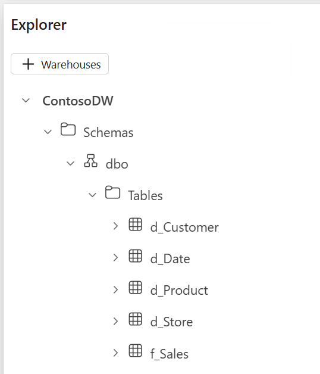

---
lab:
  title: ディメンショナル モデルを設計して実装する
  module: Design dimensional models for analytics in Microsoft Fabric
  description: このラボでは、スター スキーマ ディメンショナル モデルを設計して Fabric ウェアハウスの中に実装し、外部キー リレーションシップを持つファクト テーブルとディメンション テーブルを作成します。 分析クエリを実行して売上データを複数のディメンションにわたって集計し、SCD (緩やかに変化するディメンション) タイプ 1 とタイプ 2 のパターンを実装します。これは時とともに変化するデータを扱うためです。
  duration: 30 minutes
  level: 300
  islab: true
  primarytopics:
    - Microsoft Fabric
---

# ディメンショナル モデルを設計して実装する

Microsoft Fabric では、データ ウェアハウスで T-SQL のセマンティクス全体がサポートされるため、これを使用してディメンショナル モデルの作成と管理を行うことができます。 ディメンショナル モデルとは、データをファクト テーブル (ビジネス イベントを記録する) とディメンション テーブル (分析のためのコンテキストを表す) として整理するものです。 この構造はスター スキーマと呼ばれ、ほとんどの分析ワークロードに推奨されるアプローチであり、Power BI のセマンティック モデルの基礎となります。

この演習では、架空の小売業組織 Contoso Retail のためのスター スキーマ ディメンショナル モデルを設計して実装します。この組織は、さまざまな店舗、商品、顧客、期間にわたる販売実績分析を必要としています。 ファクト テーブルとディメンション テーブルを Fabric ウェアハウスの中に作成し、サンプル データを読み込み、分析クエリを実行します。このクエリではファクト テーブルをディメンション テーブルに**スター スキーマ**として結合します。

また、時とともに変化するデータを扱うための SCD (緩やかに変化するディメンション) パターンを実装し、タイプ 1 (上書き) とタイプ 2 (履歴追跡) の変化が実際にどのように機能するかを示します。

このラボの所要時間は約 **30** 分です。

> **注**: Fabric が有効化されたワークスペースにアクセスできることが必要です。 お持ちでない場合は、この演習を完了するための [Microsoft Fabric 試用版](https://learn.microsoft.com/fabric/get-started/fabric-trial)を作成してください。

## ワークスペースの作成

Fabric でデータを操作する前に、Fabric 試用版を有効にしてワークスペースを作成してください。

1. ブラウザーの `https://app.fabric.microsoft.com/home?experience=fabric` で [Microsoft Fabric ホーム ページ](https://app.fabric.microsoft.com/home?experience=fabric)に移動し、Fabric 資格情報でサインインします。

1. 左側のメニュー バーで、 **[ワークスペース]** を選択します (アイコンは &#128455; に似ています)。

1. [詳細]__ セクションで **[Fabric と Power BI ワークスペースの種類]** を選択します。 選択肢は [Fabric]、[Fabric 試用版]、[Power BI Premium]__ などとなります。

1. 開いた新しいワークスペースは空のはずです。

    

## データ ウェアハウスの作成

ワークスペースを用意できたので、ディメンショナル モデルをホストするデータ ウェアハウスを作成します。

1. ワークスペースの画面で、**[+ 新しい項目]** を選択し、[データの格納]__ セクションで **[ウェアハウス]** を選択します。 名前を **ContosoDW** とします。

    約 1 分後に、新しいウェアハウスが作成されてブラウザーに表示されます。

    

## ファクト テーブルを作成する

ファクト テーブルには、測定対象のビジネス イベントが記録されます。Contoso Retail の場合は売上トランザクションです。 粒度は**売上トランザクション品目ごとに 1 行**です。 クエリで集計する数値列を**メジャー**といいます。ここでは数量、単価、売上額、割引額です。 このテーブルには外部キーもあり、これで各トランザクションが 4 つのディメンション テーブルにリンクされます。

1. ウェアハウスの画面で、ツール バーの **[新しい SQL クエリ]** ボタンを選択し、次の T-SQL ステートメントを入力します。

    ```sql
    CREATE TABLE f_Sales
    (
        DateKey INT NOT NULL,
        StoreKey INT NOT NULL,
        ProductKey INT NOT NULL,
        CustomerKey INT NOT NULL,
        Quantity INT NOT NULL,
        UnitPrice DECIMAL(10,2) NOT NULL,
        SalesAmount DECIMAL(10,2) NOT NULL,
        DiscountAmount DECIMAL(10,2) NOT NULL
    );
    ```

1. **[&#9655; 実行]** ボタンを使用して SQL スクリプトを実行します。

1. ツール バーの **[更新]** ボタンを使用して、ビューを更新してください。 **[エクスプローラー]** ペインで **[スキーマ]** > **[dbo]** > **[テーブル]** の順に展開し、**f_Sales** テーブルが作成されていることを確認します。

    > **注**: `f_` というプレフィックスは、これがファクト テーブルであることを示します。 この名前付け規則に従うと、アナリストやツールにとってファクト テーブルとディメンション テーブルが区別しやすくなります。 ファクト テーブルに主キーがないのは意図的であり、標準的な手法です。その理由は、ファクト テーブルでは主キーが特に有益な目的を果たすことはなく、不必要にストレージ使用量を増やすことになるからです。

    

## ディメンション テーブルを作成する

ディメンション テーブルとは、ファクト データを意味のあるものにするコンテキストを与えるものです。 どの測定の背後にもある、"誰が、何を、いつ、どこで" に答えるものです。________ このモデルには、日付、店舗、商品、顧客の 4 つのディメンションが必要です。

商品と店舗のディメンションには、SCD タイプ 2 の追跡列 (`ValidFrom`、`ValidTo`、`IsCurrent`) が含まれていますが、これは商品原価と店舗リージョン割り当ての過去の変化を追跡する必要があるためです。 顧客と日付のディメンションでは、これよりも単純な構造が使用されていますが、その理由は顧客には修正 (タイプ 1) のみが必要であることと、日付ディメンションは静的参照データであることです。

1. **[ホーム]** メニュー タブで、**[新しい SQL クエリ]** を選択し、次のコードを実行して 4 つのディメンション テーブルすべてを作成します。

    ```sql
    -- Date dimension: uses YYYYMMDD integer format as surrogate key
    CREATE TABLE d_Date
    (
        DateKey INT NOT NULL,
        FullDate DATE NOT NULL,
        [Year] INT NOT NULL,
        [Quarter] INT NOT NULL,
        [Month] INT NOT NULL,
        MonthName VARCHAR(10) NOT NULL,
        [Day] INT NOT NULL,
        [DayOfWeek] VARCHAR(10) NOT NULL,
        FiscalYear INT NOT NULL,
        FiscalQuarter INT NOT NULL,
        IsHoliday BIT NOT NULL,
        IsWeekday BIT NOT NULL
    );

    -- Store dimension: includes SCD Type 2 tracking columns
    CREATE TABLE d_Store
    (
        StoreKey INT NOT NULL,
        StoreNaturalKey VARCHAR(10) NOT NULL,
        StoreName VARCHAR(50) NOT NULL,
        StoreType VARCHAR(20) NOT NULL,
        City VARCHAR(50) NOT NULL,
        [State] VARCHAR(50) NOT NULL,
        Country VARCHAR(50) NOT NULL,
        Region VARCHAR(50) NOT NULL,
        OpenDate DATE NOT NULL,
        ValidFrom DATE NOT NULL,
        ValidTo DATE NOT NULL,
        IsCurrent BIT NOT NULL
    );

    -- Product dimension: includes SCD Type 2 tracking columns
    CREATE TABLE d_Product
    (
        ProductKey INT NOT NULL,
        ProductNaturalKey VARCHAR(10) NOT NULL,
        ProductName VARCHAR(50) NOT NULL,
        Brand VARCHAR(50) NOT NULL,
        Subcategory VARCHAR(50) NOT NULL,
        Category VARCHAR(50) NOT NULL,
        UnitCost DECIMAL(10,2) NOT NULL,
        ValidFrom DATE NOT NULL,
        ValidTo DATE NOT NULL,
        IsCurrent BIT NOT NULL
    );

    -- Customer dimension: simple structure (SCD Type 1 only)
    CREATE TABLE d_Customer
    (
        CustomerKey INT NOT NULL,
        CustomerName VARCHAR(50) NOT NULL,
        Segment VARCHAR(20) NOT NULL,
        City VARCHAR(50) NOT NULL,
        [State] VARCHAR(50) NOT NULL,
        Country VARCHAR(50) NOT NULL,
        LoyaltyTier VARCHAR(20) NOT NULL,
        JoinDate DATE NOT NULL
    );
    ```

    > **注**: 日付ディメンションでは、`YYYYMMDD` という整数書式がサロゲート キーとして使用されます。 この手法が日付ディメンションに関して受け入れられているのは、意味があり、かつ効率的であるからです。 会計年度は 7 月に始まるため、2026 年 1 月は第 3 会計四半期に当たります。 店舗と商品のディメンションには、`NaturalKey` 列 (ソース システム識別子) と 3 つの SCD タイプ 2 追跡列 (`ValidFrom`、`ValidTo`、`IsCurrent`) が含まれています。 サロゲート キー (`StoreKey`、`ProductKey`) によって、1 つのディメンション メンバーの各バージョンが一意に識別されます。__ この設計は、この演習で後ほど実装する過去の変化の追跡に不可欠です。

1. ツール バーの **[更新]** ボタンをクリックします。 **[エクスプローラー]** ペインで、5 つのテーブル (**f_Sales**、**d_Date**、**d_Store**、**d_Product**、**d_Customer**) すべてが **[スキーマ]** > **[dbo]** > **[テーブル]** の下に表示されることを確認します。

    > **ヒント**: テーブルが表示されるのに時間がかかる場合は、ブラウザー ページを最新の情報に更新してください。

    

## テーブル制約を追加する

ファクト テーブルとディメンション テーブルが存在する状態になったので、外部キー制約を追加するという方法でこれらを接続してスター スキーマを作成し、サンプル データを読み込み、分析クエリを実行します。 Fabric Warehouse では、テーブル制約 (主キーと外部キー) を CREATE TABLE ステートメント内でインライン定義することはできないため、テーブルが作成された後に ALTER TABLE を使用して追加します。 制約は `NOT ENFORCED` であり、テーブル間のリレーションシップを文書化するメタデータとしての役割を果たします。 このメタデータは、ウェアハウスからセマンティック モデルを作成するときに Power BI がリレーションシップを自動検出するのに利用されます。

1. 新しい SQL クエリを作成し、次のコードを実行して各ディメンション テーブルに主キーを追加するとともに外部キーをファクト テーブルに追加します。

    ```sql
    -- Add primary keys to dimension tables
    ALTER TABLE d_Date
        ADD CONSTRAINT PK_d_Date PRIMARY KEY NONCLUSTERED (DateKey) NOT ENFORCED;

    ALTER TABLE d_Store
        ADD CONSTRAINT PK_d_Store PRIMARY KEY NONCLUSTERED (StoreKey) NOT ENFORCED;

    ALTER TABLE d_Product
        ADD CONSTRAINT PK_d_Product PRIMARY KEY NONCLUSTERED (ProductKey) NOT ENFORCED;

    ALTER TABLE d_Customer
        ADD CONSTRAINT PK_d_Customer PRIMARY KEY NONCLUSTERED (CustomerKey) NOT ENFORCED;

    -- Add foreign keys to the fact table
    ALTER TABLE f_Sales
        ADD CONSTRAINT FK_Sales_Date FOREIGN KEY (DateKey)
            REFERENCES d_Date(DateKey) NOT ENFORCED;

    ALTER TABLE f_Sales
        ADD CONSTRAINT FK_Sales_Store FOREIGN KEY (StoreKey)
            REFERENCES d_Store(StoreKey) NOT ENFORCED;

    ALTER TABLE f_Sales
        ADD CONSTRAINT FK_Sales_Product FOREIGN KEY (ProductKey)
            REFERENCES d_Product(ProductKey) NOT ENFORCED;

    ALTER TABLE f_Sales
        ADD CONSTRAINT FK_Sales_Customer FOREIGN KEY (CustomerKey)
            REFERENCES d_Customer(CustomerKey) NOT ENFORCED;
    ```

## サンプル データを読み込む

スキーマができたので、サンプル データを読み込むと、このスター スキーマに対してクエリを実行できるようになります。 このブロックで、5 つのテーブルすべてに行が挿入されます。

1. 新しい SQL クエリを作成し、次のコードを実行してサンプル データをすべてのディメンション テーブルとファクト テーブルに読み込みます。

    ```sql
    -- Load date dimension data
    INSERT INTO d_Date VALUES
    (20260105, '2026-01-05', 2026, 1, 1, 'January', 5, 'Monday', 2026, 3, 0, 1),
    (20260112, '2026-01-12', 2026, 1, 1, 'January', 12, 'Monday', 2026, 3, 0, 1),
    (20260209, '2026-02-09', 2026, 1, 2, 'February', 9, 'Monday', 2026, 3, 0, 1),
    (20260302, '2026-03-02', 2026, 1, 3, 'March', 2, 'Monday', 2026, 3, 0, 1),
    (20260406, '2026-04-06', 2026, 2, 4, 'April', 6, 'Monday', 2026, 4, 0, 1),
    (20260504, '2026-05-04', 2026, 2, 5, 'May', 4, 'Monday', 2026, 4, 0, 1);

    -- Load store dimension data
    INSERT INTO d_Store VALUES
    (1, 'ST-001', 'Contoso Downtown', 'Flagship', 'Seattle', 'Washington', 'United States', 'West', '2020-03-15', '2026-01-01', '9999-12-31', 1),
    (2, 'ST-002', 'Contoso Mall', 'Standard', 'Portland', 'Oregon', 'United States', 'West', '2021-07-01', '2026-01-01', '9999-12-31', 1),
    (3, 'ST-003', 'Contoso Central', 'Standard', 'Chicago', 'Illinois', 'United States', 'Central', '2019-11-20', '2026-01-01', '9999-12-31', 1),
    (4, 'ST-004', 'Contoso Plaza', 'Express', 'New York', 'New York', 'United States', 'East', '2022-01-10', '2026-01-01', '9999-12-31', 1);

    -- Load product dimension data
    INSERT INTO d_Product VALUES
    (1, 'MB-PRO', 'Mountain Bike Pro', 'AdventureWorks', 'Mountain Bikes', 'Bikes', 1200.00, '2026-01-01', '9999-12-31', 1),
    (2, 'RB-ELT', 'Road Bike Elite', 'AdventureWorks', 'Road Bikes', 'Bikes', 900.00, '2026-01-01', '9999-12-31', 1),
    (3, 'HL-STD', 'Cycling Helmet', 'SafeRide', 'Helmets', 'Accessories', 25.00, '2026-01-01', '9999-12-31', 1),
    (4, 'WB-STD', 'Water Bottle', 'HydroGear', 'Bottles', 'Accessories', 5.00, '2026-01-01', '9999-12-31', 1),
    (5, 'LK-STD', 'Bike Lock', 'SecureLock', 'Locks', 'Accessories', 15.00, '2026-01-01', '9999-12-31', 1);

    -- Load customer dimension data
    INSERT INTO d_Customer VALUES
    (1, 'Jordan Rivera', 'Premium', 'Seattle', 'Washington', 'United States', 'Gold', '2023-06-15'),
    (2, 'Alex Chen', 'Standard', 'Portland', 'Oregon', 'United States', 'Silver', '2024-01-20'),
    (3, 'Sam Patel', 'Premium', 'Chicago', 'Illinois', 'United States', 'Gold', '2022-11-05'),
    (4, 'Taylor Kim', 'Budget', 'New York', 'New York', 'United States', 'Bronze', '2025-03-12'),
    (5, 'Morgan Lee', 'Standard', 'Seattle', 'Washington', 'United States', 'Silver', '2024-08-30');

    -- Load fact data (sales transactions)
    INSERT INTO f_Sales VALUES
    (20260105, 1, 1, 1, 1, 1500.00, 1500.00, 0.00),
    (20260105, 1, 3, 1, 2, 35.00, 70.00, 5.00),
    (20260112, 2, 2, 2, 1, 1100.00, 1100.00, 100.00),
    (20260112, 2, 4, 2, 3, 8.00, 24.00, 0.00),
    (20260209, 3, 1, 3, 2, 1500.00, 3000.00, 150.00),
    (20260209, 3, 5, 3, 1, 22.00, 22.00, 0.00),
    (20260302, 1, 2, 5, 1, 1100.00, 1100.00, 0.00),
    (20260302, 4, 3, 4, 4, 35.00, 140.00, 10.00),
    (20260406, 2, 1, 2, 1, 1500.00, 1500.00, 75.00),
    (20260504, 3, 4, 3, 5, 8.00, 40.00, 0.00);
    ```

## スター スキーマに対してクエリを実行する

1. 新しい SQL クエリを作成し、次のコードを実行して売上を商品カテゴリと月別に分析します。

    ```sql
    SELECT
        d.MonthName,
        p.Category,
        SUM(f.SalesAmount) AS TotalSales,
        SUM(f.Quantity) AS TotalQuantity,
        SUM(f.DiscountAmount) AS TotalDiscounts
    FROM f_Sales f
    JOIN d_Date d ON f.DateKey = d.DateKey
    JOIN d_Product p ON f.ProductKey = p.ProductKey
    GROUP BY d.MonthName, d.[Month], p.Category
    ORDER BY d.[Month], p.Category;
    ```

    > このクエリにスター スキーマ設計がどのように反映されているかに注目してください。ファクト テーブル (`f_Sales`) が各ディメンション テーブルに結合されているため、説明となる属性が取り込まれます。 `SUM` 関数でファクト テーブルの数値列を集計し、`GROUP BY` 句ではディメンション属性を使用してグループ化を定義しています。

    | MonthName | カテゴリ | TotalSales | TotalQuantity | TotalDiscounts |
    |---|---|---|---|---|
    | 1 月 | アクセサリ | 94.00 | 5 | 5.00 |
    | 1 月 | Bikes | 2600.00 | 2 | 100.00 |
    | 2 月 | アクセサリ | 22.00 | 1 | 0.00 |
    | 2 月 | Bikes | 3000.00 | 2 | 150.00 |
    | March | アクセサリ | 140.00 | 4 | 10.00 |
    | March | Bikes | 1100.00 | 1 | 0.00 |
    | April | Bikes | 1500.00 | 1 | 75.00 |
    | May | アクセサリ | 40.00 | 5 | 0.00 |

1. 新しい SQL クエリを作成し、次のコードを実行して売上を店舗リージョンと顧客セグメント別に分析します。

    ```sql
    SELECT
        s.Region,
        c.Segment,
        SUM(f.SalesAmount) AS TotalSales,
        COUNT(*) AS TransactionCount
    FROM f_Sales f
    JOIN d_Store s ON f.StoreKey = s.StoreKey
    JOIN d_Customer c ON f.CustomerKey = c.CustomerKey
    GROUP BY s.Region, c.Segment
    ORDER BY s.Region, c.Segment;
    ```

    > 結果を確認します。 JOIN 句と GROUP BY 句の中のディメンション テーブルを入れ替えると、基になるスキーマを変更しなくても同じファクト データをさまざまな角度から分析することができます。

    | リージョン | Segment | TotalSales | TransactionCount |
    |---|---|---|---|
    | Central | Premium | 3062.00 | 3 |
    | 東部 | 予算 | 140.00 | 1 |
    | 西部 | Premium | 1570.00 | 2 |
    | 西部 | Standard | 3724.00 | 4 |

## SCD パターンを実装する

ディメンション データは時とともに変化します。 顧客が移動し、商品の価格が改定され、店舗の割り当て先が別のリージョンに変更されます。 SCD (緩やかに変化するディメンション) パターンとは、ディメンショナル モデルがこのような変化にどう反応するかを定義するものです。

商品ディメンションでは、次の 2 つの SCD パターンが使用されます。
- **タイプ 2 (新しい行を追加)** を `UnitCost` に対して: この事業ではマージン履歴分析のために原価変化の追跡を必要としています。
- **タイプ 1 (上書き)** を `ProductName` に対して: 名前の修正は履歴全体に適用する必要があります。

### SCD タイプ 2 の変化をシミュレートする

Mountain Bike Pro の原価が 2026 年 3 月 1 日付けで $1,200 から $1,350 に上昇するとします。 SCD タイプ 2 の変化が発生すると、現在の行が失効して新しいバージョンが挿入されます。

1. 新しい SQL クエリを作成して次のコードを実行します。このコードが行うことは次のとおりです。
   - 現在の商品バージョンを失効させる
   - 新しいバージョンを挿入する
   - 更新後の商品を参照する売上を追加する

    ```sql
    -- Step 1: Expire the current version of Mountain Bike Pro
    UPDATE d_Product
    SET ValidTo = '2026-03-01',
        IsCurrent = 0
    WHERE ProductNaturalKey = 'MB-PRO'
      AND IsCurrent = 1;

    -- Step 2: Insert the new version with updated cost
    INSERT INTO d_Product VALUES
    (6, 'MB-PRO', 'Mountain Bike Pro', 'AdventureWorks', 'Mountain Bikes', 'Bikes', 1350.00, '2026-03-01', '9999-12-31', 1);

    -- Step 3: A sale after the cost change references the new product version (ProductKey = 6)
    INSERT INTO f_Sales VALUES
    (20260504, 1, 6, 5, 1, 1500.00, 1500.00, 0.00);
    ```

1. 新しい SQL クエリを作成し、次のコードを実行して SCD タイプ 2 では履歴の正確性がどのように維持されるかを調べます。

    ```sql
    SELECT
        d.FullDate,
        p.ProductName,
        p.UnitCost AS ProductCostVersion,
        p.ValidFrom AS CostEffectiveDate,
        f.Quantity,
        f.SalesAmount
    FROM f_Sales f
    JOIN d_Date d ON f.DateKey = d.DateKey
    JOIN d_Product p ON f.ProductKey = p.ProductKey
    WHERE p.ProductNaturalKey = 'MB-PRO'
    ORDER BY d.FullDate;
    ```

    > 結果を確認します。 1 月、2 月、4 月の売上は元の原価バージョン ($1,200) にリンクしていますが、5 月の売上は新しい原価バージョン ($1,350) にリンクしています。 各ファクト行には、売上時点で有効だった商品原価が保持されます。 これは SCD タイプ 2 の重要な利点です。つまり、過去のファクトの正確性はディメンション属性が変化しても変わりません。

    | FullDate | ProductName | ProductCostVersion | CostEffectiveDate | 数量 （Quantity） | SalesAmount |
    |---|---|---|---|---|---|
    | 2026-01-05 | Mountain Bike Pro | 1200.00 | 2026-01-01 | 1 | 1500.00 |
    | 2026-02-09 | Mountain Bike Pro | 1200.00 | 2026-01-01 | 2 | 3000.00 |
    | 2026-04-06 | Mountain Bike Pro | 1200.00 | 2026-01-01 | 1 | 1500.00 |
    | 2026-05-04 | Mountain Bike Pro | 1350.00 | 2026-03-01 | 1 | 1500.00 |

### SCD タイプ 1 の変化をシミュレートする

ここでは、商品名 "Water Bottle" を "Insulated Water Bottle" に修正する必要があるとします。 SCD タイプ 1 の変化とは、既存の値をその場で上書きするものであり、履歴追跡は行われません。

1. 新しい SQL クエリを作成し、次のコードを実行して商品名を上書きします。

    ```sql
    UPDATE d_Product
    SET ProductName = 'Insulated Water Bottle'
    WHERE ProductNaturalKey = 'WB-STD';
    ```

1. 新しい SQL クエリを作成し、次のコードを実行して両方の SCD 変化を確認します。

    ```sql
    SELECT ProductKey, ProductNaturalKey, ProductName, UnitCost, ValidFrom, ValidTo, IsCurrent
    FROM d_Product
    ORDER BY ProductNaturalKey, ValidFrom;
    ```

    > 次のことに注意してください。
    > - **MB-PRO** の行は 2 つあります。失効したバージョン (ProductKey 1、原価 $1,200) と現行バージョン (ProductKey 6、原価 $1,350) です。 これは SCD タイプ 2 です。
    > - **WB-STD** の行は 1 つであり、名前が "Insulated Water Bottle" に修正されています。 元の名前は残っていません。 これは SCD タイプ 1 です。

    | ProductKey | ProductNaturalKey | ProductName | UnitCost | ValidFrom | ValidTo | IsCurrent |
    |---|---|---|---|---|---|---|
    | 3 | HL-STD | Cycling Helmet | 25.00 | 2026-01-01 | 9999-12-31 | 1 |
    | 5 | LK-STD | Bike Lock | 15.00 | 2026-01-01 | 9999-12-31 | 1 |
    | 1 | MB-PRO | Mountain Bike Pro | 1200.00 | 2026-01-01 | 2026-03-01 | 0 |
    | 6 | MB-PRO | Mountain Bike Pro | 1350.00 | 2026-03-01 | 9999-12-31 | 1 |
    | 2 | RB-ELT | Road Bike Elite | 900.00 | 2026-01-01 | 9999-12-31 | 1 |
    | 4 | WB-STD | Insulated Water Bottle | 5.00 | 2026-01-01 | 9999-12-31 | 1 |

## 設計を検証する

完成したディメンショナル モデルをレビューするために、4 つのディメンションすべてをファクト テーブルに結合する包括的なクエリを実行します。

1. 新しい SQL クエリを作成して次のコードを実行します。

    ```sql
    SELECT
        d.FullDate,
        d.[Year],
        d.MonthName,
        s.StoreName,
        s.Region,
        p.ProductName,
        p.Category,
        c.CustomerName,
        c.Segment,
        f.Quantity,
        f.UnitPrice,
        f.SalesAmount,
        f.DiscountAmount
    FROM f_Sales f
    JOIN d_Date d ON f.DateKey = d.DateKey
    JOIN d_Store s ON f.StoreKey = s.StoreKey
    JOIN d_Product p ON f.ProductKey = p.ProductKey
    JOIN d_Customer c ON f.CustomerKey = c.CustomerKey
    ORDER BY d.FullDate, s.StoreName;
    ```

1. 結果を確認します。 次のことがこのモデルでサポートされていることを確認します。
    - **期間別の売上**: 日付ディメンションを使用して年、四半期、月、日でグループ化できます。
    - **場所別の売上**: 店舗ディメンションは地理的階層 (Region > Country > State > City) を表します。
    - **商品別の売上**: 商品ディメンションは商品階層 (Category > Subcategory > Brand > Product) を表します。
    - **顧客セグメント別の売上**: 顧客ディメンションを使用するとセグメントとロイヤルティ ティアでセグメント化できます。

1. 次に示す設計要約を考慮して結果をレビューします。

- **スキーマの種類**: スター スキーマであり 1 つのファクト テーブル (`f_Sales`) と 4 つのディメンション テーブル (`d_Date`、`d_Store`、`d_Product`、`d_Customer`) がある
- **粒度**: 売上トランザクション品目ごとに 1 行
- **メジャー**: Quantity (加法)、UnitPrice (非加法)、SalesAmount (加法)、DiscountAmount (加法)。 加法メジャーは、どのディメンションでも合計できます。 非加法メジャー (たとえば単価) は合計しても意味を持ちません。これらは平均されるか、計算の中で使用されます。
- **階層**: Date (Year > Quarter > Month > Day)、Store (Region > Country > State > City)、Product (Category > Subcategory > Brand > Product)
- **SCD 追跡**: 商品原価に対してタイプ 2、商品名とすべての顧客属性 (この演習で示しているもの) に対してタイプ 1。 店舗ディメンションでも、その設計に SCD タイプ 2 の列が含まれています。

## Copilot を使ってみる (省略可能)

Copilot は、この演習の次のようなタスクに利用できます。

| タスク | Copilot での代替方法 |
|------|---------------------|
| CREATE TABLE ステートメントを書く | SQL エディターで Copilot を使用してディメンショナル モデルを自然言語で説明してテーブル定義を生成する |
| スター スキーマ クエリを書く | ファクト テーブルをディメンション テーブルに結合する集計クエリを書くように Copilot に依頼する |
| SCD 更新ロジックを書く | 特定のディメンション属性での SCD タイプ 2 の変化を処理する SQL を生成するように Copilot に依頼する |

**プロンプトの例:** 

`"Write a query that shows total sales revenue and discount amount by store region and product category for Q1 2026, using the f_Sales fact table with d_Store and d_Product dimensions."`

> **ヒント:** 最初に手作業で手順を完了して十分に理解してから、Copilot を使うと一般的なタスクをどれだけスピードアップできるかを試してください。

## リソースをクリーンアップする

この演習では、売上ファクト テーブルと 4 つのディメンション テーブルから成るスター スキーマ ディメンショナル モデルを持つ、データ ウェアハウスを作成しました。 サンプル データを読み込み、クエリを実行してファクト テーブルをディメンション テーブルに結合し、SCD タイプ 1 とタイプ 2 の変化パターンを実装しました。

データ ウェアハウスの探索が完了したら、この演習用に作成したワークスペースを削除してください。

1. 左側のバーで、ワークスペースのアイコンを選択して、それに含まれるすべての項目を表示します。
1. ツール バーの **[ワークスペース設定]** を選択します。
1. **[全般]** セクションで、**[このワークスペースの削除]** を選択します。
