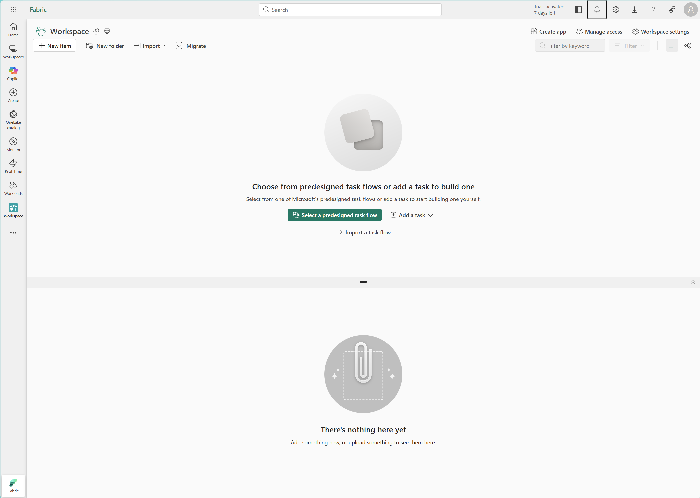
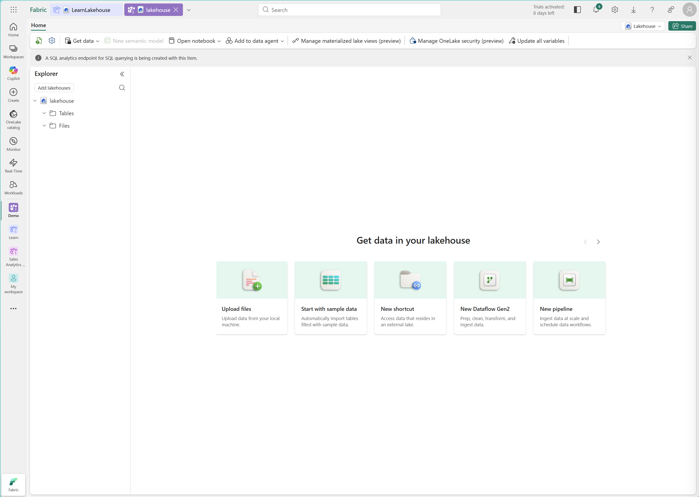
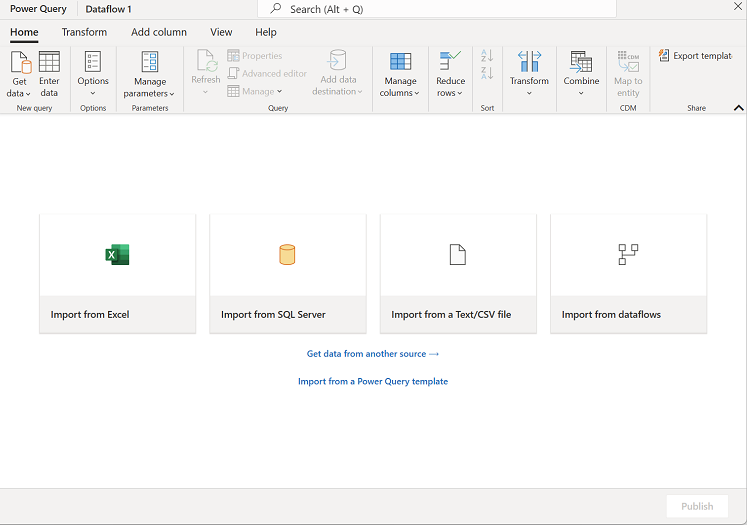
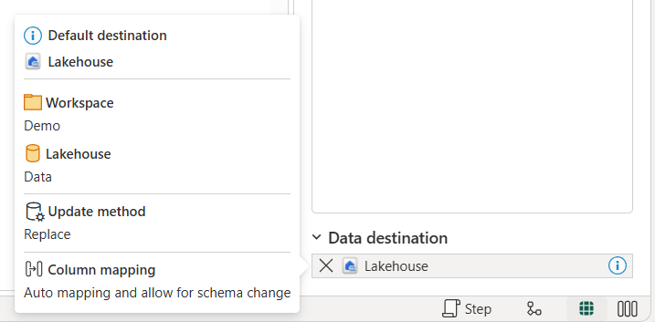
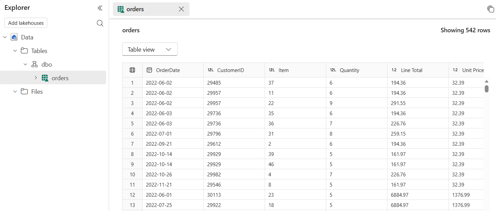

---
lab:
  title: Microsoft Fabric でデータフローを使用してデータを変換する
  module: Transform data using dataflows in Microsoft Fabric
  description: このラボでは、Dataflow Gen2 を作成してサンプル売上データに接続し、Power Query の変換を適用してデータをクリーンアップおよび整形し、結果をレイクハウス テーブルに読み込みます。 行のフィルター処理、列の削除、データ型の変更、列の名前変更、計算列の作成など、一般的なデータ準備タスクを練習します。
  duration: 30 minutes
  level: 300
  islab: true
  primarytopics:
    - Microsoft Fabric
  categories:
    - Data engineering
  courses:
    - DP-600
---

# Microsoft Fabric でデータフローを使用してデータを変換する

Microsoft Fabric のデータフローでは、分析データの準備用にロー コードで Power Query ベースの変換エクスペリエンスが提供されています。 Excel または Power BI Desktop から Power Query を使うのに慣れたメンバーがチームにいる場合、データフローを使うと、Spark または T-SQL のコードを記述することなく、それらのスキルをエンタープライズ規模のデータ準備に適用できます。

この演習では、Dataflow Gen2 を作成してサンプル売上データに接続し、Power Query の一連の変換を適用してデータをクリーンアップおよび整形し、結果をレイクハウス テーブルに読み込みます。 適用する変換は、行のフィルター処理、不要な列の削除、データ型の変更、列の名前変更、計算列の作成など、一般的なデータ準備タスクを表します。 これらは、ダウンストリームのレポートと AI のエクスペリエンス用に分析対応のテーブルを生成する手順です。

このラボの所要時間は約 **30** 分です。

> **ヒント:** 関連するトレーニング コンテンツについては、「[Microsoft Fabric のデータフローを使用した変換](https://learn.microsoft.com/training/modules/fabric-transform-data-dataflows/)」を参照してください。

## 環境を設定する

> **注**: この演習を完了するには、Fabric の有料または試用版の容量にアクセスする必要があります。 無料の Fabric 試用版の詳細については、[Fabric 試用版](https://aka.ms/fabrictrial)に関するページを参照してください。

### ワークスペースの作成

このタスクでは、Fabric 対応のワークスペースを作成して、この演習用のリソースを整理します。

1. ブラウザーの `https://app.fabric.microsoft.com/home?experience=fabric` で [Microsoft Fabric ホーム ページ](https://app.fabric.microsoft.com/home?experience=fabric)に移動し、Fabric 資格情報でサインインします。
1. 左側のメニュー バーで、 **[ワークスペース]** を選択します (アイコンは &#128455; に似ています)。
1. 任意の名前で新しいワークスペースを作成し、Fabric 容量を含むライセンス モード ("試用版"、*Premium*、または *Fabric*) を選択します。**
1. 開いた新しいワークスペースは空のはずです。

    

### レイクハウスを作成する

このタスクでは、変換されたデータフローの出力の格納先として機能するレイクハウスを作成します。

1. 左側のメニュー バーで、**[作成]** を選択します。 *[新規]* ページの [*[Data Engineering]* セクションで、**[レイクハウス]** を選択します。 任意の一意の名前を設定します。

    >**注**: **[作成]** オプションがサイド バーにピン留めされていない場合は、最初に省略記号 (**...**) オプションを選択する必要があります。

    1 分ほどすると、新しい空のレイクハウスが作成されます。

    

## Dataflow Gen2 を作成する

データフローでは、スケジュールに基づいて更新を行って複数のダウンストリーム コンシューマーにサービスを提供できる、再利用可能なノー コードの変換レイヤーが提供され、データ準備ロジックを一元化する必要があるチームに最適です。 このセクションでは、レイクハウスから Dataflow Gen2 を作成し、販売注文を含むサンプルの CSV データ ソースに接続します。

1. レイクハウスのホーム ページで、**[データの取得]** > **[新しいデータフロー Gen2]** の順に選択します。 数秒後、新しいデータフローのための Power Query エディターが開きます。

    

1. **[Text ファイルまたは CSV ファイルからイポート]** を選択し、次の設定を使用して新しいデータ ソースを作成します。
    - **ファイルへのリンク**: 選択**
    - **ファイル パスまたは URL**: `https://raw.githubusercontent.com/MicrosoftLearning/dp-data/main/orders.csv`
    - **接続**: 新しい接続の作成
    - **接続名**: そのままにします
    - **データ ゲートウェイ**: (なし)
    - **認証の種類**: 匿名

1. **[次へ]** を選んでファイルのデータをプレビューしてから、**[作成]** を選んでデータ ソースを作成します。 Power Query エディターで、データ ソースと、データの形式を設定するためのクエリ手順の初期セットが示されます。

    

これで、レイクハウスに読み込む前のデータをデータフローで変換できるようになります。

## Power Query の変換を適用する

これらの変換は、生のソース データを分析対応テーブルに変換するためにデータ プロフェッショナルが実行する、最も一般的なデータの品質と準備のタスクを表します。 このセクションでは、列の選択、フィルター処理、データ型の変更、名前の変更、計算列を注文データに対して適用します。

最初の 3 つのタスクでは "クエリ フォールディング" がサポートされおり、Power Query はより効率的な実行のために操作をデータ ソースに戻します。** これらの手順を最初に配置すると、フォールドできる作業が最大になります。 名前の変更やカスタム列など、その後の手順は、通常、フォールドの境界に従わず、Power Query エンジンのローカル環境で実行されます。

   > **ヒント**: 右側の **[クエリの設定]** ペインの **[適用したステップ]** に、各変換が 1 つのステップとして表示されることに注意してください。 任意のステップを選んで、変換プロセスのその時点でのデータを確認できます。

### 列の選択

余分な列を削除するとソースから取得されるデータが減り、これはクエリ フォールディングの最も効果的な手順の 1 つです。 このタスクでは、分析に必要な列のみを残します。

1. リボンの **[ホーム]** タブを選びます。 **[列の選択]** を選びます。

    > **ヒント**: リボンを展開すると、大きなアイコンが表示されます。
    > 

1. ダウンストリームの分析に必要のない列の選択を解除します。 次の列が選択された状態のまま、**[OK]** を選びます。
    - `OrderDate`
    - `CustomerID`
    - `LineItem`
    - `OrderQty`
    - `LineItemTotal`

### 行のフィルター選択

他の変換の前に行をフィルター処理すると、後続のステップで処理されるデータの量が減り、ほとんどのデータ ソースにうまくフォールドされます。 このタスクでは、日付がない行と、数量がゼロまたは負の行を削除します。

1. `OrderDate` 列ヘッダーを選びます。 ドロップダウン矢印を選んでから、**[空の削除]** を選びます。

1. `OrderQty` 列ヘッダーを選びます。 ドロップダウン矢印を選び、**[数値フィルター]** を選んでから、**[次の値より大きい]** を選びます。 値として「`0`」を入力し、**[OK]** を選びます。

### データ型を設定する

正しいデータ型は計算、並べ替え、フィルター処理に不可欠であり、Copilot や他の AI 機能でデータを正しく解釈できるようになります。 データ型の変更も多くのソースにフォールドされるため、名前の変更とテキスト操作の前に適用すると、フォールド チェーンがそのまま維持されます。 このタスクでは、3 つの列のデータ型を確認します。

1. リボンの **[変換]** タブを選びます。次の列を選び、データ型が正しく設定されていることを確認します。

    - `OrderDate` = **日付**
    - `OrderQty` = **整数**
    - `LineItemTotal` = **10 進数**

    ![[データ型] フィールドのスクリーンショット。](./Images/dataflows-data-types.png)

### 列名の変更

通常、列の名前を変更するとクエリ フォールディングが損なわれるため、上記のフォールド可能な手順の後に行います。 ビジネスに適した明確な列名にすると、レポート作成者がデータを理解しやすくなり、わかりやすい名前に依存する Copilot などの AI ツールの使いやすさが向上します。 このタスクでは、3 つの列の名前をよりわかりやすい名前に変更します。

1. `OrderQty` 列ヘッダーを選びます。 ヘッダーをダブルクリックして、名前を `Quantity` に変更します。

1. `LineItemTotal` の名前を `Line Total` に変更します。

1. `LineItem` の名前を `Item` に変更します。

    > **ヒント**: 列の名前は、列ヘッダーを右クリックして **[名前の変更]** を選んで変更することもできます。

### 計算列を追加する

行の合計から単価を導き出すと、レポートのたびに計算し直さなくても、価格比較、割引分析、コスト内訳に使用できる列が、レポート作成者に提供されます。 このタスクでは、`Line Total` を `Quantity` で除算して、`Unit Price` 列を作成します。

1. **[列の追加]** タブで **[カスタム列]** を選びます。

1. **[カスタム列]** ダイアログで、次の値を設定します。
    - **新しい列名**: `Unit Price`
    - **データ型**: **10 進数**
    - **カスタム列の式**: `[Line Total] / [Quantity]`

1. **[OK]** を選択します。 新しい `Unit Price` 列が、計算された値と共にデータ プレビューに表示されることを確認します。

### 適用されたステップと構成を確認する

適用されたステップの一覧を理解すると、変換の問題のデバッグ、操作のシーケンスの最適化、チーム メンバーのためのデータ準備ロジックの文書化に役立ちます。 このタスクでは、**[クエリの設定]** ペインの **[適用したステップ]** の一覧を確認し、すべての変換が完全で正しい順序になっていることを確認します。

1. **[クエリの設定]** ペインで、**[適用したステップ]** の一覧を確認します。 列の選択、フィルター処理、データ型の変更、名前の変更、カスタム列に関するステップが表示されているはずです。

1. さまざまなステップを選び、変換プロセスの各段階でデータの表現がどのようになるかを確認します。

1. 一部のステップでは、[設定] 歯車アイコンの近くに追加のアイコンが表示されていることに注意してください。 このアイコンは、そのステップをデータ ソース内で評価できるかどうか、つまりそのステップが "クエリ フォールディング" をサポートするかどうかを示します。** このラボでは、クエリ フォールディングをサポートしていない CSV ファイルを使います。 ただし、このアイコンを理解しておくことは、ステップの順序を変更してパフォーマンスを向上させられるかどうかを知るために重要です。

    

1. **[データ同期先]** が既に [レイクハウス] に設定されていることに注意してください。** レイクハウスをポイントし、それが自分で作成したレイクハウスに既定でなっていることを確認します。 それが既定のデータ格納先に設定されているのは、そのレイクハウスからデータフローを直接作成したためです。 データフローを個別に作成した場合は、エクスペリエンスが異なります。

    

### 結果を発行して検証する

発行では、データフローをスケジュールされた更新やチーム コラボレーションで使用できるようにし、検証では、ダウンストリーム システムでデータに依存する処理が行われる前に、変換によって期待される出力が生成されたことを確認します。 このタスクでは、データフローを保存して実行した後、予想される列と計算値を含むテーブルがレイクハウスに正しく読み込まれたことを確認します。

1. ツール バー のリボンで、**[ホーム]** タブを選びます。**[保存して実行]** を選び、データフローが保存されて更新されるまで待ちます。

    > **注意**: 保存すると、データフローの発行と検証が自動的に行われます。 最初の更新は保存後に実行されます。

1. データフローの更新が完了するまで待ちます。 これには数分かかることがあります。 完了したら、ワークスペースに戻ります。

    > **注意**: リボンの [ホーム] タブから **[最近の実行]** を調べて、データフローが成功したことを確認できます。

1. レイクハウスに戻ります。

1. **[エクスプローラー]** ペインで **[テーブル]** を展開し、`orders` テーブルを選んで読み込まれたデータを確認します。

    > **ヒント**: テーブルが表示されない場合は、**テーブル** フォルダーの **[...]** メニューで **[最新の情報に更新]** を選びます。

1. 選んだ列と `Unit Price` 計算列のみがデータに含まれることを確認します。

1. `Unit Price` 列の小数点以下の桁数が一貫していないことに注意してください。 小数点以下が 2 桁の値もあれば、それより多い値もあります。 これを修正するため、ワークスペースでデータフローを選んでそれに戻ります。

1. `Unit Price` 列ヘッダーを選びます。 **[変換]** タブで **[丸め]** を選んでから、**[四捨五入...]** を選びます。小数点以下の桁数に「`2`」と入力して、**[OK]** を選びます。

1. **[保存して実行]** を選び、更新されたデータフローを発行します。 更新が完了するまで待ってから、レイクハウスに戻り、`Unit Price` 列が一貫して小数点以下 2 桁の書式で表示されていることを確認します。

## Copilot を使ってみる (省略可能)

Copilot は自然言語の指示を Power Query のステップに変換します。これにより、開発の時間が短縮され、Power Query の構文に慣れていないチーム メンバーでもデータフローに近づきやすくなります。 このセクションでは、Data Factory の Copilot が、行のフィルター処理や計算列の追加などの一般的な変換にどのように役立つのかを調べます。

| タスク | 代わりに Copilot を使用する方法 |
|------|---------------------|
| null 値で行をフィルター処理する | Copilot を使用して、「`OrderDate` が空の行を削除します」と入力します** |
| 計算列を追加する | Copilot を使用して、「`Line Total` を `Quantity` で除算する `Unit Price` という名前の列を追加します」と入力します** |

> **注意:** 最初に手作業で手順を完了してよく理解してから、Copilot を試し、一般的なタスクに要する時間がどれくらい短縮されるか確認してください。 Data Factory の Copilot は Fabric 容量を必要とし、サポートされている Azure リージョンで利用できます。

## リソースをクリーンアップする

この演習では、Dataflow Gen2 を作成してサンプル データに接続し、Power Query の変換を適用してデータのクリーンアップと整形を行い、結果をレイクハウス テーブルに読み込みました。

Microsoft Fabric でのデータフローの調査が完了したら、この演習用に作成したワークスペースを削除できます。

1. ブラウザーで Microsoft Fabric に移動します。
1. 左側のバーで、ワークスペースのアイコンを選択して、それに含まれるすべての項目を表示します。
1. **[ワークスペースの設定]** を選択し、**[全般]** セクションで下にスクロールし、**[このワークスペースを削除する]** を選択します。
1. **[削除]** を選択して、ワークスペースを削除します。
