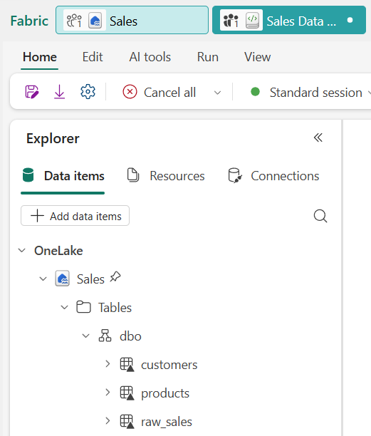
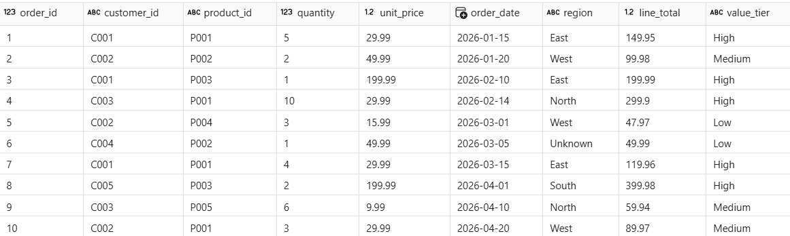
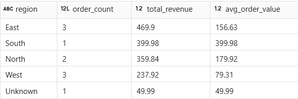

---
lab:
  title: Microsoft Fabric でノートブックを使用してデータを変換する
  module: Transform data using notebooks in Microsoft Fabric
  description: このラボでは、生の売上データを Fabric ノートブック内でクリーニングし、複数のテーブルを結合し、集計とウィンドウ関数を適用して、結果をレイクハウス内の Delta テーブルに書き込みます。
  duration: 30 minutes
  level: 200
  islab: true
  primarytopics:
    - Microsoft Fabric
  categories:
    - Data engineering
  courses:
    - DP-600
---

# Microsoft Fabric でノートブックを使用してデータを変換する

Microsoft Fabric の中のノートブックは対話型のコードベースの環境であり、Apache Spark を使用してレイクハウス データの変換を大規模に行うのに使用されます。 個々のセルの中でコードを書いて実行すると、結果がすぐにわかるので、反復しながら段階的に改善していくことができます。 SQL を使用している分析エンジニア向けに Spark SQL が用意されており、使い慣れた構文で大規模なデータセットを扱えるように拡張されています。また、`%%sql` マジック コマンドを使用して SQL をノートブック セルの中で直接実行できます。

この演習では、ある小売分析組織の売上、顧客、製品のデータを扱います。 生データには品質の問題があり、たとえば重複する行、null 値、一貫性のない書式設定が見られます。 あなたはデータをクリーニングして整形し、複数のテーブルを結合し、集計とウィンドウ関数を計算し、結果をレイクハウス内の Delta テーブルに書き込みます。 これらの変換パターンは、モジュールの概念ユニットで見てきたものと同じです。

この演習の所要時間は約 **30** 分です。

> **ヒント:** 関連するトレーニング コンテンツについては、「[Microsoft Fabric のノートブックを使用したデータの変換](https://learn.microsoft.com/training/modules/fabric-transform-data-notebooks/)」を参照してください。

## 環境を設定する

> **注**: この演習を完了するには、Fabric の有料または試用版の容量にアクセスする必要があります。 無料の Fabric 試用版の詳細については、[Fabric 試用版](https://aka.ms/fabrictrial)に関するページを参照してください。

### ワークスペースの作成

このタスクでは、容量ライセンスと新しいレイクハウスを使用して Fabric ワークスペースを作成します。

1. ブラウザーの `https://app.fabric.microsoft.com/home?experience=fabric` で [Microsoft Fabric ホーム ページ](https://app.fabric.microsoft.com/home?experience=fabric)に移動し、Fabric 資格情報でサインインします。

1. 左側のメニュー バーで、 **[ワークスペース]** を選択します (アイコンは &#128455; に似ています)。

1. 任意の名前で新しいワークスペースを作成し、Fabric 容量を含むライセンス モード ("試用版"、*Premium*、または *Fabric*) を選択します。**

1. 開いた新しいワークスペースは空のはずです。

    

1. ワークスペースの画面で **[+ 新しい項目]** を選択し、次に **[レイクハウス]** を選択します。

1. レイクハウスの名前を入力して (たとえば `Sales`)、**[作成]** を選択します。

1. 作成されたレイクハウスが開きます。 それを閉じて、次のタスクのためにワークスペースの画面に戻ります。

### サンプル データを作成する

このタスクでは、事前構築済みのノートブックをダウンロードして自分のワークスペースにアップロードし、レイクハウスにアタッチし、最初のセルを実行してサンプル データを生成します。

1. [Sales Data Transformation.ipynb](https://github.com/MicrosoftLearning/mslearn-fabric/raw/main/Allfiles/Labs/26c/Sales%20Data%20Transformation.ipynb) というノートブックを `https://github.com/MicrosoftLearning/mslearn-fabric/raw/main/Allfiles/Labs/26c/Sales%20Data%20Transformation.ipynb` からダウンロードしてローカルに保存します。

1. ワークスペースの画面に戻って **[インポート]** > **[ノートブック]** を選択し、**[アップロード]** を選択します。 **Sales Data Transformation.ipynb** ファイルを選択します。

1. ワークスペース項目の一覧で、**Sales Data Transformation** ノートブックを選択して開きます。

1. 左側の **[エクスプローラー]** ペインで、データソースを追加するために **[追加]** を選択し、自分のレイクハウス (たとえば **Sales**) を選択します。 これでノートブックがレイクハウスにアタッチされた状態になり、作成したテーブルが **[エクスプローラー]** ペインからアクセス可能になりました。

1. ノートブックの画面で、**Shift + Enter** キーを押して最初のコード セルを実行します。 このコードによって 3 つの Delta テーブルがレイクハウスの中に作成されます。

    > `raw_sales` の中には 11 行があり、これには重複する行 (order_id 10 が 2 回出現します) と `region` 列の null 値が含まれていることに注目してください。 これらの品質の問題は意図的なものであり、実際のソース データでの一般的な問題を表しています。

1. **[エクスプローラー]** ペインで、**[テーブル]** の横にある **[&#8635; 更新]** を選択して `raw_sales`、`customers`、`products` が表示されることを確認します。

## 売上データを整形してクリーニングする

実務では、受け取ったデータがクリーンであることはほとんどありません。 このセクションでは、重複を除去し、null 値を処理し、計算列を追加します。また、価値を基準として各注文を分類するための条件列を作成します。

1. ノートブックの画面で、**[Shape and clean the sales data]** セクションまでスクロールします。 4 種類の変換について記述されている Markdown セルを確認してから、その下のコード セルを実行します。

    このクエリでは、4 種類の変換が単一のパスで適用されます。具体的には `SELECT DISTINCT` で重複する行を削除し、`COALESCE` で null のリージョンを埋め、計算列で明細行合計を計算し、`CASE` という式で各オーダーを価値レベル別に分類します。

1. 次のコード セルを実行して結果を確認します。

結果には 10 行が表示されます (重複はなくなりました)。 order_id 6 の行では、リージョンが `Unknown` と表示されます。 どの行にも `line_total` と `value_tier` の値があります。

> ノートブック内の **Try it with Copilot** のプロンプトに従って `clean_sales` を拡張する列を追加します (省略可能)。

## データを結合して集計する

クレンジングされたデータは、他のテーブルからのコンテキストでエンリッチするとさらに有益になります。 このセクションでは、売上データに顧客および製品の参照テーブルを結合してから、集計を使用してリージョン別収益サマリーを作成します。

1. ノートブックの画面で **[Join and aggregate the data]** セクションまでスクロールし、最初のコード セルを実行して 3 つのテーブルを結合します。

    `INNER JOIN` で、売上の各行に一致する顧客および製品の詳細が結びつけられます。 どちらのテーブルにも一致するものがない行は除外されます。

1. 次のコード セルを実行して、集計を使用してリージョン別サマリーを作成します。

出力にはリージョンごとに 1 行が表示され、注文数、総収益、平均注文額が含まれます。 これで 10 行の詳細行が集約されてサマリー行となります (リージョンごとに 1 行)。

> ノートブック内の **Try it with Copilot** プロンプトに従って、製品カテゴリ別の集計を追加で作成します (省略可能)。

## ウィンドウ関数を適用する

ウィンドウ関数を使用すると、関連する複数の行にまたがって値を計算し、しかもこれらの行を集約せずに詳細を保持することができます。 このセクションでは、`SUM() OVER` と `ROW_NUMBER() OVER` を使用して各顧客の累計と注文シーケンス番号を追加します。

1. ノートブックの画面で、**[Apply window functions]** セクションまでスクロールしてコード セルを実行します。

    前のセクションでの集計とは異なり、ウィンドウ関数の実行後は元の行がすべて保持されます。 `PARTITION BY` 句で行が顧客ごとにグループ化され、`ORDER BY` 句でシーケンスが決定し、各行に累計の `running_total` と連番である `order_sequence` 番号が付加されます。

複数の注文を持つ顧客 (たとえば Contoso Ltd) では、累計と連番の注文番号が大きくなっていきます。 全体の行数は入力と同じです。

> ノートブック内の **Try it with Copilot** プロンプトに従って `RANK` ウィンドウ関数をデータに適用します (省略可能)。

## 結果を Delta テーブルに書き込む

結果を Delta テーブルとして永続化すると、そのデータをレポート、他のノートブック、ダウンストリーム パイプラインで使用できるようになります。 このセクションでは、エンリッチ後の売上ビューをレイクハウス内のマネージド Delta テーブルに書き込みます。

1. ノートブックの画面で、**[Write results to a Delta table]** セクションまでスクロールして最初のコード セルを実行します。

    `CREATE OR REPLACE TABLE` ステートメントで、エンリッチされたビューが永続的な Delta テーブルとして書き出されます。 `OR REPLACE` オプションを指定すると、テーブルが存在する場合に上書きされます。これは、開発中にノートブックを再実行するときに便利です。

1. **[エクスプローラー]** ペインの **[テーブル]** の横にある **[&#8635; 更新]** を選択して `gold_sales` がテーブルの一覧に表示されることを確認します。

1. 次のコード セルを実行してデータがクエリ可能であることを確認します。

結果には、収益が製品カテゴリとリージョン別に表示されるため、結合されてエンリッチされたデータが正しく書き込まれたことをこれで確認できます。

> ノートブック内の **Try it with Copilot** プロンプトに従って Delta テーブルに対するクエリを実行して高価値の注文を見つけます (省略可能)。

## リソースをクリーンアップする

この演習では、ノートブックを作成してサンプル データを生成し、生の売上トランザクションをクリーニングして整形し、複数のテーブルを結合し、集計とウィンドウ関数を適用し、結果を Microsoft Fabric レイクハウス内の Delta テーブルに書き込みました。

探索が終了したら、この演習用に作成したワークスペースを削除してもかまいません。

1. 左側のバーで、ワークスペースのアイコンを選択して、それに含まれるすべての項目を表示します。

1. ツール バーの **[ワークスペース設定]** を選択します。

1. **[全般]** セクションで、**[このワークスペースの削除]** を選択します。
