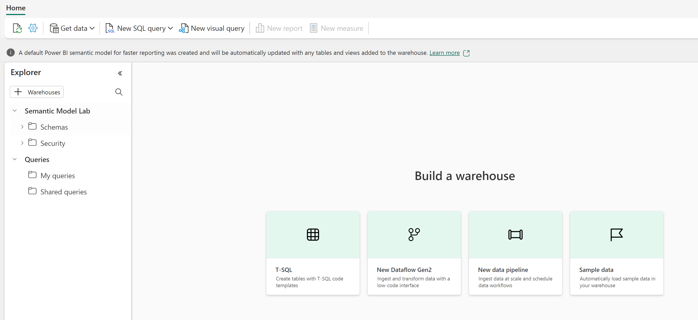

---
lab:
  title: T-SQL を使用して Fabric データ ウェアハウス内のデータを変換する
  module: Transform data using T-SQL in Microsoft Fabric
  description: Fabric データ ウェアハウス内のステージング データのフィルター処理、結合、集計を行う T-SQL クエリを記述します。 再利用可能なロジックのためのビューとストアド プロシージャを作成し、分析用のディメンション テーブルを構築します。
  duration: 45 minutes
  level: 200
  islab: true
  primarytopics:
    - Microsoft Fabric
    - T-SQL
    - Data warehouse
  categories:
    - Data warehouse
  courses:
    - DP-600
---

# T-SQL を使用して Fabric ウェアハウス内のデータを変換する

Microsoft Fabric ウェアハウスは、データを変換するための T-SQL の完全な読み取り/書き込み機能を備えています。 レイクハウスでの (読み取り専用の) SQL 分析エンドポイントとは異なり、ウェアハウスでは `INSERT`、`UPDATE`、`DELETE`、`CREATE TABLE AS SELECT` (CTAS) ステートメントがサポートされています。 このため、ウェアハウスは結果を保持する必要がある変換ロジックを構築するのに適した場所です。

この演習では、Fabric ウェアハウス内の売上、顧客、製品のステージング データを操作します。 データのフィルター処理、結合、集計を行う T-SQL クエリを記述します。 再利用可能な変換ロジックのためのビューを作成し、反復可能な処理用のパラメーターを使ってストアド プロシージャを構築し、ディメンション テーブルを作成して読み込みます。 これらのタスクにより、このモジュールで説明するクエリ、ビュー、ストアド プロシージャ、ディメンション モデリングの手法が強化されます。

この演習の所要時間は約 **45** 分です。

> **ヒント:** 関連するトレーニング コンテンツについては、「[Microsoft Fabric の T-SQL を使用したデータを変換する](https://learn.microsoft.com/training/modules/fabric-transform-data-tsql/)」を参照してください。

> **注意**: この演習には、Copilot の機能を調べるためのオプションのプロンプトが含まれています。

## 環境を設定する

> **注**: この演習を完了するには、Fabric の有料または試用版の容量にアクセスする必要があります。 無料の Fabric 試用版の詳細については、[Fabric 試用版](https://aka.ms/fabrictrial)に関するページを参照してください。

### ワークスペースの作成

このタスクでは、演習用の Fabric ワークスペースを作成します。

1. ブラウザーの `https://app.fabric.microsoft.com/home?experience=fabric` で [Microsoft Fabric ホーム ページ](https://app.fabric.microsoft.com/home?experience=fabric)に移動し、Fabric 資格情報でサインインします。
2. 左側のメニュー バーで、 **[ワークスペース]** を選択します (アイコンは &#128455; に似ています)。
3. 任意の名前で新しいワークスペースを作成し、Fabric 容量を含むライセンス モード ("試用版"、*Premium*、または *Fabric*) を選択します。**
4. 開いた新しいワークスペースは空のはずです。

    

### ウェアハウスの作成

このタスクでは、データを格納および変換するためのウェアハウスを作成します。

1. 左側のメニュー バーで、**[作成]** を選択します。 **[新規]** ページの **[データ ウェアハウス]** セクションで、**[ウェアハウス]** を選択します。 それに任意の名前を付けます。

    > **注意**: **[作成]** オプションがサイド バーにピン留めされていない場合は、最初に省略記号 (**[...]**) オプションを選びます。

    1 分ほどすると、新しいウェアハウスが作成されます。

    

### ステージング テーブルを作成してサンプル データを読み込む

このタスクでは、スキーマとステージング テーブルを作成した後、生の販売トランザクション、顧客、製品をシミュレートするサンプル データを挿入します。

1. ウェアハウスで、ツール バーから **[新しい SQL クエリ]** を選び、次の T-SQL を実行してスキーマとステージング テーブルを作成します。

    > **注意**: ラボ VM 内にいてコードの入力に問題がある場合は、[26d-snippets.txt](https://github.com/MicrosoftLearning/mslearn-fabric/raw/main/Allfiles/Labs/26d/26d-snippets.txt) ファイルを `https://github.com/MicrosoftLearning/mslearn-fabric/raw/main/Allfiles/Labs/26d/26d-snippets.txt` からダウンロードして VM に保存できます。 このファイルには、このラボで使われるすべての T-SQL コードが含まれます。

    ```sql
    -- Create schemas for organizing objects
    CREATE SCHEMA staging;
    GO
    CREATE SCHEMA dim;
    GO
    CREATE SCHEMA fact;
    GO
    CREATE SCHEMA gold;
    GO

    -- Staging: Customers
    CREATE TABLE staging.customers (
        customer_id VARCHAR(20) NOT NULL,
        customer_name VARCHAR(100),
        segment VARCHAR(50),
        region VARCHAR(50)
    );

    INSERT INTO staging.customers VALUES
    ('C001', 'Contoso Ltd', 'Enterprise', 'East'),
    ('C002', 'Fabrikam Inc', 'SMB', 'West'),
    ('C003', 'Northwind Traders', 'Enterprise', 'North'),
    ('C004', 'Adventure Works', 'SMB', 'South'),
    ('C005', 'Woodgrove Bank', 'Enterprise', 'West');

    -- Staging: Products
    CREATE TABLE staging.products (
        product_id VARCHAR(20) NOT NULL,
        product_name VARCHAR(100),
        category VARCHAR(50),
        unit_price DECIMAL(10,2)
    );

    INSERT INTO staging.products VALUES
    ('P001', 'Widget Alpha', 'Widgets', 15.00),
    ('P002', 'Widget Beta', 'Widgets', 22.50),
    ('P003', 'Gadget Gamma', 'Gadgets', 45.00),
    ('P004', 'Gadget Delta', 'Gadgets', 60.00),
    ('P005', 'Component Epsilon', 'Components', 9.99);

    -- Staging: Orders
    CREATE TABLE staging.orders (
        order_id INT NOT NULL,
        customer_id VARCHAR(20),
        product_id VARCHAR(20),
        order_date DATE,
        quantity INT,
        unit_price DECIMAL(10,2),
        discount DECIMAL(10,2),
        status VARCHAR(20)
    );

    INSERT INTO staging.orders VALUES
    (1, 'C001', 'P001', '2026-01-15', 10, 15.00, NULL, 'Completed'),
    (2, 'C001', 'P003', '2026-01-22', 5, 45.00, 10.00, 'Completed'),
    (3, 'C002', 'P002', '2026-02-10', 20, 22.50, NULL, 'Completed'),
    (4, 'C003', 'P004', '2026-02-18', 3, 60.00, 5.00, 'Completed'),
    (5, 'C002', 'P001', '2026-03-05', 15, 15.00, NULL, 'Completed'),
    (6, 'C004', 'P003', '2026-03-12', 8, 45.00, NULL, 'Pending'),
    (7, 'C001', 'P002', '2026-04-01', 12, 22.50, NULL, 'Completed'),
    (8, 'C003', 'P001', '2026-04-15', 25, 15.00, 2.50, 'Completed'),
    (9, 'C005', 'P004', '2026-05-02', 6, 60.00, NULL, 'Completed'),
    (10, 'C002', 'P005', '2026-05-20', 40, 9.99, NULL, 'Completed'),
    (11, 'C005', 'P002', '2026-06-08', 14, 22.50, 5.00, 'Completed'),
    (12, 'C003', 'P003', '2026-06-15', 2, 45.00, NULL, 'Completed');

    -- Staging: Dates (for the date dimension)
    CREATE TABLE staging.dates (
        calendar_date DATE NOT NULL,
        calendar_year INT,
        calendar_month INT,
        month_name VARCHAR(20),
        calendar_quarter INT
    );

    INSERT INTO staging.dates VALUES
    ('2026-01-15', 2026, 1, 'January', 1),
    ('2026-01-22', 2026, 1, 'January', 1),
    ('2026-02-10', 2026, 2, 'February', 1),
    ('2026-02-18', 2026, 2, 'February', 1),
    ('2026-03-05', 2026, 3, 'March', 1),
    ('2026-03-12', 2026, 3, 'March', 1),
    ('2026-04-01', 2026, 4, 'April', 2),
    ('2026-04-15', 2026, 4, 'April', 2),
    ('2026-05-02', 2026, 5, 'May', 2),
    ('2026-05-20', 2026, 5, 'May', 2),
    ('2026-06-08', 2026, 6, 'June', 2),
    ('2026-06-15', 2026, 6, 'June', 2);
    ```

2. **[エクスプローラー]** ペインの **[最新の情報に更新]** ボタンを使って、テーブルが**ステージング** スキーマの下に表示されることを確認します。

## T-SQL クエリを使用してデータを変換する

クエリは、すべてのデータ変換ワークフローの最初のステップです。 このセクションでは、ステージング データに対してフィルター処理、整形、結合、集計、ウィンドウ関数の適用を行う T-SQL クエリを記述します。

1. **[新しい SQL クエリ]** を選んで新しいクエリ タブを開きます。次のクエリを実行して、完了した注文をフィルター処理し、計算列を追加します。

    ```sql
    -- Filter completed orders and add calculated columns
    SELECT
        order_id,
        customer_id,
        order_date,
        quantity,
        unit_price,
        quantity * unit_price AS line_total,
        ISNULL(discount, 0) AS discount,
        (quantity * unit_price) - ISNULL(discount, 0) AS net_amount,
        CASE
            WHEN quantity * unit_price > 200 THEN 'High'
            WHEN quantity * unit_price > 100 THEN 'Medium'
            ELSE 'Standard'
        END AS order_tier
    FROM staging.orders
    WHERE status = 'Completed';
    ```

    このクエリは、完了した注文をフィルター処理し、`ISNULL` を使って null の割引をゼロに置き換え、行の合計と正味金額を計算し、`CASE` 式を使って各注文を階層に分類します。

2. **[新しい SQL クエリ]** を選んで次のクエリを実行し、注文と顧客を結合して、地域とセグメント別に集計します。

    ```sql
    -- Join orders with customers and aggregate by region and segment
    SELECT
        c.region,
        c.segment,
        COUNT(*) AS order_count,
        SUM(o.quantity * o.unit_price) AS total_sales,
        AVG(o.quantity * o.unit_price) AS avg_order_value
    FROM staging.orders AS o
    INNER JOIN staging.customers AS c
        ON o.customer_id = c.customer_id
    WHERE o.status = 'Completed'
    GROUP BY c.region, c.segment
    ORDER BY total_sales DESC;
    ```

    `INNER JOIN` によって、各注文とその顧客の詳細が結合されます。 `GROUP BY` 句は、集計メジャーを使用して行を地域とセグメントのグループに折りたたみます。

3. **[新しい SQL クエリ]** を選んで次のクエリを実行し、顧客ごとに累計と注文シーケンスを計算するウィンドウ関数を適用します。

    ```sql
    -- Window functions: running totals and order sequences per customer
    SELECT
        o.customer_id,
        c.customer_name,
        o.order_date,
        o.quantity * o.unit_price AS line_total,
        ROW_NUMBER() OVER (
            PARTITION BY o.customer_id ORDER BY o.order_date
        ) AS order_sequence,
        SUM(o.quantity * o.unit_price) OVER (
            PARTITION BY o.customer_id ORDER BY o.order_date
        ) AS running_total,
        LAG(o.quantity * o.unit_price) OVER (
            PARTITION BY o.customer_id ORDER BY o.order_date
        ) AS prev_order_amount
    FROM staging.orders AS o
    INNER JOIN staging.customers AS c
        ON o.customer_id = c.customer_id
    WHERE o.status = 'Completed'
    ORDER BY o.customer_id, o.order_date;
    ```

    `GROUP BY` とは異なり、ウィンドウ関数ではすべての行が結果に保持されます。 `ROW_NUMBER` は各顧客の注文内にシーケンスを割り当て、`SUM ... OVER` は累計を計算し、`LAG` は比較のために前の注文の金額を取得します。

    複数の注文を持つ顧客 (Contoso Ltd など) では、示される累計と注文シーケンス番号が増加しています。 各顧客の最初の注文では、`prev_order_amount` に対して `NULL` が示されます。

4. **[新しい SQL クエリ]** を選んで次の CTE クエリを実行し、月ごとの合計と年初来の累計を計算します。

    ```sql
    -- CTE: monthly totals with year-to-date running total
    WITH monthly_totals AS (
        SELECT
            YEAR(order_date) AS yr,
            MONTH(order_date) AS mo,
            SUM(quantity * unit_price) AS monthly_total
        FROM staging.orders
        WHERE status = 'Completed'
        GROUP BY YEAR(order_date), MONTH(order_date)
    )
    SELECT
        yr,
        mo,
        monthly_total,
        SUM(monthly_total) OVER (ORDER BY yr, mo) AS ytd_total
    FROM monthly_totals
    ORDER BY yr, mo;
    ```

    この CTE は、最初に注文を月ごとの合計に集計し、次に外側のクエリでウィンドウ関数を適用して、年初来の累計を計算します。 CTE は、複雑なクエリを読みやすい名前付きのステップに分割します。

### Copilot を使ってみる (省略可能)

ウェアハウスで Copilot を使用できる場合は、新しい SQL クエリを開き、**[Copilot]** ボタンを選んで、次のようなプロンプトを入力します。

> "売上合計が上位の顧客 3 人を表示するクエリを作成します。表示には地域とセグメントを含めます。"

生成された T-SQL を確認して実行します。 これにより、タスク 1 で調べたデータを変更することなく、新しいクエリ結果が作成されます。

## 再利用可能なロジックのためのビューを作成する

ビューを使うと、複雑なクエリ ロジックをカプセル化できるため、コンシューマーは結合と集計を書き換えることなく再利用できます。 このセクションでは、製品カテゴリ別に月ごとの売上を集計するビューを作成します。

1. **[新しい SQL クエリ]** を選んで次の T-SQL を実行し、毎月の売上の集計ビューを作成します。

    ```sql
    -- Create view: monthly sales summary by product category
    CREATE VIEW gold.vw_monthly_sales
    AS
    SELECT
        d.calendar_year,
        d.calendar_month,
        d.month_name,
        p.category,
        COUNT(*) AS order_count,
        SUM(o.quantity) AS total_quantity,
        SUM(o.quantity * o.unit_price) AS total_sales
    FROM staging.orders AS o
    INNER JOIN staging.dates AS d
        ON o.order_date = d.calendar_date
    INNER JOIN staging.products AS p
        ON o.product_id = p.product_id
    WHERE o.status = 'Completed'
    GROUP BY d.calendar_year, d.calendar_month, d.month_name, p.category;
    ```

    このビューは、注文を日付および製品と結合してから、月と製品カテゴリ別に売上を集計します。 ビューにはデータが格納されないため、結果は常にステージング テーブルの現在の状態を反映します。

1. ビューのクエリを実行して結果を確認します。

    ```sql
    -- Query the monthly sales view
    SELECT *
    FROM gold.vw_monthly_sales
    ORDER BY calendar_year, calendar_month, category;
    ```

    結果では、製品カテゴリ別に分類された月ごとの売上合計が示されます。 **[最新の情報に更新]** を選ぶと、**[エクスプローラー]** ペインの **[スキーマ]** > **[gold]** > **[ビュー]** の下にビューが表示されます。

### Copilot を使ってみる (省略可能)

新しい SQL クエリを開き、**[Copilot]** ボタンを選んで、次のようなプロンプトを入力します。

> "顧客ごとの売上と注文数の合計を表示する (セグメントと地域を含む) gold.vw_customer_summary という名前のビューを作成します"

生成された T-SQL を確認します。 問題がなければ、それを実行して 2 つ目のビューを作成します。 これにより、`gold.vw_monthly_sales` を変更せずに新しいビューが追加されます。

## パラメーターを使用してストアド プロシージャを構築する

ストアド プロシージャはビューより多くの機能を備えており、書き込み操作、パラメーター、複数ステップのロジックをサポートします。 このセクションでは、特定の月の集計テーブルを更新するストアド プロシージャを作成します。

1. **[新しい SQL クエリ]** を選んで次の T-SQL を実行し、プロシージャ用のターゲット テーブルを作成します。

    ```sql
    -- Create target table for the stored procedure
    CREATE TABLE gold.monthly_sales (
        calendar_year INT,
        calendar_month INT,
        month_name VARCHAR(20),
        category VARCHAR(50),
        order_count INT,
        total_quantity INT,
        total_sales DECIMAL(12,2)
    );
    ```

1. **[新しい SQL クエリ]** を選んで次の T-SQL を実行し、ストアド プロシージャを作成します。

    ```sql
    -- Create stored procedure: refresh monthly sales for a given year and month
    CREATE PROCEDURE gold.usp_refresh_monthly_sales
        @year INT,
        @month INT
    AS
    BEGIN
        -- Remove existing data for the target period
        DELETE FROM gold.monthly_sales
        WHERE calendar_year = @year AND calendar_month = @month;

        -- Insert fresh aggregated data
        INSERT INTO gold.monthly_sales
            (calendar_year, calendar_month, month_name, category,
             order_count, total_quantity, total_sales)
        SELECT
            d.calendar_year,
            d.calendar_month,
            d.month_name,
            p.category,
            COUNT(*),
            SUM(o.quantity),
            SUM(o.quantity * o.unit_price)
        FROM staging.orders AS o
        INNER JOIN staging.dates AS d
            ON o.order_date = d.calendar_date
        INNER JOIN staging.products AS p
            ON o.product_id = p.product_id
        WHERE o.status = 'Completed'
            AND d.calendar_year = @year
            AND d.calendar_month = @month
        GROUP BY d.calendar_year, d.calendar_month, d.month_name, p.category;
    END;
    ```

    このプロシージャは、年と月のパラメーターを受け取り、その期間の既存の行を削除して、新しく集計されたデータを挿入します。 この "削除してから挿入" パターンでは、特定の期間が完全に更新されます。

1. 2026 年 1 月についてプロシージャを実行した後、結果のクエリを実行します。

    ```sql
    -- Execute the procedure for January 2026 and view results
    EXEC gold.usp_refresh_monthly_sales @year = 2026, @month = 1;

    SELECT * FROM gold.monthly_sales;
    ```

    `gold.monthly_sales` テーブルには、2026 年 1 月の集計売上データが含まれます。

1. 他の月に対してプロシージャを実行し、テーブルにデータが蓄積されることを確認します。

    ```sql
    -- Execute the procedure for February through April and view accumulated results
    EXEC gold.usp_refresh_monthly_sales @year = 2026, @month = 2;
    EXEC gold.usp_refresh_monthly_sales @year = 2026, @month = 3;
    EXEC gold.usp_refresh_monthly_sales @year = 2026, @month = 4;

    SELECT *
    FROM gold.monthly_sales
    ORDER BY calendar_year, calendar_month, category;
    ```

テーブルには 2026 年 1 月から 4 月までの集計行が含まれるようになり、各月の製品カテゴリごとのデータが示されています。

### Copilot を使ってみる (省略可能)

新しい SQL クエリを開き、**[Copilot]** ボタンを選んで、次のようなプロンプトを入力します。

> "@year パラメーターを受け取り、その年の売上合計が上位の顧客 5 人を返す、gold.usp_top_customers というストアド プロシージャを記述します"

生成された T-SQL を確認します。 これにより、`gold.usp_refresh_monthly_sales` を変更することなく新しいプロシージャが作成されます。

## ディメンション テーブルを作成して読み込む

ディメンション テーブルは、分析とセマンティック モデル用に最適化されたスター スキーマにデータを整理するものです。 このセクションでは、ディメンション テーブルとファクト テーブルを作成し、代理キー参照を使ってステージング データからそれらを読み込みます。

1. **[新しい SQL クエリ]** を選んで次の T-SQL を実行し、日付ディメンションを作成して読み込みます。

    ```sql
    -- Create and load the date dimension
    CREATE TABLE dim.date (
        date_key BIGINT IDENTITY,
        calendar_date DATE NOT NULL,
        calendar_year INT,
        calendar_month INT,
        month_name VARCHAR(20),
        calendar_quarter INT
    );

    INSERT INTO dim.date
        (calendar_date, calendar_year, calendar_month, month_name, calendar_quarter)
    SELECT DISTINCT
        calendar_date, calendar_year, calendar_month, month_name, calendar_quarter
    FROM staging.dates;
    ```

1. 次の T-SQL を実行し、SCD Type 2 列を含む顧客ディメンションを作成して読み込みます。

    ```sql
    -- Create and load the customer dimension (SCD Type 2)
    CREATE TABLE dim.customer (
        customer_key BIGINT IDENTITY,
        customer_id VARCHAR(20) NOT NULL,
        customer_name VARCHAR(100),
        segment VARCHAR(50),
        region VARCHAR(50),
        effective_date DATE,
        end_date DATE,
        is_current BIT
    );

    INSERT INTO dim.customer
        (customer_id, customer_name, segment, region, effective_date, is_current)
    SELECT
        customer_id,
        customer_name,
        segment,
        region,
        CAST(GETDATE() AS DATE),
        1
    FROM staging.customers;
    ```

    `IDENTITY` 列では、各行に対する一意の `BIGINT` 代理キーが自動的に生成されます。 Fabric ウェアハウスの `IDENTITY` 列では `BIGINT` データ型を使う必要があり、カスタム シード値やインクリメント値はサポートされていません。 `effective_date`、`end_date`、`is_current` 列では SCD Type 2 の追跡がサポートされており、変更を上書きするのではなく、レコードの履歴バージョンが保持されます。

1. 次の T-SQL を実行し、製品ディメンションを作成して読み込みます。

    ```sql
    -- Create and load the product dimension
    CREATE TABLE dim.product (
        product_key BIGINT IDENTITY,
        product_id VARCHAR(20) NOT NULL,
        product_name VARCHAR(100),
        category VARCHAR(50),
        unit_price DECIMAL(10,2)
    );

    INSERT INTO dim.product
        (product_id, product_name, category, unit_price)
    SELECT
        product_id, product_name, category, unit_price
    FROM staging.products;
    ```

1. 次の T-SQL を実行してファクト テーブルを作成し、代理キーを検索するためにステージング注文とディメンション テーブルを結合して読み込みます。

    ```sql
    -- Create and load the fact table with surrogate key lookups
    CREATE TABLE fact.sales (
        sales_key BIGINT IDENTITY,
        date_key BIGINT NOT NULL,
        customer_key BIGINT NOT NULL,
        product_key BIGINT NOT NULL,
        quantity INT,
        unit_price DECIMAL(10,2),
        sales_amount DECIMAL(12,2)
    );

    INSERT INTO fact.sales
        (date_key, customer_key, product_key, quantity, unit_price, sales_amount)
    SELECT
        d.date_key,
        c.customer_key,
        p.product_key,
        o.quantity,
        o.unit_price,
        o.quantity * o.unit_price
    FROM staging.orders AS o
    INNER JOIN dim.date AS d
        ON o.order_date = d.calendar_date
    INNER JOIN dim.customer AS c
        ON o.customer_id = c.customer_id
        AND c.is_current = 1
    INNER JOIN dim.product AS p
        ON o.product_id = p.product_id
    WHERE o.status = 'Completed';
    ```

    ファクト テーブルの読み込みでは、自然なビジネス キー (`customer_id` など) がディメンション テーブルからの代理キーに変換されます。 `dim.customer` への結合では、`is_current = 1` でフィルター処理されて、各ファクト行が顧客レコードの現在のバージョンにリンクされます。

1. ディメンションをファクト テーブルに結合してクエリを実行し、データを確認します。

    ```sql
    -- Verify: query fact table joined back to dimensions
    SELECT
        d.calendar_date,
        d.month_name,
        c.customer_name,
        c.segment,
        p.product_name,
        p.category,
        f.quantity,
        f.sales_amount
    FROM fact.sales AS f
    INNER JOIN dim.date AS d ON f.date_key = d.date_key
    INNER JOIN dim.customer AS c ON f.customer_key = c.customer_key
    INNER JOIN dim.product AS p ON f.product_key = p.product_key
    ORDER BY d.calendar_date;
    ```

    結果では、顧客名、セグメント、製品名、ディメンション テーブルから解決されたカテゴリを含む 11 個の完了した注文が示されます。

### Copilot を使ってみる (省略可能)

新しい SQL クエリを開き、**[Copilot]** ボタンを選んで、次のようなプロンプトを入力します。

> "fact.sales テーブルとディメンション テーブルを使って、製品カテゴリと四半期ごとの合計売上金額を表示するクエリを作成します"

生成された T-SQL を確認して実行します。 これにより、どのテーブルも変更することなく、構築したディメンション モデルのクエリが実行されます。

## 最終的な状態を確認する

次のクエリを実行し、このラボの間に作成したすべてのオブジェクトの一覧を表示します。

```sql
-- List all warehouse objects by schema and type
SELECT
    TABLE_SCHEMA AS [schema],
    TABLE_NAME AS [name],
    TABLE_TYPE AS [type]
FROM INFORMATION_SCHEMA.TABLES
WHERE TABLE_SCHEMA IN ('staging', 'dim', 'fact', 'gold')
UNION ALL
SELECT
    ROUTINE_SCHEMA,
    ROUTINE_NAME,
    ROUTINE_TYPE
FROM INFORMATION_SCHEMA.ROUTINES
WHERE ROUTINE_SCHEMA IN ('staging', 'dim', 'fact', 'gold')
ORDER BY [schema], [type], [name];
```

結果には、次の 11 個のオブジェクトが含まれるはずです。

| schema | name | type |
|--------|------|------|
| dim | 顧客 | BASE TABLE |
| dim | 日付 | BASE TABLE |
| dim | product | BASE TABLE |
| ファクト (fact) | 営業 | BASE TABLE |
| gold | monthly_sales | BASE TABLE |
| gold | usp_refresh_monthly_sales | PROCEDURE |
| gold | vw_monthly_sales | VIEW |
| staging | 顧客 | BASE TABLE |
| staging | 日付 | BASE TABLE |
| staging | 注文 | BASE TABLE |
| staging | products | BASE TABLE |

> **注意**: オプションの Copilot プロンプトも実行した場合、`gold.vw_customer_summary` や `gold.usp_top_customers` などの追加のオブジェクトが表示されることがあります。

## リソースをクリーンアップする

この演習では、ステージング データを含むウェアハウスを作成し、クエリを含む T-SQL 変換オブジェクト、ビュー、ストアド プロシージャとパラメーター、スター スキーマ パターンに従うディメンション テーブルを作成しました。

ウェアハウスを調べ終わったら、この演習用に作成したワークスペースを削除してかまいません。

1. 左側のバーで、ワークスペースのアイコンを選択して、それに含まれるすべての項目を表示します。
1. ツール バーの **[ワークスペース設定]** を選択します。
1. **[全般]** セクションで、**[このワークスペースの削除]** を選択します。
