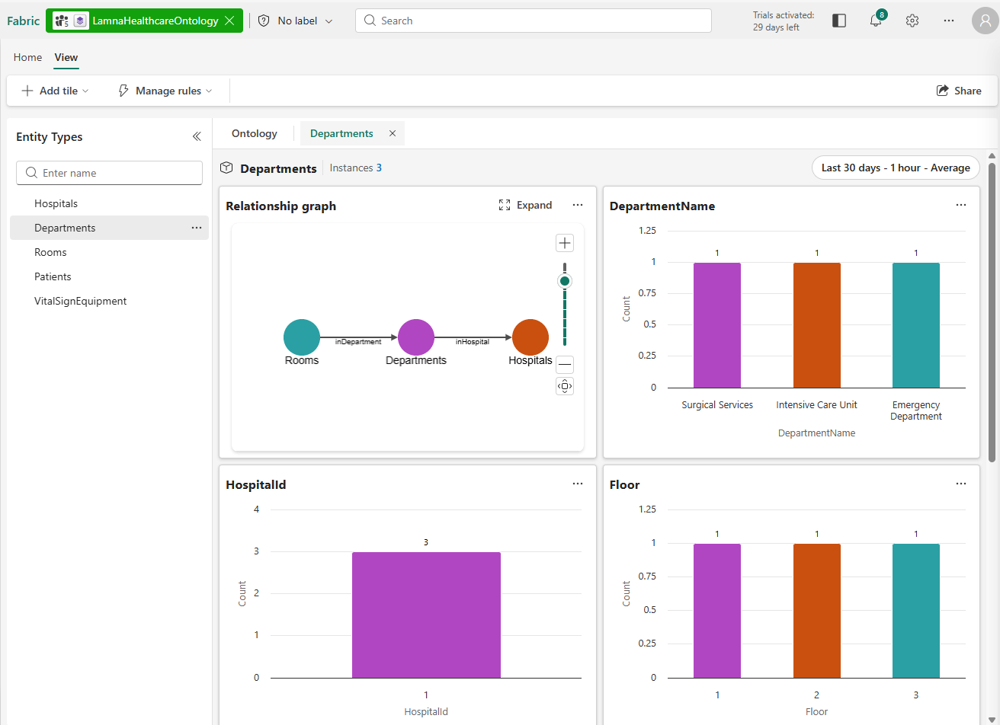
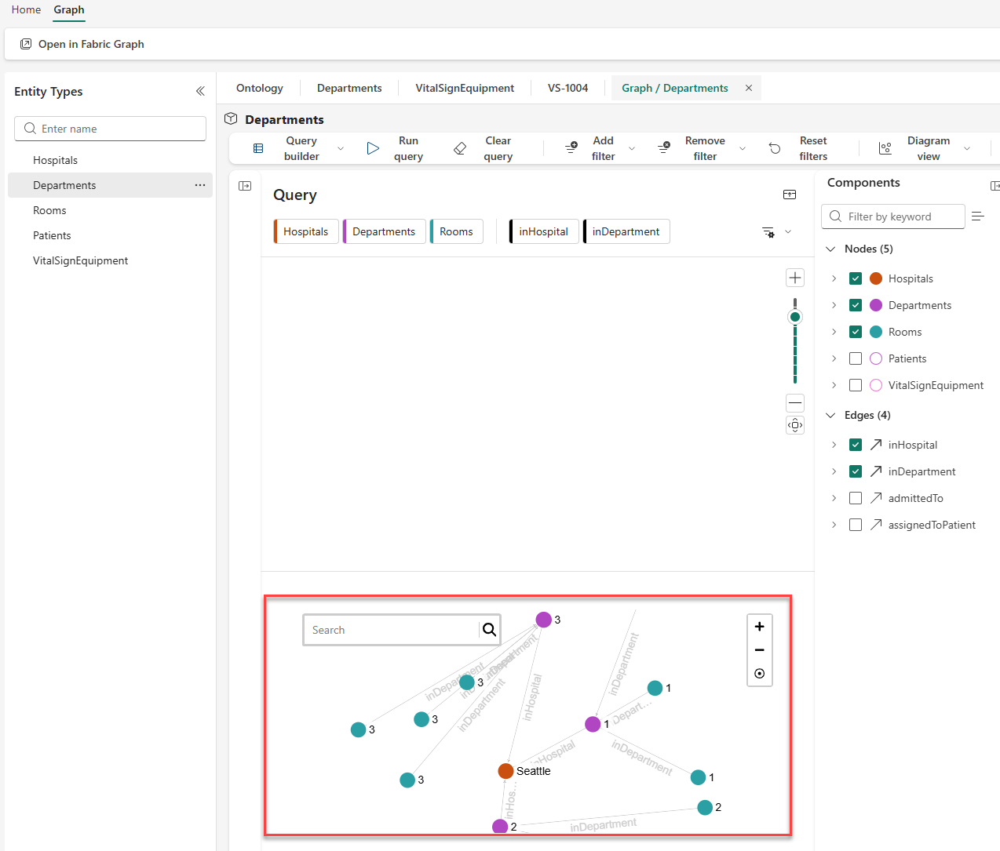
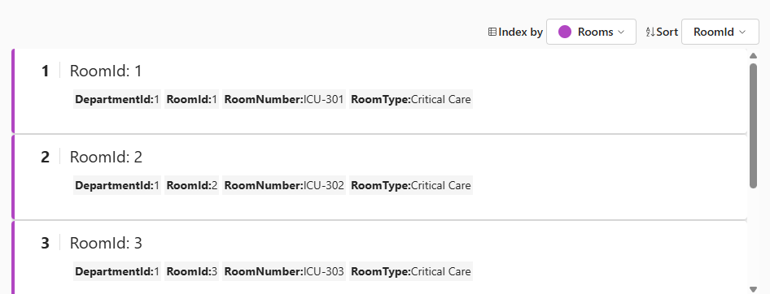

---
lab:
  title: Microsoft Fabric IQ を使用してオントロジ データを視覚化する
  module: Visualize ontology data with Microsoft Fabric IQ
  description: このラボでは、オントロジ プレビュー エクスペリエンスを使用してエンティティ インスタンスとリレーションシップを視覚化します。 Lamna Healthcare オントロジを使用して、対話型のグラフ、チャート、リレーションシップの視覚化を通じてデータをどのように活用できるかを確認します。
  duration: 30 minutes
  level: 100
  islab: true
  primarytopics:
    - Microsoft Fabric
  categories:
    - Fabric IQ
  courses: null
---

# Microsoft Fabric IQ を使用してオントロジ データを視覚化する

このラボでは、Lamna Healthcare という架空の会社のノートブックからオントロジを作成します。 エンティティ インスタンスを視覚化し、対話型グラフを使用してエンティティ リレーションシップを探索し、プロパティ チャートと時系列の視覚化を使用してデータを表示します。

> [!IMPORTANT]
> Microsoft Fabric のオントロジは現在[プレビュー段階](https://learn.microsoft.com/fabric/fundamentals/preview)です。

このラボの所要時間は約 **30** 分です。

> **注**: この演習を完了するには、Fabric の有料版または試用版の容量にアクセスできることが必要です。 無料の Fabric 試用版の詳細については、[Fabric 試用版](https://aka.ms/fabrictrial)に関するページを参照してください。 また、次の[テナント設定](https://learn.microsoft.com/fabric/iq/ontology/overview-tenant-settings)を有効にする必要があります: **オントロジ項目を有効にする (プレビュー)** および**ユーザーは Graph を作成可能 (プレビュー)**。

## ワークスペースの作成

1. ブラウザーで [Microsoft Fabric ホーム ページ](https://app.fabric.microsoft.com/home?experience=fabric)に移動し、Fabric 資格情報でサインインします。
1. 左側のメニュー バーで、 **[ワークスペース]** を選択します (アイコンは &#128455; に似ています)。
1. 任意の名前で新しいワークスペースを作成し、*Fabric*、*Fabric 試用版*、または *Power BI Premium* のいずれかの種類のワークスペースのライセンス モードを選択します。
1. 開いた新しいワークスペースは空のはずです。

## ノートブックからオントロジを作成する

このラボでは、プレビュー エクスペリエンスを使用したオントロジの視覚化 (エンティティ インスタンスの調査、グラフ内のリレーションシップの探索、クエリ ビルダーを使用したデータのフィルター処理) に重点を置いています。 これらの機能を最大限に活用するために、レイクハウス、イベントハウス、エンティティ型、データ バインディング、リレーションシップの設定を含むオントロジ作成プロセスを自動化するノートブックを使用します。

Lamna Healthcare オントロジには、病院、部門、治療室、患者、バイタル サイン機器、バイタル サインの測定値を表すサンプル データが含まれています。

> **注**: オントロジをステップバイステップで構築する方法については、[手動でのオントロジの作成](https://microsoftlearning.github.io/mslearn-fabric/Instructions/Labs/23-build-ontology-manually.html)または[セマンティック モデルからのオントロジの生成](https://microsoftlearning.github.io/mslearn-fabric/Instructions/Labs/24-build-ontology-semantic-model.html)に関する演習を参照してください。

1. [**[setup-ontology.ipynb**](https://github.com/MicrosoftLearning/mslearn-fabric/raw/main/Allfiles/Labs/27-28/setup-ontology.ipynb) を選択してブラウザーでノートブック ファイルを開き、右クリックしてローカ]ル コンピューターに保存します。 ブラウザーで `setup-ontology.ipynb.txt` として保存される場合は、`.txt` 拡張子を削除するようにファイルの名前を変更します。

1. ワークスペースで、リボンから **[インポート]** を選択します。

1. **[インポート]** ダイアログで次の手順を実行します。
   - **[アップロード]** を選択し、ダウンロードした **setup-ontology.ipynb** ファイルを参照します
   - **[開く]** を選択します

1. インポートが完了するまで待ちます。 ワークスペース項目の一覧にノートブックが表示されます。

1. **setup-ontology** ノートブックを選択して開きます。

   ノートブックには、各ステップを説明する詳細な Markdown セルが含まれています。 次のようになります。
   - 5 つの病院データ テーブル (Hospitals、Departments、Rooms、Patients、VitalSignEquipment) を使用して、**LamnaHealthcareLH** という名前のレイクハウスを作成します
   - 時系列のバイタル サイン測定値を含む **LamnaHealthcareEH** という名前のイベントハウスを作成します
   - Fabric REST API を使用して、5 つのエンティティ型、データ バインディング、リレーションシップ型を持つ **LamnaHealthcareOntology** を構築します

1. ノートブックで、**Step 0: Get or Create Infrastructure** の下にある最初の Python コード セルを見つけます。 セルの左側にある **[このセル以下すべてを実行]** を選択します。

   ![ノートブックの [このセル以下すべてを実行] ボタンを示すスクリーンショット](./Images/27-run-notebook-cell.png)

### ノートブックの実行時に想定される内容

ノートブックが実行されたら、セル出力で次の成功指標を確認します。

- **ステップ 0**: "✅ Infrastructure ready!" が レイクハウス ID およびイベントハウス ID とともに表示されます
- **ステップ 1**: "✅ All lakehouse tables written!" が テーブルの数である 5 とともに表示されます
- **ステップ 2**: "✅ Eventhouse step complete!" が確認されます (データが既に存在する場合はインジェストがスキップされる可能性があります)
- **ステップ 3**: "✅ Entity and relationship definitions ready!" が報告されます
- **ステップ 4**: ポーリング後、"✅ SUCCESS" と表示されます (このステップで、REST API を使用してオントロジが作成されます)
- **ステップ 5**: オントロジ名に ✅ が付いた "Ontologies in workspace:" が一覧表示されます

> **トラブルシューティング**: ステップ 4 で "❌ FAILED" と表示された場合、ノートブックにエラーの詳細が表示されます。 一般的な原因としては、アクセス許可が不足しているか、テナント設定が不足しています。 必要なテナント設定が有効になっていることを確認し、ノートブックを再実行してみてください。

1. 実行が完了したら、ワークスペースに次の項目が表示されていることを確認します。
   - **LamnaHealthcareLH** (レイクハウス)
   - **LamnaHealthcareEH** (イベントハウス)
   - **LamnaHealthcareOntology** (オントロジ)
   - **LamnaHealthcareOntology** (グラフ) - オントロジと同じ名前で自動的に作成されます

   > **重要**: ノートブックが完了すると、Fabric でデータ バインディングが処理され、バックグラウンドでグラフ モデルが構築されます。 容量の負荷と複雑さによりますが、**この処理は通常、数分で完了します**。 これは 1 回限りのセットアップ プロセスであり、完了するとオントロジは応答性を維持します。 データの準備ができていることを確認するには、**LamnaHealthcareOntology** 項目を開き、エンティティ型 (例: **Departments**) を選択し、**[エンティティ型の概要]** を選択します。 "オントロジを設定しています" または "オントロジを更新しています" と表示された場合は、ページ上でしばらく待ってください。プレビュー エクスペリエンスの読み込みが完了すると、自動的に更新されます。 エンティティ インスタンスが表示されたら、次のセクションに進むことができます。

   

これでオントロジを探索する準備ができました。

## エンティティ インスタンスを探索する

オントロジが構築され、プレビュー エクスペリエンスが読み込まれたので、エンティティ インスタンス (各エンティティ型を設定する、レイクハウスとイベントハウスの実際のデータ レコード) を探索できます。

### Departments エンティティ インスタンスを表示する

**Departments** エンティティ型の概要は、データが読み込まれているかどうかを確認した際に既に開かれている可能性があります。 移動した場合は、次のようにします。

1. **LamnaHealthcareOntology** オントロジ キャンバスに戻ります
1. **Departments** エンティティ型を選択して強調表示します
1. リボンで、**[エンティティ型の概要]** を選択します

   ![リボンの [エンティティ型の概要] ボタンを示すスクリーンショット](./Images/27-entity-type-overview.png)

エンティティ型の概要が表示されたら、次のようにします。

1. 概要ページには、いくつかのタイルが表示されます。
   - Departments が他のエンティティ型とどのようにつながっているかを示す **[リレーションシップ グラフ]** タイル
   - 部門レコード全体のプロパティ値の分布を視覚化する **[プロパティ チャート] タイル**:
     - **DepartmentName**: データに含まれる 3 つの部門名を示します
     - **HospitalId**: 部門がどの病院に属するかを示します (すべての部門が HospitalId 1 に属しています)
     - **Floor**: 各部門が配置されているフロアの階数を表示します (階数 1、2、3)
   - レイクハウスからの実際の部門レコードが一覧表示された **Entity instances** テーブル (下部)

1. [プロパティ チャート] タイルで、個々のレコードをドリルダウンする前にデータの視覚的な概要がどのように表示されるかを確認します。

1. **Entity instances** テーブルで、*Intensive Care Unit*、*Emergency Department*、*Surgical Services* などの部門レコードが表示されていることを確認します。

1. Entity instances テーブル内の任意の行 (例: *Intensive Care Unit*) を選択します。
1. **インスタンス ビュー**が開き、次の情報が表示されます。
   - 選択した部門インスタンスのすべてのプロパティ値
   - Departments (Rooms、Hospitals) のエンティティ型のつながりを示す**リレーションシップ グラフ**

1. [インスタンス] タブの横にある **[X]** を選択して、Departments エンティティ型の概要に戻ります。

### イベントハウスからの時系列データを探索する

VitalSignEquipment エンティティは、時系列データのためにイベントハウスにバインドされます。 先ほど探索した、比較的静的なレコードを含むレイクハウス エンティティ (Departments、Hospitals) とは異なり、イベントハウスには、特定のタイムスタンプで取得された頻繁に変化する測定値である、継続的にストリーミングされるバイタル サインの測定値が保存されます。

このオントロジの静的データと時系列データがどのようにつながっているかを次に示します。
- **VitalSignEquipment** (静的): レイクハウス内の各機器レコードには、ほとんど変化しない EquipmentId、PatientId、MonitoringStartDate などのプロパティがあります
- **VitalSignsReadings** (時系列): その機器からの測定値 (心拍数、酸素飽和度、呼吸数) は、イベントハウスで一定の間隔をおいて取得され、機器レコードに関連付けられます

この組み合わせにより、機器の詳細とそのリアルタイムの測定値の両方を 1 つの統合ビューで確認できます。 エンティティ型の概要には、時間の経過に伴ってこれらの測定値がどのように変化するかを示す時系列グラフが表示されます。

1. キャンバス上で **VitalSignEquipment** エンティティ型を選択します。
1. リボンで、**[エンティティ型の概要]** を選択します。
1. このエンティティ型の表示は、レイクハウスにバインドされたエンティティとは異なることに注意してください。
   - **時系列グラフ**は、標準プロパティ分布グラフ (PatientId、EquipmentType) に加えて、時間の経過に伴う測定値 (HeartRate、OxygenSaturation、RespiratoryRate) を示します
   - 時系列グラフに表示される期間は上部の時間範囲セレクターで制御します

1. サンプル データは、セットアップ ノートブックを実行したときにタイムスタンプが付けられます。 詳細な時系列グラフを表示するには、上部にある時間範囲セレクターを構成します。
   - **時間範囲**: **[過去 3 日間]** を選択します
   - **時間の粒度**: **[5 分]** を選択します 
   - **集計**: **[平均]** を選択します

1. 時系列グラフに 5 分間隔でバイタル サインの測定値 (心拍数、酸素飽和度、呼吸数) が表示されるのを観察します。

1. **[Entity instances]** タイルで、機器 ID (**VS-1004** など) を選択して、**[HeartRate]**、**[OxygenSaturation]**、**[RespiratoryRate]** タイルの特定の測定値を表示します。

1. 探索が完了したら、オントロジ キャンバスに戻ります。

## リレーションシップ グラフを視覚化する

オントロジ リレーションシップ グラフを使用すると、エンティティ型が相互にどのようにつながっているかを確認し、マルチホップ リレーションシップ間を移動できます。 次に、Department エンティティからグラフを展開し、この医療モデル全体のつながりを探索しましょう。

### グラフを展開して探索する

1. オントロジ キャンバスで、エンティティ型 **Departments** を選択します。
1. リボンから **[エンティティ型の概要]** を選択します。
1. **[リレーションシップ グラフ]** タイルで、**[展開]** を選択します。
1. グラフ ビューが開き、エンティティ型ノードが表示されます (実際のデータ インスタンスはまだ表示されていません)。
1. リボンから、**[クエリの実行]** を選択します。
1. これで、画面下部のグラフに、バインドされたデータから実際のエンティティ インスタンスが読み込まれます。
   - エンティティ型ノードが個々のインスタンスのクラスターに展開されます
   - エッジには、インスタンス間のラベル付きリレーションシップ接続 (inHospital、inDepartment) が表示されます。
   - **[コンポーネント]** ペインでノードとエッジを選択し、キャンバスに追加のノードとエッジを加えることができます。

   

2. **Hospitals** ノード (**Seattle** というラベルが付いています) を選択して、サイド パネルにそのプロパティを表示します。
3. リレーションシップのエッジをたどって、エンティティがどのようにつながっているかを確認します。
   - Departments は、**inHospital** エッジを介して病院につながっています
   - Rooms は、**inDepartment** エッジを介して部門につながっています
   
   > **注**: グラフ ビューでは、マウスまたは右下隅のコントロールを使用してズームおよびパンできます。 ノードをダブルクリックすると、そのノードを中心にして拡大できます。

4. 探索が完了したら、グラフ ビューを閉じます。

## クエリ ビルダーを使用してデータをフィルター処理する

クエリ ビルダーを使用して、オントロジ グラフから取得したデータをフィルター処理し、整形できます。 フィルター処理した 2 つのビューを作成します。1 つは特定の部門の患者を検索するためのビューで、もう 1 つは**ノードの追加**機能を使用して結果にモニタリング機器を含めるものです。

### 集中治療室部門の患者を検索する

1. オントロジ キャンバスで、**Rooms** エンティティ型の **[エンティティ型の概要]** を選択し、[リレーションシップ グラフ] タイルで **[展開]** を選択してグラフ ビューを開きます。
1. **[クエリ ビルダー]** リボンで、**[フィルターの追加]** を選択します。
1. フィルターを構成します。
   - **エンティティ型**: Departments
   - **プロパティ**: DepartmentName
   - **演算子**: 次の値と等しい
   - **値**: Intensive Care Unit

2. **[コンポーネント]** ペインで、次の項目のみをオンにします。
   - **エンティティ型**: Departments、Rooms、Patients
   - **リレーションシップ**: inDepartment、admittedTo
   - 他のすべてのエンティティ型とリレーションシップをオフにします

   ![[コンポーネント] ペインを示すスクリーンショット](./Images/27-components-panel.png)

3. **[クエリの実行]** を選択します。
4. これで、グラフには次の情報のみが表示されます。
   - Intensive Care Unit 部門インスタンス
   - ICU に属する治療室 (inDepartment リレーションシップ)
   - これらの治療室に受け入れられた患者 (admittedTo リレーションシップ)

5. グラフ視覚化の上にある**ダイアグラム ビュー** モード セレクターを見つけて、次の 3 つの結果ビューを探索します。
   - **ダイアグラム**: 対話型グラフ構造 (現在のビュー)
   - **カード**: 各インスタンスのカードとして表示されるプロパティ値
   - **テーブル**: 表形式の行と列の形式

6. **カード** ビューに切り替えると、各患者の詳細が個々のカードに表示されます。
   - カード ビューで、上部にある **[インデックス作成方法]** ドロップダウンに注目してください。 これを使用して、クエリ結果のさまざまなエンティティ型別にカードを整理できます。
   - ドロップダウンから **[Departments]** または **[Rooms]** を選択して、そのエンティティ型に基づいてデータがどのように再構成されるかを確認します。

   
   
7. **テーブル** ビューに切り替えると、スプレッドシートに似た形式のクエリ結果が表示されます。
8. **ダイアグラム** ビューに戻ります。
9. リボンで **[クエリのクリア]** を選択してグラフをリセットします。

### ICU 患者のモニタリング機器を見つける

このクエリでは、**ノードの追加**機能を使用します。これにより、クエリ結果に追加のエンティティ型を含めることができます。

1. グラフ ビューには、前のステップのクリアしたクエリが表示されているはずです。
1. **クエリ キャンバス**で、**[ノードの追加]** を選択します。
1. 使用可能なエンティティ型の一覧から **[VitalSignEquipment]** を選択します。 これにより、クエリ キャンバスに VitalSignEquipment が追加されます。

   > **注**: ノードを追加すると、クエリにはその特定のエンティティ型のみが含まれるようになります。 VitalSignEquipment が患者、治療室、部門にどのようにつながっているかを確認するには、追加のコンポーネントを選択する必要があります。

1. **[コンポーネント]** ペインを開きます (まだ開いていない場合)。 **[ノード]** で **[VitalSignEquipment]** のみがオンになっており、**[エッジ]** (リレーションシップ) が選択されていないことに注意してください。

1. **[コンポーネント]** ペインで、VitalSignEquipment を部門につなげるために必要な他のエンティティ型とリレーションシップを追加します。
   - **ノード**: Departments、Rooms、Patients を選択 (VitalSignEquipment は既にオンになっています)
   - **エッジ**: inDepartment、admittedTo、assignedToPatient を選択

1. **[フィルターの追加]** を選択し、以下を構成します。
   - **エンティティ型**: Departments
   - **プロパティ**: DepartmentName
   - **演算子**: 次の値と等しい
   - **値**: Intensive Care Unit

1. **[クエリの実行]** を選択します。
1. これで、ICU 部門から治療室、患者、そしてバイタル サインのモニタリング機器に至るまでの一連の流れ全体がグラフに示されます。
1. **VitalSignEquipment** ノードを選択して、モニタリング対象の患者やモニタリング開始時刻などのプロパティを表示します。

## リソースをクリーンアップする

Fabric IQ オントロジの探索が終了したら、この演習用に作成したワークスペースを削除できます。

1. 左側のバーで、ワークスペースのアイコンを選択します。
1. ツール バーで、**[ワークスペース設定]** を選択します。
1. **[全般]** セクションで、**[このワークスペースの削除]** を選択します。
1. **[削除]** を選択して削除を確定します。

## まとめ

この演習では、Lamna Healthcare オントロジを探索し、バインドされたデータによってエンティティ型がどのように設定されるかを理解しました。 あなた: 

- 概要ページとインスタンス ビューでエンティティ インスタンスについて確認しました
- 日付範囲のフィルター処理を使用してイベントハウスからの時系列データを探索しました
- マルチホップ リレーションシップ (Departments → Rooms → Patients → VitalSignEquipment) をグラフで視覚化しました
- クエリ ビルダーと [コンポーネント] ペインを使用してデータをフィルター処理しました
- ノードの追加機能を使用して、フィルター処理されたビューを拡張しました

これらの視覚化機能を使用することで、複雑なクエリを記述することなく、複数のデータ ソース間のリレーションシップ (関係性) に従って、オントロジ モデルの視点からビジネス データを探索できます。