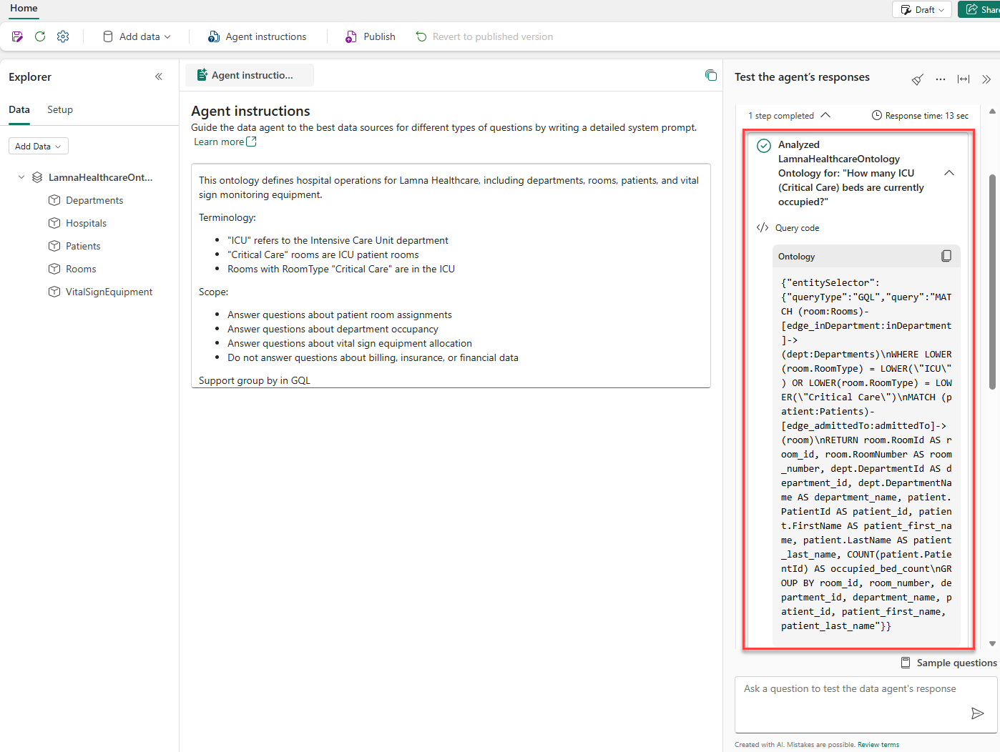

---
lab:
  title: オントロジを使用する Fabric データ エージェントを構築する
  module: Build a Fabric data agent with an ontology
  description: このラボでは、Lamna Healthcare のオントロジをデータ ソースとして使用する Fabric データ エージェントを作成します。 エージェントの指示を構成し、自然言語クエリをテストして、同僚が使用できるようにエージェントを公開します。
  duration: 30 minutes
  level: 200
  islab: true
  primarytopics:
    - Microsoft Fabric
  categories:
    - Fabric IQ
  courses: null
---

# オントロジを使用する Fabric データ エージェントを構築する

このラボでは、Lamna Healthcare という架空の会社の Fabric データ エージェントを作成します。 データ ソースとして使用するオントロジにエージェントを接続し、クエリの精度を向上させる指示を構成し、自然言語の質問をテストし、臨床スタッフが "占有されている ICU のベッドは何床ですか?" などの質問に対する回答を得ることができるようにエージェントを公開します。

> [!IMPORTANT]
> Microsoft Fabric のオントロジは現在[プレビュー段階](https://learn.microsoft.com/fabric/fundamentals/preview)です。

このラボの所要時間は約 **30** 分です。

## 開始する前に

> **注**: この演習を完了するには、有料の Fabric 容量が必要です。 Fabric 試用版では、Copilot 機能はサポートされていません。 Fabric ライセンスの詳細については、[Microsoft Fabric ライセンス](https://learn.microsoft.com/fabric/enterprise/licenses)に関するページを参照してください。

また、ファブリック管理者によって次の[テナント設定](https://learn.microsoft.com/fabric/data-science/data-agent-tenant-settings)が有効にされている必要があります。

- **容量を Fabric Copilot 容量として指定できる**
- **Azure OpenAI に送信されるデータは、容量の地理的リージョン、コンプライアンス境界、または国内のクラウド インスタンスの外部で処理できる** - Fabric 容量がヨーロッパまたは米国外にある場合にのみ必要
- **Azure OpenAI に送信されるデータは、容量の地理的リージョン、コンプライアンス境界、または国内のクラウド インスタンスの外部に保存できる** - Fabric 容量がヨーロッパまたは米国外にある場合にのみ必要

## ワークスペースの作成

1. ブラウザーで [Microsoft Fabric ホーム ページ](https://app.fabric.microsoft.com/home?experience=fabric)に移動し、Fabric 資格情報でサインインします。
1. 左側のメニュー バーで、 **[ワークスペース]** を選択します (アイコンは &#128455; に似ています)。
1. 任意の名前で新しいワークスペースを作成し、Fabric 容量を含むライセンス モード ([Fabric] または [Power BI Premium]) を選択します。****
1. 開いた新しいワークスペースは空のはずです。

## ノートブックからオントロジを作成する

このラボでは、オントロジに基づく Fabric データ エージェントの構築と使用に焦点を当てます。 これらの作業に最大限の時間を活用するために、レイクハウス、イベントハウス、エンティティの種類、データ バインディング、リレーションシップの設定など、オントロジの作成プロセスを自動化するノートブックを使用します。

Lamna Healthcare のオントロジには、病院、診療部門、病室、患者、バイタル サイン監視機器を表すサンプル データが含まれています。

> **注**: オントロジをステップバイステップで構築する方法については、[手動でのオントロジの作成](https://microsoftlearning.github.io/mslearn-fabric/Instructions/Labs/23-build-ontology-manually.html)または[セマンティック モデルからのオントロジの生成](https://microsoftlearning.github.io/mslearn-fabric/Instructions/Labs/24-build-ontology-semantic-model.html)に関する演習を参照してください。

1. [**[setup-ontology.ipynb**](https://github.com/MicrosoftLearning/mslearn-fabric/raw/main/Allfiles/Labs/27-28/setup-ontology.ipynb) を選択してブラウザーでノートブック ファイルを開き、右クリックしてローカ]ル コンピューターに保存します。 ブラウザーで `setup-ontology.ipynb.txt` として保存される場合は、`.txt` 拡張子を削除するようにファイルの名前を変更します。

1. ワークスペースで、リボンから **[インポート]** を選択します。

1. **[インポート]** ダイアログで次の手順を実行します。
   - **[アップロード]** を選択し、ダウンロードした **setup-ontology.ipynb** ファイルを参照します
   - **[開く]** を選択します

1. インポートが完了するまで待ちます。 ワークスペース項目の一覧にノートブックが表示されます。

1. **setup-ontology** ノートブックを選択して開きます。

   ノートブックには、各ステップを説明する詳細な Markdown セルが含まれています。 次のようになります。
   - 5 つの病院データ テーブル (Hospitals、Departments、Rooms、Patients、VitalSignEquipment) を使用して、**LamnaHealthcareLH** という名前のレイクハウスを作成します
   - 時系列のバイタル サイン測定値を含む **LamnaHealthcareEH** という名前のイベントハウスを作成します
   - Fabric REST API を使用して、5 つのエンティティ型、データ バインディング、リレーションシップ型を持つ **LamnaHealthcareOntology** を構築します

1. ノートブックで、**Step 0: Get or Create Infrastructure** の下にある最初の Python コード セルを見つけます。 セルの左側にある **[このセル以下すべてを実行]** を選択します。

   ![ノートブックの [このセル以下すべてを実行] ボタンを示すスクリーンショット](./Images/27-run-notebook-cell.png)

### ノートブックの実行時に想定される内容

ノートブックが実行されたら、セル出力で次の成功指標を確認します。

- **ステップ 0**: "✅ Infrastructure ready!" が レイクハウス ID およびイベントハウス ID とともに表示されます
- **ステップ 1**: "✅ All lakehouse tables written!" が テーブルの数である 5 とともに表示されます
- **ステップ 2**: "✅ Eventhouse step complete!" が確認されます
- **ステップ 3**: "✅ Entity and relationship definitions ready!" が報告されます
- **ステップ 4**: ポーリング後、"✅ SUCCESS" と表示されます (このステップで、REST API を使用してオントロジが作成されます)
- **ステップ 5**: オントロジ名に ✅ が付いた "Ontologies in workspace:" が一覧表示されます

> **トラブルシューティング**: 手順 4 で "❌ FAILED" と表示される場合は、テナント設定が有効になっていることを確認し、ノートブックを再実行してみてください。

1. 実行が完了したら、ワークスペースに次の項目が表示されていることを確認します。
   - **LamnaHealthcareLH** (レイクハウス)
   - **LamnaHealthcareEH** (イベントハウス)
   - **LamnaHealthcareOntology** (オントロジ)

   > **重要**: ノートブックが完了すると、Fabric でデータ バインディングが処理され、バックグラウンドでグラフ モデルが構築されます。 容量の負荷と複雑さによりますが、この処理は通常、数分で完了します。 この手順は、1 回限りのセットアップ プロセスです。 完了後も、オントロジは応答性を維持します。 データの準備ができていることを確認するには、LamnaHealthcareOntology 項目を開き、エンティティの種類 (例: Departments) を選択し、**[エンティティの種類の概要]** を選択します。 "オントロジを設定しています" または "オントロジを更新しています" と表示された場合は、ページ上でしばらく待ちます。プレビュー エクスペリエンスの読み込みが完了すると、自動的に更新されます。 エンティティ インスタンスが表示されたら、次のセクションに進むことができます。

## Fabric データ エージェントを作成する

オントロジの準備ができたので、それをデータ ソースとして使用する Fabric データ エージェントを作成できます。

1. ワークスペースで、**[+ 新しい項目]** を選択します。
1. 検索ボックスに「`data agent`」と入力し、結果から **[データ エージェント]** を選択します。
1. **[名前]** フィールドに「`LamnaHealthcareAgent`」と入力し、**[作成]** を選択します。

   データ エージェントが構成ビューで開き、左側に [エクスプローラー] ペイン、右側にチャット ペインが表示されます。

## オントロジをデータ ソースとして追加する

データ エージェントを Lamna Healthcare オントロジに接続します。 エージェントは、オントロジのエンティティの種類、プロパティ、リレーションシップを使用して、自然言語の質問を解釈します。

1. データ エージェントの構成ビューで、**[データ ソースの追加]** を選択します。
1. 検索ボックスに「`LamnaHealthcareOntology`」と入力します。
1. 検索結果から **[LamnaHealthcareOntology]** を選択し、**[追加]** を選択します。
1. 左側の **[エクスプローラー]** ペインで、次の 5 つのエンティティの種類がすべて表示されていることを確認します。
   - Hospitals
   - 部署
   - 部屋
   - 患者
   - VitalSignEquipment

## エージェントへの指示を構成する

エージェントの指示はプレーンテキスト ガイダンスであり、データ エージェントが特定の用語を解釈し、回答する必要がある質問を理解するのに役立ちます。 オントロジ データ ソースの場合、指示は唯一のチューニング メカニズムであり、クエリの例はサポートされていません。

1. データ エージェントのツール バーで、**[エージェントの指示]** を選択します。
1. 指示ペインで、次のテキストを入力します。

   ```
   This ontology defines hospital operations for Lamna Healthcare, including departments, rooms, patients, and vital sign monitoring equipment.

   Terminology:
   - "ICU" refers to the Intensive Care Unit department
   - "Critical Care" rooms are ICU patient rooms
   - Rooms with RoomType "Critical Care" are in the ICU

   Scope:
   - Answer questions about patient room assignments
   - Answer questions about department occupancy
   - Answer questions about vital sign equipment allocation
   - Do not answer questions about billing, insurance, or financial data

   Support group by in GQL
   ```

1. 指示ペインを閉じます。

## 自然言語の質問を使用してテストする

チャット ペインを使用して自然言語の質問を行います。 応答ごとに、ステップを展開して、エージェントが質問をどのように解釈し、どのようなクエリを生成したかを確認します。

1. チャット ペインで、次の質問を入力し、**Enter** キーを押します。

   ```
   How many ICU beds are occupied right now?
   ```

1. 応答を確認します。 回答の下にある **ステップ** ドロップダウンを選択して次の内容を確認します。
   - エージェントが識別したエンティティの種類とリレーションシップ
   - 生成された GQL クエリ
   - 中間の推論ステップ

   

1. エージェントが、Department (ICU) でフィルター処理された Room エンティティを正しく識別し、占有率を確認したことを確認します。

1. 2 つ目の質問を行います。

   ```
   How many patients are currently admitted?
   ```

1. エージェントがすべての診療部門の合計患者数を返していることを確認します。

1. 3 つ目の質問を行います。

   ```
   Which patient is in room ICU-301?
   ```

1. ステップを展開して、エージェントが Room エンティティから `admittedTo` 関係を走査し、正しい患者を返したことを確認します。

1. 4 つ目の質問を行います。

   ```
   How many rooms in the Surgical Services department are currently occupied?
   ```

1. ステップを展開して、診療部門別に病室をカウントするクエリがエージェントによって生成されたことを確認します。

1. 5 つ目の質問を行います。

   ```
   Which vital sign equipment is in the Emergency department?
   ```

1. 応答に注意してください。エージェントはこの診療部門の結果を返しません。 クエリが失敗したと見なす前に、データを調べて、実際にそこに何があるかを把握します。 より広範なフォローアップの質問を行います。

   ```
   Where is the vital sign equipment located?
   ```

1. 結果を確認して、機器が割り当てられている診療部門を確認します。 これは、データ エージェントを操作する際の重要なスキルです。データの形状を理解するための広範な質問から始めて、得られた情報に基づいて質問を絞り込みます。

1. 6 つ目の質問を行います。

   ```
   Which department has the most patients now?
   ```

1. エージェントが、ランク付けされた結果を返していることを確認します。 この質問によって、オントロジ全体の集計をテストします。

   > **ヒント**: エージェントの指示は、時間の経過と共にエージェントの動作を調整する方法です。 `"ICU" refers to the Intensive Care Unit department` などの用語を追加したことで、エージェントが日常的な言語をオントロジ値にマップするのに役立ちました。 エージェントが用語を誤って解釈したり、予期しない結果を返したりした場合はいつでも、**[エージェントの指示]** に戻り、明確な定義を追加します。

## データ エージェントを公開して共有する

データ エージェントを公開して、同僚がクエリを実行できる安定バージョンを作成します。

### データ エージェントを公開する

1. データ エージェントのツール バーで、**[公開]** を選択します。
1. **[目的と機能の説明]** フィールドに、次のように入力します。

   ```
   Queries the Lamna Healthcare ontology to answer questions about patient room assignments, department occupancy, and vital sign equipment allocation.
   ```

1. この演習では、**[Microsoft 365 Copilot のエージェント ストアにも公開する]** トグルを**オフ**に設定したままにします。

   > **注**: これをオンにすると、データ エージェントを Microsoft 365 Copilot (Teams、Outlook、その他の Microsoft 365 アプリ) 内で直接使用できるようになるため、ユーザーは Fabric を開かずにクエリを実行できます。 この演習では、オフのままにします。

1. **公開**を選択します。

   公開により、次の 2 つのバージョンが作成されます。
   - **下書きバージョン**: 編集を続行できます。変更は、公開済みバージョンには影響しません。
   - **公開済みバージョン**: 既定のアクセス許可を持つユーザーがクエリを実行できる安定バージョン。

1. ツール バーの **[下書き]** ボタンに注意してください。 それを選択し、**[公開済み]** を選択して公開済みバージョンに切り替えます。 これは、同僚がエージェントにアクセスしたときに表示されるバージョンです。

### データ エージェントを共有する

データ エージェントを共有するには、アクセス権の付与とリンクの共有の 2 つの手順があります。

**手順 1: アクセス権を付与する**

1. データ エージェントのツール バーで、**[共有]** を選択します。

   **[ユーザーにアクセス権を付与する]** ダイアログが開きます。

   ![データ エージェントを共有するための [ユーザーにアクセス権を付与する] ダイアログを示すスクリーンショット](./Images/28-share-data-agent.png)

1. **[このデータ エージェントに質問できるユーザー]** フィールドに、共有相手の名前またはメール アドレスを入力します。
1. **[追加のアクセス許可]** で、適切なレベルを選択します。
   - 追加のチェック ボックスがオンにされていない場合: 公開済みバージョンに対してのみクエリを実行できます。構成にアクセスすることはできません
   - **共有**: このデータ エージェントを他のユーザーと共有できます
   - **詳細の編集と表示**: 両方のバージョンの表示、編集、クエリを行うことができるフル アクセス
   - **詳細の表示**: 構成 (両方のバージョン) の表示とクエリの実行の両方を行うことができます。編集することはできません
1. **[許可]** を選択します。

**手順 2: リンクを共有する**

1. ワークスペースに移動します。
1. アイテムの一覧で **LamnaHealthcareAgent** を見つけて、項目名の右側にある **[...]** (その他のオプション) メニューを選択し、**[共有]** を選択します。

   **[リンクの作成と送信]** ダイアログが開き、リンクのコピー、メールによる共有、Teams による共有のオプションが表示されます。

   ![[リンクのコピー]、[メール]、[Teams] オプションを含む [リンクの作成と送信] ダイアログを示すスクリーンショット](./Images/28-copy-link.png)

1. **[リンクのコピー]** を選択して、エージェントの URL をクリップボードにコピーします。

   > **重要**: リンクは、手順 1 で既にアクセス権を付与したユーザーに対してのみ機能します。 受信者には、**LamnaHealthcareOntology** 項目、**LamnaHealthcareLH** レイクハウス、**LamnaHealthcareEH** イベントハウスに対する **[読み取り]** アクセス許可も必要です。 データ ソースの種類別のアクセス許可要件の詳細については、「[Fabric データ エージェントの共有とアクセス許可の管理](https://learn.microsoft.com/fabric/data-science/data-agent-sharing)」を参照してください。

## リソースをクリーンアップする

Fabric データ エージェントの探索が完了したら、この演習用に作成したワークスペースを削除できます。

1. 左側のバーで、ワークスペースのアイコンを選択します。
1. ツール バーで、**[ワークスペース設定]** を選択します。
1. **[全般]** セクションで、**[このワークスペースの削除]** を選択します。
1. **[削除]** を選択して削除を確定します。

## まとめ

この演習では、Lamna Healthcare のオントロジに基づいて Fabric データ エージェントを作成しました。 あなた: 

- セットアップ ノートブックを使用してオントロジをプロビジョニングしました
- Fabric データ エージェントを作成し、データ ソースとしてオントロジに接続しました
- 用語をマップし、スコープを定義するエージェントの指示を構成しました
- 自然言語の質問を使用してエージェントをテストし、生成されたクエリと推論ステップを確認しました
- エージェントを公開し、共有アクセス許可のレベルを確認しました

オントロジのビジネス ボキャブラリ (エンティティの種類、プロパティ、リレーションシップ) により、データ エージェントは自然言語の質問に対する回答を提供できます。